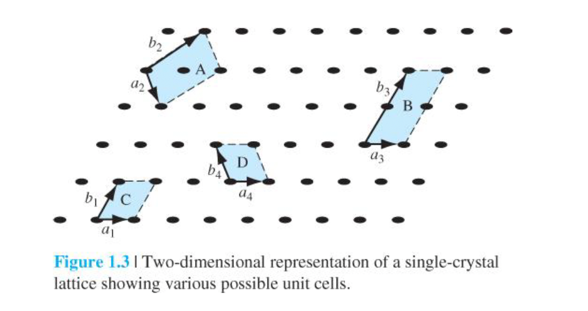
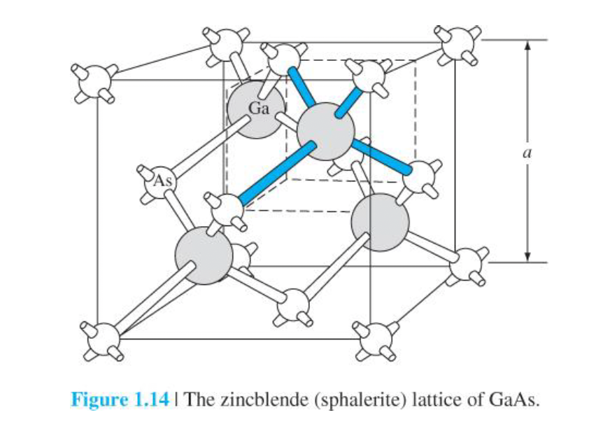

고체의 결정 구조에 대한 이해는 반도체 재료와 소자의 전기적 특성을 이해하는데 필수적이다. 
반도체는 일반적으로 단결정 형태로 사용된다.
단결정의 전기적 성질은 (1) 구성 원자의 화학적 성질과 (2) 원자 배열에 의해 결정된다.
반도체를 만들 때 일반적으로 주기율표 4족에 있는 원소반도체(elementary semiconductor)와 3족과 5족의 원속들의 결합으로 이루어진 화합물 반도체(compound semiconductor)가 있다.
예를들어 GaAs, GaP 등이 있다.

원자 배열에 따라 가질 수 있는 고체는 3가지 형태에 대해 알아보자.
그전에 용어 하나만 정의하고 가자. 질서영역은 기하학적으로 규칙적 배열을 가지고 주기성을 갖는 공간적인 부피를 의미한다. 그냥 결정들이 규칙적으로 반복되는 공간이다.
3가지 형태를 보자
1. 비정질(amorphous)
  - 질서영역의 부피가 굉장히 작다. 원자 혹은 분자 단위에서만 질서를 가진다.
2. 다결정(poly crystal)
  - 비정질 보다는 다소 넓은 질서영역을 가지나, 여러 규칙성을 가진 질서영역들이 존재한다.
  - 규칙성을 가지는 질서영역을 그레인(grain)이라고 하고 그레인 사이의 경계를 그레인 경계(grain boundary)라고 한다.
3. 단결정(single crystal)
  - 전체 부피에 대해 원자들이 일정한 규칙으로 배열하게 된다.

이제부터 단결정에 대해서 좀 더 파보자. 이때 격자(lattice)라는 개념이 등장한다.
격자(lattice)는 결정의 규칙적인 배열을 의미한다.
그리고 전체 결정을 표현할 수 있는 작은 결정 단위를 unit cell라고 한다. 결국 이 3차원 격자는 unit cell의 주기적인 반복이므로 unit cell의 물리적 특성을 이해하는 것이 전체 lattice의 물리적인 특성을 이해하는데 중요하다. 여러 unit cell 중 가장 작은 결정 단위를 primitive cell라고 한다. 아래 이미지가 좀 더럽긴 하지만 A, B, C, D는 전부 unit cell이지만 이 중 C, D만 primitive cell 이다. 그리고 cell내의 atom 개수가 1일 때 primitive cell이라고 생각할 수도 있으니 참고하자.

3차원 결정에 사용되는 격자점(atom)을 아래 벡터를 이용해 구할 수 있다. a, b, c 벡터의 크기를 단위셀의 lattice constant라고 한다.
$$\overrightarrow{r} = p\overrightarrow{a} + q\overrightarrow{b} + r\overrightarrow{c}$$

일반적인 고체 결정 구조부터 시작해서 조건이 하나씩 추가되고 있는데, 하나 더 추가해보자. 벡터 a, b, c가 서로 직교하도록 하고 길이가 같도록 unit cell을 설정할 수 있다. 그럼 cubic 구조가 된다. 대표적인 cubic 구조를 가진 cell들을 살펴보자.
1. simple cubic crystal(SCC)
2. body centered cubic crystal(BCC)
3. face centered cubic crystal(FCC)

이 각각의 격자 구조에 대해 머릿속으로 그려놓고 있어야하는데, 개인적으로 좋았던 방법은 어떤 atom이 인접해있는지를 먼저 고려해보는 것이었다. 예를들어 BCC는 아래 이미지처럼 중앙에 위치한 atom과 꼭짓점에 위치한 atom이 인접해있다. FCC는 면에 있는 atom들이 인접해있다.
 
*(https://choid.tistory.com/entry/%EB%82%98%EB%85%B8-%ED%99%94%ED%95%99-3-SC%EB%8B%A8%EC%88%9C%EC%9E%85%EB%B0%A9%EA%B5%AC%EC%A1%B0-FCC%EB%A9%B4%EC%8B%AC%EC%9E%85%EB%B0%A9%EA%B5%AC%EC%A1%B0-BCC%EC%B2%B4%EC%8B%AC%EC%9E%85%EB%B0%A9%EA%B5%AC%EC%A1%B0%EC%9D%98-%EC%B6%A9%EC%A7%84%EC%9C%A8)*

이런 격자 구조가 무수히 많이 반복되어 큰 결정을 이루게 되는데, 실제 결정은 무한대의 크기를 가지지 않고 결국 어떤 표면에서 결정의 주기는 끝이난다. 이 표면(혹은 결정을 관통하는 평면)을 crystal plane(결정면)이라고 부른다. 이게 왜 중요하냐면 반도체 소자는 표면 근처에서 제작되기 때문에 표면의 성질은 소자 특성에 큰 영향을 미칠 수 있다. 예를들어 결정 특성을 나타내는 요소로서 결정면에 의해 잘려지는 원자의 표면밀도(#/$cm^2$)는 그 위에 다른 재료(ex. 절연체)를 적층할 때 다른 재표가 반도체 표면에 결정 구조적으로 얼마나 잘 맞는지를 판단하는 중요한 요소이다.

결정면을 표현할 때 기호로는 중괄호 ()를 사용하고 콤마를 사용하지않고 평면벡터가 정수로 표현되어있다. 이 때 이 정수를 밀러 정수(Miller indices)라고 한다. 아래 이미지를 참고하자.

격자에서 결정의 방향을 결정 방향이라고 하며, 이 결정방향은 방향을 나타내는 벡터 성분인 3개의 정수집합으로 표현된다. 기호는 대괄호 []를 사용한다. unit cell이 입방격자(cubic crystal)일 때는 결정 방향은 결정면에 수직이며, 결정면과 결정방향이 동일한 밀러지수를 갖는다. 위에서 (100) plane의 방향을 [100]으로 표현한다.

그 다음 다이아몬드 구조에 대해 보자. **가장 널리 사용되는 반도체인 실리콘은 다이아몬드 격자 구조를 갖는다.** 실제로 한 unit cell 내에 8개의 원자가 포함되어있다(FCC로 4개의 원자에 si 원자 4개가 추가로 격자 내에 포함되어있다)

이 때 헷갈리지 말아야할게 격자 면과 꼭짓점에 걸져있는 원자말고 포함된 원자가 하부 반쪽에 2개, 상부 반쪽에 2개가 서로 90도 회전된 형태로 존재한다는 것이다.

마지막으로 zincblend 구조에 대해서 보자. FCC 구조를 가진 서로 다른 원자 결정이 겹쳐진 구조이다. A,B 원자가 있다고 했을 때 A원자는 A원자까리 FCC구조, B원자는 B원자끼리 FCC구조를 가진다. Diamond구조는 zincblend 구조와 동일한데 같은 원자로 이루어져있다는 점이 다르다.
즉 다이아몬드 구조를 가지는 화합물인 것인데 예시로 GaAs가 있다.

지금까지는 이상적인 단결정을 살펴보았다. 하지만 실제 결정에서는 격자가 완전하지 않고 완전한 기하학적 주기가 어떤 형태로 파괴되어 결함을 가지고 있거나 불순물을 포함하고 있다. 결함이나 불순물은 물질의 전기적인 성질을 변화시킨다. 먼저 고체의 결함을 보자. 모든 결정이 공통적으로 가지고 있는 결함은 원자의 열진동이다. 열에너지는 원자들이 무작위 형태로 평형상태의 격자점을 중심으로 진동하게된다. 이러한 무작위 열운동은 원자간의 간격이 무작위로 변형되게하고, 이것은 원자들의 완전한 기하학적 배열을 깨뜨린다. 그래서 원자 하나가 특정 격자점으로부터 이탈할 수도 있고(빈자리, vacancy) 원자가 격자점 사이에 위치할 수도 있다.(틈새, interstitial) 이러한 vacancy와 interstitial의 경우는 원자들의 완전한 기하학적 배열이 깨질뿐만 아니라, 원자들간의 이상적인 화학결합도 변형시켜 물질의 전기적 성질을 변화시킨다.

그리고 고체에 불순물이 포함돌 수도 있는데, 불순물 원자가 특정 격자점에 위치할 때 이를 치환 불순물(substitutional impurity)라고 하고, 불순물 원자가 격자점 사이에 위치할 때는 이것을 틈새 불순물(interstitial impurity)라고 한다. 4장에서는 이를 의도적으로 특정 불순물을 일정량 첨가함으로써 반도체의 전기적인 성질을 변화시키는데 이를 도핑이라고 한다. 일반적으로 도핑 방법으로 불순물 확산(diffusion)과 이온 주입(ion implementation) 두가지 방법이있다. 불순물 확산 공정은 고온에서 불순물원자와 반도체 결정을 두고 수행하게 되는데, 고온에서 단결정이 격자 자리를 이탈하고 그 사이로 불순물 원자가 들어오는 방식이고, 이온주입은 불순물의 이온빔은 50KeV 혹은 그 이상의 운동에너지를 가지고 반도체 표면에 주입되고, 이 고 에너지 불순물 이온들은 결정 내에 주입되어 표면으로부터 일정한 깊에에서 정지하게된다. 이 기술의 장점은 불순물 원자들의 원하는 수를 원하는 위치에 주입할 수 있다는 것이다.