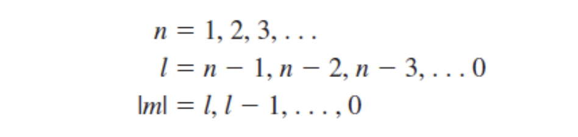

결국 반도체 소자를 이해하는게 목표다. 반도체 소자를 이해하기 위해서는 전류와 전압을 특성을 이해해야하고, 그 특성을 이해하기 위해서는 다양한 전위에 놓여진 격자 안에 있는 전자의 운동에 대한 지식이 필요하다. 이러한 전자들의 운동과 특성은 파동역학으로 표현될 수 있고 슈뢰딩거의 파동방정식을 통해 설명할 수 있다.

# 슈뢰딩거의 파동방정식 보기 전 잠깐 알고가기
그걸 공부하기 전에 알고 있어야 할 중요한 지식 3가지를 먼저 알아보자.
1. 에너지 양자화 원리(principle of energy quanta)
2. 파동-입자 이중성(wave-particle duality principle)
3. 불확정성 원리(uncertainty principle)

에너지 양자화의 원리에 대한 중요한 실험의 한 예로 광전효과를 들 수 있다. 단색광 빛(고정된 파장의 빛, 가시광선은 400nm ~ 700nm 정도됨) 을 금속의 깨끗한 표면으로 쐈을 때 특정 조건 아래에서 광전자(photoelectron)이 표면으로부터 방출된다. 이 때 한계 진동수 $\nu=\nu_0$ 아래에서는 광전자가 방출되지 않고 특정 진동수 이상에서 광전자가 방출되는데 이 때 방출되는 광전자의 최대 운동 에너지가 주파수에 선형적으로 변화하는 것이 관찰되었다. 1900년대 플랑크는 가열되는 물질의 표면으로부터 열복사는 양자라고 부르는 불연속적인 에너지 형태로 방출된다고 가정했다. 이 에너지 양자는 아래 식으로 표현된다.
$$E = h\nu (h=6.625*10^{-34}Jsec)$$
이 때 전자를 방출하는데 필요한 최소한의 에너지를 일함수(work function)라 부르고 그 이상의 광자 에너지는 광전자의 운동 에너지로 전환된다.

근데 입자의 형태만 가지고 있는건 아니다. 1924년 드브로이는 물질파(양자역학에서 물질의 파동을 의미함)의 존재를 가설로 세웠다. 드브로이는 입자의 파장은 아래처럼 표현된다고 가정했고 p는 입자의 운동량이고 $\lambda$는 물질파의 디브로이 파장이라고 알려졌다.
$$\lambda = \frac{h}{p}$$
물질을 입자로 보고 싶으면 입자로 보고 파동으로 보고 싶으면 파동으로 보자. 입자를 대표하는 물리량인 운동량과 파동을 대표하는 물리량인 파장 사이에 반비례 관계임을 보였다. 큰 입자들에 대해서는 고전역학의 방정식으로 설명이 되지만 전자와 같은 작은 입자들은 양자역학의 이러한 파동와 입자의 이중성 원리로 설명된다.

하이젠베르크는 1927년 불확정성원리를 주장했다. 이것도 마찬가지로 대단히 작은 입자에 적용되며, 원자보다 작은 입자의 움직임을 정확하게 설명할 수 없다는 것을 입증했다.
1. 불확정원리의 첫번째 주장은 입자의 위치와 운동량은 정확하게 정할 수 없다는 것이다.
$$\Delta p \Delta x \ge \hslash$$
- 이 때 $\hslash$는 $\frac{h}{2\pi}$로 대략 $1.054*10^{-34}Js$이고 변형된 플랑크 상수라고 부른다.
2. 불확정성 원리의 두번째 주장은 입자의 에너지와 입자가 에너지를 갖는 시간은 정확하게 정할 수 없다는 것이다. 
$$\Delta E \Delta t \ge \hslash$$

이러한 예시로 전자의 위치를 정확하게 결정할 수 없다는 것을 들 수있다. 대신에 전자를 특정 위치에서 발견한 확률은 이야기할 수 있다. 그래서 이후 전자의 특정 에너지를 가질 확률을 확률 밀도함수로 표현하며, 전자의 이동을 표현하는데도 확률 함수를 이용하게된다.

잠깐 옛날에 배웠던 물리를 떠올려보자. 먼저 전위(electric potential)는 단위전하를 무한대의 거리에서부터 해당지점까지 가져다 놓기 위한 일을 의미한다. 이 전위는 스칼라 물리량이고 단위는 V(또는 J/C)를 사용한다. 전위가 다른 서로 다른 두 지점이 있으면 그 사이에서 전기장이 생기는데 여기서 단위전하를 옮길 때 전위의 차이를 전위차라고 한다. 전위차는 다른 말로 전압이라고도 한다. 또 다른 말로 전기장 내에서 단위 전하가 가지는 전기적 위치 에너지를 의미한다. 그래서 V(볼트)를 J/C 사용한다. 전기장은 1C의 전하(단위 전하)가 (어떠한 source charge)에 의해 받는 전기력을 의미하는데, 그래서 전하 q에 대한 전기력은 $\overrightarrow F = q \overrightarrow E$로 나타낼 수 있다.
자주 사용되는 단위로 eV(전자볼트)가 있는데, 전자 하나가 1V의 전위 차이를 이동할 때 필요한 에너지를 의미한다. $1eV = 1.602176634*10^{-19}J$ 이다. V는 J/C 이므로 기본 전하량 $e = 1.602176634*10^{-19}C$을 V를 곱해 J로 만든거다.

# 슈뢰딩거 파동방정식
시작은 1차원 비상대성 슈뢰딩거 방정식으로부터 출발한다. 

여기서 변수분리 방법으로 파동함수를 시간 종속 부분과 위치 종속 부분으로 나눈다. 이 장에서는 시간에 독립적인 파동함수를 만들고 사용할 것인데, 위치와 시간을 각 변으로 분리한 다음 시간종속 부분을 분리상수로 정의한다. 

궁극적으로 결정에서 전자의 거동을 묘사하기 위해 파동함수를 사용하는 것이다. 그럼 함수와 전자 사이 관계가 어떻게 될까? 함수의 제곱은 전자 위치의 확률을 나타낸다.
전체 파동함수는 복소함수이고 전체 파동함수와 그 복소공액의 곱을 구해보자. 이 때 나오는 확률밀도함수는 여전히 시간독립적이다. 이처럼 입자의 위치가 결정되는게 아니라 확률로써 주어진다.

경계조건을 살펴보자.
- 파동함수의 제곱은 입자에 대한 확률밀도함수이기 때문에 전체 적분 값은 1이된다.
- 그리고 만약 총에너지 E와 전위 V가 모든 곳에서 유한하다면 파동함수와 그 미분은 반드시 다음의 성질을 가진다.
  - $\psi(x)$는 유한하고, 단일 값을 가지며, 연속이어야한다.
  - $\partial\psi(x)/\partial x$는 유한하고, 단일 값을 가지며, 연속이어야한다.

1차원 전위에너지 함수와, 입자를 발견할 확률 함수를 구하기 위해 슈뢰딩거 시간 독립 파동방정식을 풀어볼 것이다. 슈뢰딩거의 파동방정식을 여러 가지 전위 함수에 적용해볼 수 있으며 나중에 반도체 물성을 논의하는데 적용된다.

- 자유공간에서 전자의 운동을 생각해보자.
  - 입자에 작용하는 힘이 없다면 전위함수 V(x)는 일정할 것이고, 전자의 E(에너지) > V(x) 이어야 하므로 간단히 하기 위해 모든 위치 x에서 전위함수 V(x) = 0라고 가정하자.
  - 위 파동 함수 식에서 V = 0 넣고 미분방정식을 푼다.
  - 파동함수가 가질 수 있는 함수 꼴은 exponential 형태로 이루어져 있고 각 계수들은 경계조건을 통해 계산할 수 있다.
   - 식을 계산한 결과 정확한 에너지를 갖는 자유 입자는 역시 정확한 파장과 운동량을 갖게 된다. 그리고 확률밀도함수는 위치에 무관한 상수 값이 되며, 결정된 운동량을 갖는 자유입자는 동일한 확률을 가지고 모든 위치에서 발견된다. 이 결과 운동량이 정확할 경우 위치를 결정할 수 없다는 불확정성원리와 일치한다
  - $$k = \sqrt{\frac{2mE}{\hslash^2}}=\frac{p}{\hslash}=\frac{2\pi}{\lambda}$$
- 무한 전위 우물 내에 전자가 갖혀있다고 생각해보자.
  - 위와 똑같이 파동방정식과 경계조건을 이용하여 식을 유도할 수 있다.
  - 결과는 입자의 에너지는 오직 특정한 불연속 값들만 가질 수 있다는 것인데, 다르게 말하면 **갇혀있는 입자의 에너지는 양자화된다는 것이다.** 입자 에너지의 양자화는 입자가 연속 에너지 값을 가질 수 있는 고전물리의 결과와 상반된다. 이러한 불연속 에너지들은 뒷장에서 양자 상태들을 유도하게된다.
  - 무한 전위 우물내의 파동함수 식과 양자화된 에너지 식 정도는 유도할 수 있어야한다.
  - $$k = \frac{n\pi}{a}$$
    - free electron에서는 k가 continuous한 값을 가졌지만 bounded되면 discrete한 k값을 가지게된다.
  - $$E = \frac{\hslash^2k^2}{2m}$$
- 유한한 전위 장벽에 입자를 입사한다고 가정한다. 전위 장벽은 아래처럼 생겼다.
  - 
  - 입사파를 나타내는 +x 방향의 진행파와 반사파를 나타내는 -x 방향의 진행파를 나누어 생각한다.
  - 똑같다. 파동방정식과 경계조건을 이용하여 식을 유도한다.
  - 결과는 입자가 전위 장벽을 투과할 수 있다는 것이다.
    - 전위장벽의 투과에 대한 투과 계수를 다음과 같이 계산할 수 있다.
    - 
    - 이처럼 전위장벽에 충돌한 입자가 장벽을 뚫고 위 그림에서 영역 3에 나타날 확률이 있다는 의미이다. 이를 투과(tunneling)이라고 하며, 이런 양자역학적 투과현상이 반도체 소자, 즉 터널 다이오드에 응용되는지 보게 될 것이다.
  

파동함수를 전자 하나에서 원자로 확대해보자. 여기서는 단일 전자 혹은 수소원자의 전위함수를 살펴볼 것이다. 원자핵은 무거운 양전하를 띤 양성자이고 전자는 가볍고 음전하를 띤 입자이며, 고전적 보어이론에 의해 전자는 원자핵 주위를 회전한다. 전위함수는 양성자와 전자 사이의 쿨롱 인력에 의해 형성된다.

- 단일 전자원자
  - 시간 독립 슈뢰딩거 파동방정식을 3차원으로 일반화하고 변수분리 방법을 활용해, 3가지 변수로 식을 분리한다. 이 때 계산되는 변수분리 상수들을 즉, n, l, m은 양자수라고 하며 다음과 같은 관계를 갖는다. 양자수의 조합은 전자가 차지하는 양자 상태에 해당한다.
  - 
  - 전자의 에너지는 다음과 같이 주어지고 -의 의미는 전자가 핵에 갇혀있음을 나타내고, 갇힌 전자는 다시 양자화 됨을 의미한다. 만약 에너지가 +라면 전자는 더이상 갇힌 입자가 아니고, 총 에너지도 양자화 되지않는다.
  - 
    - 실제로 단일 전자 원자의 첫 3개 에너지 준위를 위 식으로 계산을 해보면 n=1일 때 -13.58eV, n=2일 때 3.39eV, n=3일 때 -1.51eV가 된다. 에너지 준위가 증가함에 따라 에너지의 음의 값이 작아진다. 이것은 전자가 원자의 속박으로부터 점점 벗어남을 의미한다.
  - 단일 전자 원자에 대해 수학적으로 깊이 다루진 않았지만 반도체를 더 깊이 고찰하기 위해서 3가지 결과가 중요하다.
    - 첫째는 간단한 전위함수에서와 같이 전자확률함수를 제공하는 슈뢰딩거 방정식의 해이다. 다음 장에서 반도체의 물성을 다룰 때 전자확률함수도 고려한다.
    - 둘째는 갇힌 전자의 에너지 준위는 양자화 된다는 것이다.
    - 셋째는 변수분리 과정에서 도출된 양자수와 양자상태의 개념이다.
- 주기율표
  - 원소 주기율표는 앞에서 본 단일 전자 원자의 결과와 (1) 전자스핀, (2) 파울리 배타원리에 의해 결정된다.
  - 전자는 양자화 되어 두개의 가능한 값중에 하나를 취하는 스핀 (혹은 내부 각운동량)을 갖는다. 스핀은 양자수 s로 지정하여 사용한다. **그래서 4개의 기본 양자수 n, l, m, s를 통해 원소를 표현하게 된다.**
    - 
  - 파울리 배타원리란 주어진 시스템(원자 또는 분자 또는 결정)에서 두 개의 전자가 같은 양자 상태를 차지할 수 없는 원리를 말한다.
  - 전자 스핀과 파울리 배타원리의 개념과 함께 단일 전자 원자에 대한 슈뢰딩거 파동방정식의 해로부터 원소의 주기율표를 작성할 수 있다. 원소의 원자번호가 증가함에 따라 전자들은 서로 영향을 주게되어 주기율표의 작성은 간단한 원리로부터 다소 벗어나게된다.
