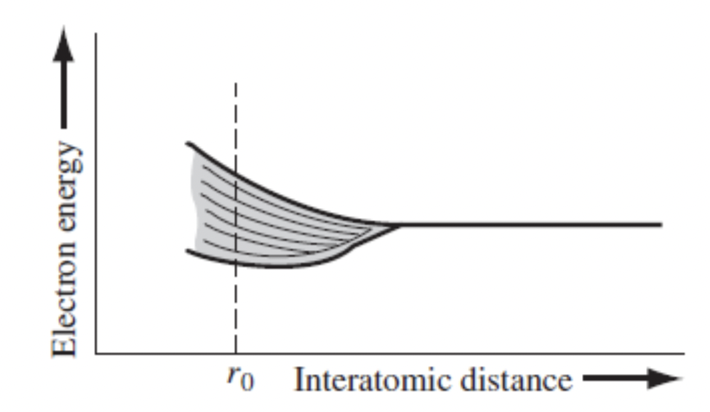
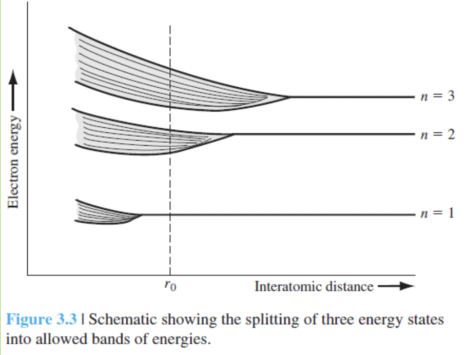
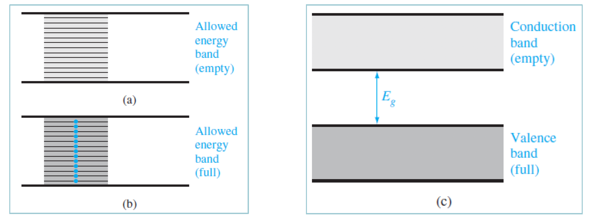

지금까지 다양한 전위에서 전자 하나에 대한 확률함수와 에너지를 계산해보았고, 전자 한개를 가진 원자 속에서 전자의 에너지에 대해서도 계산해보았다. 원자에 구속되어 있거나 혹은 작은 공간에 갇혀있는 전자는 반드시 양자화된 에너지를 가진다. 이번 장에서는 이런 개념을 결정격자 속에 있는 전자로 일반화시킬 것이다. 이 장에서는 반도체 소자의 전류-전압 특성을 해석하는데 필요한 반도체 재료의 전기적 성질을 배우는 것이다. 이런 목적을 달성하기 위해 두가지를 배워야하는데 하나는 결정격자 속에 있는 전자의 성질이고 다른 하나는 결정 속에 있는 엄청난 수의 전자들의 통계적 특성을 다루는 방법이다.

# 허용 에너지밴드와 금지대(금지 에너지밴드)
2장에서 수소에서 갇힌 전자의 에너지는 불연속적으로 떨어진 값을 갖는다는 것(1)과 전자는 특정 거리에서 전자가 발견될 확률로 나타낸다(2)는 것을 보았다. 이 결과를 결정으로 확장시켜 허용, 금지 에너지밴드의 개념을 볼 것이다.

## 에너지밴드의 형성
서로 멀리 떨어져 있는 수소 원자들이 가까이 밀착하면 각 원자의 양자화된 에너지 준위는 불연속한 에너지 준위로 분리되어, 밴드(불연속한 에너지 준위의 다발)를 형성한다. 원자들이 결정 속에서 일정한 간격으로 배열될 때 전자의 허용된 에너지밴드가 형성되며, 허용밴드(allowed band)는 무수히 많은 불연속한 에너지 준위를 가진다. 결정을 이루는 원자 수가 아무리 많아도 각 원자가 가지는 양자 상태수는 변함이 없고 같은 양자 상태를 가진 전자가 동시에 존재할 수 없다. 아래 이미지를 보면 $10^{19}$개의 수소원자가 원자간 평형 간격에서 허용된 에너지 밴드의 폭이 1eV라고 가정하고 각 에너지 상태가 일정하게 유지된다면, 에너지 준위는 $10^{-19}eV$ 간격으로 떨어져 있어야한다.

좀 더 직관적으로 생각해보면 한 결정내에 n=3 에너지 준위까지 전자를 채운 si와 같은 원자들로 채워져 있다고 가정해보자. 그럼 아래 그림처럼 n=3부터 밴드가 형성되고 각 원자들이 더 가까이 붙게되면 n=1에서도 밴드가 형성되게된다. 아래 왼쪽 그림이다.

하지만 실제로는 오른쪽처럼 훨씬 복잡하다. 중요한건 이 상태는 온도가 0K일 때를 나타낸 것이다. 절대온도 0K에서 전자들은 가장 낮은 에너지 상태에 위치하므로 가전자대(valence band, 낮은 밴드)에 모든 전자가 차게되고, 전도대(conduction band, 높은 밴드)에는 완전히 비어있게된다. 그리고 valence band의 꼭대기 에너지와 conduction band의 밑바닥 에너지 사이의 간격을 에너지 밴드갭(energy bandgap)이라고한다.

 

지금까지 결정에서 allowed band(허용밴드)와 forbidden band(금지밴드)가 어떻게 나누어지고 그리고 allowed band는 또 valence band와 conduction band로 나눠짐을 어떻게 형성되는지 그리고 왜 형성되는지에 대해서도 알아보았다.

## Kronig-Penney 모델
위에서는 전자의 allowed 에너지가 분리되는 것을 정성적으로 설명했는데 여기서는 수식으로 좀 더 볼 것이다. 수소 원자 하나가 아니라 결정에 대해서 풀어볼거다. 또 결정은 결정이지만 **1차원 단결정**에 대한 슈뢰딩거 방정식을 풀어볼 것이다.

아래 왼쪽 그림은 한 원자에 대한 전위함수, 이웃한 원자들의 중첩된 전위함수, 1차원 단결정의 알짜 전위함수를 나타낸 그림이다. 그리고 이를 단순화하여 아래 오른쪽 그림을 얻어낼 수 있는데, 이것이 주기전위 함수의 1차원 Kronig-Penney model(크로니 페니 모델)이다.

 

Bloch 정리는 고체물리에서 중요한 이론 중 하나로 크리스탈 구조를 가진 고체 내 전자의 파동 운동을 설명할 수 있도록 도와준다. 즉, 격자내에서 전자의 움직임을 쉽게 설명할 수 있도록 도와주는데, 주기적으로 변하는 전위에너지 함수에 대한 슈뢰딩거 방정식에서 얻어지는 모든 단일 전자의 파동함수는 다음과 같은 형태를 가진다.
$$\psi(x)=u(x)e^{jkx}$$
이 때 파라미터 k는 운동상수라고 부른다.

2장에서 논의된 시불변 슈뢰딩거 파동방정식에 위 $\psi$를 대입해서 식을 쭉 풀어보자. 파라미터 k, 운동에너지 E, 전위 $V_0$의 상호관계를 결정할 수 있다.
$$\frac{\partial^2\psi(x)}{\partial x^2} + \frac{2m}{\hslash^2}(E - V(x))\psi(x) = 0$$

$\alpha$를 아래처럼 두고, $P^{\prime}$를 아래처럼 정의하고
$$\alpha^2 = \frac{2mE}{\hslash^2}$$
$$P' = \frac{mV_0ba}{\hslash^2}$$

최종적으로 다음과 같은 식을 얻을 수 있다.
$$P'\frac{sin\alpha a}{\alpha a} + cos\alpha a = coska$$

이는 슈뢰딩거 파동방정식의 해는 아니지만 슈뢰딩거 파동방정식이 해를 가질 수 있는 조건을 보여주고 파라미터 k, 운동에너지 E, 전위 $V_0$의 상호관계를 보였다.

위 식을 해석해보는 차원에서 $V_0=0$인 경우를 보자. 이는 전위장벽이 없는 경우에 해당하므로 자유입자에 해당된다. $P'=0$가 된다. 그럼 $\alpha=k$가 되고 $\alpha = \frac{2mE}{\hslash^2} = \frac{p}{\hslash} = k$ 가 되므로 $p=\hslash k$식을 자주 사용할 것이다. p는 입자의 운동량이고 운동파라미터 k는 자유전자의 운동량과 관련이 있으므로 파수(wave number)라고 불린다. 죽 자유입자의 에너지와 운동량은 아래와 같은 관계를 갖는다.
$$E = \frac{p^2}{2m}=\frac{k^2\hslash^2}{2m}$$
쉽게 자유입자를 자유전자로 생각하자. 위 식은 자유전자의 에너지와 운동량과의 포물선 관계 식이다.

## k-공간 그림
위 식을 그래프로 나타내면 다음과 같으며 여기서 E와 k에 대한 그래프도 그려볼 수 있다.

다음과 같은 그래프로 그려 볼 수 있고 allowed energy band와 forbidden energy band 사이가 에너지 밴드 갭이며, 맨 아래부터 위로 에너지 밴드갭은 각각 n=1, n=2, n=3 일 때를 의미한다.

근데 위 식에서 우변 함수 $coska$ 는 주기함수임을 알 수 있다. 즉, $coska = cos(ka+ 2n\pi) = cos(ka - 2n\pi)$ 로 위 그림에서 곡선의 일부를 $2\pi$ 만큼 이동시키더라도 위 식은 여전히 만족하게된다. 아래 왼쪽 그림은 곡선의 여러 부분들이 어떻게 $2\pi$ 만큼 이동되는지를 보여주고 있다. 그리고 아래 오른쪽 그림에서는  $-\frac{-\pi}{a} < k < \frac{-\pi}{a}$ 범위 내의 모양을 보여주고 이를 축소된 k-공간 또는 축소된 영역 표현이라고 한다.

단결정 격자를 모델링하기 위해 1차원 주기 전위함수를 사용한 Kronig-penney 모델을 살펴보았다. 이 분석의 중요한 결과는 전자들은 결정에서 허용 에너지 밴드에만 속하여 존재할 수 있으며, 금지 에너지 밴드에는 존재할 수 없다는 것이다. 위 그림을 E-k 다이어그램이라고 하고 뒤에서 지겹도록 나올거다.

# 고체의 전기 전도
궁극적으로 알고 싶은 것은 반도체 소자의 전류와 전압의 특성이다. 이를 살펴보기 위해 도체, 반도체, 부도체에서의 허용에너지 밴드에서 전자의 운동을 살펴볼 것이다.

## 에너지밴드와 결합 모델
위의 그림에서 절대온도 0K에서 실리콘의 개별 에너지 상태가 허용 에너지 밴드로 분리되는 것으로 보았고, 가전자대(valenced band)에 4N개의 전자들로 가득차게 된 것도 보았다. 하지만 이 때 온도가 0K보다 증가함에 따라 약간의 가전자대 전자들이 충분한 열에너지를 얻게되어 공유결합을 깨고 전도대로 이동한다.

온도가 0K 위로 증가함에 따라 약간의 가전자대 전자들이 충분한 열에너지를 얻게 되어 공유결합을 깨뜨리고 전도대(conduction band)로 이동한다. 전하적으로 중성인 반도체의 (음전하의) 전자가 자기의 공유결합 위치를 깨뜨리고 탈출함에 따라 (양전하를 띤다고 볼 수 있는) 빈상태(hole)가 가전자대의 원래 공유결합 위치에 형성됨을 의미한다. 온도가 증가함에 따라 더 많은 공유결합이 깨지고 더 많은 전자가 전도대로 이동하여 더 많은 빈상태가 가전자대에 형성되는데 여러한 결합의 깨어짐을 E-k 에너지 밴드와 관련지어 설명할 수 있는데 아래와 같다.

## 유동(drift) 전류
전류는 전하의 이동에 의해 발생하는데, 특히 전기장(또는 전위차)에 의한 전하의 이동을 드리프트라고 하고 그 전류를 드리프트 전류라고 한다. 평소 회로에서 +에서 -로 흐르는 전류를 의미한다고 생각하면 될 것 같다. 전류는 전자의 속도에 직접 관계됨을 주의해야하는데, 즉 전류는 전자가 고체 내부에서 얼마나 잘 움직이는지에 의해 결정된다. conduction band에 있는 전체 전자의 drift가 전류를 발생시킨다. 전자의 운동에 의한 드리프트 전류 밀도는 다음과 같다. 여기서 e는 전자 전하량의 크기고 n은 전도대의 단위 부피당 전자 수, $v_i$는 i번째 전자의 속도이다. 단위는 $A/cm^2$이 된다. 전류는 전자 속도에 직접 관계되며 전류는 전자가 고체 내부에서 얼마나 잘 움직이는지에 의해 결정된다.
$$J = -e \Sigma_{i=1}^{n}v_i$$

반도체에서 전류는 크게 두가지로 나뉘는데 확산전류(diffusion current)와 드리프트(drift current)로 나뉜다. diffusion current는 전위차에 의해 생기는 전류가 아니라 밀도차에 의해 전자나 정공이 움직이면서 발생하는 전류이다.

## 전자유효질량
격자 내 하나의 전자에 가해지는 힘을 정확히 분석하는 것은 불가능하다. 양전하를 띤 이온이나 양성자, 음전하를 띤 전자 등에 의한 격자내부 힘과 다른 외부 힘들이 여러 존재하기 때문이다.
그래서 이 모든 것을 고려한 유효질량(effective mass)라는 개념을 도입한다. 기름과 물이 담긴 통에 구슬을 떨어뜨린다고 했을 때 기름 속에서 느낀 구슬의 운동을 물에서 그대로 유지하려면 질량을 작게 만들어야한다. 이렇게 작아진 질량이 유효질량에 해당하며, 구슬의 정지질량에 기름의 점성이 질량의 변화에 영향을 준 것으로 간주하여 새로운 작은 질량을 사용한 것이다. effective mass도 비슷한 개념이다.

식으로 나타내면 다음과 같다.
$$\frac{1}{\hslash^2}\frac{d^2E}{dk^2} = \frac{1}{m}$$

유효질량은 양자역학적 결과를 고전적 힘의 방정식과 결부시키는 파라미터다. 대부분의 경우 전도대 하단에 있는 전자는 내부 힘과 양자역학적 성질들을 유효 질량으로 고려하면 뉴턴역학으로 그 운동을 묘사할 수 있는 고전적 입자로 생각할 수 있다. 중요한건 "전자"의 유효질량이다.

아래는 k=0 근처에서 conduction band의 E-k 곡선을 포물선으로 근사할 수 있고, valence band에서도 마찬가지임을 그림으로 표현했다.

## 정공의 개념
T가 0 이상에서 모든 가전자들은 열에너지를 얻고, 가전자가 작은 양의 열에너지를 얻으면 전도대로 올라갈 수 있다. 이 때 가전자에는 빈 공간이 하나 존재하게 되고 이 빈 공간에 전자가 채워지는 것이 마치 빈공간이 움직인다고 생각할 수 있는데 이를 양전하의 운동으로 볼 수 있고 이 양전하의 운동은 새로운 전류를 만들어내며 전자 전류와 함께 결정의 중요한 전류이다. 이 양전하 캐리어를 정공(hole)라고 부른다.

## 금속, 절연체, 반도체
각 결정체는 자신의 에너지 밴드 구조를 갖는다. 예를들어 실리콘에서 에너지 상태가 분리되어 가전자대와 전도대를 형성하는 복잡한 과정을 보았다. 이런 밴드 분리는 다른 결정체에서도 발생하며 다양한 고체들로부터 많은 종류의 밴드 구조가 유도되고 또한 넓은 범위의 전기적 특성을 나타낸다. 단순화된 에너지밴드를 살펴봄으로써 이러한 밴드 구조의 차이 때문에 발생하는 전기적 특성의 근본적인 차이점을 정성적으로 이해해보자.

아래 이미지는 각각 절연체(insulator), 반도체, 금속(metal)의 에너지 밴드를 보여주고 있다.

완전히 채워져 있던지, 혹은 비어져있는 에너지 밴드를 갖는 물질을 절연체(insulator)라고 하며 전연체의 저항도(resistivity)는 대단히 크며 혹은 역으로 전도도(conductivity)는 매우 작다. 드리프트 전류에 기여할 수 있는 전하 입자는 근본적으로 존재하지 않는다. Insulator의 밴드갭 에너지는 보통 3.5eV에서 6eV 정도이며 더 큰 경우도 있다.

반도체의 밴드갭 에너지는 1eV 정도의 크기를 가질 수도 있고 아래 이미지에서는 절대온도 0K보다 큰 반도체를 나타낸다. 

아래 metal의 두가지 형태의 에너지 밴드를 갖는다. 첫번째는 부분적으로 채워진 밴드를 보여주고 여기에는 전도에 이용될 수 있는 많은 전자가 있다. 또는 conduction band와 valence band가 중첩되는 경우도 보여준다.

# 3차원으로 확장
여기서부터는 3차원 결정의 특성들을 E-k diagram, bandgap, effective mass를 사용하여 알아볼 것이다. 전위함수를 3차원으로 확장함에 따라 부딪히게 되는 한가지 문제는 원자들간의 간격이 결정방향에 따라 바뀐다는 것이다. 그래서 전자의 운동방향이 다르면 전자들이 겪는 전위 에너지의 모양이 달라지고 또한 k-공간에서의 에너지도 달라진다. E-k diagram은 일반적으로 결정에서 k-공간 방향의 함수이다.

## Si와 GaAs의 k-공간 도표
아래 그림은 GaAs와 Si의 E-k diagram을 보여준다. GaAs의 경우 k=0의 같은 k값에 conduction band의 최소지점과 valence band의 최대지점에 위치한다. 이러한 성질을 갖는 반도체를 direct bandgap semiconductor(직접 밴드갭 반도체)라고 한다. 이 반도체에서 두 에너지 밴드 사이의 전자 전이는 k=0 지점에서 발생하므로 운동량 변화없이 이루어진다. (p=mv(입자일 때)= $\hslash$ k(파동일 때)) 운동량은 변화가 없으면서 에너지의 변화가 가능한 것은 빛에너지에서만 가능하다. 전자가 다시 아래로 떨어질 때 에너지를 빛으로 사용하게되고 이러한 직접 밴드갭 반도체들은 반도체 레이저와 LED와 같은 광소자들에 사용하기에 적합하다.

반대로 Si에서는 conduction band의 최저 에너지 점이 k=0 가 아니라 [100]방향 위에 위치한다. conduction band의 최소 에너지와 valence band의 최대 에너지가 k축에서 일치하지 않는 반도체를 indirect bandgap semiconductor 라고 부른다. 

## 유효질량의 추가 개념
GaAs에서 conduction band의 최소값에서 곡률이 실리콘보다 크다. 이는 유효질량 식에 의해 conduction band에서의 전자의 유효질량이 GaAs가 실리콘보다 작음을 의미한다.

# 양자상태(에너지 상태) 밀도함수
최종적인 목표는 반도체 소자의 전류-전압 특성을 설명하는 것이다. 전류는 전하의 흐름에 기인하는 것이므로 반도체에서 전도에 참여하는 전자와 정공의 수를 결정하는 것이 중요한 요소가 된다. 전도에 기여하는 캐리어의 수는 이용가능한 에너지의 상태 혹은 양자상태의 개수의 함수인데 왜냐면 파울리의 베타율이 의해 단지 하나의 전자만이 하나의 양자상태를 가질 수 있기 때문에 양자상태 수가 많으면 결국 전자의 수가 많음을 의미하기 때문이다.

앞에서 에너지 준위가 allowed와 forbidden 에너지밴드로 분리되는 현상을 설명할 때 allowed 에너지 밴드는 개별 에너지 준위들로 구성되었다. 전자와 정공의 수를 계산하기 위해 allowed 에너지 상태들을 에너지 함수로 표현해야하는데, 이것을 에너지 상태 밀도 함수(energy density of states function)라고하며 단위 에너지당 단위 부피당 양자상태 수(단위: 양자상태 수 / $cm^3eV$)로 정의된다.

정리하면 반도체에서 전류에 참여하는 conduction band에 있는 전자의 수를 결정하는 것이 중요한데, 전자는 하나의 양자상태만 가질 수 있으므로 전자의 수를 구하기 전에 양자 상태 수를 먼저 구해야한다. 근데 이 양자 상태를 에너지에 대한 함수로 한번 구해보자는 것이다.

## 수학적 유도
양자상태의 밀도를 에너지 함수로 결정하기 위해 적절한 수학적 모델을 고려해보자. 여기서 결정을 한변의 길이가 a인 육면체라고 가정하고 육면체 내의 전위는 0이고 그 밖은 무한대라고 가정한다. 3차원 무한 양자우물에 갇힌 질량 m을 가진 "하나의" "자유전자"의 모델을 사용하여 전자의 양자 상태밀도에 대한 일반적인 표현식을 유도할 것이다.

아래는 단위 부피당, 단위 에너지 당 양자상태수이다. 즉 양자 상태 밀도식이다. 양자상태 밀도는 에너지 E의 함수이다. 이 자유전자의 에너지가 작아짐에 따라 이용 가능한 양자상태의 수는 감소한다.
$$g(E) = \frac{4\pi (2m)^{\frac{3}{2}}}{h^3}\sqrt{E}$$

## 반도체의 양자상태밀도
앞에서 전자 하나의 양자 상태밀도에 대한 일반적인 표현식을 유도했다. 이를 반도체에 확대하여 전도대 및 가전자대의 양자상태밀도 식을 유도할 것이다.

자유전자와 에너지와 운동량과의 포물선 관계는 $E = \frac{p^2}{2m}=\frac{\hslash^2 k^2}{2m}$ 으로 주어진다. 그리고 k=0 근처에서 E-k 곡선은 포물선으로 근사할 수 있으므로 $E=E_c + \frac{\hslash^2 k^2}{2m_n^{\ast}}$로 나타낼 수 있고 $E_c$는 conduction band의 바닥에너지, $m_n^{\ast}$는 전자유효질량이다. conduction band의 하단에서 전자에 대한 E-k의 일반적인 형태는 질량이 effective mass로 대체된 것을 제외하고는 자유전자와 같다. 따라서 전도대 하단의 전자는 자신의 특별한 질량을 가진 자유전자로 생각할 수 있고, 자유전자모델 도출했던 앞의 식을 일반화하여 conduction band의 에너지 상태밀도를아래처럼 나타낼 수 있다.
$$g_c(E) = \frac{4\pi(2m_n^{\ast})^{\frac{3}{2}}}{h^3}\sqrt{E - E_c}$$

valence band에서도 마찬가지로 식이 유도된다. 정공의 effective mass는 $m_p^*$ 이다.
$$g_v(E) = \frac{4\pi(2m_p^{\ast})^{\frac{3}{2}}}{h^3}\sqrt{E_v - E}$$

에너지 함수에 대한 전도대의 에너지 상태 밀도(양자 상태 밀도)와 가전자대의 에너지 상태밀도(양자 상태 밀도)의 그림이다. 당연히 그림처럼 forbidden band 내부에는 양자상태가 존재하지 않는다. 전자와 정공의 유효질량이 같으면, 함수 $g_c(E)$와 $g_v(E)$는 $E_c$와 $E_v$ 사이의 에너지 통로, 혹은 중간갭 에너지를 사이에 두고 대칭이 될 것이다.

# 통계역학
많은 수의 입자들을 다루는데 있어서 각 개별 입자의 거동보다는 전체로서 집단의 통계적 거동을 취급하게 된다. 예를들면 용기에 든 가스는 개별 가스 입자들의 충돌에 의한 것이지만 각 개별 분자를 추적하지 않고 용기 벽에 평균 압력을 구하게되는 것처럼 말이다. 결정에서도 마찬가지로 전기적 특성은 많은 수의 전자들의 통계적 거동에 의해 결정된다.

## 통계 법칙
에너지 상태에서 입자들의 분포를 결정하는 세가지 분포 법칙이 있다.
1. 멕스웰 볼츠만 확률함수 : 입자들은 1부터 N까지 번호를 매김으로써 구분 가능하고 각 에너지 상태에 허용되는 입자의 수에 제한이 없다. 적당히 낮은 압력 상태의 용기 속에 든 가스 분자들의 거동은 이 분포의 예가 된다.
2. 보스-아인슈타인 함수 : 입자들은 구분 불가능하고 각 양자상태에 허용되는 입자의 수에는 제한이 없다. 광자, 혹은 흑체 복사의 거동이 이 법칙의 예가 된다.
3. 페르미-디락 확률함수 : 입자들은 구분 불가능하지만, 각 양자상태에 오직 하나의 입자만이 허용된다. 결정의 전자들은 이런 법칙을 따른다. 입자들은 상호간에는 서로 영향을 주지 않는 것으로 가정한다. 예를들어 i번째 에너지 준위에 양자상태가 g개, 전자가 N개 있다고 했을 때 i번째 층(?)에서 $g_i$개의 방이 있을 때 이 방에 구별할 수 없는 $N_i$개의 구슬을 넣을 때의 경우의 수라고 생각하자. 구분을 잘 하자. 에너지 준위에 -> 다양한 양자상태 들이 존재하고 -> 하나의 양자 상태에 전자가 들어가는 구조다.

## 페르미-디락 확률함수
$g_i$개의 양자상태를 갖는 i번째 에너지 준위가 있고, n개의 에너지 준위에서 구별할 수 없는 입자 $(N_1, N_2, ..., N_n)$개의 입자를 배열할 수 있는 가능한 모든 방법의 가지 수는 아래와 같다. N을 다 더하면 총 전자의 수이다.
$$W_i = \Pi_{i=1}^{n} \frac{g_i!}{N_i!(g_i - N_i)!}$$

여기서 W의 최대값을 구하는 과정을 쭉 진행하게 되면 아래와 같은 페르미 디락 분포함수를 얻을 수 있다.
$$\frac{N(E)}{g(E)} = f_F(E) = \frac{1}{1 + exp(\frac{E - E_F}{kT})}$$

N(E)는 단위 에너지당 단위 부피당 입자의 수이며, 함수 g(E)는 단위 에너지당 단위 부피당 양자 상태의 수이다. 함수 $f_F(E)$를 페르미 디락 분포 혹은 확률 함수라고 하며, 에너지 E에 있는 하나의 양자상태를 전자가 차지할 확률을 나타낸다. $E_f$를 페르미 에너지 라고 부르고, 이 분포함수의 다른 의미는 **어느 에너지 E에 있는 총 양자 상태 중에서 전자로 채워진 양자상태의 비율**이다.

## 분포함수와 페르미 에너지
T=0K일 때는 $E_F$보다 큰 에너지 준위에서 전자가 차지할 확률(페르미-디락 분포함수)은 0이 되고, $E_F$보다 작은 에너지 준위에서는 1이된다. 즉, 모든 전자들은 T=0K에서 페르미 에너지 이하의 에너지를 갖는다. **페르미 에너지는 전자의 통계적 확률분포를 결정하며, 허용된 에너지 준위와 일치할 필요는 없다** (즉 페르미 에너지가 꼭 양자화된 에너지 준위와 일치할 필요가 없다는 것이다. 허용된 에너지 준위 사이에 들어가도 된다는 말) 아래 왼쪽 이미지에 해당한다.

반대로 절대온도 0K 이상의 온도에서 $E_F$위의 에너지 상태들이 전자에 의해 채워질 확률이 0이 아니며, $E_F$아래의 에너지 상태들이 비어있을 확률이 존재한다. 이 결과는 일부 전자들이 열에너지의 증가와 함께 더 높은 에너지 준위로 이동함을 의미한다. 아래 이미지에서 오른쪽에 해당한다.

 

T가 0K 이상일 때는 $E_F$ 이상의 에너지 준위에 전자가 채워질 수 있고 온도가 올라가면 더 많은 전자가 채워질 수 있게된다. 표로 나타내면 아래와 같다. 그리고 이때 $E_F$보다 dE 위에 있는 상태가 채워질 확률이 dE 아래에 있는 상태가 비워질 확률과 같다는 점에 유의하자. 함수 $f_F(E)$는 페르미 에너지 $E_F$에 대해 함수 $1-f_F(E)$와 대칭이다.

그리고 $E-E_F \gg kT$ 인 경우에 페르미 디락 함수의 분포에 있는 지수항이 1보다 훨씬 큰 값을 가져 1이 무시된다. 아래 식을 페르미-디락 분포함수의 **맥스웰-볼츠만 근사**, 혹은 **볼츠만 근사**라고 한다.
$$f_F(E) \approx exp(\frac{-(E-E_F)}{kT})$$
