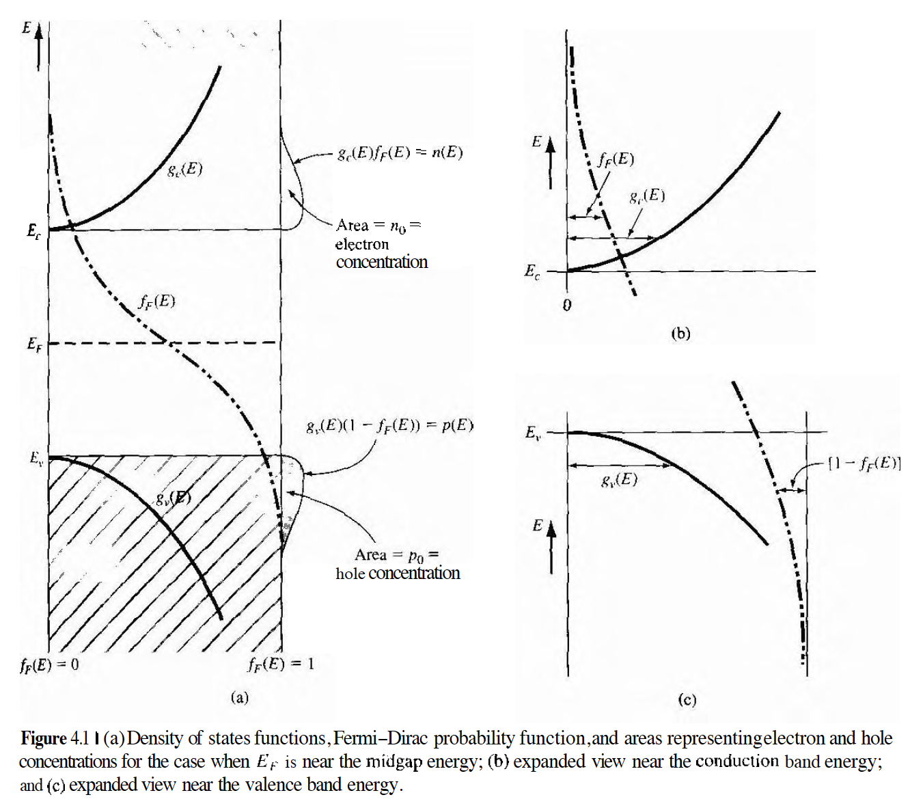
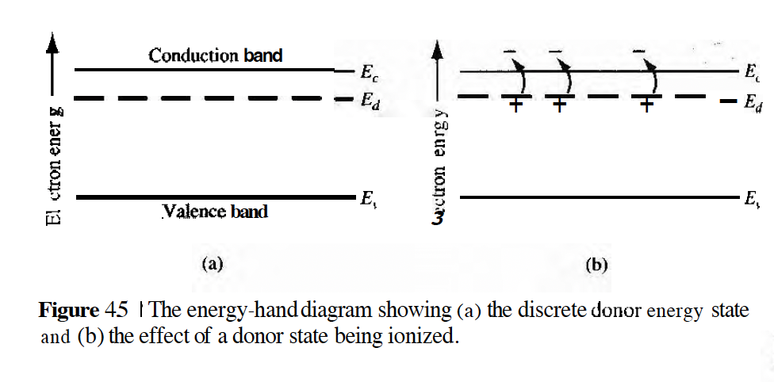
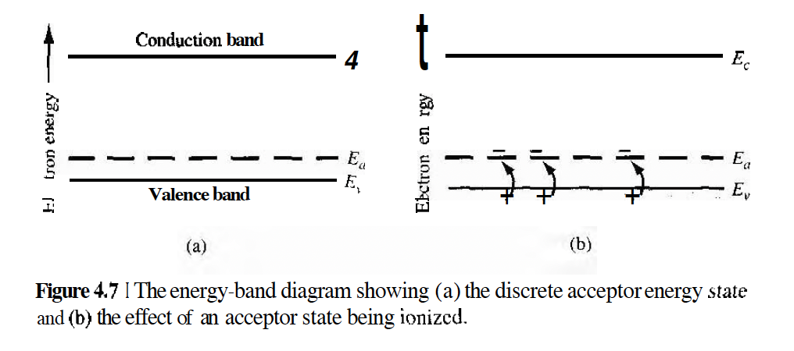
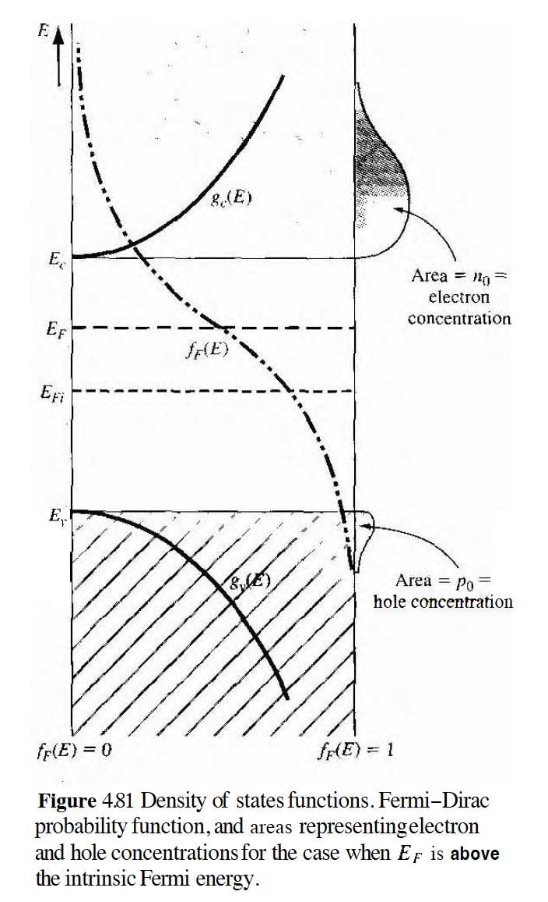
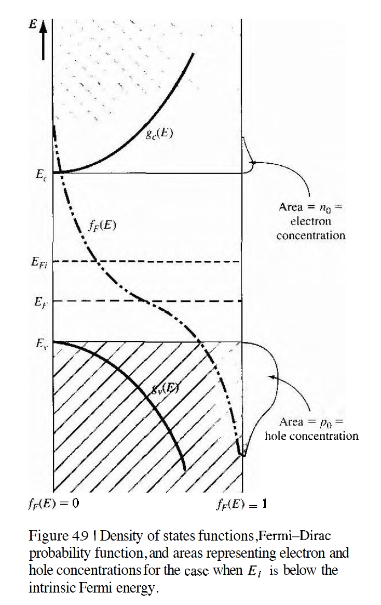
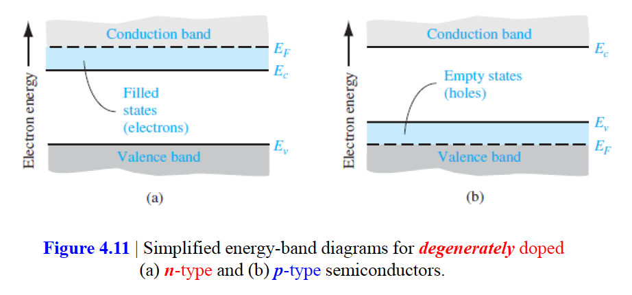
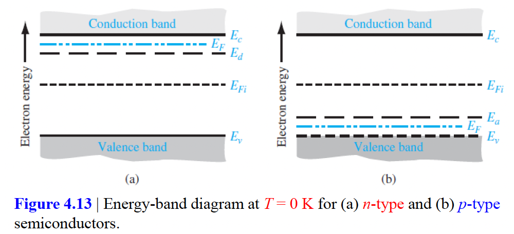
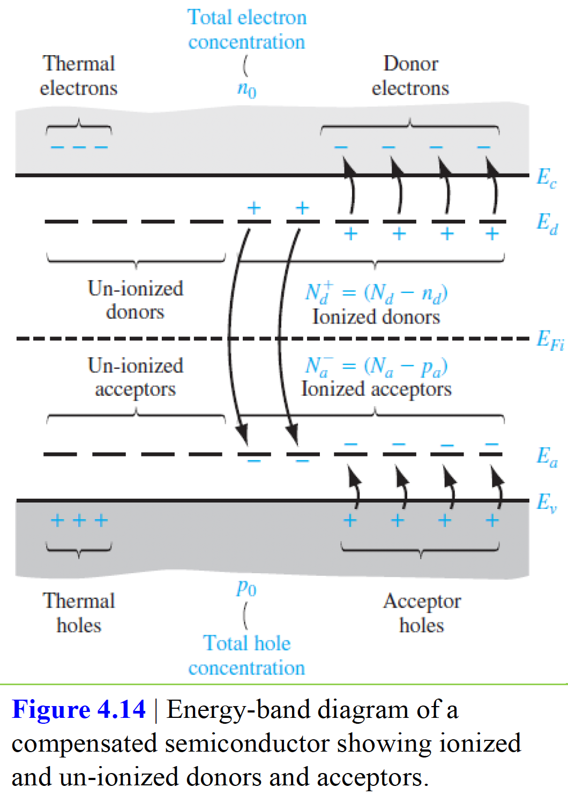
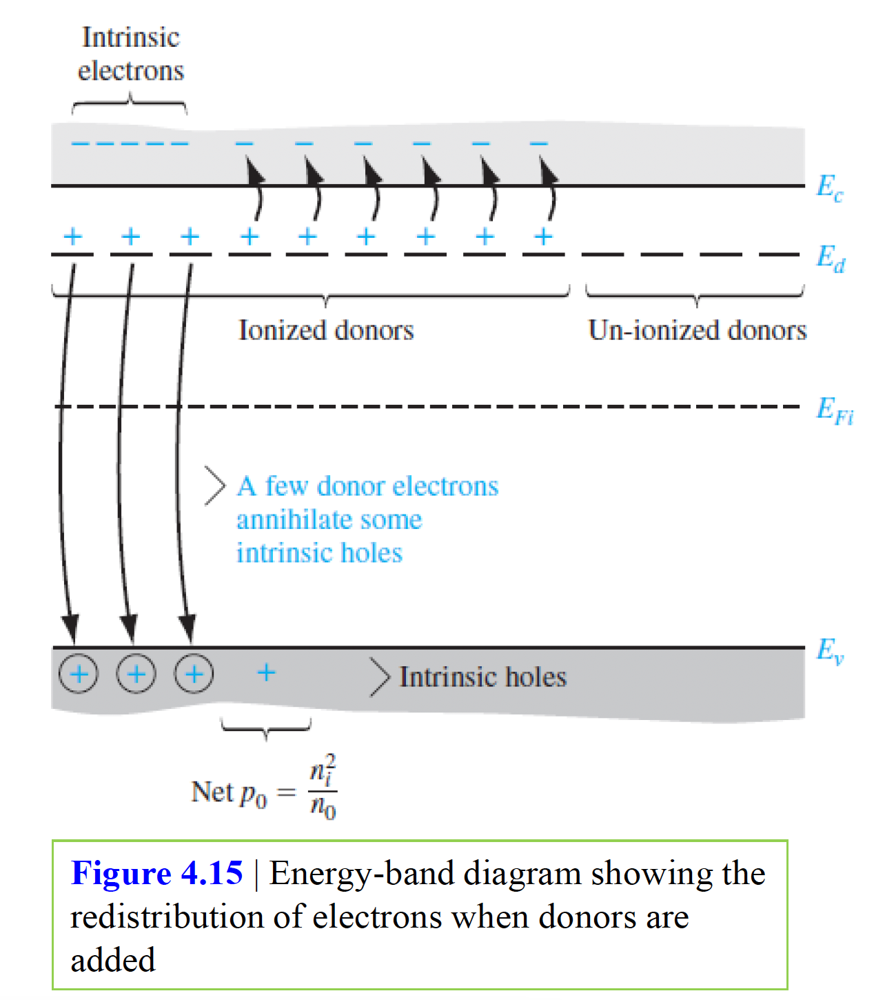
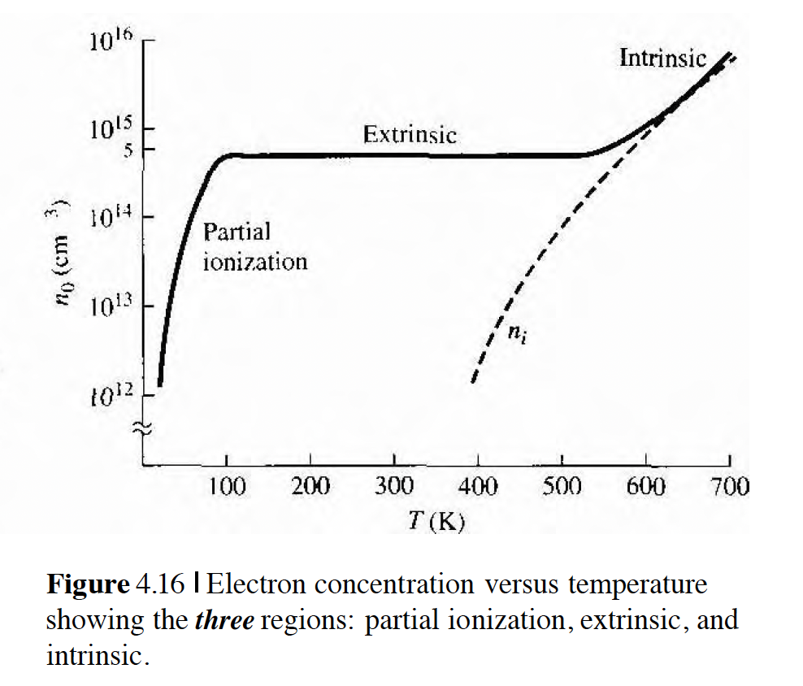

# 목차
1. 반도체의 전하 캐리어
2. 도펀트 원자와 에너지 준위
3. 외인성 반도체
4. 도너와 억셉터 통계

이 장에서는 페르미-디락 확률함수와 함께 가전자대와 전도대의 양자상태 밀도를 사용하여 가전자대와 전도대의 전자 및 정공의 농도를 각각 계산할 것이다. 또한 페르미 에너지 개념을 반도체에 적용할 것이다. 여기서는 반도체 소자의 전류-전압 특성을 밝히는 것이 최종 관심사이다. 전류는 전하의 순흐름에 기인하므로 전류를 만드는데 사용되는 전하 캐리어의 수를 결정하는 것이 필요하다. 반도체에서는 전하 캐리어로서 전자 뿐 아니라 마찬가지로 중요한 정공이 있다.

# 반도체의 전하 캐리어
## 평형상태의 전자와 정공 분포
반도체에서 전류는 주로 전도대의 전자의 수와 가전자대의 정공의 수에 의해 결정되므로 반도체의 중요한 특성은 이러한 전하 캐리어의 농도이다. 이는 양자상태 밀도와 하나의 양자상태가 전자에 의해 채워질 확률을 곱해 나타낼 수 있다. 전도대에서 단위부피당 총 전자농도는 전체 전도대 에너지에 대해 $n(E) = g_c(E)f_F(E)$를 적분하면 된다. $f_F(E)$는 페르미-디락 확률함수이고 $g_c(E)$는 전도대의 양자상태 밀도이다. 반대로 정공의 분포도 가전자대의 양자상태밀도와 양자상태가 전자에 의해 채워지지 않을 확률을 곱하면 되는데 $p(E) = g_v(E)(1 - f_F(E))$로 구할 수 있다.

intrinsic semiconductor(진성반도체)는 불순물과 결함이 전혀 없는 순수한 반도체이다. T=0K의 intrinsic semiconductor에서 가전자대의 모든 에너지 상태는 전자로 채워지고 전도대의 모든 에너지 상태는 전자의 빈상태이므로 페르미 에너지는 $E_c$와 $E_v$사이에 있어야한다. 아래 이미지는 3장에서 본 양자상태밀도함수와 페르미-디락 분포함수가 E에 대한 그래프였는데 E-k 다이어그램에 맞춰 E를 y축으로 보고 생각해보면된다. 아래 이미지에서 오른쪽 볼록 튀어나온 부분의 면적이 곧 전자농도 또는 정공농도가 된다.

온도가 높아지면 어떻게 될까? 뒤에서 보겠지만 페르미 에너지 준위는 온도에 영향을 받지만 그 영향이 미미하여 intrinsic 페르미 에너지 준위는 밴드갭 중앙에 위치한다고 생각할 수 있다. 온도가 높아지면 그래프는 $E_F$위치는 약간 바뀌지만 거의 그대로 일 것이고 시그모이드 곡선 f의 변곡점 기울기가 더 작아질 것이다.

## $n_0$와 $p_0$ 방정식
열평형상태에서 전자농도는 다음과 같다. 적분의 하한은 $E_c$이고 상한은 전도대 에너지의 상단이어야한다. 하지만 위 이미지에서도 볼 수 있듯이 페르미 확률 함수는 에너지가 증가함에 따라 급격히 0에 접근하므로 적분의 상한을 무한대로 해도 큰 오차는 없다.
$$n_0 = \int g_c(E)f_F(E)dE$$
페르미 확률함수는 볼츠만 근사를 진행하여 쭉 전개했을 때 전도대의 열평형상태의 전자농도는 아래와 같다.
$$n_0 = \frac{N_c}{e^{\frac{(E_c - E_F)}{kT}}}$$
이 때 파라미터 $N_c$를 전도대의 유효상태밀도함수(effective density of states function)이라하며 다음과 같다.

$$N_c = 2(\frac{2\pi m_n^*kT}{h^2})^{\frac{3}{2}}$$

만약 $m_n^*=m_0$라고 가정하면 T=300K에서 유효상태밀도함수의 값은 $2.5*10^{19} cm^{-3}$이 되고 대부분 반도체의 $N_c$가 이 정도의 값을 갖는다. 

하나의 양자 상태가 점유될 확률과 양자 상태 밀도의 곱으로 생각해보자. 그래서 $N_c$를 유효상태밀도함수라고 부르는 것이고, 그 뒤에 곱해지는 exponential항이 하나의 양자 상태가 점유될 확률이라고 생각할 수 있다. 실제로 하나의 양자상태에 전자가 발견될 확률은 굉장히 작지만 엄청난 수의 양자 상태가 존재하기 때문에 모든 상태에 존재하는 모든 전자의 농도는 상당히 큰 값을 갖게된다.

반대로 열평형상태의 정공농도는 다음과 같다.
$$p_0 = \int g_c(E)(1-f_F(E))dE$$
식을 전개했을 때 아래와 같으며 가전자대의 유효상태밀도함수라고 부른다. 그리고 파라미터 $m_p$는 정공의 상태밀도 유효질량이다.
$$N_v = 2(\frac{2\pi m_p^*kT}{h^2})^{\frac{3}{2}}$$

가전자대의 열평형상태의 정공농도는 아래와 같다. 대부분의 반도체 경우 $N_v$의 크기도 역시 T=300K에서 $10^{19}cm^{-3}$의 크기를 가진다.
$$p_0 = \frac{N_v}{e^{\frac{(E_F - E_v)}{kT}}}$$

보다시피 유효상태밀도함수 $N_c$와 $N_v$는 주어진 반도체에 대해 특정 온도에서 상수이다. 전도대의 열평형상태의 전자농도와 가전자대의 열평형상태의 정공농도는 유효상태밀도함수와 페르미 에너지에 직접 관련이있다.

## 진성(intrinsic)캐리어 농도
도핑하지 않고 열평형상태에 있는 순수한 반도체라고 생각하자. intrinsic 반도체에 대해 전도대의 전자농도는 가전자대의 정공농도와 같다. 전자농도와 정공농도를 각각 $n_i$와 $p_i$라 표시하고 둘은 같기 때문에 전자농도와 정공농도 식을 곱해 $n_i^2$를 구할 수 있는데 아래와 같다. $n_i$를 intrinsic(진성)캐리어 농도라고 한다. 이 때 $E_g$는 밴드갭 에너지이다. 특정 온도에서 주어진 반도체에 대해 $n_i$값은 일정하고 페르미 에너지에 대해 무관하다. 아래부터 나오는 식에서 i 아래첨자는 intrinsic을 표현하는 첨자로 사용된다.
$$n_i^2 = \frac{N_c N_v}{e^{\frac{E_c - E_v}{kT}}} = \frac{N_c N_v}{e^{\frac{E_g}{kT}}}$$

## 진성 페르미 준위 위치
위에서는 전자농도와 정공농도를 곱하여 식을 유도했다면, 아래에서는 전자농도와 정공농도가 같다는 식으로부터 intrinsic 페르미 준위 위치를 유도하게 된다.
$$\frac{N_c}{e^{\frac{E_c - E_{Fi}}{kT}}} = \frac{N_v}{e^{\frac{E_{Fi-E_v}}{kT}}}$$
양변에 자연로그 ln을 취해 식을 유도하면 아래와 같다. $E_{midgap}$은 $E_c$와 $E_v$의 중간값이다.
$$E_{Fi} - E_{midgap} = \frac{3}{4}kTln(\frac{m_p^*}{m_n^*})$$
전자와 정공의 유효질량이 같으면 intrinsic 페르미 준위는 정확히 밴드갭의 중앙이되고, 정공의 유효질량이 더 크면 페르미 준위는 중앙보다 위에 위치하고, 전자의 유효질량이 더 크면 중앙보다 아래에 위치하게된다. 

이해를 다음과 같이 해보자. 상태밀도함수는 캐리어 유효질량과 직접 관계되므로 유효질량이 크면 상태밀도함수가 커진다. 그래서 intrinsic 페르미 준위는 전자와 정공의 수가 같아지기 위해 상태밀도함수가 큰 밴드로부터 멀어지게된다. 예를들어 전자가 정공보다 유효질량이 크다고 했을 때 유효상태밀도함수는 전자가 클 것이지만(양자상태는 전자가 더 많은 것이지만) 정공과 전자의 밀도가 같아야하기 때문에 각 상태에서 발견될 확률은 정공이 더 커져야하고 실제로 페르미 에너지 준위가 midgap 에너지 준위보다 내려가게 되면서 정공에서 전자가 발견될 확률이 전자보다 더 커지게 된다. (정공의 exponential의 지수항이 더 작아지게 되므로) 양자상태밀도와 발견될 확률이 tradeoff 관계를 가지면서 왔다갔다 하는 것 같다.

많은 경우 intrinsic 페르미 준위는 밴드갭 중앙에 위치한다고 근사할 수 있다. 온도에 따라서 페르미 에너지 준위와 midgap 에너지 준위가 달라지지만 실제 밴드갭 에너지보다 무시할 만큼 작기 때문에 intrinsic 페르미 준위는 거의 밴드갭 중앙에 위치한다고 생각하자.

그리고 위에서 유도한 식에서 사용된 페르미 확률함수는 볼츠만 근사를 사용한 것이다.

# 도펀트 원자와 에너지 준위
반도체의 실제 저력은 소량의 특정 도펀트 혹은 불순물 원자를 첨가함으로써 발휘된다. 도핑공정은 반도체의 전기적 특성을 크게 변화시킬 수 있다. extrinsic semiconductor라고 부르는 도핑된 반도체가 반도체 소자들에 사용되는 주요 재료이다.

## 정성적 설명
|3족|4족|5족|
|--|--|--|
|B|C|N|
|Ai|Si|P|
|Ga|Ge|As|
|In|Sn|Sb|

단결정 실리콘 격자에서 인(P)와 같은 5족의 원소를 치환 불순물로서 첨가한 경우를 생각해보자. 최외각 전자 4개는 실리콘 원자와 공유결합하지만 5번째 전자는 인 원자와 느슨하게 결합되어 남게된다. 이 5번째 가전자를 donor 전자(도너, donate로부터 파생됨)라고 부른다.

아래 그림은 에너지밴드 그림이며, 에너지 준위 $E_d$는 도너 전자의 에너지 준위이다. $E_c$에서 $E_d$를 뺀 에너지 정도만 도너 전자에 가해져도 양전하를 띤 인 이온을 남기고 도너 전자는 전도대로 상승한다. 이 전도대 전자는 결정 내부를 이동하면서 전류를 생성시키는 반면에 양이온은 결정 내에 고정되어있다.

이러한 형태의 불순물 원자는 전자를 전도대에 제공하기 때문에 도너 불순물(donor impurity)원자라고 부른다. 도너 불순물 원자는 가전자대에 정공을 만들지 않고 전도대에 전자를 제공한다. 따라서 이러한 반도체를 n형 반도체라고 한다.

반대로 5족이 아니라 3족의 B(붕소)를 치환불순물로서 실리콘에 첨가했다고 생각해보자. 이 때 3족 원소는 가전자대로부터 전자를 받아드리므로 억셉터 불순물(acceptor impurity)원자라고 부른다. 억셉터 원자는 전도대에 전자를 생성하지 않고 가전자대에 정공을 생성한다. 이러한 형태의 반도체를 p형 반도체라고 부른다. 아래 이미지에서 

donor 혹은 acceptor와 같은 도펀트 원자를 조절된 양으로 첨가하므로써 extrinsic semiconductor를 만든다.

## 이온화 에너지
도너 불순물 이온과 도너 전자 사이의 거리를 근사적으로 계산하여 도너 전자를 전도대로 상승시키는데 필요한 에너지를 이온화 에너지 라고 한다.

수소원자의 이온화 에너지는 E = 13.6eV 이다. 실리콘의 이온화 에너지는 E = -25.8meV로 실리콘의 밴드갭 에너지 1.1eV보다도 훨씬 작다. 이 에너지가 도너 원자의 근사 이온화 에너지, 혹은 도너 전자를 전도대로 상승시키는데 필요한 에너지이다.

## 3-4족 반도체 계열

# 외인성(extrinsic) 반도체
외인성반도체는 일정량의 특정 도펀트, 혹은 불순물 원자를 첨가하여 열평형상태의 전자와 정공의 농도을 intrinsic 반도체와 다르게 만든 물질이다. extrinsic semiconductor에서는 2개의 carrier 중에 어느 하나의 캐리어가 지배적으로 많이 존재한다.

## 전자와 정공의 평형상태 분포
반도체에 도너와 억셉터 불순물 원자들을 첨가하는 것은 전자와 정공의 에너지 분포를 변화시킨다. 페르미 에너지는 전자 확률 분포함수와 관계되므로 페르미 에너지는 도펀트 원자가 첨가되면 변한다. 페르미 에너지가 밴드갭의 가운데로부터 멀어지면 아래 이미지처럼 전도대의 전자농도와 가전자대의 정공농도가 변할 것이다.

 

전자와 정공의 열평형상태의 농도식의 지수항에 intrinsic 페르미 에너지항을 더하고 빼서 식을 유도하면 아래와 같은 식을 얻을 수 있다.
$$n_0 = n_i e^{\frac{E_F-E_{Fi}}{kT}}$$
$$p_0 = n_i e^{\frac{-(E_F-E_{Fi})}{kT}}$$

$n_0$, $p_0$는 페르미 에너지와 intrinsic 페르미 에너지와의 차이만큼 $n_i$와 차이 나게된다.

## $n_0 \cdot p_0$ 곱
위 두식을 곱해보자 그러면 아래 식을 얻을 수 있다. 페르미 에너지의 일반적인 값에 대해 유도되었기 때문에 $n_0$와 $p_0$가 같을 필요가 없다. 즉 열평형 상태에 있는 반도체에 대해 아래 식을 얻을 수 있는데 $n_0$와 $p_0$의 곱은 항상 상수임을 의미한다. 불순물을 넣어서 $n_0$와 $p_0$의 농도 값이 변해도 곱은 일정하다는거다.
$$n_0 p_0 = n_i^2$$
이 방정식이 단순해 보이지만 열평형 상태에 있는 반도체의 근본적인 원리 중 하나이다. 다시 한번 더 강조하지만 위의 모든 식은 볼츠만 근사로부터 유도되었음을 명심해야하고 볼츠만 근사가 성립하지 않으면 위 식은 성립되지 않는다.

## 페르미-디락 적분

## 축퇴와 비축퇴 반도체
반도체의 도펀트 원자들의 도핑을 이야기할 때 도펀트 원자의 농도가 반도체를 구성하고 있는 원자의 농도와 비교해서 작다고 가정했다. 작은 수의 불순물 원자들은 멀리 떨어져서 넓게 퍼져있기 때문에 n형 반도체의 경우 도너 원자들 사이의 상호간섭은 없다. 불순물은 n형 반도체에서 개별적이고 비간섭적인 도너 에너지 상태를 만들고 반대로 p형 반도체에서는 개별적이고 비간섭적인 에너지 상태를 만든다고 가정했는데 이러한 형태의 반도체를 비축퇴(nondegenerate)반도체라고 한다. 지금까지는 nondegenerate 반도체에 대해서 다뤘다.

이 때 불순물 농도가 증가하면 불순물 원자들 사이의 거리가 감소하고 도너 전자들이 서로 간섭하는 지점에 도달하게 된다. 이 때 단일 개별 도너 에너지는 에너지 밴드로 형성될 것이다. 도너 농도가 더 증가하면 도너 에너지 상태의 밴드화는 더 확장되고 전도대 하단과 겹치게된다. 이는 도너 농도가 유효상태밀도와 유사한 크기를 가질 때 발생하는데 전도대의 전자농도가 상태 밀도 $N_c$보다 클 때 페르미 에너지는 전도대 내부에 있게된다. 이를 축퇴(degenerate) n형 반도체라고 부른다.

마찬가지로 정공농도가 상태밀도 $N_v$를 넘어서면 페르미 에너지는 가전자대 내부에 있게 되는데 이러한 반도체를 축퇴 p형 반도체라고 한다. 그림은 아래와 같다.

# 도너와 억셉터의 통계
도너 불순물는 도너 전자를 하나만 갖는다. 즉 양자상태는 둘이지만 전자는 하나만 둘 수 있으므로 도너 에너지 상태에 있는 도너 전자의 분포함수는 페르미-디락 함수와는 약간 달라진다. 도너상태를 차지하는 전자의 확률함수는 아래와 같다. 아래에서 $n_d$는 도너 준위를 차지하는 전자농도이고 $E_d$는 도너준위의 에너지이다.
$$n_d = \frac{N_d}{1 + \frac{1}{2}exp(\frac{E_d-E_F}{kT})}$$
여기서 조금 헷갈린만한 식이 나온다. 아래에서 $N_d$는 넣어준 도너 전자농도라고 생각하자. 그리고 $N_d^+$는 이온화된 도너농도이다. 이온화된 도너농도와 전도대로 이온화된 전자농도는 서로 같은 의미이다. 그럼 자연스럽게 $n_d$는 도너 에너지 준위에 남아있는 전자를 의미한다.
$$n_d = N_d - N_d^+$$
우리가 위에서 구했던 $n_0$는 일반화된 식이다. 즉 열로서 생긴 전자(다시말하면 intrinsic 전자농도라고 말할 수 있다)와 도너가 이온화된 전자를 모두 합친 값이 된다. $n_0$는 $E_F$에 대한 식으로 도너 전자를 넣어주면서 $E_F$가 변화하게 되고 $n_0$도 함께 변하게 되는데 여기에는 기존에 열로 인해 전도대로 넘어온 전자, 도너 전자가 이온화된 전자가 모두 포함된다.

그럼 도핑을하고 도너 상태에 남아있는 전자 수의 비율을 계산하고 싶다면(즉, 이온화되지 않은 전자의 비율) 아래처럼 계산할 수 있다. 실제로 T=300K에서 도핑농도 $N_d=10^{16}$ 도너 상태에 남아있는 전자 수의 비율을 계산하게되면, 도너 상태에 남아있는 전자수의 비율($n_d$)는 0.41%가 되고 상온에서 거의 대부분의 전자가 이온화된다. 즉 상온에서 도너 상태는 원칙적으로 완전이온화(complete ionization)되며 통상적인 도핑농도 $10^{16}cm^{-3}$인 경우 거의 대부분의 도너 불순물 원자들은 전도대로 전자를 이온화시킨다.
$$\frac{n_d}{n_0 + n_d}$$

완전이온화의 정반대 현상이 T=0K에서 발생하게 된다. 절대온도 0K에서 모든 전자는 가능한 가장 낮은 에너지 상태에 있게된다. 즉 n형 반도체에서 각 도너 상태는 하나의 전자를 가져야하므로 $n_d = N_d$ 혹은 $N_d^+=0$이 된다. 즉 위 $n_d$에 T=0, $n_d=N_d$를 대입하여 풀어보면 $E_F > E_d$임을 알 수 있다. 페르미 에너지 준위는 절대온도 0K에서 도너 에너지 준위 위에 있어야한다. 도너 상태로부터 어떤 전자도 열에너지에 의해 전도대로 상승하지 못한 현상을 동결(freeze-out)이라고 한다.

그림 4.12는 도너 상태와 억셉터 상태의 완전 이온화를 보여주는 에너지 밴드그림이고, 4.13은 n형 반도체와 p형 반도체의 T=0K에서의 에너지 밴드 그림이다.

반대로 p형 반도체도 위 개념이 똑같이 적용된다. notation은 acceptor의 a를 따서 $N_a, p_a, N_a^-$등으로 정의된다.

# 전하중성
보상 반도체(compensated semiconductor)는 같은 영역에 도너와 억셉터 불순물을 함께 도핑한 반도체를 의미한다. 보상반도체는 예를들어 p형 반도체에 도너 불순물을 확산함으로써 만들 수 있다. n형 보상 반도체는 $N_d > N_a$일 때 형성되고, p형 보상 반도체는 $N_d < N_a$일 때 형성된다. 만약 $N_d = N_a$이면 완전 보상 반도체가되고 이는 진성 반도체의 특성을 갖는다. 보상 반도체는 소자를 만드는 동안에 자연스럽게 형성된다.

## 열평형상태의 전자 및 정공 농도
아래 그림을 잘 이해하는게 중요하다. 이는 보상 반도체를 만들기 위해 도너와 억셉터 불순물을 같은 영역에 도핑했을 때 반도체의 에너지 밴드를 나타내고 있으며 전자와 정공이 에너지 상태에서 어떻게 분포될 수 있는지를 보여준다.

전하중성조건을 한번 보자. 비이온화된 도너($n_d$와 $n_a$)는 전하를 가지고 있지 않기 때문에 전하중성조건(charge neutrality condition)은 음전하와 양전하 농도를 같게 둠으로써 표현된다. 순수하게 전하 자체의 농도를 같게 둔 것이다. "$n_0$에 $N_d^+$로부터 옮겨간 전하를 가지고 있는게 아니냐. 근데 왜 식에 $n_0$가 있는데 $N_d^+$를 써주냐." 아니라 옮겨갔기 때문에 도너 에너지에 이온화된 전하를 +쪽에 더해줘야한다. 순수 전하의 농도를 비교하는 것이다.
$$n_0 + N_a^- = p_0 + N_d^+$$

여기서 전자농도 완전이온화를 가정하면 $n_d$, $p_a$는 모두 0이고 아래 식을 도출할 수 있고 
$$n_0 + N_a = p_0 + N_d$$
여기서 $n_i^2 = p_0 n_0$ 식을 대입하여 $n_0$와 $p_0$에 대해 2차 방정식을 풀어 해를 계산할 수 있다.

전도대의 전자농도는 도너 불순물 원자를 도핑함에 따라 진성 캐리어 농도 이상으로 증가한다. 동시에 소수 캐리어 정공농도는 도너 원자들을 도핑함에 따라 진성 캐리어 농도 이하로 감소한다. 도너 불순물 원자와 이에 해당하는 도너 전자를 도핑함에 따라 에너지 상태에서 전자의 재분포가 발생한다. 실제로 아래 그림은 전자 재분포를 보여주는데 일부 도너 전자들이 가전자대의 빈상태로 떨어지고 진성 정공의 일부가 사라진다. 그래서 소수 캐리어 농도는 감소한다. 실제로 전도대의 순 전자농도는 가전자대로 떨어지는 전자들이 있기 때문에 단수히 도너 농도와 진성 전자농도의 합으로 구할 수 없다. 그렇게 $n_i^2=n_0p_0$가 성립된다.

온도가 증가함에 따라 반도체는 extrinsic한 특성을 잃어버리게 된다. 아래 그림을 참고하자.

# 페르미 에너지 준위의 위치
$n_0 = N_c exp(-(E_c-E_F)/kT$ 식으로 전부 유도할 수 있다. 이 때 중요한건 $N_d >> n_i$인 n형 반도체의 경우 $n_0를 N_d$로 근사하여 식을 나타낼 수 있다. 도너 농도가 증가함에 따라 페르미 에너지는 전도대 가까이 이동하고 반대로 페르미 에너지가 전도대 가까이 이동하면 전도대의 전자농도가 증가한다. 보상 반도체의 경우에는 $N_d$가 $N_d - N_a$로 대체된다.