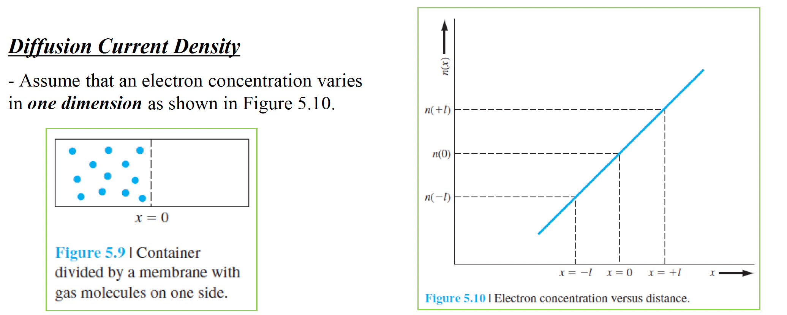

# 목차
1. 캐리어 드리프트
2. 캐리어 확산
3. 경사 불순물 분포
4. 홀 효과

반도체에서 전자와 정공의 순 흐름은 전류를 생성한다. 이러한 전하 입자들이 이동하는 현상을 전송(transport)라고 한다. 반도체에서 두가지 전송 메커니즘이 있다. 드리프트(전기장에 의한 전하의 이동)과 확산(농도차에 의한 전하의 흐름)이다. 캐리어 전송 현상은 최종적으로 반도체 소자의 전류-전압 특성을 결정하기 위한 기초이며 이장에서는 열평형 상태를 유지한다고 가정한다. 비평형(non-equilibrium)현상은 다음 장에서 다룰 것이다.

## 캐리어 드리프트
반도체에 전기장을 걸어준다. 그럼 전자와 정공에 힘을 가하게 되므로 전도대와 가전자대에 이용할 수 있는 에너지 상태가 있으면 전자와 정공들은 순 가속과 순 이동을 하게된다. 전기장에 의한 전하의 순수한 이동을 드리프트라고 한다.

### 드리프트 전류 밀도
드리프트 전류는 속도 $v_d$로써 이동하는 양의 전하밀도 $\rho$가 있으면 드리프트 전류밀도는 아래와 같다. 단위는 $\frac{A}{cm^2}$ 이다.

$$J_{drf} = \rho v_d$$

아래에 나오는 모든 것들은 저전계(low electricity)에서 일어난다. 전기장이 일정하면 양전하의 속도는 시간에 대해 선형적으로 증가하지만 반도체에서 전하 입자들은 이온화된 불순물 원자들과 열적 진동을 하는 격자 원자들과 충돌한다. 이러한 충돌(또는 산란현상(scattering))은 입자의 속도 특성을 변화시킨다.

전하 입자들이 원자와 충돌하고 에너지를 잃고, 다시 가속하고, 다시 충돌해서 에너지를 잃고를 반복하기 때문에 입자는 평균 드리프트 속도를 얻고 이는 (작은)전기장의 크기에 비례한다.
$$v_{dp} = \mu_p E$$
$$v_{dn} = -\mu_n E$$
여기서 $\mu_p$, $\mu_n$는 비례상수이고 각각 hole mobility(정공 이동도), electron mobility(전자 이동도)라고 부른다. 이동도는 입자가 전기장에 의해 얼마나 잘 반도체를 통과하는지 나타내는 반도체의 중요한 파라미터이다. 전자소자를 다룰 때 mobility 개념이 매우 중요한데, 실제로 HEMT는 High Electron Mobility Transistor의 약자로, 전자가 높은 이동도(moblility)를 가질 수 있게 해주는 소자이다. high switching device의 경우 높은 $\mu_n$이 중요하다. 그리고 이 mobility는 단위 전압과 시간당 얼마나 잘 퍼지는지를 나타내는 정도로 단위는 $\frac{cm^2}{V\cdot s}$이다.

위 이미지에서 대부분의 반도체는 $\mu_n > \mu_p$이며 compound semiconductor의 경우 예를들어 InAs 또는 InSb 같은 경우 $\mu_n$ 값이 각각 대략 40,000, 77,000 정도 된다.

전자와 정공이 드리프트 전류에 기여하고 총 드리프트 전류는 개별 전자와 정공 드리프트 전류 밀도의 합이다.

$$J_{drf} = e(\mu_n n + \mu_p p) E$$

### 이동도(mobility) 효과
전기장과 캐리어의 평균속도를 관련짓는 상수항으로서 mobility를 정의했고 캐리어 드리프트의 특성을 결정하는 중요한 반도체 파라미터이다.

아래 왼쪽 이미지(a)는 전기장이 없을 때 무작위 열속도(random thermal velocity)와 운동을 그렸고 오른쪽 이미지(b)는 전기장이 있을 때 정공의 무작위 운동을 나타내는데 (a)처럼 외부에서 E를 걸지 않아도 정공은 계속해서 움직이긴하지만 전체 드리프트 속도의 합은 0이다. 여기서 드리프트의 속도라고 함은 1번을 예시로 들었을 때 파란색 벡터에서 검은색 벡터를 뺀 방향의 속도를 드리프트 속도라고 볼 수 있다.

반도체에서는 캐리어의 이동에 영향을 주는 지배적인 두가지 충돌(또는 산란 메커니즘)
1. phonon scattering(포논산란 또는 lattice scattering(격자산란))
2. ionized impurity scattering(이온화 산란)

반도체 원자들은 0K 이상에서 일정량의 열에너지를 가지고 격자점을 중심으로 무작위 진동을 하게 된다. 이러한 열진동은 전자 또는 진공과 진동하는 원자 사이에서 간섭을 발생시킨다. 이러한 lattice scattering 을 phonon scattering이라고 한다. 애초에 phonon은 lattice가 vibration을 하면서 열을 발생시키는데 이를 양자역학적으로 설명하기 위해 도입한 개념이 phonon이다. lattice scattering은 원자의 열진동과 관련되기 때문에 온도에 비례한다. lattice scattering만 존재할 때 관찰되는 mobility를 $\mu_L$이라고 할 때 온도 관계식은 아래와 같다.
$$\mu_L \propto T^{-\frac{3}{2}}$$
이를 좀 쉽게 풀어 설명하면 electron이 움직이는데 많이 부딪히면 mobillity는 떨어진다. 근데 온도가 올라가면 lattice vibration이 더 커지므로 전자는 lattice에 더 많이 부딪히게 되고 결국 mobility는 줄어들게된다.

캐리어 이동도에 영향을 주는 두번째 산란 메커니즘은 ionized impurity scattering이다. 불순물 원자들이 반도체의 특성을 변화, 조절하기 위해 첨가되는데 이 불순물은 상온에서 이온화되므로 쿨롱 간섭이 전자 또는 정공과 이온화 불순물 사이에서 존재한다. 만약에 이온화 불순물 산란만 존재할 경우 관찰되는 mobility를 $\mu_I$, $N_I = N_d^+ + N_a^-$ 는 반도체의 총 이온화 불순물 농도라고 할 때 다음과 같다.
$$\mu_I \propto \frac{T^{\frac{3}{2}}}{N_I}$$

이 두가지 산란의 영향을 받은 이동도의 그래프를 나타내면 다음과 같다. 아래 그래프는 여러가지 도핑농도에 대해 온도와 전자 이동도(a)와 정공 이동도(b)의 관계 그래프를 나타낸 것이다. 그래프 내의 작은 그래프는 intrinsic에 가까운 반도체의 온도에 따른 이동도를 보여준 그래프이다. 온도가 증가하면 전자와 정공의 mobility가 모두 감소한다.

불순물 농도가 증가하면 mobility가 줄어들게된다.

$\tau_L$이 격자산란에 의한 평균 충돌시간이면 $dt/\tau_L$은 $dt$시간동안 발생하는 격자산란 확률이다. 이와 같이 $\tau_I$가 이온화 불순물 산란에 의한 평균충돌시간이면 $dt/\tau_I$은 $dt$ 시간동안 발생하는 이온화 불순물 산란의 확률이다. 만약 이러한 두가지 산란 현상이 독립적이면 $dt$시간동안 dt 시간동안 발생하는 산란 확률은 다음과 같다.
$$\frac{dt}{\tau} = \frac{dt}{\tau_I} + \frac{dt}{\tau_L}$$
여기서 $\mu_n = \frac{e\tau_{n}}{m_n^*}$ ($F=m\cdot\frac{dv}{dt}=q\cdot E$ 식으로부터 쉽게 유도되니 책을 참고하자) 을 대입하여 mobility에 대한 식으로 나타낼 수 있다.
$$\frac{1}{\mu} = \frac{1}{\mu_I}+\frac{1}{\mu_L}$$
$\mu_I$는 이온화 불순물 산란 과정에 의한 이동도이고 $\mu_L$은 격자 산란 과정에 의한 이동도이다. 즉 두가지의 산란이 존재할 때 순 이동도는 감소하게된다.

### 전도도(conductivity)
$$J_{drf} = e(\mu_n n + \mu_p p)E = \sigma E$$

위 식에서 전류밀도는 전자, 정공의 concentration(농도)와 mobility의 함수이다. $\sigma$를 conductivity(전도도)라고 하며 단위는 $(\Omega \cdot cm)^{-1}$ 이다.
전도도의 역수는 resistivity(저항도)이며 단위는 $\Omega \cdot cm$ 이다.
$$\rho = \frac{1}{\sigma} = \frac{1}{e(\mu_n n + \mu_p p)}$$

반도체에서 중요한 특성은 도체, 부도체와 다르게 resistivity의 range를 조정할 수 있다고 했고 이는 impurity concentration(불순물 농도)에 따라서 저항도의 범위를 조절할 수 있다.

아래 이미지는 실리콘의 온도에 대한 전자 농도와 전도도에 대한 함수이다. 앞장에서 봤듯이 온도에 대해서 전자 농도는 부분 이온화가 진행되고, extrinsic, intrinsic 현상이 각각 증가했음을 알 수 있다. 전도도에 대해서는 midtemperature(상온이라고 생각하자) 범위보다 작을 때와 클 때는 전자 농도와 비슷한 경향을 따라가는데, 상온에서 온도가 증가함에 따라 전도도가 더 줄어드는 현상을 볼 수 있다.

진성 반도체(intrinsic semiconductor)에 대해 전도도는 다음과 같다.
$$\sigma_i = e(\mu_n + \mu_p) n_i$$
진성 반도체에서 전자와 정공농도는 같으므로 진성 케리어 농도를 intrinsic 캐리어 농도 하나로 표시하지만 mobility의 경우는 전자와 정공 mobility를 모두 고려해주게 된다.

### 속도 포화(Velocity Saturation)
입자의 총 속도는 무작위 열속도와 드리프트 속도의 합이다. 실제로 300K에서 열속도를 구해보면 $\frac{1}{2}mv_{th}^2 = \frac{3}{2}kT$ 로 $v_{th}$를 구해보면 대략 $10^7cm/s$의 열속도가 나온다. 전자 이동도 $\mu_n$을 1350 $cm^2/V \cdot s$ 라고 하고 전기장이 대략 75 $V/cm$ 일 때 드리프트의 속도는 열속도의 1%에 해당하는 $10^5 cm/s$가 된다.

앞에서 드리프트 속도는 전기장에 비례해서 선형으로 증가한다고 가정했다. 하지만 높은 전기장에서 캐리어의 드리프트 속도는 선형관계에서 벗어나서 속도가 일정해진다. 마찬가지로 드리프트 전류밀도 역시 일정해져 전기장과 무관해진다. 실제로 아래이미지에서 실리콘의 경우 30 $kV/cm$의 전기장에서 드리프트 속도는 거의 $10^7 cm/s$ 로 속도가 일정해진다(포화된다)

실제로 위 GaAs의 그래프를 보면 높은 전기장일 때 오히려 drift velocity가 줄어듦을 볼 수 있는데 아래 그래프로 설명한다.

앞서 $\mu_n = \frac{e\tau_{n}}{m_n^*}$ 식에 의해 유효질량과 이동도가 반비례 관계임을 알 수 있다. 위 그래프에서 Upper valley에 있는 전자의 유효질량이 Lower valley의 전자의 유효질량보다 크기 때문에 이동도는 작아지게 된다. 그리고 실제로 Lower valley에 있는 전자들이 전기장이 증가함에 따라 전자의 에너지가 증가하여 Upper valley로 전자들이 이동하게되는데, 이 때 전자의 유효질량은 증가하고, 반대로 이동도는 작아지게되므로 높은 전기장에서 전기장 세기가 증가할수록 drift velocity는 점점 작아지게된다.

# 캐리어 확산
## 확산전류밀도
전류를 계산하기 위해 아래 왼쪽 그림의 상황에서 단위 시간, 단위 면적당 $x=0$에 있는 평면을 가로지는 전자의 순 흐름을 구할 것이다. 왼쪽 그림은 오른쪽 그림과 별개의 그림인데 $x=0$로부터 거리에 따른 전자 농도를 의미한다. 오른쪽 그림처럼 왼쪽 그림을 수정하면 전자들이 +x 방향에 있는 그림이된다.

전류밀도 $J$를 아래와 같은 식으로 나타낼 수 있다. 이를 전자 확산전류밀도(electron diffusion current density)라고 한다. 전류밀도 J에 대한 전류는 전자농도의 거리와 농도(concentration) 기울기에 비례한다.
$$J = ev_{th}l\frac{dn}{dx}$$

전자확산계수 $D_n$을 추가하여 아래처럼 식을 나타낼 수 있다. 전자확산계수의 단위는 $cm^2/s$이다.
$$J_{nx|dif} = eD_n\frac{dn}{dx}$$

높은 전자농도에서 낮은 전자농도 영역으로 전자가 확산될 때, 전자는 음의 전하를 가지므로 전자 확산전류밀도의 방향은 확산되는 반대방향으로 생기게 된다. 위의 오른쪽 그림에서 +x 방향에 전자들이 모여있으므로 전자 flux는 왼쪽 방향으로 생기고 전류밀도는 오른쪽 방향으로 생긴다. 즉 전자농도의 기울기의 방향으로 전류밀도의 방향이 결정된다.

정공의 방향은 전자와 반대가 되므로 식을 쓰면 아래와 같다. 이 때 파라미터 $D_p$를 정공확산계수라고 하며 단위는 $cm^2/s$이 된다.
$$J_{px|dif} = -eD_p\frac{dn}{dx}$$

## 총 전류밀도
반도체에는 전자와 정공의 드리프트와 확산으로 인한 4가지의 독립된 전류 메커니즘이 있다. 총 전류밀도는 이 4가지 성분의 합이고 1차원의 경우 다음과 같다.
$$J = en\mu_n E_x + ep\mu_p E_x + eD_n \frac{dn}{dx} - eD_p \frac{dp}{dx}$$

# 경사 불순물 분포
전자 이동도는 전자가 반도체에서 전기장에 의해 얼마나 잘 이동하는지를 나타낸다. 전자 확산계수는 전자가 반도체에서 농도 기울기에 의해 얼마나 잘 이동하는지를 나타낸다. 이 때 전자 (정공)이동도와 확산계수는 독립된 파라미터가 아니고 연관관계를 가진다.

지금까지 대부분의 경우 반도체가 균일하게 도핑되었다고 가정했다. 하지만 대부분의 반도체 소자들은 불균일 도핑된 영역을 가진다. 불균일 도핑된 반도체가 어떻게 열평형 상태에 도달하게될까?

## 유도 전기장(Induced Electric Field)

## 아인슈타인 관계
확산계수와 이동도는 독립된 파라미터가 아니다. 아래처럼 이동도와 확산계수의 관계를 아인슈타인 관계라고 부른다. 이동도와 확산계수의 관계는 온도 항을 갖고 있다. 주된 온도 영향은 격자 산란과 이온화 불순물 산란의 결과이다. 이동도는 산란 현상 때문에 강항 온도의 함수이므로 확산 계수 역시 온도의 함수가 된다.
$$\frac{D_n}{\mu_n} = \frac{D_p}{\mu_p} = \frac{kT}{e}$$

## 홀 효과(Hall effect)
홀 효과는 전기장 및 자기장에 의해 이동하는 전하에 작용하는 힘의 결과이다. 홀 효과는 반도체가 n형인지 p형인지 구분하는데 사용하고(다수 캐리어가 소수 캐리어에 비해 압도적으로 큰 extrinsic 반도체를 가정함) 다수 캐리어 concentration과 다수 캐리어 mobility를 측정하는데 사용된다. 여기서 논의하게 될 홀 효과 소자는 실험적으로 반도체 파라미터를 측정하는데 사용하고 반도체 관련 랩실에서 홀 측정장비는 거의 대부분 가지고 있을 정도로 여기서 구하는 값이 반도체의 특성을 파악하는데 굉장히 중요하다.

