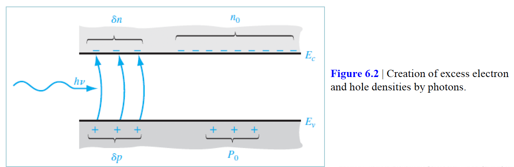
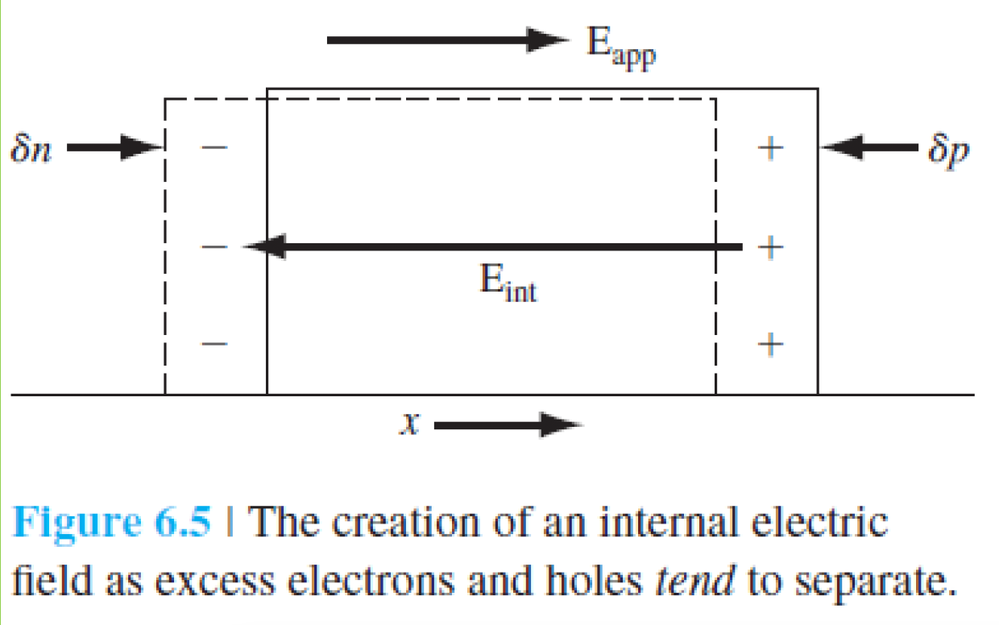
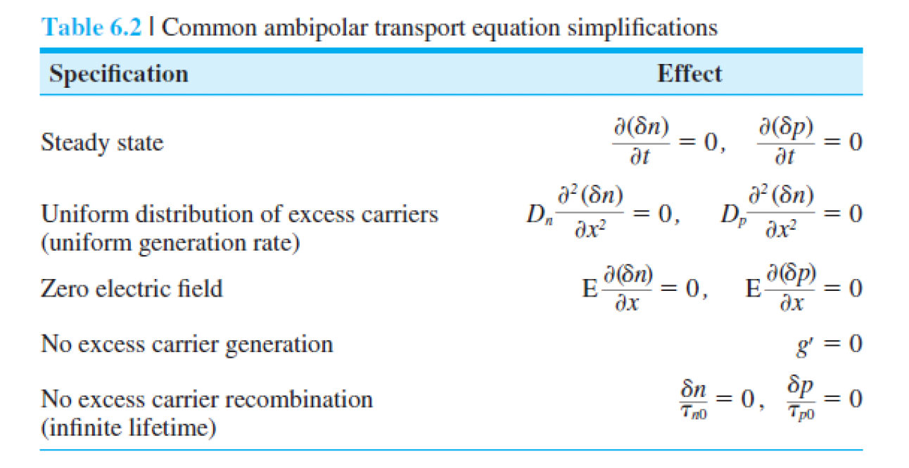
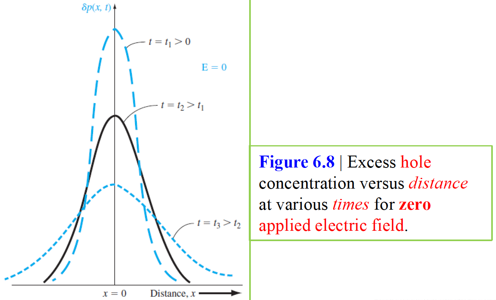
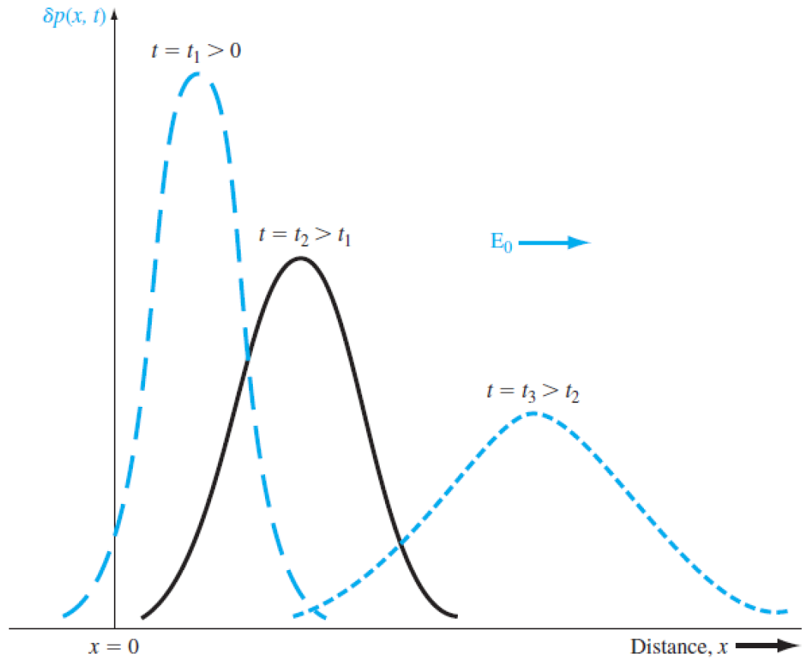
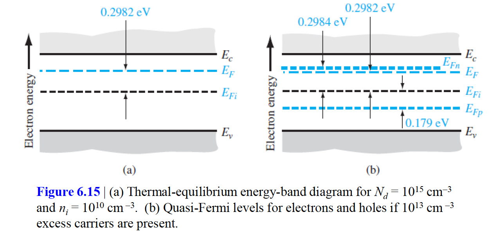

# 목차
1. 캐리어 생성 및 재결합
2. 과잉 캐리어의 특성
3. Ambipolar transport(앰피폴러 전송)
4. Quasi-Fermi Energy level (유사-페르미 에너지 준위)

반도체 소자에 전류가 흐르거나 전압이 가해질 때 반도체는 비평형 조건에서 동작하게 된다. 앞서 5장에서는 평형상태를 심하게 벗어나지 않는다고 가정했다. 만약 반도체에 외부 excitation이 더해진다면 전도대의 과잉 전자와 가전자대의 과잉 정공으로 인해 열평형상태에서의 전자와 정공 농도보다 더 많이 존재할 것이다. 먼저 과잉 캐리어의 생성과 재결합 과정에 대해 알아본다. 그리고 과잉 전자와 과잉 정공은 서로 독립적으로 움직이지 않는데, 이러한 과잉 캐리어의 동작을 앰비폴러 전송이라고 부르며 앰비폴러 전송방정식을 유도할 것이다. 이 과잉 캐리어는 반도체 재료의 전기적 특성에 큰 영향을 주며, 이 과잉 캐리어의 특징이 반도체 소자의 동작에 있어서 기초가 된다.

이 장에서 사용되는 기호는 다음과 같다.
|기호|정의|
|------|---|
|$n_0, p_0$|열평형 전자 및 정공 농도(시간, 위치에 독립적)|
|$n, p$|총 전자 및 정공 농도(시간과 위치의 함수일 수 있음)|
|$\delta n = n - n_0, \delta p = p - p_0$|과잉 전자 및 정공 농도(시간과 위치의 함수일 수 있음)|
|$g_n', g_p'$|과잉 전자 및 정공 생성률|
|$R_n', R_p'$|과잉 전자 및 정공 재결합률|
|$\tau_{n_0}, \tau_{p_0}$|과잉 소수 캐리어 전자 및 정공 수명|

# 캐리어 생성 및 재결합
생성(generation)은 전자들과 정공들이 만들어지는 과정이고 재결합(recombination)은 전자들과 정공들이 소멸되는 과정이다. 열평형으로부터 조금이라도 벗어나면 반도체 내에서 전자와 정공의 농도는 변화될 것인데, 예를들어 온도가 갑자기 증가하면 전자와 정공의 생성률이 증가하고 이로 인해 농도는 새로운 평형값에 도달할 때까지 시간에 따라 변할 것이다. 열과 마찬가지로 빛과 같은 외부 excitation도 전자와 정공을 생성시키고 비평형 조건을 만든다.

## 평형상태의 반도체
전자와 정공의 열평형 상태에서 농도는 시간에 따라 변하지 않는다. 하지만 전자들은 열적 상태의 무질서한 성질에 의해 가전자대로부터 전도대로 끊임없이 움직인다. 동시에 전자들은 전도대 내의 결정속을 무질서하게 움직이다가 가전자대 내의 정공과 아주 가깝게 접근하게 되고 빈 준위속으로 "떨어지게" 된다. 이 재결합 과정은 전자와 정공 모두를 소멸시킨다. 즉 열평형일 때 전자와 정공의 생성률과 재결합률은 같아야만한다.

$$G_{n0} = G_{p_0} = R_{n_0} = R_{p_0}$$

$G_{n0}, G_{p_0}$는 각각 열평형 상태의 전자와 정공의 생성률, $R_{n_0}, R_{p_0}$은 각각 열평형 상태에서의 전자와 정공의 재결합률이다. 열평형에서 전자와 정공의 농도는 시간에 의존하지 않으므로 생성과 재결합률은 같다. 생성률과 재결합률 단위는 모두 # $/(cm^3 \cdot s)$ 이다.

## 과잉 캐리어 생성 및 재결합
예를들어 고에너지의 광자가 반도체로 입사되면 가전자대의 전자가 전도대로 여기된다. 이 때 전도대에는 전자가 생성되고 가전자대는 정공이 쌍으로 생성된다. 이렇게 부가적으로 만들어진 전자와 정공을 과잉 전자(excess electrons), 과잉 정공(excess hole)이라고 한다.

아래 그림은 과잉 전자, 정공의 생성과정과 그로인한 캐리어 농도를 나타내고 있다. 외부의 힘이 평형을 깨뜨리면 반도체는 더 이상 열평형이 아니다. 비평형 상태에서는 $np \neq n_0 p_0 = n_i^2$ 이다.

과잉 전자와 정공의 정상상태(steady-state) 생성은 캐리어 농도를 지속적으로 증대시키지 않는다. 왜냐면 열평형의 경우에서처럼 전도대에 있는 전자가 가전자대로 떨어지게(fall down)되면서 재결합 과정이 일어나기 때문이다. 또 전자와 정공의 재결합 확률은 시간에 관계없이 일정하다. 전자의 재결합률은 전자농도에 비례하며 정공의 재결합률은 정공의 농도에 비례한다. 전자농도의 순 변화율을 아래의 식으로 나타낼 수 있다.
$$\frac{dn(t)}{dt} = \alpha_t(n_i^2 - n(t)p(t))$$
$$n(t) = n_0 + \delta n(t)$$
$$p(t) = p_0 + \delta p(t)$$
위 식에서 $n(t), p(t)$에 식을 대입하여 풀 때 low-level injection의 조건을 적용하면 식을 간단하게 만들 수 있다. 예를들어 p형 물질($p_0 \gg n_0$)에서 low-level injection($\delta n(t) \ll p_0$) 상태라면 아래 처럼 식을 나타낼 수 있다.

$$\frac{d(\delta n(t))}{dt} = -\alpha_r p_0 \delta n(t)$$
이 식을 풀면 아래와 같은데 이 때 $\tau_{n_0} = (\alpha_r p_0)^{-1}$ 이며 과잉 소수 캐리어 수명(excess minority carrier lifetime) 이라고 하며 low-level injection 조건에서 일정하다. 5장에서의 $\tau$는 충돌간의 평균 시간으로 정의했지만 여기서 사용되는 $\tau$는 완전 다른 개념이며 여기서는 재결합이 일어나기 전 평균 시간으로 가정한다.
$$\delta n(t) = \delta n(0) e^{-\alpha_r p_0 t} = \delta n(0)e^{-\frac{t}{\tau_{n0}}}$$

p형 물질에 low-level injection 조건이 더해졌을 때, 과잉 소수 캐리어인 전자와 재결합률을 아래처럼 나타낼 수 있다. 그리고 전자와 정공의 재결합률은 같다.
$$R_n' = R_p' = \frac{\delta n(t)}{\tau_{n_0}}$$
반대로 n형 물질에 low-level injection 조건이 더해졌을 때, 과잉 소수 캐리어인 정공의 재결합률을 아래처럼 나타낼 수 있고 정공과 전자의 재결합률은 같다.
$$R_n' = R_p' = \frac{\delta n(t)}{\tau_{p_0}}$$

$\tau$에는 minority carrier의 lifetime이 들어간다.

# 과잉 캐리어 특성
위에서는 열평형 상태에서의 생성률과 재결합률을 봤다. 이 때 두가지의 중요한 변화를 줄것이다. 전기장의 변화와 농도의 변화이다. 즉 농도와 전기장의 변화가 있을 때 과잉 캐리어들이 어떻게 운동하는지를 기술할 것이다. 이를 앰비폴러 전송(ambipolar transport)라고 부른다. 이 때 과잉 캐리어들은 유효 확산계수와 유효 이동도를 가지고 확산 또는 드리프트 하게되는데, 최종 결과로 low-level injection 조건의 도핑 반도체에서 유효 확산계수와 유효 이동도 파라미터는 소수 캐리어와 관련된 값임을 알게된다. 즉, 소수 캐리어의 특성이 과잉 캐리어의 운동을 결정지으며 이는 반도체 소자의 특성에 아주 중요한 영향을 끼친다.

## 연속 방정식
여기서는 전자와 정공에 대한 연속방정식을 유도한다. 자세한 내용은 책을 참고하자. 유도할 때 가로, 세로, 높이가 각각 dx, dy, dz인 cubic을 설정하고 이 cubic 내에서 흘러들어오는 캐리어, 생성되는 캐리어, 재결합되는 캐리어를 모두 계산한 결과의 식을 푼다. 예를들어 정공 입자에 대해서 계산할 때 정공의 흐름에 기인한 단위시간 당 정공의 증가를 더하고, 정공의 생성에 기인한 단위시간당 정공의 증가를 더하고, 정공의 재결합에 기인한 단위시간당 정공의 감소를 빼준다.

## 시간의존 확산 방정식
5장에서 유도한 정공과 전자의 전류밀도를 위의 연속방정식에 대입하여 식을 풀면 아래처럼 각각 정공과 전자에 대한 시간 의존 확산 방정식을 나타낼 수 있다. 전자 농도 p와 전자 농도 n에는 모두 과잉 농도가 포함되어 있다.
$$D_p \frac{\partial^2p}{\partial x^2} - \mu_p(E\frac{\partial p}{\partial x} + p \frac{\partial E}{\partial x}) + g_p - \frac{p}{\tau_{pt}} = \frac{\partial p}{\partial t}$$

$$D_n \frac{\partial^2n}{\partial x^2} + \mu_n(E\frac{\partial n}{\partial x} + n \frac{\partial E}{\partial x}) + g_n - \frac{n}{\tau_{nt}} = \frac{\partial n}{\partial t}$$
이 때 열평형 농도 값 $n_0, p_0$는 대부분 시간과 공간에 독립적이다. 즉 과잉 농도에 대한 식으로 나타낼 수 있다.

$$D_p \frac{\partial^2(\delta p)}{\partial x^2} - \mu_p(E\frac{\partial(\delta p)}{\partial x} + p \frac{\partial E}{\partial x}) + g_p - \frac{\delta p}{\tau_{pt}} = \frac{\partial(\delta p)}{\partial t}$$

$$D_n \frac{\partial^2(\delta n)}{\partial x^2} + \mu_n(E\frac{\partial(\delta n)}{\partial x} + n \frac{\partial E}{\partial x}) + g_n - \frac{\delta n}{\tau_{nt}} = \frac{\partial(\delta n)}{\partial t}$$

# 앰비폴러 전송
위 식을 보면 애초에 전기장이 있다고 가정했었다. 즉 전기장이 주어진 곳에서 빛을 받아 어떤 점에서 과잉 전자와 정공이 생성된다면 이는 서로 반대되는 방향으로 드리프트될 것이다. 그럼 내부적으로도 전기장이 생기게 되는데, 위 식에서 사용한 E는 외부 전기장과 내부 전기장을 더한 값을 사용하게 된다.  

전자들과 정공들은 단일 유효 이동도나 확산계수를 가지고 각각 드리프트 혹은 확산하게된다. 이 현상을 앰비폴러 확산(ambipolar diffusion) 혹은 앰비폴러 전송(ambipolar transport) 라고 한다.

## 앰비폴러 전송 방정식 유도
이 때 위의 시간의존 확산방정식은 과잉 캐리어들의 움직임을 나타내지만 과잉 전자와 과잉 정공의 농도를 내부 전기장과 관계시키기 위해서는 Poisson 방정식이 따로 필요한데 자세한 내용은 책을 참고하자. 식을 쭉 전개하면 다음과 같은 식을 얻을 수 있다.

$$D' \frac{\partial^2(\delta n)}{\partial x^2} + \mu'E\frac{\partial(\delta n)}{\partial x} + g - R = \frac{\partial(\delta n)}{\partial t}$$

$$D' = \frac{\mu_n n D_p + \mu_p p D_n}{\mu_n n + \mu_p p} = \frac{D_n D_p (n+p)}{D_n n + D_p p}$$

$$\mu' = \frac{\mu_n \mu_p (p-n)}{\mu_n n + \mu_p p}$$

위 식을 앰비폴러 전송 방정식(ambipolar transport equation)이라 부르며, 이 식은 시간과 공간에 있어서 과잉 전자와 과잉 정공의 움직임을 나타낸다. 파라미터 $D'$은 앰비폴러 확산 계수(ambipolar diffusion coefficient)라 부르고, $\mu'$은 앰비폴러 이동도(ambipolar mobility)라고 부른다.

## 외인성 도핑 및 low-level injection 에 의한 제한
앰비폴러 전송 방정식은 extrinsic semiconductor 및 low-level injection을 고려해 넣는다면 간단해진다. 예를들어 p형 반도체($p_0 \gg n_0$)에 low-level injection을 적용하면 $\delta n \ll p_0$ 가 되며 $D_n, D_p$ 값이 같다고 가정하면 $D'=D_n, \mu'=\mu_n$ 이 된다. 즉 low-level injection 조건의 p형 extrinsic semiconductor에 있어서 앰비폴러 확산계수와 앰비폴러 이동도 계수는 상수 값인 소수 캐리어 전자 파라미터 값들로 된다는 사실이 중요하다. 그리고 앰비폴러 파라미터가 상수인 소수 캐리어의 값들로 표현된다는 것도 중요하다. 만약 반대로 low-level injection을 적용한 n형 반도체라면 $D' = D_p, \mu'=-\mu_p$가 된다. 

이제 남은 항은 생성률과 재결합률인데, 전자와 정공의 재결합률은 같고 $R_n = R_p = \frac{n}{\tau_{nt}} = \frac{p}{\tau_{pt}} = R$ 이다. 이 때 $\tau_{nt}, \tau_{pt}$는 각각 전자와 정공의 수명을 나타낸다. 예를들어 low-level injection 에서 extrinsic p형 반도체에서 과잉 캐리어가 존재한다고 하더라도 다수 캐리어 정공의 농도는 결국 일정하게 될 것이며 그 때 다수 캐리어 정공과 만나게 되는 소수 캐리어 전자의 단위 시간당 확률은 결과적으로 일정할 것이다. 따라서 $\tau_{nt} = \tau_n$이므로 extrinsic p형 반도체에 대한 소수 캐리어 전자의 수명은 low-level injection 조건에서 일정하게 유지된다. 반대로 extrinsic n형 반도체도 마찬가지다.

low-level injection의 p형 반도체에 대한 최종 식은 아래와 같다.
$$D_n \frac{\partial^2(\delta n)}{\partial x^2} + \mu_n E\frac{\partial(\delta n)}{\partial x} + g' - \frac{\delta n}{\tau_{n0}} = \frac{\partial(\delta n)}{\partial t}$$
$\delta n$은 과잉 소수 캐리어 전자의 농도이고 파라미터 $\tau_{n0}$는 low-level injection에서의 소수 캐리어의 수명이며 다른 파라미터들이 모두 소수 캐리어 전자의 파라미터이다.

low-level injection의 n형 반도체에 대한 최종 식은 아래와 같다.
$$D_p \frac{\partial^2(\delta p)}{\partial x^2} - \mu_p E\frac{\partial(\delta n)}{\partial x} + g' - \frac{\delta p}{\tau_{p0}} = \frac{\partial(\delta p)}{\partial t}$$

위 두 식은 공간 좌표와 시간의 함수로서 과잉 소수 캐리어의 드리프트, 확산, 재결합을 나타낸다. 여기서 중성 전하 조건을 적용하여 과잉 소수 캐리어의 농도는 과잉 다수 캐리어의 농도와 같다고 설정할 수 있다. 이 때 과잉 다수 캐리어는 과잉 소수 캐리어와 함께 확산과 드리프트하게 된다. 따라서 과잉 다수 캐리어의 움직임은 소수 캐리어의 파라미터에 의해 결정된다. 이 앰비폴러 현상은 반도체 물성에 있어서 매우 중요하며, 반도체 소자의 특성과 동작을 설명하는 기초가 된다.

## 앰비폴러 전송방정식의 적용

앰비폴러 전송방정식을 적용하는 예시 하나를 들고와보자. 시간, 공간에 모두 의존하는 과잉 캐리어 농도의 성질을 살펴보자. t = 0 및 x = 0에서 전자 정공 쌍이 유한한 숫자로 갑자기 생성되었다고 가정하자. 그리고 t > 0 일 때는 $g' = 0$ 이라고 가정한다. +x 방향으로 $E_0$ 인 전기장이 일정하게 인가되고 있는 n형 반도체를 생각하자. x와 t의 함수로서 과잉 캐리어 농도를 계산해보자.

소수 캐리어 정공에 대한 일차원 앰비폴러 방정식은 다음과 같다.

$$D_p \frac{\partial^2(\delta p)}{\partial x^2} - \mu_p E_0 \frac{\partial(\delta n)}{\partial x} - \frac{\delta p}{\tau_{p_0}} = \frac{\partial(\delta p)}{\partial t}$$

이 편미분 방정식에 대한 해는 다음과 같다.

$$\delta p(x, t) = p'(x, t)e^{-\frac{t}{\tau_{p0}}}$$

그리고 이 식을 위 식에 대입시키면 다음과 같다.

$$D_p \frac{\partial^2 p'(x, t)}{\partial x^2} - \mu_p E_0 \frac{\partial p'(x, t)}{\partial x} = \frac{\partial p'(x, t)}{\partial t}$$

위 식은 라플라스 변환 기법을 사용하면 정상적으로 풀리는데 자세한 수식은 생략하고 이 식을 풀어서 $p'(x, t)$ 의 식을 계산하고 $\delta p(x, t)$를 계산하면 다음과 같다.

$$\delta p(x, t) = \frac{e^{-\frac{t}{\tau_{p_0}}}}{(4 \pi D_p t)^{\frac{1}{2}}}e^{[\frac{-(x - \mu_p E_0 t)^2}{4 D_p t}]}$$

만약 인가된 전기장이 0일 때 시간 변화에 대한 거리 x의 함수를 그리면 다음과 같다.

만약 인가된 전기장이 0이 아닐 때, 시간변화에 따른 거리함수에 대한 그림은 다음과 같다. 이 경우에 과잉 소수 캐리어 정공의 펄스는 전기장 방향인 +x 방향으로 드리프트된다. 중요한 것은 시간 및 공간에서의 어떤 점에서든지 전하 중성조건 $\delta n = \delta p$ 가 성립한다. 이 경우에 비록 전자가 마이너스 전하를 띠고 있다고 하더라도 과잉 전자펄스는 인가된 전기장과 같은 방향으로 움직인다. 즉 앰비폴러 전송 과정에 있어서 과잉 캐리어들은 소수 캐리어 파라미터에 의해 특성지어 진다.

## 유전 완화 시정수 (Dielectric Relaxation Time Constant)
위 예제에서 전하 중성조건(과잉 정공농도와 과잉 전자농도가 균형을 이루고 있음)이 성립한다고 가정했다. 하지만 아래 그림처럼 $\delta p$ 인 균일한 농도를 갖는 정공이 n형 반도체 표면 쪽으로 갑자기 주입되는 상황을 생각해보자. 이때 반도체의 전하중성은 어떻게 그리고 얼마나 빠르게 일어날까? 자세한 내용은 책을보고 전하 중성까지 걸리는 시간을 유전 완화 시정수라고 하고 시간은 다음과 같다.

$$\tau_d = \frac{\epsilon}{\sigma}$$

# 유사 페르미 에너지 준위
만약 어떤 반도체 내에 과잉 캐리어가 생성된다면 그때는 이미 열평형 상태가 아니다. 이 때 페르미 에너지는 명확하게 정의할 수 없으나 비평형 상태에서 적용할 수 있는 전자와 정공에 대한 유사 페르미 준위를 정의할 수 있다. $E_{Fn}, E_{Fp} 는 각각 전자와 정공에 대한 유사-페르미 에너지 준위이다. 전체 전자 농도는 유사 페르미 준위의 함수이다.

$$n_0 + \delta_n = n_i e^{\frac{-(E_{Fi} - E_{Fn})}{kT}}$$

$$p_0 + \delta_p = n_i e^{\frac{-(E_{Fp} - E_{Fi})}{kT}}$$

그림으로 나타내면 다음과 같다.

