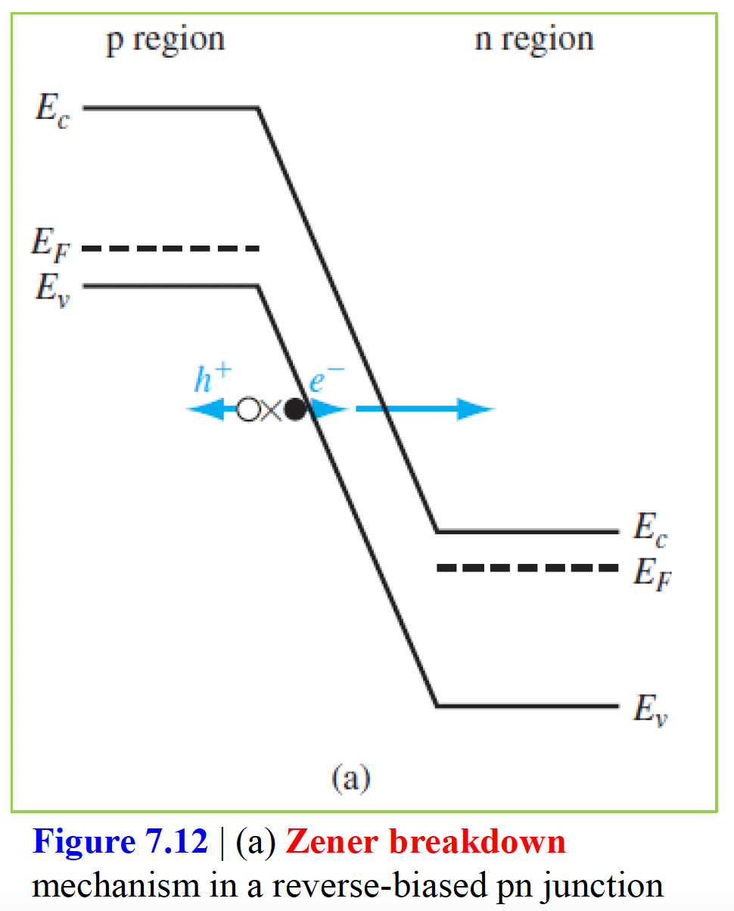

# 목차
1. pn 접합의 기본구조
2. 제로 인가 바이어스 (Zero Applied Bias)
3. 역방향 인가 바이어스(Reverse Applied Bias)
4. 접합 항복(Junction Breakdown)

# pn 접합의 기본구조
여기서 중요하게 인식해야할 것은 반도체 전체 영역은 단결정 물질이며 한 영역은 원자가 도핑된 p형이고 인접한 영역은 도너 원자가 도핑된 n형이다. n영역과 p영역의 접촉면이 분리되는 계면을 금속학적 접합(metallurgical junction)이라고 부른다. n영역 내의 다수 캐리어인 전자는 p영역으로 확산하고, p영역 내의 다수 캐리어인 정공은 n영역으로 확산하게 된다. 이 때 아래 이미지처럼 금속학적 집합 영역 주변에서 +에서 - 방향으로 전기장이 생긴다. 이 사이의 영역을 공간전하영역(space charge region)라고 부른다. 모든 전자와 정공은 전기장에 의해 공간전하영역 밖으로 없어지게된다. 공간전하 영역은 유동 전하가 고갈된 곳으로 이 영역을 다른 말로 공핍영역(depletion region) 이라고도 부른다. **공간전하의 끝에서 전자와 정공에 작용하는 확산력과 공간전하 영역에 있는 전기장에 의한 힘은 서로 균형을 이루게된다.**

# 제로 인가 바이어스(Zero Applied Bias)
두가지 가정을 전제로 한다. 첫번째는 Boltzmann 근사가 유효하다는 것을 가정한다 (이는 각 반도체 영역이 degenerated 되지 않게 도핑된 것을 의미함) 두번째는 완전 이온화된 것으로 이는 pn접합의 온도가 "너무 낮지" 않다는 것을 의미한다.

## 내부 전위 장벽
pn접합 양단에 전압을 인가하지 않는다면 페르미 에너지 준위가 시스템 전체 영역에서 일정한 열평형에 있게된다. 전도대 및 가전자대 에너지는 공간전하 영역을 통과할 때에 p 및 n영역간의 페르미 에너지 변화에 대한 전도대 및 가전자대의 상대적 위치 때문에 휘어지게된다. n영역의 전도대에 있는 전자는 p영역의 전도대로 이동하려고 할 때에 전위 장벽을 느끼게 된다. 이 전위 장벽을 내부 전위 장벽(built-in potential barrier)라고 부르며 아래 그림에서 $V_{bi}$에 해당한다.

이 내부 전위 장벽은 n영역에 있는 다수 캐리어 전자와 p영역에 있는 소수 캐리어 전자 사이에 평형을 유지시키며, 또한 p영역에 있는 다수 캐리어 정공과 n영역에 있는 소수 캐리어 정공간의 평형을 유지시킨다.

$$V_{bi} = |\phi_{Fn}| + |\phi_{Fp}|$$
$$e\phi_{Fn} = E_{Fi} - E_F$$
$$e\phi_{Fp} = E_{Fi} - E_F$$

위 식들을 이용하여 $V_{bi}$에 대해 전개하면 다음식을 얻을 수 있다. 이 때 $V_t = \frac{KT}{e}$ 이며 열전압(thermal voltage)라고 부른다.

$$V_{bi} = \frac{kT}{e}ln(\frac{N_a N_d}{n_i^2}) = V_t ln(\frac{N_a N_d}{n_i^2})$$

$N_a, N_d$ 를 이전에는 같은 영역 내에서의 도너 및 억셉터 불순물 농도라고 표기했었고 그래서 보상 반도체(같은 영역에 도너와 억셉터 불순물을 함께 도핑한 반도체)를 형성한다고 설명했다. 여기서는 비슷하게 $N_a, N_d$는 각각 n과 p영역에서 순수 도너와 억셉터 농도를 의미한다.

## 전기장
전기장은 양과 음의 공간전하 밀도가 분리됨으로 인해 공핍층 내에 생성된다. 아래 왼쪽 그림에 균일 도핑 및 계단 접합 근사를 가정한 pn 접합 내의 체적 전하밀도 분포를 보인다. 아래 그림처럼 공간전하 영역이 x가 $+x_n$ 의 n영역 끝에서 갑자기 끝나며, x가 $-x_p$의 p영역 끝에서 갑자기 끝난다고 가정했다.

다음의 모든 식은 전부 아래의 Poisson 방정식으로 부터 유도된다.
$$\frac{d^2 \phi(x)}{dx^2} = -\frac{\rho(x)}{\epsilon_s} = -\frac{dE(x)}{dx}$$
그리고 아래식에서 $\phi(x)$는 전위, $E(x)$는 전기장, $\rho(x)$는 체적전하밀도, $\epsilon_s$는 반도체의 유전률이다.
$$\rho(x) = -eN_a (-x_p \lt x \lt 0)$$
$$\rho(x) = eN_d (0 \lt x \lt x_n)$$

위 식들을 통해 $-x_p \lt x \lt 0$ 에서의 전기장과 $0 \lt x \lt x_n$ 에서의 전기장 식을 각각 구하고 양 끝의 boundary 영역(각각 $-x_p, x_n$)에서 $E=0$ 조건을 넣어 미분방정식을 풀어서 나온 상수 값을 구할 수 있다. 이 식들을 그래프로 나타내면 위의 오른쪽 그림처럼 된다.

또한 전기장이 $x=0$ 에서 연속이라는 조건을 추가하면 아래 식으로 나타낼 수 있다.
$$N_a x_p = N_d x_n$$
위 식은 p영역 내에서 단위면적당 음전하의 수와 n영역에서의 단위면적당 양전하의 수가 같다는 것을 의미한다.

전위는 전기장을 거리에 대해 적분함으로써 구할 수 있다. 전위차의 기준 전위를 $x=-x_p$에서 전위를 0으로 두고, $x=0$ 영역에서 $-x_p \lt x \lt 0$ 와 $0 \lt x \lt x_n$ 에서의 전위가 같음을 이용하여 전위 식을 구할 수 있다. 그래프로 나타내면 다음과 같다.

그리고 $x=x_n$을 대입하여 얻어지는 값은 $V_{bi}$가 되며 $V_{bi} = \frac{e}{2\epsilon_e}(N_dx_n^2 + N_a x_p^2)$ 임을 보일 수 있다. 전자의 전위 에너지는 $E = -e\phi$로 주어지며 이것은 전자 전위차 에너지도 공간전하 영역 전체에 걸쳐 거리의 제곱에 비례한다는 것을 알 수 있다.

## 공간전하폭
위에서 $N_a x_p = N_d x_n$ 식을 유도했다. 이 식에서 $x_p, x_n$ 각각에 대한 식으로 만들고 위 $V_{bi}$ 식에 대입하여 $x_p, x_n$에 대한 식으로 각각 풀면 공간전하 폭 $W$를 얻을 수 있다. $W = x_n + x_p$ 이고 위에서 유도한 값을 각각 대입하면 아래와 같다.

$$W = (\frac{2\epsilon_sV_{bi}}{e}[\frac{N_a + N_d}{N_a N_d}])^{\frac{1}{2}}$$

pn접합의 공간전하 영역 내에서의 최대 전기장은 매우 크다. 그러나 이 영역 내에는 유동전하가 없다는 사실에 유의해야한다. 따라서 드리프트 전류는 흐르지 않는다. 또 각 공간전하 영역폭은 도핑농도에 반비례하는 함수라서 공핍영역은 적게 도핑된 쪽으로 더 많이 확장된다.

# 역방향 인가 바이어스(Reverse Applied Bias)
만약 p와 n영역 사이에 전위를 인가시키면 그 때는 더이상 평형상태가 아니다. 즉 페르미 에너지 준위는 시스템 전체에 걸쳐서 더 이상 일정하지않다. n영역의 페르미 준위는 p영역의 페르미 준위보다 아래쪽에 오게된다. 둘 사이의 전위차는 에너지 단위로 표현되는 인가전압과 같다.

총 전위 장벽은 $V_R$만큼 증가하게되어 총 전위 장벽은 다음과 같다.

$$V_{total} = |\phi_{Fn}| + |\phi_{Fp}| + V_R = V_{bi} + V_R$$

## 공간전하폭과 전기장
아래 식을 보면 역방향 바이어스 전압을 인가함에 따라 총 공간전하폭이 증가하는 것을 알 수 있다. 각각 n 및 p 영역내에서의 공간전하폭은 인가한 역방향 바이어스 전압의 함수라는 것을 알 수 있다.
$$W = (\frac{2\epsilon_s(V_{bi} + V_R)}{e}[\frac{N_a + N_d}{N_a N_d}])^{\frac{1}{2}}$$

그리고 역방향 바이어스 전압이 증가함에 따라 $x_n, x_p$가 증가하기 때문에 전기장의 크기도 역시 증가하게된다. 최대 전기장은 금속학적 접합(metallurgical junction)에 생긴다(책에서 전기장에 대한 식 참고)
$$E_{max} = \frac{-eN_d x_n}{\epsilon_s} = \frac{-eN_a x_p}{\epsilon_s}$$
위 식에 $x_n$ 또는 $x_p$에 대한 식을 대입하면 아래와 같은 식을 얻는다
$$E_{max} = -(\frac{2e(V_{bi} + V_R)}{\epsilon_s}[\frac{N_a N_d}{N_a + N_d}])^{\frac{1}{2}} = -\frac{2(V_{bi} + V_R)}{W}$$

## 접합 커패시턴스(Junction Capacitance)
공핍영역 내에서 양 및 음의 전하가 분리되기 때문에 커패시턴스는 pn접합과 관계가 있게 된다. 아래 그림에서 $V_R$ 및 $V_R + dV_R$ 로 역방향 바이어스 전압이 인가될 때 공핍영역에서의 전하밀도를 보인다. 역방향 바이어스 전압이 $V_R$만큼 증가하면 n영역에서는 증분의 양전하가 그리고 p영역에서는 증분의 음전하가 생기게 된다.

$$dQ' = eN_d dx_n = eN_a dx_p$$
$$C' = \frac{dQ'}{dV_R} = eN_d \frac{dx_n}{dV_R}$$
위 식을 사용해서 $x_n$ 값을 대입하면 접합 커패시턴스(또는 공핍층 커패시턴스라고 부르기도 한다)는 다음과 같다.
$$C' = \{ \frac{e\epsilon_s N_a N_d}{2(V_{bi} + V_R)(N_a + N_d)} \}^{\frac{1}{2}} = \frac{\epsilon_s}{W}$$

## 일방 접합(one-sided junction)
일방 접합(one-sided junction)이라고 불리는 특별한 pn접합을 생각해보자. 만약 $N_a \gg N_d$ 라면 이 접합을 $p^+n$ 접합이라고 부른다. 위에서도 언급했지만 대부분의 전체적인 공간전하층은 적게 도핑된 쪽으로 확장하게 된다. 
$$x_p \ll x_n$$
$$W \approx x_n$$

# 접합 항복(Junction Breakdown)
어떤 특정 전압에서 역바이어스 전류는 급격하게 증가하는데 이 때 인가된 전압을 항복 전압(breakdown voltage)라고 부른다.

pn접합에 있어서 역바이어스 항복을 일으키는 두가지 물리적 메커니즘은 제너효과(Zener effect)와 애벌런치 효과(avalanche effect)이다. 아래 그림에서 왼쪽 그림은 역바이어스된 pn접합 내에서의 zener breakdown 메커니즘이고 오른쪽 그림은 역바이어스된 pn접합 내에서의 avalanche breakdown 과정이다.

 

Zener breakdown은 highly doped 된 pn 접합에서 생기는 터널링 매커니즘에 의해 일어난다. highly doped pn 접합에 역바이어스 전압을 걸어주면 접합의 반대쪽에 있는 전도대와 가전자대는 아주 가깝게 되어 전자는 p영역의 가전자대에서 n영역의 전도대로 직접 터널링(tunneling)이 일어나게 된다. 

Avalanche breakdown은 공간전하 영역을 건거 움직이는 전자나 정공이 전기장 때문에 충분한 에너지를 얻게되어 공핍층 내에서 원자의 전자와 충돌하면서 전자-정공쌍이 생성되게 된다. 새롭게 생성된 전자와 정공은 전기장에 의해 서로 반대로 움직이고 그로인해 역바이어스 전류가 증가하게 된다. 더욱이 새롭게 생성된 전자나 정공은 다른 원자를 이온화시키기에 충분한 에너지를 얻게된다.