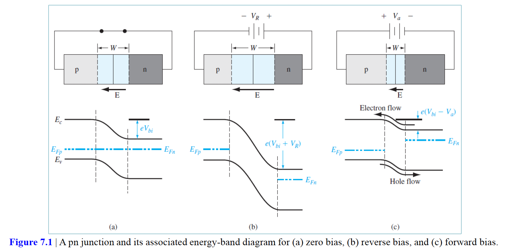
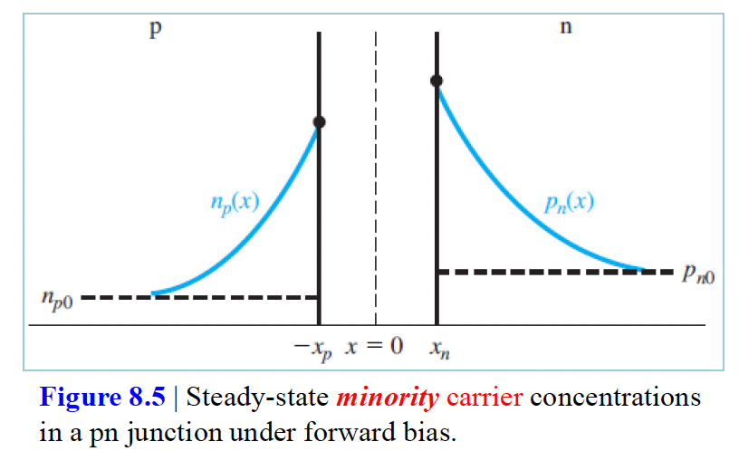
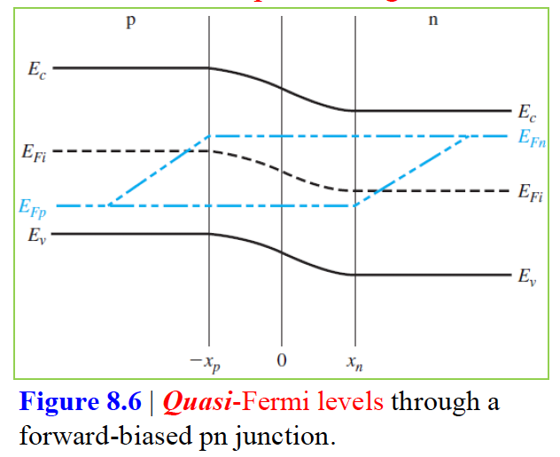
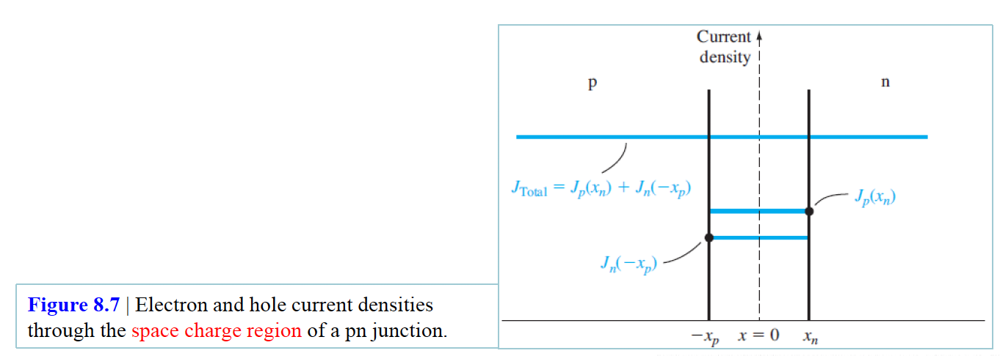
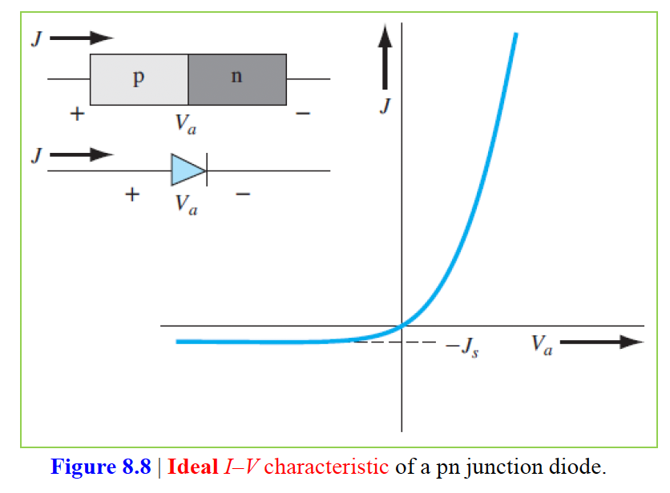
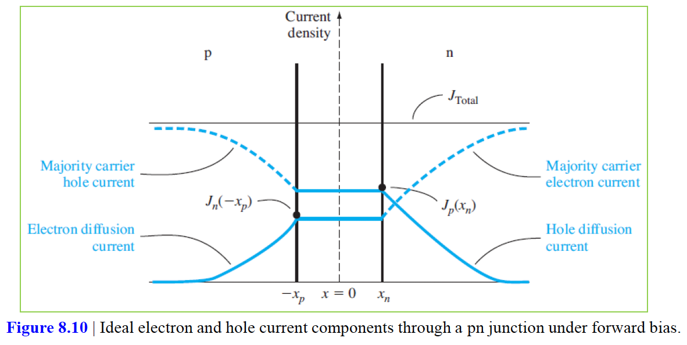
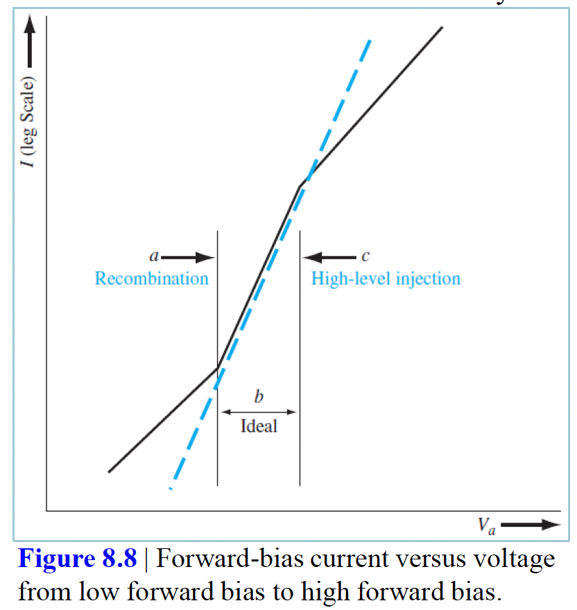

# 목차
1. pn접합 전류
2. 생성-재결합 전류 및 고주입 수준

정공이 p영역에서 공간전하 영역을 가로질러 n영역으로 흘러 들어갈 때 그들은 과잉소수캐리어 정공이 되고 6장에서 논의한 과잉 소수 캐리어 확산, 드리프트 및 재결합 과정을 겪게 된다. 마찬가지로, 전자가 n영역에서 공간전하 영역을 가로질러 p영역으로 흘러 들어갈 때 그들은 과잉 소수 캐리어 전자가 되며 똑같은 과정을 겪게 된다.

이 장에서 사용되는 기호는 다음과 같다.
|항목|의미|
|------|---|
|$N_a$|pn접합의 p영역에 있어서 억셉터 농도|
|$N_d$|pn접합의 n영역에 있어서 도너 농도|
|$n_{n0} = N_d$|n영역에 있어서 열평형 다수 캐리어 전자농도|
|$p_{p0} = N_a$|p영역에 있어서 열평형 다수 캐리어 정공농도|
|$n_{p0} = \frac{n_i^2}{N_a}$|p영역에 있어서 열평형 소수 캐리어 전자농도|
|$p_{n0} = \frac{n_i^2}{N_d}$|n영역에 있어서 열평형 소수 캐리어 정공농도|
|$n_p$|p영역에 있어서 총소수 캐리어 전자농도|
|$p_n$|n영역에 있어서 총소수 캐리어 정공농도|
|$n_p(-x_p)$|공간전하 끝의 p영역에 있어서 소수 캐리어 전자농도|
|$p_n(-x_n)$|공간전하 끝의 n영역에 있어서 소수 캐리어 정공농도|
|$\delta n_p = n_p - n_{p0}$|p영역에서 과잉 소수 캐리어 전자농도|
|$\delta p_n = p_n - p_{n0}$|n영역에서 과잉 소수 캐리어 정공 농도|

# pn 접합 전류
지금까지는 pn 접합에 역바이어스 전압만을 걸어줬었는데 여기서는 순바이어스 전압을 걸어줌으로써 전류가 소자 내에서 흐르기 시작할 것이다. pn 접합 내에서 전하가 어떻게 흐르는가를 정성적으로 논의하고 수학적으로 전류-전압 관계를 유도할 것이다.

## pn접합 내에서의 전하 흐름의 정성적 고찰
아래 그림에서 (a)는 열평형상태에 있는 pn 접합의 에너지 밴드 다이어그램을 나타낸다. 전위장벽은 n영역 내에 있는 많은 전자농도를 억제하므로 p영역으로 흐르는 것을 막고 마찬가지로 p영역 내에 있는 많은 정공농도를 억제하므로 n영역으로 흐르는 것을 막는다. (b)는 역바이어스 되어있는 pn 접합인데 총 전위 장벽은 제로 바이어스 때보다 더 높고 전자와 정공을 계속 억제하므로 전하의 흐름은 없고 전류는 흐르지 않는다.

(c)에서는 전위장벽이 열평형 상태보다 더 낮아졌고 더 낮은 전위 장벽이란 공핍영역내의 전기장이 줄어들었음을 의미하고 더 작은 전기장이란 전자와 정공이 각각 n, p영역 내에서 더이상 억제되지 않음을 의미한다. n영역에서 p영역으로 전자가 확산되고, p영역에서 n영역으로 정공이 확산되면서 전류를 생성시킨다. 이 때 n영역으로 주입되는 정공과 p영역으로 주입되는 전자는 소수 캐리어다. 이 소수 캐리어의 특징은 앰비폴러 전송 방정식으로 표현된다.

## 이상적 전류-전압 관계
pn 접합의 이상적인 전류-전압 관계는 다음의 기본 가정들로부터 유도된다.

1. 계단형 공핍층 근사를 적용한다. 공간전하 영역은 계단형 경계이며 공핍영역 밖에서의 반도체는 중성이다.
2. Maxwell-Boltzmann 근사를 캐리어 통계에 적용한다.
3. low-level injection 을 적용한다.
4. 총 전류는 모든 pn 구조에 걸쳐 일정하다
5. 각각의 전자 및 정공 전류는 pn 구조에 걸쳐서 연속함수이다.
6. 각각의 전자 및 정공 전류는 공핍영역에 걸쳐 일정하다.

## 경계조건
7장에서 다음의 내부 전위 장벽에 대한 식을 유도했다. 
$$V_{bi} = V_t ln(\frac{N_a N_d}{n_i^2})$$
그리고 완전 이온화되었다고 가정하고 $n_{n0} \approx N_d$, $n_{p0} \approx \frac{n_i^2}{N_a}$ 를 위 식에 대입하면 다음 식을 얻을 수 있다.
$$n_{p0} = n_{n0}exp(\frac{-eV_{bi}}{kT})$$
이 식은 열평형에서 접합에서 p쪽에 있는 소수 캐리어 전자농도와 접합에서 n쪽에 있는 다수 캐리어 전자 농도와의 관계를 보여주는 식이다. 

이 식에서 순바이어스 된 pn 접합에 대한 식을 유도할 수 있는데 $V_{bi}$가 $V_{bi} - V_a$로 되고, $n_{p0}$가 $n_p$로 된다. 그렇게 식을 유도하면 p영역 쪽에 있는 공간전하 영역 끝에서의 소수 캐리어 전자 농도를 구할 수 있다. 당연히 순바이어스 전압이 걸린 상태이니 열평형 상태의 전자 농도보다는 크게 된다.

경계조건 1
$$n_p = n_p(-x_p) = n_{p0}exp(\frac{eV_a}{kT})$$

반대로 n영역 쪽에 있는 공간전하 영역 끝에서의 소수 캐리어 정공농도는 다음과 같다.

경계조건 2
$$p_n = p_n(x_n) = p_{n0}exp(\frac{eV_a}{kT})$$

비교적 작은 순바이어스가 인가될 때 소수 캐리어 농도는 exp항 때문에 꽤 많이 증가하지만 공간전하 끝에서는 여전히 과잉 소수 캐리어 농도가 열평형 다수 캐리어 농도보다 아주 적으므로 low-level injection 조건이 계속 적용된다.

경계조건 3
$$p_n(x \rightarrow +\infty) = p_{n0}$$

경계조건 4
$$n_p(x \rightarrow -\infty) = n_{p0}$$

## 소수 캐리어 분포
먼저 중성의 p, n 영역 내에서의 E는 0이라고 가정하고 정상상태($\partial(\delta p_n)  / dt = 0$) 라고 가정한다. 앰비폴러 전송방정식에 위 경계조건을 대입하여 풀게되면 다음 식을 얻을 수 있다.

$x \ge x_n$에서의 식은 다음과 같다. $L_p^2 = D_p \tau_{p0}$ 이다.
$$\delta p_n(x) = p_n(x) - p_{n0} = p_{n0}[exp(\frac{eV_a}{kT}) - 1]exp(\frac{x_n - x}{L_p})$$

$x \le -x_p$에서의 식은 다음과 같다. $L_n^2 = D_n \tau_{n0}$ 이다.
$$\delta n_p(x) = n_p(x) - n_{p0} = n_{p0}[exp(\frac{eV_a}{kT}) - 1]exp(\frac{x_p + x}{L_n})$$

그림으로 나타내면 다음과 같다.

그럼 유사-페르미 준위를 알아보자. 과잉 전자는 p영역에 존재하고, 과잉 정공은 n영역에 존재하므로 유사-페르미 준위를 정의할 수 있다. $p_0, n_0$는 각각 열평형 상태에서의 정공과 전자 농도를 의미한다.

$$p = p_0 + \delta p = n_i exp(\frac{E_{Fi} - E_{Fp}}{kT})$$
$$n = n_0 + \delta p = n_i exp(\frac{E_{Fn} - E_{Fi}}{kT})$$

아래 그림을 보면 유사 페르미 준위는 중성 p, n영역에서 거리에 선형 함수이다. 그리고 p영역 내의 공간전하 끝 근처에서는 $\delta n > n_i$이기 때문에 $E_{Fn} > E_{Fi}$이며 공간전하의 끝에서 떨어진 곳에서는 $\delta n < n_i$ 이기 때문에 $E_{Fn} < E_{Fi}$ 이며 과잉 전자농도는 0에 근접하게된다. 

또한 유사-페르미 준위의 차는 인가전압 $V_a$와 관계 지을 수 있고 열평형으로부터 벗어나는 것을 나타낸다. 그리고 $E_{Fn} - E_{Fp}$는 공핍영역에서는 거의 일정하다.

## 이상적인 pn접합 전류
pn접합 내 총 전류는 공핍영역 전체에 걸쳐 일정한 각각의 전자전류 및 정공전류의 합이다. 전자전류와 정공전류는 pn접합 전체에 걸쳐 일정하고 연속함수이므로 총 pn접합 전류는 $x=x_n$에서의 소수캐리어 정공 확산전류에 $x=-x_p$에서의 소수 캐리어 전자 확산전류를 더한 것이다. 아래 그림을 참고하자.

$x=x_n$에서의 소수 캐리어 정공의 확산 전류밀도는 다음과 같다.
$$J_p(x_n) = \frac{eD_p p_{n0}}{L_p}[exp(\frac{eV_a}{kT}) - 1]$$

$x=-x_p$에서의 소수 캐리어 전자의 확산 전류밀도는 다음과 같다
$$J_n(-x_p) = \frac{eD_n n_{p0}}{L_n}[exp(\frac{eV_a}{kT}) - 1]$$

이를 더하면 다음과 같다.
$$J_s = [\frac{eD_p p_{n0}}{L_p} + \frac{eD_n n_{p0}}{L_n}]$$
$$J = J_s[exp(\frac{eV_a}{kT}) - 1]$$
이는 전압과 전류의 폭넓은 범위에 걸친 pn접합의 전류-전압 특성을 잘 나타내는 이상적인 다이오드 방정식이다. 이 때 $J_s$는 역포화 전류밀도라고 한다. 그리고 전압에 0보다 클 때를 가정하여 위 식을 유도했지만 $V_a$가 $\frac{kT}{e}V$ 만큼 역바이어스 전압이 걸리게 되면 역바이어스 전류밀도는 아래 그림처럼 역바이어스 전압에 의존하지 않게 된다. 반대로 $\frac{kT}{e}V$ 이상의 순 바이어스 전압이 걸리게 된다면 위 식에서 -1 항은 무시된다. 즉 요약하면 순바이어스 전류는 순바이어스 전압의 지수함수이다.

## 물리적 현상의 요약
소수 캐리어 확산 전류밀도는 앞에서 구했듯이 각 영역 내에서 지수적으로 감소한다. 그리고 pn접합을 통해 흐르는 총 전류는 일정하다. 즉, 총 전류와 소수 캐리어 확산전류의 차이가 다수 캐리어 전류이다. 처음에 가정했던 것처럼 p, n영역 내에서 전기장이 0이 아니므로 p, n영역 내에서의 드리프트 전류밀도가 존재한다. 그림으로 나타내면 아래와 같다.

# 생성-재결합 전류 및 high-level injection
high-level injection 및 공간전하 영역 내에서 발생하는 다른 전류 성분들이 전류-전압 관계식을 이상적인 표현식과 벗어나게 만든다.

## 생성-재결합 전류
### 역바이어스 생성 전류
역바이어스된 공간전하 영역 내에서는 실제로 전자-정공쌍이 생성된다. (재결합률이 마이너스를 띄기 때문에 생성된다는 것) 그리고 역바이어스 하에 있는 pn접합에서는 움직일 수 있는 전자들과 정공들은 최종적으로 공간전하 영역 밖으로 빠져나가게 된다. 따라서 공간전하 영역 내에서는 전자와 정공 농도는 0에 수렴 ($n \approx p \approx 0$) 하게 된다. 이 때 전자-정공 쌍의 생성에 의해 발생되는 전류밀도를 역바이어스 생성 전류라고 한다.

$$J_{gen} = \frac{en_i W}{2 \tau_0}$$

전하의 흐름은 역바이어스 전류의 방향과 같다. 공간전하 영역 내에서 전자들과 정공들의 생성에 의해 발생된 역바이어스 생성전류(reverse-biased generation current)는 이상적인 역바이어스 생성 전류 밀도에 추가되어 흐르게 된다. 총 역바이어스 전류밀도는 다음과 같다.

$$J_R = J_s + J_{gen}$$

$J_s$는 역바이어스 전압에 무관하고 $J_{gen}$은 역바이어스 전압의 함수인 공핍폭 W의 함수이다. 결국 총 역바이어스 전류밀도도 결국 전압에 의존적인 함수이다.

### 순바이어스 재결합 전류
순바이어스 하에서의 전자와 정공은 공간전하 영역을 지나 주입되므로 실제로는 공간전하 영역 내에서는 약간의 과잉 캐리어가 존재하게된다. 약간의 전자와 정공은 실제로 공간전하 내에서 재결합하게 된다. 재결합 전류는 다음과 같다.
$$J_{rec} = \frac{en_i W}{2\tau_0}exp(\frac{eV_a}{2kT}) = J_{gen}exp(\frac{eV_a}{2kT})$$

pn접합 내에서 총 순바이어스 전류밀도는 재결합 전류밀도와 이상적인 확산전류밀도의 합이다. 일반적인 다이오드 전류-전압 관계는 다음과 같이 쓸 수 있다. 이 때 n을 ideality factor(이상 인자)라고 부르며 큰 순바이어스 전압에 있어서 확산이 우세할 때 $n \approx 1$이 되며, 작은 순바이어스 전압에 있어서 재결합이 우세할 때 $n \approx 2$가 된다. $1 \lt n \lt 2$인 전이 영역이 존재한다.
$$I = I_s[exp(\frac{eV_a}{nkT}) -1]$$

## high-level injection
이상적인 다이오드 전압-전류 관계식에 있어서 low-level injection이 유효하다고 가정했다. 이는 과잉 소수 캐리어의 농도가 항상 다수 캐리어 농도보다 매우 적다는 것을 의미한다. 하지만 순바이어스 전압이 증가함에 따라 과잉 캐리어 농도는 증가하여 다수 캐리어 농도와 비슷하거나 오히려 많을 수 있다.

아래 그림에서는 저전압에서 고전압으로의 다이오드 순바이어스 전류를 보인다. 저전압의 순바이어스에서는 재결합 영향이 있고 고전압 순바이어스에서는 high-level injection의 영향을 받는다는 것을 나타낸다.

