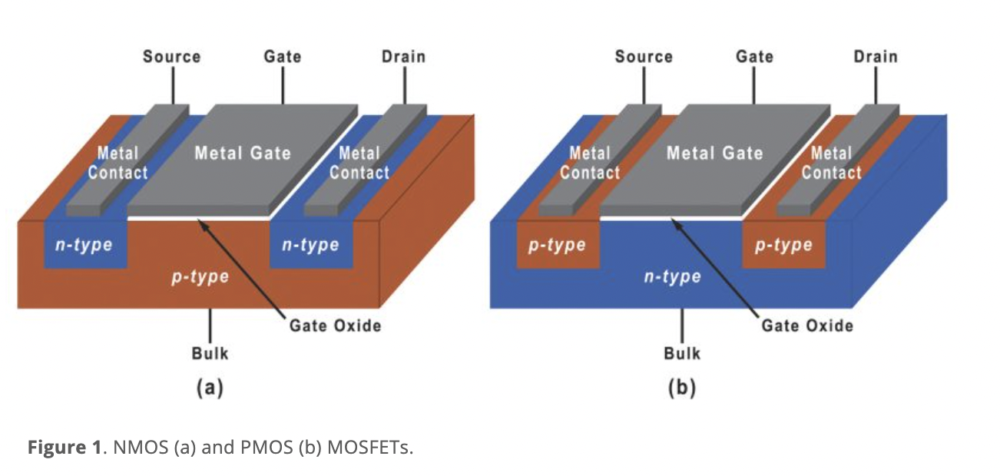
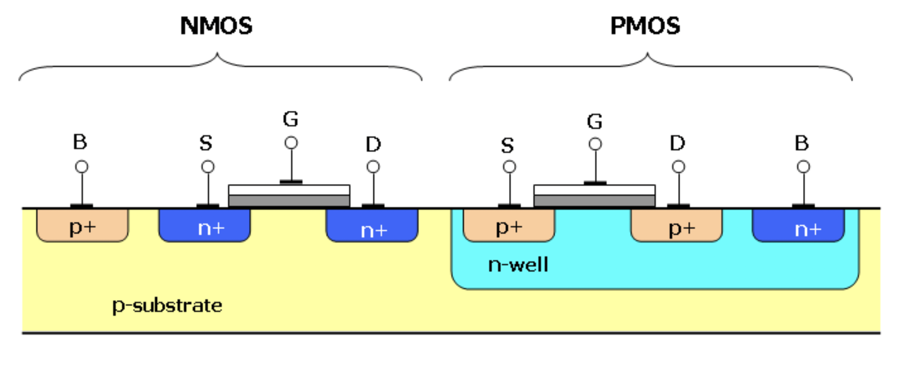

8, 9장에서 봤던 pn 동종 접합 다이오드를 포함해서 단일 접합 소자들은 전자적 스위칭 회로의 구성과 전류-전압 특성을 정류(전류와 전압을 정류한다는 말은 교류(AC)를 직류(DC)로 변환하는 과정을 의미하며 주로 다이오드와 같은 전자 부품을 사용하여 이루어짐) 시키기 위해 사용한다. 트랜지스터는 전류이득, 전압이득, 신호 전력이득을 구현할 수 있는 다중 접합 반도체 소자이다. 즉 신호 증폭, 스위칭, 전류 또는 전압 제어를 구현한다. 기본 트랜지스터 동작은 소자의 3개의 단자 중 다른 두 단자에 인가한 전압에 의해 한 단자에서의 전류를 제어한다. 

금속-산화막 반도체 전계 효과 트랜지스터(MOSFET, Metal Oxide Semiconductor Field Effect Transistor)는 주된 트랜지스터 중 하나이다. 이 장에서는 MOSFET의 기초적인 물리적 특징을 서술한다. n채널 MOSFET과 p채널 MOSFET으로 MOS 트랜지스터의 상보형 구조를 만들 수 있는데 이 회로를 CMOS(상보형 MOS)회로 라고한다.

MOSFET은 반도체의 p형 또는 n형 채널 위에 얇은 절연체(산화막)와 금속 게이트가 있는 구조이며 주요 세 부분은 source, drain, gate이다. MOSFET은 전압 제어 소자로 gate에 인가되는 전압에 의해 source와 drain 사이의 전류가 제어된다. gate 전압에 따라 채널이 형성되거나 차단되며, 이로 인해 source-drain 경로를 통한 전류 흐름이 조절된다.

_(https://www.mks.com/n/mosfet-physics)_

_(https://en.wikipedia.org/wiki/CMOS)_
