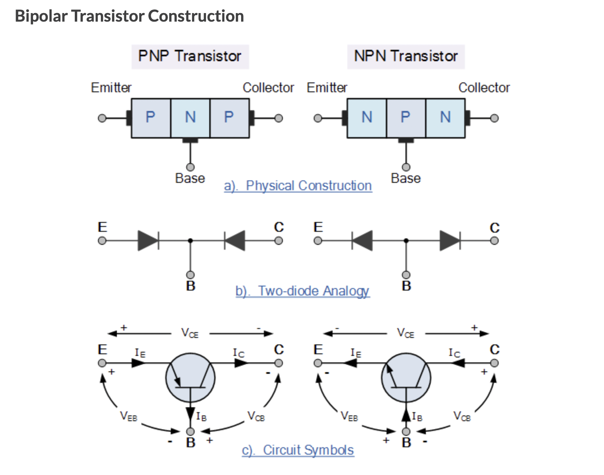

다접합 반도체 소자인 트랜지스터는 다른 회로 소자들과 함께 전류이득, 전압이득, 신호적인 전력 이득을 낼 수 있다. 그래서 다이오드는 수동적인데 반해, 트랜지스터는 능동소자로서 취급한다. 기본적인 트랜지스터 동작은 소자의 다른 두 단자의 인가한 전압에 의해 한 단자에서 전류를 제어하는 것이다. 바이폴러 접합 트랜지스터(BJT, Bipolar Junction Transistor)는 트랜지스터의 두 주요 형태 중에 한가지이며 이는 높은 전류이득 때문에 아날로그 전자 회로에서 광범위하게 사용한다. BJT의 두 상보성 모양의 npn과 pnp 소자를 제조할 수 있다. 전자회로 설계는 소자의 두 형태가 동일한 회로에서 사용할 때 매우 다양해진다.

BJT는 각각 3개의 도핑영역과 2개의 pn접합을 가지고 있다. 아래 그림은 npn 바이폴러 트랜지스터와 pnp 바이폴러의 기본 구조를 보여준다. 3개의 단자는 각각 emitter, base, collector이다. base 영역의 폭은 소수 캐리어의 확산 길이와 비교할 만큼 짧다. emitter, base, collector로 갈 수록 도핑 농도가 낮아진다. 이러한 상대적인 불순물 농도와 좁은 base 폭을 사용하는 이유는 책을 보면 자세히 알 수 있다. 앞서 pn접합에 대해 전개한 개념들을 바이폴러 트랜지스터에 직접 적용할 수 있다. BJT는 전류 제어 소자로 base 전류에 의해 collector와 emitter 사이의 전류가 제어된다. base 전류가 흐르면 큰 전류가 collector-emitter 경로를 통해 흐르게 된다.

_(https://www.electronics-tutorials.ws/transistor/tran_1.html)_
