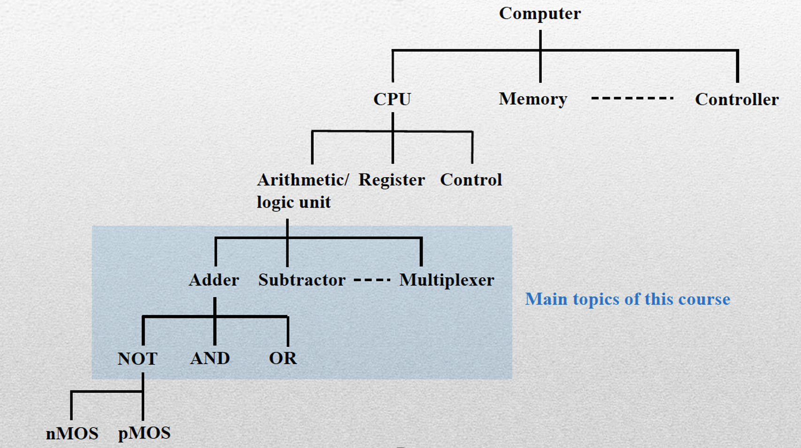
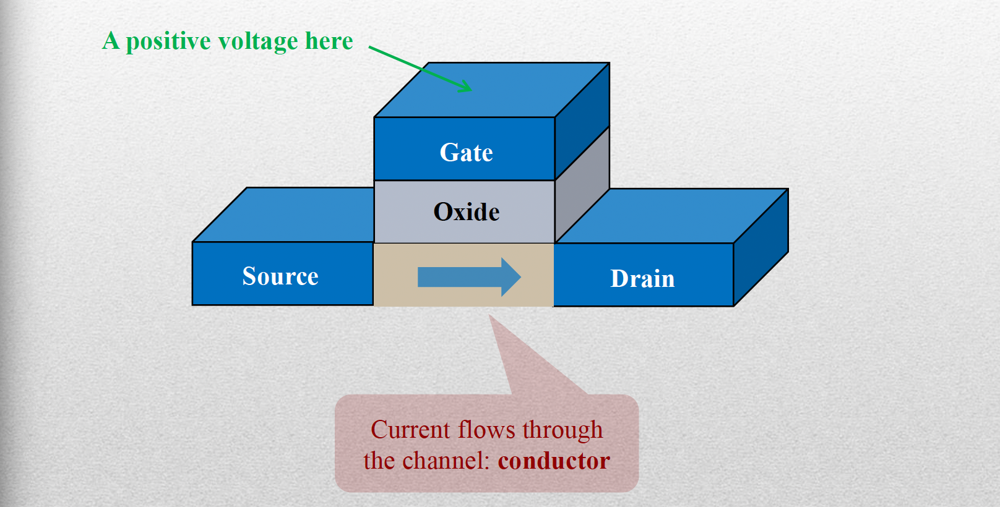
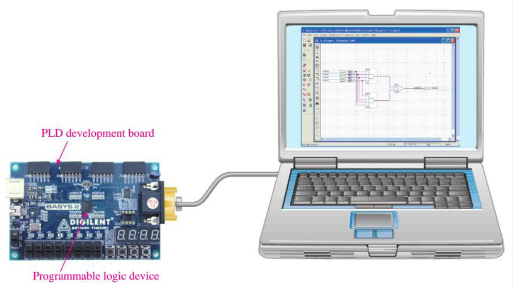

# 목차
1. Intro to Digital Systems
2. Binary Numbers and Codes
3. Boolean Algebra
4. Gate-level Minimization, Digital Logic Gates
5. Combinational Logic Circuits
6. Sequential Logic Circuits
7. Registers
8. Counters
9. Memory, Programmable Logic
10. Intro to Verilog HDL
11. Design practice in Verilog HDL

---

# Summary
## Digital System

Keywords of Digital Design
- Binary Numbers
- AND, OR, NOT, XOR
- Boolean Algebra
- Karnaugh Maps
- Combinational Logic Circuits
- Sequential Logic Circuits
- Registers, Counters, Memory
- Verilog HDL

What is digital systems doing?
- Digital systems manipulate discrete elements of information, represented internally in binary format

How to represent in binary format?
- Natural signals are analog
- Analog-to-digital conversion(ADC): <u>sampling and quantization processes</u> to form a digital representation of an analog quantity.
- 디지털 신호 처리(Digital signal processing, DSP)는 디지털화된 신호를 원하는 방향으로 정보 신호를 수정하거나 개선할 목적으로 알고리즘에 의해 수치적으로 처리하는 것을 말한다. 보통 아날로그 신호를 디지털화하는 과정에서 이산 신호가 되고 수치화 된다. <u>DSP의 일반적인 목적은 연속적인 실세계 아날로그 신호를 측정하고 걸러내고 압축하는 것이다. 첫 단계는 샘플링이라는 과정을 통해 신호를 아날로그에서 디지털 형태로 변환하는 것이고, 그 뒤 ADC(analog to digital converter)를 이용하여 디지털화하여 아날로그 신호를 디지털 전기 신호로 변환한다.</u> 과거에 예를들어 전화기의 경우 아날로그방식으로 신호를 전송하였지만 현재는 아날로그 -> 디지털 -> 아날로그 형태로 인코딩/디코딩하여 신호를 전송한다. 이 때 가장 핵심으로 사용되는 개념이 DSP이다. ([출처링크](https://ko.wikipedia.org/wiki/%EB%94%94%EC%A7%80%ED%84%B8_%EC%8B%A0%ED%98%B8_%EC%B2%98%EB%A6%AC]))

How to manipulate digital(binary) data?
- Switches enable digital circuits to utilize binary numbers
- The on and off nature of a switch supports the operation of 1's and 0's

Evolution of switches
- 1930s: Relays
- 1940s: Vacuum Tubes
- 1950s: Discrete Transistors(Shockley, Bardeen, Brattain)
- 1960s: Integrated Circuits(a number of CMOS transistorson silicon)

Approach to digital system structure
- Bottom-to-top: transistors -> logic gates -> combination of logic gates -> complex digital system
- Integrated circuits: System on a chip (SOC)

## CMOS Transistor

- Gate에 가해지는 전압에 따라, CMOS 트랜지스터는 conductor 또는 insulator 등의 역할을 할 수 있다. 
- 디지털 시스템에서 CMOS 트랜지스터는 switch의 역할을 하여 binary digit을 조작 할 수 있다.
- CMOS 트랜지스터는 boolean logic gates를 구현하는데 사용된다.

## Logic Gate
NOT, AND, OR 등의 logic gate는 CMOS 트랜지스터를 연결하여 만든다.

## Combining logic gates
- Logic gates are the basic digital building blocks which perform the basic logical operations (ex. AND, OR, NOT, XOR)
- Logic gates are combined to build higher-level structures(ex. adder, multiplexer, decoder, register, memory)
- Higher-level structures are combined to build components in a digital system(ex. CPU, bus interface, memory management unit)

## Integrated Circult
How to combine many transistors in a compact, efficient, fast, reliable way?  Integrated Circuits
- 집적회로(IC) 또는 칩은 손톱 크기의 실리콘 조각에 수많은(수십억 개까지) 작은 트랜지스터를 집적함
- 집적회로에는 일반적으로 모든 논리 소자와 기능들이 포함됨
- small size, high reliability, low cost, low power 때문에 집적회로를 만듦

### Level of integration
- Small-scale integration(SSL): several independent (up to 10) gates on a single package.
- Medium-scale integration(MSI): 10 to 1000 gates. Elementary logic functions such as decoders, encoders, adders, multiplexers, etc.
- Large-scale integration(LSI): thousands of gates. Digital systems such as processors, memory chips, etc.
- Very large-scale integration(VLSI): millions of gates. Large memory arrays and complex microprocessors.

### Manufacture of IC
- Full custom IC: 원하는 회로의 게이트들을 구현하기 위해 특별히 제작된 칩이다.
- Application-Specific IC(ASIC): semi-custom IC, 범용 용도가 아닌 특정 용도에 맞게 제작된 집적 회로를 의미한다. 주문형 반도체라고도 하는데 트랜지스터와 그 연결선이 놓여질 위치에 제한을 두지 않은 반도체 설계 방식이다. 예를들어 블록체인 채굴 전용으로 실행되도록 설계된 칩은 ASIC이다. 로직 라이브러리(standard cells) 또는 사전에 설계된 트랜지스터를 사용하여 logic gate array를 만든다. 수요자의 목적에 맞게 설계된 칩이라 대량생산으로 가격을 낮추기 힘들고 생산 과정에서 설계에 결함이 생기면 수정이 어렵기 때문에 ASIC 칩을 생산하기 전에 CPLD나 FPGA로 설계를 검증해보고 생산에 들어간다.
- Field-Programmable Gate Array(FPGA): programmable IC, 특정 비트스트림을 IC의 메모리에 저장하여 원하는 회로를 구성한다. Programmable logic device(PLD)의 종류 중 하나다. 
  - PLD는 제조 후에 사용자가 내부 논리 회로의 구조를 변경할 수 있는 집적 회로이다. 초기에는 설계시 사양이나 기능이 정해져서 제조되기 때문에 나중에 회로 구성을 변경할 수 없었지만 지금은 논리 설계를 변경할 수 있다. PLD의 종류로 PLA(programmable logic array), PAL(programmable array logic), CPLD(complex programmable logic device), FPGA가 존재한다. 이러한 논리 회로 설계는 FPGA나 CPLD와 같은 프로그래밍 가능한 device를 컴퓨터와 연결한 후 VHDL이나, Verliog와 같은 설계언어를 사용하여 다양한 logic function을 만들 수 있다.

### Design flow
1. Design entry: System design by _hardware description language(HDL)_
2. Functional simulation: Verifying the design by checking the input/output
3. Synthesis
4. Place and route(배치 및 배선)
    - 제한된 공간에 전자부품(ex. registor, capacitor, inductor, 전원장치 등), 회로, 논리 부품을 어디에 배치할 것인지 결정하고 배선을 연결하는 과정
5. Timing verification: Checking the timing problems due to propagation delay
  - propagation delay(전달 지연): 신호가 입력 신호가 들어가고 출력 신호가 나올 때까지 걸리는 시간이다.
6. Download
  

### Hardware description languages (HDL)
VHDL, Verilog
