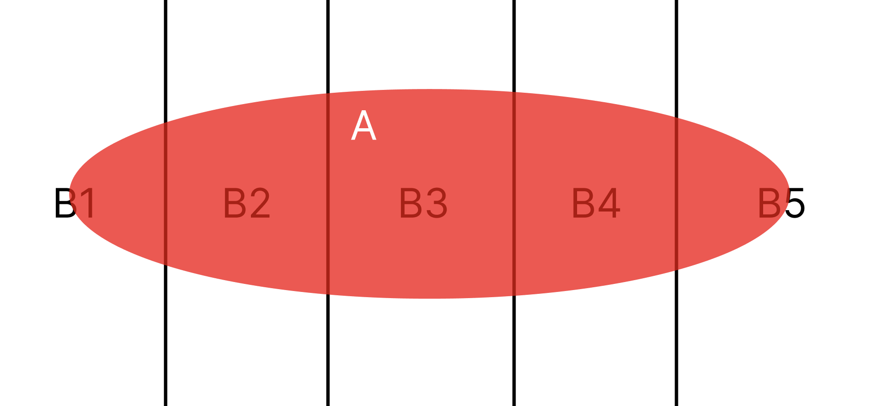

# Probability theory
## Review of probability
1. Relative frequency interpretation of probability
- 우리가 지금까지 자주했던 빈도의 관점에서 확률을 바라보기
2. set theory
- set, union, intersection, and complement
- mutually exclusive and collectively exhaustive(MECE, 상호배제, 전체포괄)
  - Mutually exclusive
    - 두 set A, B가 그냥 겹치는게 없다는 뜻
    - $AB = \{\emptyset\}$
    - 독립은 probabililty 간의 관계를 정의한 거라면, ME는 그냥 set을 비교한거
  - Collectively exhaustive
    - $A_1, A_2, ..., A_n$이 있을 때 collectively exhaustive 하다는 것은 $A_1 \cup A_2 \cup A_3 ... \cup A_n = S$ 라는 말. S는 전체 집합. 
  - 드모르간 법칙
3. Applying set theory to probability
- sample space vs event
  - 여기서 sample space와 event를 특히 잘 구분하자. sample space는 possible outcomes(event)을 전부 포함한 space 이다. 쉽게말해 가능한 모든 결과의 집합이다.
  - Null space $\emptyset: space에 possible한 outcome이 없다는거고 $P(\emptyset)=0$ 가 된다.
  - Event A, B가 mutually exclusive 하다면, $P(AB) = 0$ 일 것.
- Probability를 P라는 함수로 볼 수도 있는데, sample space의 event가 real number space으로 mapping 된다고 볼 수도 있다. 이런 관점도 생각해두자.
4. Probability axiom

## Conditional probability and bayes rules
1. conditional probability
- $$P(A | M) = \frac{P(AM)}{P(M)}$$
2. law of total probability
- For an event space $${B_1, B_2, ..., B_m}이 있다고 할 때, 물론 이 event space는 모두 MECE하다고 가정한다. 
- $$P(A) = \sum_{i=1}^{m}P(A \cap B_i) = \sum_{i=1}^{m}P(A|B_i)P(B_i)$$
- 아래 이미지와 함께 생각하자.
- 
3. bayes' theorem
- $$P(B | A) = \frac{P(A | B)P(B)}{P(A)}$$
4. statistical independence
- 두 이벤트가 있을 때 서로 statistically independent라고 하는 것은 한 이벤트가 일어날 확률이 다른 이벤트에게 영향을 주지 않는 것으로 수식으로 표현하면 아래와 같다.
- $$P(A | B) = P(A)$$
- $$P(AB) = P(A)P(B)$$
- mutually exclusive와는 다르다. Mutually exclusive는 두 set이 겹치는게 없다는거고, 두 set이 일부 겹치는게 있어도 각 확률이 independent할 수 있다.
- 그리고 3개의 이벤트 $A_1, A_2, A_3$이 independent하다는 것은, 서로 다른 2개의 이벤트에 대해서도 독립이고, 3개의 이벤트에 대해서도 독립이어야한다. 수식으로 나타내면 아래와 같다.
- $$P(A_{i}A_{j})=P(A_i)P(A_j) \quad i \neq j \quad \& \quad P(A_{1}A_{2}A_{3}) = P(A_1)P(A_2)P(A_3)$$
5. bernoulli trials
- indepedent trial + only two outcomes 이 두가지를 만족하는 trial이 bernoulli trial 이다.
6. reliability problems
7. Binomial distribution
- bernoulli trials로 부터 확률 분포를 얻게 되면 binomial distribution을 얻게된다.
- 이때 시행 N, 시행에 대한 성공 확률이 p라고 하고, N >> 1, p << 1 일 때, Binomial distribution을 Poisson distribution으로 근사시킬 수 있다. 시행을 굉장히 많이하고, 확률이 1보다 매우 작다 가정하고 근사한다.
8. De Moivre-Laplace Theorem