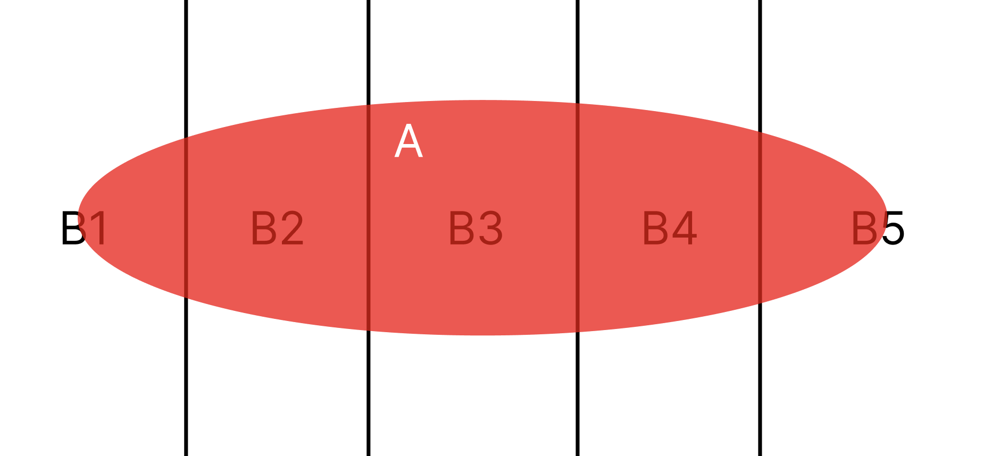
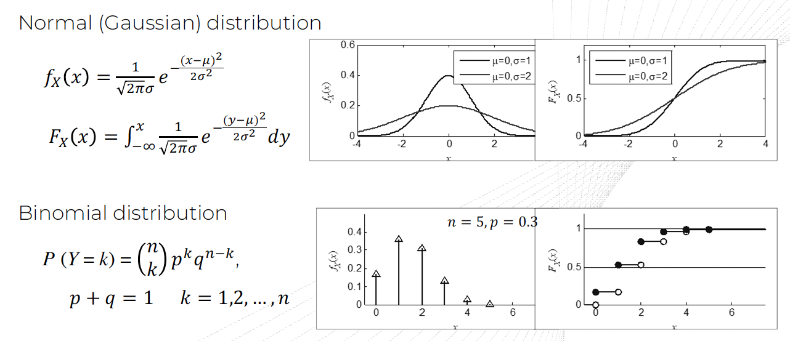
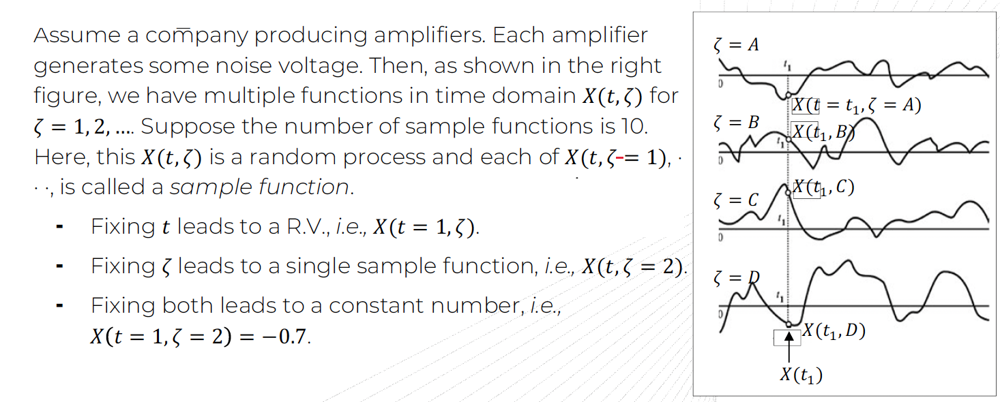
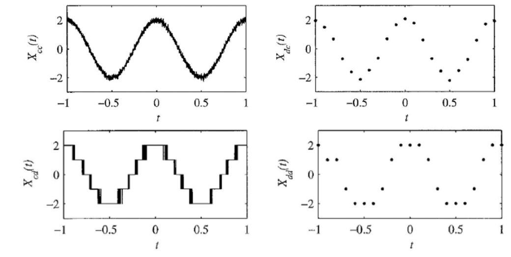

확률과 통계 실라버스
- descriptive statistics
- probability
- random variable and expectations
- special random variables
- distribution of sampling statistics
- parameter estimation
- hypothesis testing
- regression
- variance
- goodness fit tests

# Course schedule
### Probability theroy(1.5W)
- (Lec1, Lec2, Lec3)
- review probability theory
- conditional probability and bayes rule

### Random Variable(4.5W + $\alpha$) 
- (Lec4, Lec5, Lec6, Lec7, Lec8, Lec9, Lec10)
- Defintion, CDF, PDF
- Random vectors and joint CDF/PDF
- Moment of random variables and inequality
- Bivariate and multivariate normal (Gaussian) random variables
- The weak/strong law of large numbers and central limit theorem

### Random Process(6.5W + $\alpha$)
- (Lec11, Lec12, Lec13, Lec14, Lec15, Lec16)
- Random (stochastic) process, Stationary of random process
- Poisson random process
- Markov processes and Markov random fields
- Gaussian processes and cyclo-stationary processes

### Application(1.5W + $\alpha$)
- (Lec17, Lec18, Lec19, Lec20, Lec21, Lec22)
- Linear systems, linear prediction and estimation
- Matched filter, Wiener-Hopf equation, and Kalman filtering

# Lectures Summaries
## Probability Theory Review
### Lec1
**Relative frequency interpretation of probability**
- 우리가 지금까지 자주했던 빈도의 관점에서 확률을 바라보기

**Set theory**
- set, union, intersection, and complement
- mutually exclusive and collectively exhaustive(MECE, 상호배제/전체포괄)
  - Mutually exclusive
    - 두 set A, B가 그냥 겹치는게 없다는 뜻
    - $AB = \{\emptyset\}$
    - 독립은 probabililty 간의 관계를 정의한 거라면, ME는 그냥 set을 비교한거
  - Collectively exhaustive
    - $A_1, A_2, ..., A_n$이 있을 때 collectively exhaustive 하다는 것은 $A_1 \cup A_2 \cup A_3 ... \cup A_n = S$ 라는 말. S는 전체 집합. 
  - 드모르간 법칙

**Applying set theory to probability**
- sample space vs event
  - 여기서 sample space와 event를 특히 잘 구분하자. sample space는 possible outcomes(event)을 전부 포함한 space 이다. 쉽게말해 가능한 모든 결과의 집합이다.
  - Null space $\emptyset$ : space에 possible한 outcome이 없다는거고 $P(\emptyset)=0$ 가 된다.
  - Event A, B가 mutually exclusive 하다면, $P(AB) = 0$ 일 것.
- probability를 P라는 함수로 볼 수도 있는데, sample space의 event가 real number space으로 mapping 된다고 볼 수도 있다. 이런 관점도 생각해두자.

**Probability axiom**

### Lec2, Lec3
**Conditional probability**
$$P(A | M) = \frac{P(AM)}{P(M)}$$

**Law of total probability**
- For an event space ${B_1, B_2, ..., B_m}$이 있다고 할 때, 물론 이 event space는 모두 MECE하다고 가정한다. 
  $$P(A) = \sum_{i=1}^{m}P(A \cap B_i) = \sum_{i=1}^{m}P(A|B_i)P(B_i)$$

**Bayes' theorem**
$$P(B | A) = \frac{P(A | B)P(B)}{P(A)}$$

**Statistical independence**
- 두 이벤트가 있을 때 서로 statistically independent라고 하는 것은 한 이벤트가 일어날 확률이 다른 이벤트에게 영향을 주지 않는 것으로 수식으로 표현하면 아래와 같다.
  $$P(A | B) = P(A)$$
  $$P(AB) = P(A)P(B)$$
- mutually exclusive와는 다르다. mutually exclusive는 두 set이 겹치는게 없다는거고, 두 set이 일부 겹치는게 있어도 각 확률이 independent할 수 있다.
- 그리고 3개의 이벤트 $A_1, A_2, A_3$이 independent하다는 것은, 서로 다른 2개의 이벤트에 대해서도 독립이고, 3개의 이벤트에 대해서도 독립이어야한다. 수식으로 나타내면 아래와 같다.
  $$P(A_{i}A_{j})=P(A_i)P(A_j) \quad (i \neq j), \quad P(A_{1}A_{2}A_{3}) = P(A_1)P(A_2)P(A_3)$$

**Bernoulli trials**
- indepedent trial + only two outcomes 이 두가지를 만족하는 trial이 bernoulli trial 이다.

**Reliability problems**

**Binomial distribution, Poisson distribution**
- bernoulli trials로 부터 확률 분포를 얻게 되면 binomial distribution을 얻게된다.
- 이때 시행 N, 시행에 대한 성공 확률이 p라고 하고, $N \gg 1, p \ll 1$ 일 때, Binomial distribution을 Poisson distribution으로 근사시킬 수 있다. 시행을 굉장히 많이하고, 확률이 1보다 매우 작다 가정하고 근사한다.

**De Moivre-Laplace Theorem**

## Random Variable

### Lec4
**Definitions of random variable**
- The outcome of a random experiment needs not be a number, but we are usually interested not in the outcome itself, but rather the numerical attribute of the outcome (여기서는 outcome이 numerical 한 것만 다루겠다)

**Cumulative distribution function(CDF)**
$$F_x(x) = P(X \le x),  \quad F_x(-\infty) = 0, \quad F_x(+\infty) = 1 $$

**Probability density function(PDF)**
$$f_X(x) = \frac{dF_x(x)}{dx}, \quad f_X(x) \ge 0, \quad \int_{-\infty}^{\infty}f_X(x)dx = 1$$
  - Probability Mass Function

**Commonly used random variables**
- contiuous-type random variable
  - uniform distribution
  - normal(gaussian) distribution
  - beta distribution
  - laplace distribution
  - cauchy distribution
  - rayleigh distribution
  - maxwell distribution
  - exponential distribution
- discrete-type random variable
  - binomial distribution
  - poisson distribution
  - geometric distribution

### Lec5
**Two random variable(joint cdf, joint pdf)**
  - Joint CDF and PDF: $F_{XY}(x, y)$ and $f_{XY}(x, y)$, or $F_{\vec{X}}(\vec{x})$ and $f_{\vec{X}}(\vec{x})$
  - random vector
  - complex random variable

**Conditional distribution/densities**
- For a random vector $\vec{X} = [X_1, X_2, ..., X_N]$ with PDF $f_{\vec{X}}(\vec{x})$, and $\vec{Z} = [X_1, X_2, ..., X_K]$, and $\vec{Y} = [X_{K+1}, ..., X_N]$
$$f_{\vec{z} | \vec{y}(x_1, x_2, ..., x_K | x_{K+1}, ..., x_N)} = \frac{f_{\vec{X}}(x_1, ..., x_K, ..., x_N)}{f_{\vec{Y}}(x_{K+1}, ..., x_N)} $$

**Indepedence of random variables**
$$f_{\vec{X}}(\vec{x}) = f_{X_1, X_2, ..., X_n}(x_1, x_2, ..., x_n) = f_{X_1}(x_1)f_{X_2}(x_2)...f_{X_n}(x_n)$$

**Functions of random variables(vectors)**

### Lec6
**Expectation of random variable**
$$E[x] = \int_{-\infty}^{\infty}xf_X(x)dx$$
**Moments of random variable**
  - nth moment(expectation을 일반화): $E[X^n] = \int_{-\infty}^{\infty}x^nf_X(x)dx$
  - nth central moment(variance의 일반화)
    - $E[(X-E[X])^n] = \int_{-\infty}^{\infty}(x-\eta_X)^nf_X(x)dx$
    - variance: $E[(X-E[X])^2]$ ($n$이 1일 때)
  - joint moment
    - $E[X^iY^j] = \int_{-\infty}^{\infty}x^iy^j f_{XY}(x, y)dxdy$
  - joint central moments
    - $M_{ij} = E[(X-E[X])^i(Y-E[Y])^j] = \int_{-\infty}^{\infty}(x-\eta_X)^i(y-\eta_Y)^j f_{XY}(x, y)dxdy$
    - covariance: $C_{X, Y} = E[(X-E[X])(Y-E[Y])] = E[XY] - E[X]E[Y]$ ($i, j$가 1일 때)
  - correlation
    - $E[XY]$ 를 random variable $X, Y$의 correlation이라고 정의하며 kg, m 와 같은 unit이 존재하며 $R_{XY}$ 로 표기한다.
    - $R_{XY} = E[XY] = \int_{-\infty}^{\infty}\int_{-\infty}^{\infty}xyf_{X, Y}(x, y)dxdy$ 이다.
  - uncorrelated
    - $R_{XY} = E[XY] = E[X]E[Y]$ 를 만족할 때 $X, Y$ 가 uncorrelated 하다고 정의한다.
    - $X, Y$ 가 independent 하면 uncorrelated 라고 정의한다 (일반적으로 역은 성립하지 않지만, $X, Y$가 gaussian random variable 일 때는 역이 성립한다)
    - 증명과정: $E[XY] = \int_{-\infty}^{\infty}\int_{-\infty}^{\infty}xyf_{X, Y}(x, y)dxdy = \int_{-\infty}^{\infty}\int_{-\infty}^{\infty}xyf_{X}(x)f_{Y}(y)dxdy = \int_{-\infty}^{\infty}xf_{X}(x)dx\int_{-\infty}^{\infty}yf_{Y}(y)dy = E[X]E[Y]$
    - independent $\subset$ uncorrelated $\subset$ jointly distributed X ,Y
  - orthogonal
    - $E[XY] = 0$
    - algebraic 한 것을 geometric 하게 해석가능
  - correlation coefficient(상관계수) of $X, Y$: 
    - $\rho_{XY} = \frac{E[(X-E[X])(Y-E[Y])]}{\sqrt{E[(X-E[X])^2]E[(Y-E[Y])^2]}} = \frac{M_{11}}{\sqrt{\rho_{X}^2\rho_{Y}^2}} = \frac{M_{11}}{\rho_{X}\rho_{Y}} = R_{\frac{X - E[X]}{\sigma_X}, \frac{Y - E[Y]}{\sigma_Y}} = C_{\frac{X}{\sigma_X}, \frac{Y}{\sigma_Y}}$
    - $\rho_{XY}=0$ 이면 $X, Y$가 uncorrelated 하다. 역도 성립한다.
    - unitless 하고 $-1 \le \rho \le 1$ 의 범위를 가진다.

**Markov & Chebyshev inequality**
$$P(R \ge a) \le \frac{E[R]}{a} \quad P(|X - \eta_X| \ge a) \le \frac{\sigma_X^2}{a^2}$$

**Moment generation function(MGF)**
  $$\Psi_X(s) = E[e^{sX}] = \int_{-\infty}^{\infty}e^{sx}f_X(x)dx$$
- PDF가 존재한다면, moment generation function(MGF)는 위와 같이 정의될 수 있다
- MGF는 존재하지 않을수도 있지만 존재하면 상당히 유용하다.
- $\frac{d^n}{ds^n} \Psi_X(s) = E[\frac{d^n}{ds^n} e^{sX}] = E[X^ne^{sX}]$ 처럼 s에 대해 n번 미분하고 s에 0을 대입하면 nth order moment를 구할 수 있고 그래서 moment를 generation 하는 function 을 위처럼 정의했다

**Characteristic function**
  $$\Phi_X(\omega) = E[e^{j\omega X}] = \int_{-\infty}^{\infty} e^{j\omega x}f_X(x)dx$$
- characteristic function은 existence 하고 uniqueness 하다. 즉 하나의 random variable에 대해 항상 존재하고 유일하다.
- Random variable 를 fully characterize (완벽하게 표현하는) 방법으로 아래 4가지가 존재한다
  - underlying probability space and a measurable function 을 주는 것
  - induced probability sequence 를 주는 것
  - CDF를 주는 것
  - CF를 주는 것

### Lec7
**Conditional expectation**
$$E[X|Y] = \int_{-\infty}^{\infty} xf_{X|Y}(x|y)dx$$

**Linear minimum mean squared error(LMMSE) estimator**
$$\hat{Y} = aX + b \rightarrow \hat{Y} = \rho_{XY}\sigma_Y(\frac{X - E[X]}{\sigma_X}) + E[Y]$$

**Estimator from a random vector**
$$E[(Y - \Sigma_{i=1}^{N}a_iX_i)X_j] = 0, \quad (j=1, 2, ... N)$$

### Lec8
**Expected value vector, correlation, covariance matrix**

**Generalize Gaussian random variable**
- gaussian distribution은 다양한 technical field(ex. communication theory, detection theory, signal processing, pattern recognition, machine learning, control theory) 에서 random signal을 모델링하는데 중요한 역할을 한다.
- univariate normal random variable
- bivariate normal random variable
- multivariate normal random variable

### Lec9
**Estimation of Gaussian random variables**

**Transformation to uncorrelated random variables**

### Lec10
**Weak law of large numbers(WLLN)**
- Let $X_1, X_2, ...$ be a sequence of i.i.d random variables, each having finite mean $E[X_i] = \eta_X$. Then, for any $\epsilon >0$, $P(|\frac{X_1 + X_2 + ... + X_n}{n} - \eta_X| > \epsilon) \rightarrow 0$ as $n \rightarrow \infty$
  - i.i.d: independence(독립) + identical distribution(각각의 $X_i$는 같은 확률 분포에서 유래)

**Central limit theorem(CLT)**
- A sequence of i.i.d random variables, where each $X_i$ has mean $\eta_X$ and variance $\sigma_X^2$. Then, the distribution of $\frac{X_1 + X_2 + ... + X_n - n \eta_X}{\sigma_X \sqrt{n}}$ tends to standard normal as $n \rightarrow \infty$
- 예를들어 어떤 시행의 outcome을 number와 연결한 확률 변수 $X$에서 표본 N개를 추출하고 더한 새로운 확률변수 $X_1 + X_2 + ... + X_N$ 을 구한다. 그리고 표본 $N$이 $\infty$에 가까워질수록 이 합의 분포는 정규분포에 가까워진다. 이 때 평균 $\mu_{X_1 + X_2 + ... + X_N}$은 $n\eta_X$ 이고 분산 $\sigma_{X_1 + X_2 + ... + X_N}^2$ 은 $n\sigma_X^2$ 이 된다.
- 시각적으로 보고싶다면 다음 [링크](https://www.youtube.com/watch?v=SoKjCUcDBf0)를 참고하자.

### Lec11
**Central limit theorem - proof**

**Central limit theorem approximation**

**Strong law of large numbers(SLLN)**

**Other inequalities**
- One-sided chebyshev inequality

---
## Random Process
### Lec12
**Stochastic (random) process definitions and examples**
- A rule for assigning to every $\zeta$ a function $X(t, \zeta)$
- Random process는 sample space에서 랜덤한 함수를 추출하는 과정으로도 볼 수 있다. 다양한 sample function의 모양이 나올 수 있음 (아래 그림 참고)
- CDF, PDF of 2nd order random process
  $$F_X(x_1, x_2, t_1, t_2) = P(X(t_1) \le x_1, X(t_2) \le x_2)$$
  $$f_X(x_1, x_2, t_1, t_2) = \frac{\partial^2 F_X(x_1, x_2, t_1, t_2)}{\partial x_1 x_2}$$
- mean, auto-correlation, and auto-covariance
  - 아래 식들은 모두 시간의 함수이다.
    $$E[X(t)] = \eta(t)$$
    $$R_X(t_1, t_2) = E[X(t_1)X(t_2)]$$
    $$C_X(t_1, t_2) = E[(X(t_1) - \eta(t_1))(X(t_2) - \eta(t_2))]$$
  - $R_X(t_1, t_2)$를 알면 랜덤 프로세스의 sample function이 얼마나 빠르게 또는 느리게 변하는지를 알 수 있고 결과적으로 주파수 f 성분에 대해 알 수 있다. 뒤에서 보겠지만 랜덤 프로세스의 PSD(power spectral density)는 $R_X$의 푸리에 변환으로 주어진다
- random variable은 불확실한 사건을 숫자로 모델링하는데 사용하고, random process는 불확실한 신호를 모델링하는데 사용한다.
- 그리고 크게 time domain(temporal)과 frequency domain(spectral)에서 random process의 특성에 대해 나타내는 법을 배운다.

**Types of stochastic processes**
- $X(t)$ is a continuous-time random process if $t$ takes any value on the set of real numbers R.
- $X(t)$ is a discrete-time random process if $t$ takes only countable values, e.g the set of integers I.
- $X(t)$ is a continuous-state (value) random process if $t$ takes any value on the set of real numbers R.
- $X(t)$ is a discrete-state (value) random process if $t$ takes only countable values.

**Stationary of stochastic process**
- Stationary 라는 것은 수많은 함수들 중에 $(t, t+\tau)$ 구간에서 통계적 성질이 변하지 않는 성질을 의미함.
- Strict-sense stationary(SSS) random process
  - For any time shift $c$, $f_X(x_1, x_2, ... ,x_n, t_1, t_2, ..., t_n) = f_X(x_1, x_2, ..., x_n, t_1+c, t_2+c, ..., t_n+c)$
  - 모든 finite n에 대해 stationary 하며 모든 translation에 대해 joint pdf가 변하지 않는다.
- Wide-sense Stationary(WSS) random process
  - 아래 두가지 조건을 만족해야 WSS random process 이다.
    1. $E[X(t)]=\eta$ 
    2. $E[X(t_1)X(t_2)] = E[X(t+\tau)X(t)] = R_X(\tau)$
  - Random process가 WSS 하게 되면 더 이상 absolute time t에 의존하지 않고 상대시간 $\tau$에 의존하게 된다. $\tau$가 작다고 가정하고 $R_{XX}(\tau)$가 크면 $\tau$ 시간동안 함수 모양이 급격히 변하고, 반대로 $R_{XX}(\tau)$가 작으면 함수 모양이 부드럽게 변한다.

### Lec13
**Poisson random process**
- A counting process $X(t) = n(0, t)$ is a Poisson process of rate $\lambda$
- For a given $t$, $X(t)$ is a poisson random variable with a parameter $\lambda t$
  $$P_{X(t)}(k) = \frac{(\lambda t)^k}{k!} e^{-\lambda t}, \quad E[X(t)] = \sigma_{X(t)}^2 = \lambda t$$
  $$R_X(t_1, t_2) = \begin{cases}
      \lambda t_2 + \lambda^2 t_1 t_2 \quad (t_1 \ge t_2) \\
      \lambda t_1 + \lambda^2 t_1 t_2 \quad (t_1 \le t_2)
  \end{cases}$$

**Incremental Poisson process**
$$Y(t) = \frac{X(t+ \epsilon) - X(t)}{\epsilon}, \quad E[Y(t)] = \lambda, \quad R_Y(\tau) \rightarrow \delta(\tau) \quad as \quad \epsilon \rightarrow 0$$

### Lec14
**Properties of Poisson process**
- Memoryless properties of inter-arrival time
  $$P(L_n \gt t+l | L_n \gt t) = \frac{P(L_n \gt t+ l, L_n \gt t)}{P(L_n \gt t)} = \frac{e^{-\lambda(t+l)}}{e^{-\lambda t}} = e^{-\lambda l}$$
- Composition of a Poisson process
  - Let $N_1(t)$ and $N_2(t)$ be two independent Poisson processes of rates $\lambda_1$ and $\lambda_2$. The counting process $N(t) = N_1(t) + N_2(t)$ is a Poisson process of rate $\lambda_1 + \lambda_2$
- Bernoulli decomposition of a Poisson process
  - The counting processes $N_1(t)$ and $N_2(t)$ derived from a Bernoulli decomposition of the Poisson process $N(t)$ with $p$ are independent Poisson processes with rates $\lambda p$ and $\lambda (1-p)$

**Properties of 2nd order statistics of random process**
- jointly wide sense stationary(WSS) processes
  - 아래 두 성질을 만족해야 jointly WSS process 이다
    1. $X(t)$ and $Y(t)$ are both WSS
    2. $R_{XY}(t_1, t_2) = E[X(t_1)X(t_2)] = R_{XY}(t_1 - t_2)$ (The cross-correlation depends only on the time difference between the two random variables)
- $X(t), Y(t)$ are uncorrelated, $E[X(t_1)Y(t_2)] = E[X(t_1)]E[Y(t_2)]$
- $X(t), Y(t)$ are orthogonal, $E[X(t_1)Y(t_2)] = 0$

### Lec15
**Discrete-time random process example**

**Gaussian (normal) random (stochastic) process**
- $X(t)$ is a Gaussian random process iff $\vec{X} = [X(t_1), X(t_2), ..., X(t_k)]$ is a Gaussian random vector for any integer $k > 0$ and any set of time instants $t_1, t_2, ..., t_k$

**Brownian motion process(Wiener process)**
- A Brownian motion process $W(t)$는 다음의 성질을 만족한다. (1) $W(0) = 0$ 이고 (2) 현재 state와 $\tau$ 만큼 차이나는 state 간의 차이(increment, $W(t+\tau) - W(t)$ )가 평균이 0이고 분산이 $\alpha \tau$인 정규분포를 따르고 (3) 모든 $t' \le t$에 대해 $W(t')$가 독립이다.
- Wiener process는 예를들어 액체안의 particle이 어떻게 확산되는지 등 real world의 다양한 randomness를 표현하기 위해 사용한다.

### Lec 16
**Random walk**

**Cyclostationary processes**
  - Strict sense cyclo-stationary(SSCS)
  - Wide sense cyclo-stationary(WSCS)
  - Sampled data signal example

---

### Lec17
**Linear System(function)**

**Random process and linear systems**
- Static(memoryless) and dynamic (with memory) system
- Superposition integral, $Y(t_2) = \int_{-\infty}^{\infty}h(t_1, t_2)X(t_1)dt_1$
- Impulse response $h(t_1, t_2)$ means that if the system input $X(t) = \delta(t - t_1)$, the output $Y(t_2) = h(t_1, t_2)$

### Lec18
**Linear Time-invariant System(LTIS)**

**Power spectral density property**
- For sample functions $x(t)$ of a stationary random process $X(t)$, let a $x_{\tau}(t)$ a truncated version of $x(t)$, which is identical to $x(t)$ for $-T \le t \le T$ and 0 elsewhere
- Fourier transform of sample function: $X_T(f) = \int_{-T}^{T} x(t)e^{-j 2 \pi ft}dt$
- The squared magnitude $|X_T(f)|^2$ appears in the definition of power spectral density $S_X(f)$
- If $X(t)$ is an electrical signal measured in volts or amperes, $|X_T(f)|^2$ has units of energy. Its time average $\frac{|X_T(f)|^2}{2T}$ has units of power. $S_X(f)$ is the limit as the time window goes to infinity of the expected value of this function

**Wiener-Khinchin theorem**
- Both the autocorrelation function and the power spectral density(PSD) function convey information about $X(t)$
- The Wiener-Khinchin theorem shows that they convey the same information
  - The autocorrelation function of a WSS random process has spectral decomposition given by the power spectrum of that process.
  - If $X(t)$ is a WSS random process, $R_X(\tau)$ and $S_X(f)$ are Fourier transform pair
$$S_X(f) = \int_{-\infty}^{\infty} R_X(\tau)e^{-j2\pi f\tau} d\tau, \quad R_X(\tau) = \int_{-\infty}^{\infty} S_X(f)e^{j2\pi f\tau} df $$
- 즉 WSS random process의 autocorrelation function(ACF, 자기상관함수)와 power spectral density(PSD, 전력 스펙트럼) 간의 관계를 나타낸다. ACF는 random process $X(t)$와 $X(t+\tau)$ 간의 상관 관계를 나타내며 $E[X(t)X(t+\tau)]$ 를 통해 계산할 수 있다. 그리고 PSD는 주파수 영역에서의 random process의 에너지 분포를 나타낸다. spectral decomposition을 통해 ACF는 주파수 영역으로 분해될 수 있으며 이 변환된 형태가 PSD이다. WSS random process의 PSD는 ACF의 푸리에 변환이며 반대로 ACF는 PSD의 역푸리에 변환이다. 이 관계는 신호 처리에서 매우 중요하며, 시간 영역과 주파수 영역 간의 분석을 가능하게 한다. ACF를 통해 시간적 상관성을 파악하고, PSD 통해 주파수 성분을 분석할 수 있다.

**Ergodicity**
- Mean-ergodic
  - time average와 ensemble average가 같은 경우를 의미한다.
  - 이때 time average는 단일 sample path를 따라 장기간에 걸쳐 측정된 값의 평균이고 ensemble average는 동일한 시간에 여러 샘플 경로를 고려하여 측정된 값의 평균이다.
  - For a real stationary process $X(t)$, time average($\eta_T$) to estimate ensemble average($\eta = E[X(t)]$)
  $$\eta_T = \frac{1}{2T}\int_{-T}^{T} X(t)dt, \quad \lim_{x \rightarrow \infty} \eta_{\tau} = \eta$$
  - Mean-ergodic if $X(t)$ is WSS and its time average $\eta_T$ tends to the ensemble average $\eta$ as $T \rightarrow \infty$
- Mean-ergodic 말고 Variance-ergodic, Covariance-ergodic 도 있다.
- 에르고딕성을 직관적으로 이해보기 위해 주사위 던지기를 한다고 해보자. 주사위를 던져서 나오는 값의 평균을 구하는 두 가지 방법이 있는데 한 주사위를 매우 많이 던져서 그 평균을 구하는 방법과(시간 평균) 여러 주사위를 동시에 던져서 평균을 구하는 방법이 있다 (Ensemble 평균) 이때 주사위가 공정하다면 두 평균은 동일해야 하고, 이는 주사위 던지기는 ergodicity를 가진다는 것을 의미한다.
- 하나의 sample path를 볼 때, 예를들어 주식 그래프를 보면 미래 예측이 불가능한데, ergodic 가정에서 보면 꽤나 예측을 잘하고 할 수 있는 일이 많아진다. ergocity는 sample path 하나를 잘 관찰하면 다른 가능한 sample path의 통계를 알 수 있음을 의미한다. 당연히 모든 process가 ergodic하지 않으므로 process가 ergodic한지 안한지 확인하는 과정이 필요하다.
- white noise가 ergodic 하는 경우가 많고 또 상태 전이 확률이 시간에 대해 일정한 markov process도 ergodic 할 수 있다.

### Lec19
**Properties of auto-correlation function(ACF)**

**Processing random process with a linear filter**
- Matched filter: An optimum filter (maximizing output SNR) to detect the "known signal"(deterministic) in an AWGN noise channel.
- Wiener filter: A filter minimizing the mean square error for "random signal"

### Lec20
**Discrete-time linear filtering**

**Linear prediction filter**

**Linear estimation filter**

### Lec21
**Markov Process**
- The past has no influence on the future if the present is specified
  $$P(X(t_n) \le x_n | X(t), t \le t_{n-1}) = P(X(t_n) \le x_n|X(t_{n-1}))$$

**Discrete-time Markov Chain**
$$P(X_{n+1} = j | X_n = i, X_{n-1} = i_{n-1}, ..., X_0 = i_0) = P(X_{n+1}=j | X_n = i) = P_{ij}$$

**Chapman-Kolmogorov Equations (for a finite Markov chain)**
$$P_{ij}(n+m) = \Sigma_{k=0}^{K}P_{ik}(n)P_{kj}(m), \quad P(n+m)=P(n)P(m)$$

### Lec22
**Recurrent and transient states**

**Periodic states**

**Steady-state convergence theorem**

**Birth-death processes**
