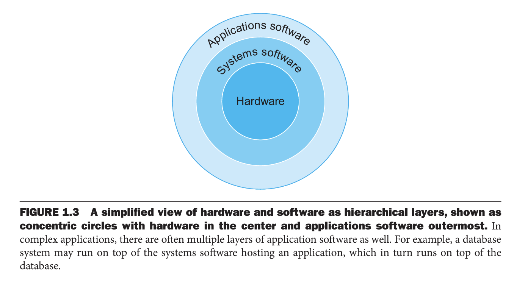
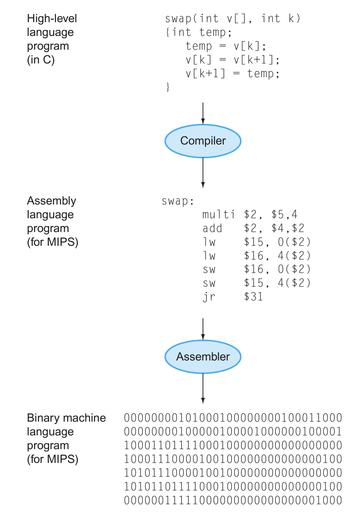
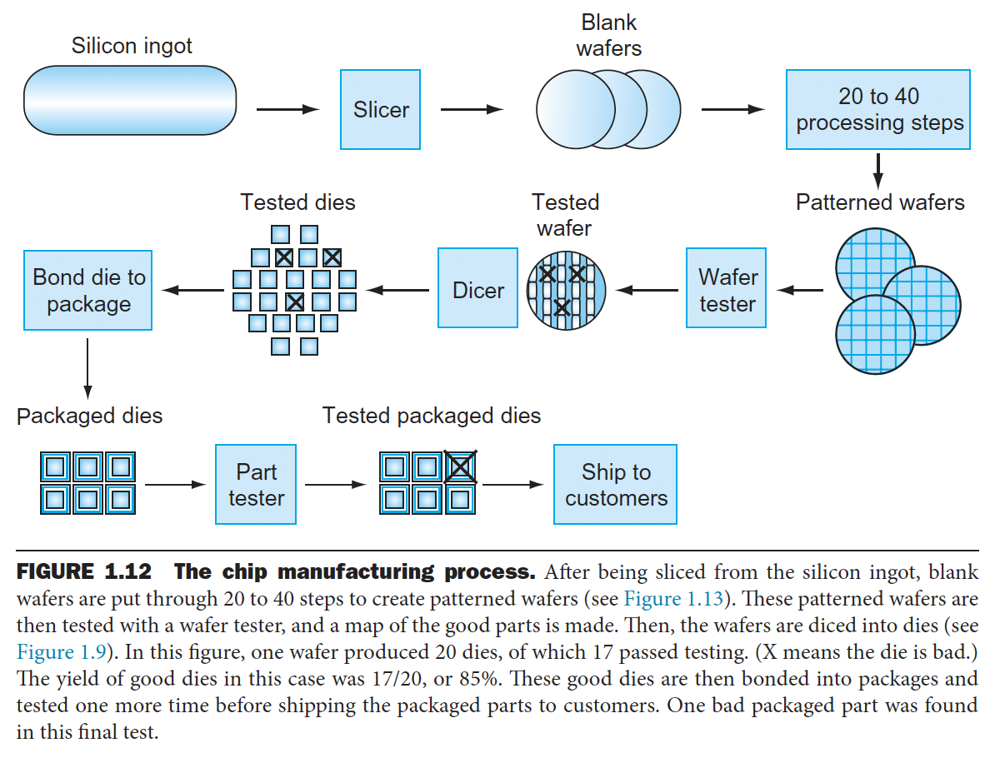
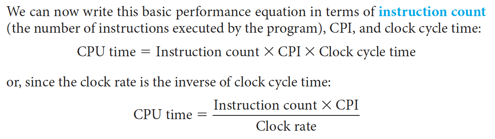
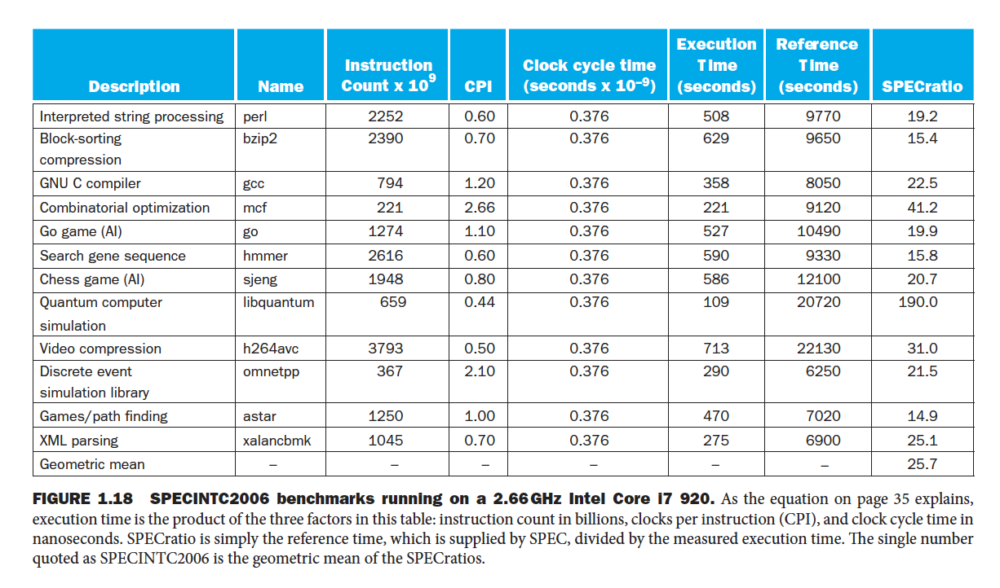
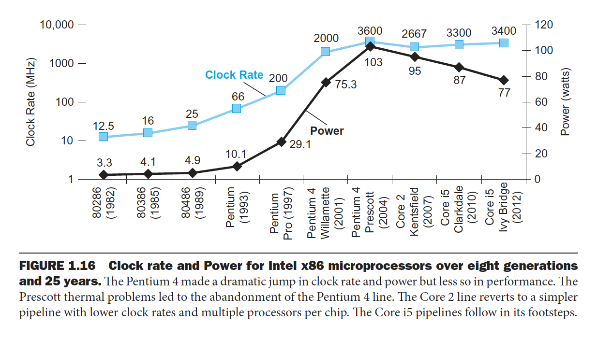

# 목차
1. [왜 컴퓨터 구조를 공부할까?](#왜-컴퓨터-구조를-공부할까?)
2. [컴퓨터 구조 분야의 일곱 가지 위대한 아이디어](#컴퓨터-구조-분야의-7가지-위대한-아이디어)
3. [소프트웨어](#소프트웨어)
4. [하드웨어](#하드웨어)
5. [성능](#성능)
6. [전력 장벽](#전력-장벽)

# 왜 컴퓨터 구조를 공부할까?
우리가 컴퓨터에서 수행되는 프로그램의 성능을 개선하거나, 컴퓨터 간의 상대적 성능 차이의 원인을 밝혀내는 작업들이 가설을 세우고 실험을 통한 과학적 절차에 따라 이루어지지 못하고 무작정 시도만 해서는 문제를 어렵게 해결할 수 밖에 없다. 개발을 하면서 맞딱뜨리게 되는 수 많은 문제의 원인을 제대로 이해하고 파악하기 위해 컴퓨터 구조의 지식이 필요하다. 컴퓨터 과학에서 가장 기본이 되는 내용이다. 실무에서 직접적으로 사용되진 않더라도 내부적으로 대략적으로라도 어떻게 돌아가는지에 대한 이해가 있어야한다. 요즘 사람들이 많이 스터디하는 cuda compiler와 같은 내용들도 전부 이런 기본 지식 위에 쌓이는 것은 아닐까.

스마트 가전제품, 휴대전화에서 슈퍼컴퓨터에 이르기까지 기본이 되는 하드웨어 기술은 거의 동일하지만 응용 분야에 따라 이 기술을 사용하는 방법은 다르다. 이 하드웨어 기술이 무엇을 의미하는지는 곧 살펴보자. 컴퓨터는 크게 3가지로 구분할 수 있다.
- 개인용 컴퓨터(PC)
  - 개인용 컴퓨터는 낮은 가격으로 좋은 성능을 일반 사용자들에게 제공하는 것을 중요시하며 third-party app을 실행하기 위해 사용한다.
  - 그리고 이 PC가 요즘은 개인 휴대용 기기(PMD, personal mobile device)로 변하고 있다. 그냥 스마트폰이라고 해도 될 것 같은데, 요즘 rabbit이나 비전프로와 같이 스마트폰말고 개인 휴대용 디바이스들이 많이 나오고 있는 것 같아 PMD가 좀 더 적절한 용어로 보인다.
- 서버
  - 가격과 성능의 폭이 매우 넓으며 PC와 성능이 비슷한 저사양 서버(주로 파일저장이나 중소기업 업무 또는 간단한 웹서비스 용으로 사용)에서부터 슈퍼컴퓨터와 같은 고사양 서버에까지 사용된다.
  - 고장나면 PC와 비교할 수 없이 큰 손해가 발생하므로 dependability를 매우 강조한다 (reliability와 비슷한 개념인 것 같은데 dependability가 좀 더 포괄적인 개념같다. reliability는 제품이 정확하기 동작하고 오류가 나지 않는지를 위주로 본다면 dependability는 그것뿐만 아니라 안전성이나 유지보수성까지 모두 포괄하는 개념인 것 같다)
- 임베디드 컴퓨터
  - 응용 분야가 매우 다양하다. 지금 집안에 임베디드 컴퓨터가 얼마나 많은지 세어만봐도 알 수 있다.
  - 자동차에 들어있는 마이크로프로세서, 전기밥솥, 에어컨과 같은 가전제품, 비행기나 화물선을 제어하는 프로세서 네트워크 등 다양하게 사용된다.
  - 임베디드 어플리케이션은 최소한의 성능을 유지하면서 가격과 소모전력을 엄격하게 제한해야하는 독특한 요구사항을 가지고 있다.
  - 예를들어 mp3의 프로세서는 노래를 play하고 pause하는 등의 간단한 기능만 실행하면 되지만 정작 더 중요한 문제는 가격과 소모 전력을 최소화 해야한다.

역사를 살펴보면 1960~70년대 컴퓨터 성능을 제약하던 가장 큰 요소는 컴퓨터 메모리 용량이었다. 그래서 프로그래머들은 프로그램을 빠르게 하려면 메모리 사용을 최소화해야한다 라는 말을 중요하게 생각했다고 한다. 지금은 50~60년 동안 컴퓨터 성능이 발전하면서 메모리 사용을 최소화해야하는 필요성이 전보다 많이 줄어들었다. 근데 물론 요즘 LLM을 학습하거나 추론할 때 여전히 gpu 메모리 이슈가 있긴하다. 또 서비스 개발을 할 때도 메모리 이슈로 db가 다운되는 경우도 있었고 c나 c++로 개발할 때는 여전히 고려해야할 요소이긴하나 메모리 사이즈가 점점 커지고 가비지컬렉터가 함께 구현된 다양한 언어도 나온만큼 50년전만큼 메모리를 고려해도 되지 않음은 맞는 것 같다. 그럼 메모리 이슈를 줄일 수 있었던 두가지 아아디어가 뭘까? 그건 바로 계층성과 프로세스의 병렬성이다. 뒤에서 또 살펴보자.

프로그램 성능에 영향을 미치는 하드웨어 또는 소프트웨어의 요소가 무엇이 있을까?
1. 알고리즘 : 소스 코드의 문장 수와 입출력 작업 수가 영향
2. 프로그래밍 언어, 컴파일러, 컴퓨터 구조 : (소스 코드 문장에 해당하는) 기계어 명령어 수가 영향
3. 프로세서와 메모리 시스템 : 명령어의 실행 속도가 영향
4. 입출력 시스템(하드웨어, 운영체제) : 입출력 작업의 실행 속도가 영향

# 컴퓨터 구조 분야의 7가지 위대한 아이디어
이건 두고두고 기억하고 일상 생활에도 적용할 수 있었으면 좋겠다.
1. Abstraction : 하드웨어와 소프트웨어의 생산성을 높이는 핵심 기술 중 하나는 여러 수준에서 추상화를 적용하는 것이다. 하위 수준의 상세한 사항을 안보이게 함으로써 상위 수준의 모델을 추상화한다.
2. Common case fast : 자주 생기는 일을 더 빠르게 만드는 것이 드물게 생기는 일을 더 빠르게 만드는 것보다 성능 개선에 도움이 된다는거다.
3. Pipelining
4. Prediction : 예측이 틀렸을 때 이를 복구하는 비용이 비싸지 않고 예측이 맞을 확률이 비교적 높은 경우, 확실해질 때까지 기다리는 것보다 추측해서 일단 시작하는 것이 평균적으로 빠를 수 있다.
5. Memory hierarchy : 메모리의 속도가 성능을 좌우하고, 메모리의 크기가 풀 수 있는 문제의 크기를 제한하며, 메모리 가격이 오늘날 컴퓨터 가격에서 차지하는 비중이 높다. 이렇게 상충되는 요구를 메모리 계층 구조를 통해 해결하고 있는데, 최상위 계층에는 가장 빠르고, 가장 작고, 비트당 가격이 가장 비싼 메모리를 사용하고 최하위 계층으로 갈수록 반대다.
6. Dependability : 컴퓨터는 신뢰할 수 있어야한다. 모든 물리 소자는 장애가 발생할 수 있으므로 장애를 감지하고 장애가 난 소자를 대치할 수 있도록 여유 분을 준비해야한다. 서버나 데이터베이스 이중화를 하는 것도 비슷한 이유다.
7. Moore의 법칙을 고려한 설계 : 1년마다 칩에 집적되는 소자의 수가 2배가 된다는 것이었는데, 지금은 깨졌다.

# 소프트웨어
아래 이미지처럼 소프트웨어는 계층적으로 구성된다. 

이것이 추상화라는 위대한 아이디어의 한 예시다. 특히 이 system software가 여러가지나 있으나 오늘날 컴퓨터 시스템에서 핵심이 되는 두가지는 운영체제와 컴파일러다.
- 운영체제는 application과 하드웨어 사이의 인터페이스 역할을 하면서 기본적인 입출력 처리, 메모리 및 저장장치에 데이터 할당, 여러 application의 동시성 제공 등을 제공한다.
- 컴파일러
  - 상위 수준 언어로 작성된 프로그램을 하드웨어가 실행할 수 있는 명령어로 번역하는 일을 제공한다.
  - 초창기 프로그래머들은 실제로 이진수로 로직을 작성했다. 하지만 이후 프로그램을 기호로 작성할 수 있게 어셈블러를 만들었고, 사람들은 어셈블리 언어를 이용하여 코딩을 했다.
  - 어셈블리 언어는 컴퓨터가 수행할 명령어를 한줄에 하나씩 써야하기 때문에 프로그래머에게 기계식 사고방식을 강요한다. 나중에는 상위 수준 언어와 이 언어를 기계어로 변환하는 컴파일러가 개발이 되었다.
  - 

# 하드웨어
익숙하지 않아서 그런지 신기했던건 아무래도 하드웨어다. 모든 컴퓨터의 하드웨어는 데이터 입력, 출력, 처리, 저장을 한다. 컴퓨터의 고전적인 다섯가지 구성요소를 보면 제어유닛(control unit), 데이터패스(datapath), 메모리, 입력장치, 출력장치 크게 5가지로 구분할 수 있다.

### 입출력 장치
입력 장치 중 하나인 디스플레이를 보자. 대부분의 개인 휴대용 기기들은 얇고 전력소모가 적은 LCD(liquid crystal display)를 사용한다. LCD는 스스로 빛을 내지는 않고 통과하는 빛을 제어한다. 광원은 LCD 뒤에있다. LCD 디스플레이는 화소(pixel)마다 3개의 트랜지스터 스위치가 있다. 각 이미지는 픽셀의 행렬로 구성되며 이것이 비트맵(bit map)이라고 불리는 비트들의 행렬로 구성된다. 디스플레이 행렬은 스크린의 크기와 해상도에 따라 예를들어 1024 * 726에서 2048 * 1536개의 화소로 구성된다. 컬러 디스플레이는 빛의 3원색(빨, 파, 초) 각각마다 8비트씩, 모두 24비트를 사용하여 수백만 가지의 색을 표시할 수 있다 (ex. #000000 ~ #ffffff)

터치스크린을 구현하는 방법은 다양하게 있는데 요즘 많은 태블릿은 정전용량 감지 기법을 사용한다. 유리 같은 절연체 위에 투명한 도체를 코팅하면, 사람이 손을 댔을 때 전기가 통하기 때문에 스크린의 정전기장이 찌그러 지면서 정전용량이 변하게 된다. 

이 말고도 입출력 장치로, 전면카메라, 후면 카메라, 마이크, 헤드폰 잭, 스피커, 가속도계, 자이로스코프, wifi 네트워크, 블루투스 네트워크 그리고 앞에서 본 LCD 디스플레이와 정전용량식 멀티터치 LCD가 있다.

### CPU와 메모리
좀 더 들어가서 CPU와 메모리를 보자. 우리가 PC을 열어보면 가장 중요한 부분인 메인보드안에는 집적회로(integrated circuit, IC) 또는 칩이 있다. 메인보드 중앙부에 여러 개의 intel 또는 ARM 프로세서(CPU)가 있다. 프로세서는 **논리적으로** 데이터패스와 제어유닛 두 부분으로 구성된다. 데이터 패스는 연산을 수행하고 제어 유닛은 데이터 패스에서 진행되는 연산을 제어하는 역할을 한다. 좀 더 구체적으로 데이터 패스는 프로세서 안에서 데이터를 가지고 연산하거나 데이터를 저장하는 기능 유닛을 의미하며, MIPS 구현에서는 **명령어 메모리, 데이터 메모리, 레지스터 파일, ALU, 덧셈기** 등이 데이터패스 구성요소에 포함된다. 제어 유닛은 명령어의 유형과 종류에 따라 적절한 제어 신호를 생성하여 데이터 전송, 연산 수행, 저장 작업 등을 적절한 순간에 지시하게 된다. 예를들어 시스템 클럭과 동기화하여 각 명령어가 올바른 시점에 실행되도록 보장한다.

메모리는 DRAM칩으로 구성되어있는데 DRAM은 dynamic random access memory의 약자로 이때 RAM이 의미하는 바가 자기 테이프 같은 순차 접근 메모리(데이터가 테이프의 어떤 위치에 있는지에 따라서 속도가 다름)와는 다르게 메모리의 어떤 부분을 읽든지 같은 시간이 걸린다는 것을 의미한다고 한다. (운영체제 수업 때 교수님이 RAM에서 R이 왜 Random인지 물어봤는데 학생들이 아무도 대답을 못했다)
또 캐시 메모리는 DRAM의 버퍼 역할을 하는 작고 빠른 메모리이다. 이때 DRAM이 아니라 SRAM(static random access memory)이라는 다른 메모리 기술을 사용한다.
이 메모리를 메인 메모리라고 하며 volatile 성질을 가지고 있다고해서 volatile memory(휘발성 메모리)라고도 한다. 반대되는 개념으로 보조기억장치(secondary memory)가 있고 nonvolatile 성질을 가지고 있다. 보조기억장치는 magnetic disk(자기 디스크)가 대표적인 주종이고 개인 휴대용 기기에는 크기와 모양의 제약 때문에 magnetic disk 대신 플래시 메모리(flash memory)를 사용한다. 플래시 메모리는 DRAM보다 당연히 느리지만 훨씬 싸고 비휘발성이라는 장점이있다. 그래서 플래시 메모리는 PMD의 표준 보조기억장치로 활용된다.

### ISA
제일 중요한 추상화 중 하나는 하드웨어와 소프트웨어 간의 인터페이스이다. 이 인터페이스를 위해 사용하는 단어들을 명령어(instruction)라고 하고, 그 명령어들의 집합을 명령어 집합 구조(instruction set architecture, ISA)라고 한다. 이 ISA에는 입출력 작업, 메모리 할당 등의 작업을 하기 위한 명령어들이 정의되어 있는데, application 개발자가 이런 것들을 신경쓰지 않을 수 있게 기타 저수준 시스템 기능의 세부 사항은 운영체제가 감추어서 세세한 부분을 걱정하지 않도록 했다. 명령어 집합 구조는 **컴퓨터 설계자로 하여금 실행 하드웨어와 독립적으로 컴퓨터 기능을 활용할 수 있게 해준다. 예를들어 디지털 시계 기능(현재 시각을 유지하고, 표시하고, 알람을 설정하는 등)을 클럭 하드웨어(Clock generator, LED 디스플레이 등)와 독립적으로 생각할 수 있다.** 우리가 디지털 시계를 만든다고 할 때 그 시계에 최적화된 하드웨어를 그때 그때마다 생각할 필요가 없게 ISA로 잘 추상화했다고 이해하자.

### 집적회로
더 내려가보자. 프로세서와 메모리 생산 기술을 살펴보자. 트랜지스터는 전기로 제어되는 온/오프 스위치이다. 집적회로는 수십, 수백개의 트랜지스터를 하나의 칩 하나에 집적시킨 것이다.

집적회로 제조공정은 칩 가격에 막대한 영향을 미치기 때문에 컴퓨터 설계자에게 중요한 요소이다.

1. 실리콘 결정 괴(덩어리) 에서부터 시작한다.
    - 실리콘 결정 덩어리는 지름이 20~30cm 정도되고, 길이는 30~60cm정도된다.
    - 그냥 실리콘 덩어리다.
2. 이 덩어리를 0.25cm이하의 두께로 얇게 잘라 웨이퍼(wafer)를 만든다. 이 웨이퍼 지름이 20~30cm 정도된다.
3. 이 웨이퍼에 화학 물질을 첨가해 부분부분을 트랜지스터(반도체), 도체, 절연체로 바꾸는 일련의 공정을 거친다.
4. 웨이퍼 자체에 마세한 흠집이 있었거나 여러 공정 중 한 부분에 흠집이 생기면 웨이퍼의 그 부분은 못쓰게 되는데 이를 결함(defect)라고하고 결함 없는 웨이퍼를 만드는 것은 불가능하다.
5. 이를 위에 웨이퍼를 같은 패턴으로 여러개 자르게 되는데 잘린 한 조각을 다이(die) 또는 칩(chip)이라고 한다.
    - 집적 회로를 다이라고 표현해도된다. 집적회로는 특정기능을 수행하는 복잡한 전기회로와 반도체 소자(저항, 커페시터, 인덕터, 다이오드 등이 있지만 주로 트랜지스터)들을 하나의 (다이)칩으로 구현한 것이다. 이 전기회로를 펩리스 회사에서 설계해서 전달해주는 것이다.
    - 집적회로를 기능에 따라 분류할 수도 있다
      - 메모리 반도체
        - 정보를 저장하기 위한 집적회로이다. 트랜지스터와 커패시터로 구성된 회로인 단위 셀을 2차원(요즘엔 3차원도 한다)으로 무수히 배열한 형태로 이루어져있다.
          - 휘발성 메모리: DRAM, SRAM 등
          - 비휘발성 메모리: Mask ROM, 플래시 메모리, PROM, EPROM, EEPROM 등
      - 비메모리 반도체
        - 정보를 계산하고 변환하고 신호를 감지하는 등 특정 기능을 수행하기 위한 집적회로. 메모리 반도체를 제외한 모든 집적회로. (ex. CPU, GPU, ASIC)
    - 그리고 더 나아가 PC에서 개별적인 기능을 하는 것을 하나의 통합하여, 개별적인 기능을 하는 여러 칩(집적회로)을 하나로 묶어 여러 기능을 동시에 하는 패키지를 만드는데 이를 칩셋이라고 한다. 칩셋은 일반적으로 메인보드 칩셋을 의미하지만, 이더넷 카드, 그래픽 카드, 사운드 카드 등 그 메인보드에 장착하는 각종 확장 카드로 칩셋의 형태로 만들어져있다.
6. 이렇게 여러 조각으로 나누면 웨이퍼에 결함이 생겼을 때 웨이퍼 전체가 아니라 해당 다이만 버리면 된다. 이 때 수율(yield)은 웨이퍼 상의 전체 다이 중 정상 다이의 비율로 정의된다.
7. 다이의 크기가 커지면 웨이퍼에 넣을 수 있는 다이가 적어지고 수율이 떨어지므로 집적회로 가격이 급속도로 상승한다. 그래서 트랜지스터와 연결선의 크기를 줄임으로써 가능해진다. 반도체 몇 nm 공정에 대한 이야기는 많이 들어봤을텐데 [이 영상](https://www.youtube.com/watch?v=ij6Rk8peX9Q)을 한번 보자.

# 성능
거의 모든 컴퓨터는 하드웨어 이벤트가 발생하는 시점을 결정하는 클럭을 이용해 만들어진다. 이 클럭의 간격을 클럭 사이클(clock cycle, 또는 틱)이라 한다. 클럭 주기(clock period)는 한 클럭 사이클에 걸리는 시간(ex. 250 picoseconds($250 * 10^{-12}$)) 또는 클럭 속도(clock rate 또는 clock speed)(ex. 4GHz)로 표시한다.

우리가 cpu 실행시간이라고 하는 것이 일단 사용자가 느끼는 응답시간과 다르며(ex. 입출력에 걸린 시간, 다른 프로그램을 실행하는데 걸린 시간 등) 이는 또 실제로 프로그램을 실행하는데 걸리는 시간(cpu 시간)과 운영체제가 이 프로그램을 실행하는데 걸리는 시간(시스템 cpu 시간)으로 나눌 수 있다. 하지만 운영체제에서 각 작업이 어떤 프로그램을 위해 수행되고 있는지 명확히 가려내는 것은 쉽지 않고 논의의 일관성을 위해 cpu 성능에만 관심을 가져보자. 고전적인 cpu 성능식은 다음과 같다.

- 프로그램의 cpu 실행시간 = (프로그램의) cpu 클럭 사이클 수 * 클럭 주기 = cpu 클럭 사이클 수 / 클럭 속도
- cpu 클럭 사이클 수 = 명령어 수 * 명령어당 평균 클럭 사이클 수(CPI)
  - 명령어당 클럭 사이클 수(clock cycles per instructions)를 CPI로 줄여쓰기도 한다. 명령어마다 실행시간이 다르므로 CPI는 프로그램이 실행한 모든 명령어에 대해 평균한 값을 사용한다. ISA가 같으면 프로그램에 필요한 명령어 수가 같으므로 CPI는 서로 다른 구현을 비교하는 한가지 기준이 될 수 있다.
- 프로그램의 cpu 실행시간 = 명령어 수 * CPI * 클럭 주기 가 된다.

이 성능식의 세가지 인자값은 어떻게 구할까?
- 클럭 주기 보통 컴퓨터 하드웨어 메뉴얼에 기록되어있다. 예를들어 M1 맥북 에어의 칩 속도가 3.2GHz 속도라고 하니까 클럭 주기는 대략 $313*10^{-12}$초(313 picoseconds) 정도 걸리는거다.
- 하지만 명령어 개수와 CPI는 조금 구하기 어렵다. 
  - 명령어 개수는 실행 과정을 추적하는 소프트웨어 도구나 컴퓨터 구조의 시뮬레이터를 이용해서 측정할 수 있다. 그 외에 하드웨어 카운터(대부분의 프로세서에 장착되어있음)를 사용하면 실행 명령어 수나 평균 CPI, 심지어 성능 저하의 원인도 찾아낼 수 있다.
  - CPI는 프로그램 실행에 사용되는 명령어 배합뿐 아니라 메모리 시스템과 프로세서 구조를 포함하는 여러가지 컴퓨터 세부 설계에 따라 달라진다. 따라서 CPI는 명령어 집합이 같더라도 구현 방식에 따라서 달라질 뿐 아니라 응용 프로그램에 따라서도 달라진다. 실제로 Intel Core i7에서 SPEC 정수형 벤치마크 프로그램을 여러개 돌렸을 때, 프로그램에 따라 CPI가 5배 가까이 차이가 나기도했다.
  - 

그래서 단순히 한가지 인자만으로 프로그램의 성능을 결정하면 안된다. 예를들어 명령어 개수만으로 프로그램 실행시간에 영향을 미친다고 생각할 수 있지만 이는 한 명령어 당 필요한 클럭 수, 클럭 주기 등을 같다고 가정한 상태인 것이다. 컴퓨터 성능은 응답시간, throughput 등 다양하게 측정할 수 있고, 또 응답시간은 cpu 실행시간, 입출력 시간 등으로 나눌 수 있고 앞에서는 그 중 cpu 실행시간을 비교하는 방법에 대해 알아본거다. 그냥 쉽게 cpu 프로그램 실행시간은 프로그램의 명령어로 인해 생성된 클럭 사이클 수에 클럭 주기를 곱하면 구할 수 있다고 기억하자.

근데 갑자기 든 생각인데 소프트웨어 성능을 평가할 때 latency와 throughput의 축으로 많이 이야기하는데, 이 말고도 cpu의 성능 평가 척도로 클럭 속도와 내부 데이터 버스의 폭을 이야기하는데 다들 비슷한 성능 평가 척도를 가지고 있는게 아닌가싶다.

# 전력 장벽
클럭 속도와 소비 전력은 오랫동안 빠르게 증가하다가 2004년 기점으로 주춤해졌는데, 그동안 클럭 속도와 전력이 같이 증가한 이유는 둘이 서로 연관되어 있기 때문이고, 최근에 성장이 정체된 이유는 마이크로프로세서의 냉각 문제 때문에 실제로 사용할 수 있는 전력이 한계에 도달했기 때문이다.

이 그림도 보면 신기하다. 1982년과 2012년을 비교했을 때, clock rate는 272배 가까이 증가했는데, power는 23배 밖에 증가하지 않았다. 왜 그럴까?
집적회로의 주된 기술은 CMOS는 트랜지스터가 0에서 1로 혹은 그 반대로 스위칭하는 동안에 에너지가 소비된다(이 에너지를 동적 에너지라고 한다) 즉 전력은 용량성 부하(콘덴서를 포함하는 회로에서 발생하는 저항으로 전류의 흐름을 방해하는 요소이다, R(저항부하)/C(용량성부하, 컨덕턴스)/L(유도성 부하, 인덕턴스) 중 C에 해당), 전압의 제곱, 스위칭 빈도에 비례하여 증가한다. 이 때 스위칭 빈도는 클럭 속도의 함수이다. 그럼 다시 질문으로 돌아가서 새로운 공정 기술이 나왔을 때마다 클럭 속도는 증가하더라도 전압은 낮아졌고 또 전력은 전압의 제곱에 비례하기 때문에 전체 소비전력이 낮아질 수 있었다. 공정기술 세대가 바뀔때마다 15%씩 전압이 줄어들었다. 20년동안 5V에서 1V로 줄어들었는데, 이것이 전력이 30배 밖에 증가하지 않은 이유이다.
 
전압을 낮게 계속 유지하려고 했던 것은 결국 전력 소모를 줄이기 위함이었다. 하지만 이제는 전압을 더 낮추면 트렌지스터의 동적에너지를 더 줄일 수 있을진 몰라도 트랜지스터 누설 전류가 너무 커지는 이슈가 생긴다. 동적 에너지가 CMOS 에너지 소모의 주요인이긴 하지만 트랜지스터가 꺼져 있을 때도 흐르는 누설 전류 때문에 정적 에너지 소모가 존재하고 이게 무시 못할 정도로 커지게 되었다. 실제로 서버 칩에서 이미 40% 정도의 전력이 누설에 의해 소모된다고한다. 이와 같이 트랜지스터가 많아지면 비록 그것이 꺼져 있다고해도 전력 소모가 늘어나게 되는데 이 누설 전류 제어를 위해 다양한 설계 기법이 적용되고 있지만 전압을 더 낮추는 것은 어려운 일이다. 전력을 줄이기 위해 전압과 누설전류 사이의 트레이드 오프를 잘 고려하는 것이 중요한 것 같다.

**반도체라는 것은 근본적으로보면 같은 전력대비 얼마나 더 좋은 성능을 나타내는가** 이게 모든 반도체 설계와 공정의 목적이라고 봐도 무방하다고한다. 전성비(전력 대비 성능 비율)는 일정 전력당 얼마만큼의 연산을 하는가에 대한 상대적 지표인데 이런 지표가 상당히 중요할 것 같다. 메모리도 마찬가지다. V100에서 350W라는 작은 파워로 1TB/s의 속도로 DRAM을 읽을 수 있었는데, A100에서는 겨우 50W 전력이 증가되면서 메모리 속도는 2배나 향상되었다고한다. V100을 통해 nvidia가 HBM의 상업화 가능성을 확인한 계기였다면, A100에서는 본격적으로 HBM 상업화를 극한으로 끌어올렸다고 한다. 즉, 2TB/s의 달성을 미미한 전력량 상승만으로도 이끌어냈다는게 엄청난 발전이었다. ([링크](https://www.facebook.com/share/p/rEZBm91H6F34TaVr/?mibextid=oFDknk))

# 오류 및 함정
자세한 내용은 책을 찾아보자.
1. 함정) 컴퓨터의 한 부분만 개선하고 그 개선된 양에 비례해서 전체 성능이 좋아지리라고 기대하는 것
    - 암달의 법칙(Amdahl's law)와 함께 참고
2. 오류) 이용률이 낮은 컴퓨터는 전력 소모가 작다
    - 서버는 작업부하가 가변적이기 때문에 이용률이 낮을 때 전력 효율이 중요하다. 하지만 앞서 말했던 누설 전류와 같은 이유로 2012년의 가장 좋은 결과가 나오도록 제작된 컴퓨터에서도 작업 부하가 10%일 때 최대 전력의 33%나 소비하고 있었다고 한다. 서버의 부하가 작을 때도 최대 전력의 상당 부분 사용하고 있기 때문에, 에너지에 비례하는 컴퓨팅을 달성하기 위해 하드웨어를 재설계해야한다고 주장하기도 한다. 예를들어 서버가 10% 부하일 때 최대 전력의 10%만 사용할 수 있다면, 데이터센터의 전기요금이 절약될 것이고, 이산화탄소 배출량도 줄이는데 도움을 줄 것이다.
3. 오류) 성능에 초점을 둔 설계와 에너지 효율에 초점을 둔 설계는 서로 무관하다.
4. 함정) 성능식의 일부분의 성능의 척도로 사용하는 것