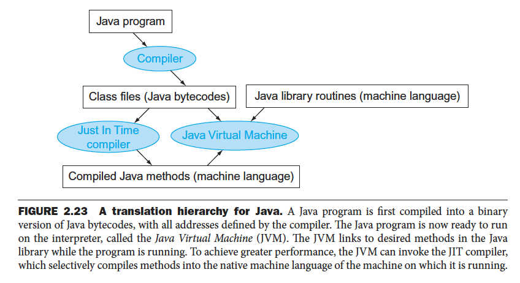

# 목차
1. [서론](#서론)
2. [하드웨어 연산](#하드웨어-연산)
3. [피연산자](#피연산자)
4. 부호있는 수와 부호없는 수
5. 명령어의 컴퓨터 내부 표현
6. 논리 연산 명령어
7. 판단을 위한 명령어
8. 하드웨어 프로시저 지원
9. 문자와 문자열
10. 32비트 수치와 주소를 위한 MIPS 주소 지정 방식
11. 병렬성과 명령어: 동기화
12. 프로그램 번역과 실행

# 서론
컴퓨터 하드웨어에게 일을 시키려면 하드웨어가 알아들을 수 있는 언어로 말을 해야한다. 컴퓨터 언어에서 단어를 명령어(instruction)라 하고, 그 집합을 명령어 집합(instruction set)이라한다.

예시로 사용할 명령어 집합은 MIPS로 1980년대 이후 설계된 명령어 집합 중 잘 만들어진 것 중 하나다. 다른 예시로 ARMv7, Intel x86, ARMv8 등이 있다. 이 모든 명령어 집합은 사실 유사하며, 이는 모든 컴퓨터가 같은 기본 원리 위에 구축된 하드웨어 기술로 만들어지며, 하드웨어가 제공하는 기본적인 연산은 몇가지 안된다는 사실에 기인한다. 하드웨어의 간결성은 1950년대나 지금이나 똑같이 중요한 고려사항이다.

우리가 ARM 아키텍처, AMD 아키텍처라고 하는 모든 것들은 cpu구조와 명령어 집합을 함께 지칭한다고 생각하면된다. 이 cpu 설계 방식으로 CISC(Complex Instruction set computer)과 RISC(Reduced Instruction set computer)로 나뉘는데, CISC구조의 예시로 AMD64, x86, 인텔 8080 등이 있으며, RISC 구조의 예시로 ARM, MIPS 등이 있다.
- RISC 방식은 자주 쓰이는 명령어만 간략화했기 때문에 명령어 개수가 적고 명령어 길이도 고정되어있다. 명령어의 종류가 적어 전력 소비가 적고 속도도 빠르지만 복잡한 연산을 수행하기 위해 명령어들을 반복 조합해서 사용해야하므로 레지스터를 많이 필요로하고 프로그램도 복잡하다. 보통 단순한 작업을 하는 서버나 워크스테이션으로 많이 사용된다.
- CISC 방식은 명령어의 종류가 많고 복잡한 연산에 하나씩 기계어를 대응시킴으로써 명령어 집합이 커지고 길이가 다양한 명령어를 가진다. 명령어의 종류가 많다보니 전력 소비가 많고 명령어 설계가 어려워 가격이 비싸지만 레지스터를 적게 사용하므로 프로그램이 간단하다. 하지만 주로 쓰이는 명령어는 일부에 불과하다. 보통 PC같은 개인용 컴퓨터에 많이 사용된다.

아래 이미지는 MIPS 명령어와 실행 빈도를 정리해놓은 표인데, 명령어들은 애초부터 사용빈도가 서로 다르고 소수의 명령어들이 다른 것보다 훨씬 자주 사용된다. SPEC CPU2006 벤치마크에서 각 종류가 얼마나 자주 쓰이는지를 아래 표로 정리한 것인데 대부분 데이터를 이동하거나 조건분기에 필요한 명령어를 많이 사용한다. 

RISC구조도 명령어가 적음에도 불구하고 사용하는 것만 주로 사용하는데, CISC의 명령어들은 RISC 구조의 명령어보다 훨씬 많고 복잡하니 그래서 더욱더 사용하는 명령어만 사용하지 않았을까? 실제로 아래는 CISC 아키텍처의 한 종류인 x86의 명령어 개수의 성장 그래프를 보여준다. 이러한 확장은 기술적 가치가 있는 것도 있지만, 이러한 급격한 변화는 호환 프로세서를 만드는 다른 회사들에게 큰 어려움을 안겨줄 수 있다.


# 하드웨어 연산
MIPS 어셈블리 언어는 다음과 같다


변수가 f, g, h, i, j인 다음 C 문장에 대한 컴파일러 출력은 무엇일까?
```c
f = (g + h) - (i + h);
```

```MIPS
add t0, g, h # MIPS 명령어는 한번에 하나의 연산만 하기 때문에 컴파일러는 임시변수 t0를 만든다.
add t1, i, j
sub f, t0, t1
```

# 피연산자
MIPS로 연산을 할 때 피연산자(operand)는 레지스터(register)에 위치해야한다. MIPS 구조에서 레지스터의 크기는 32비트로, MIPS에서는 32비트가 한 덩어리로 처리되는 일이 매우 빈번하여 이를 워드(word)라고 부른다. 워드는 cpu가 한번에 처리할 수 있는 데이터의 크기이며 32비트 cpu에서 1워드는 32비트(4바이트)이고, 64비트 cpu에서 1워드는 64비트(8바이트)가 된다. 그리고 보통 32개의 레지스터가 있다. 즉, MIPS에서 산술명령어의 각 피연산자는 32개의 32비트 레지스터 중 하나여야한다.

여기서 왜 32개 이상의 레지스터를 사용하지 않는 것일까?
1. 컴퓨터 설계 측면에서 봤을 때 레지스터 수가 적은 것이 더 빠르긴하다. 레지스터가 많아지면 저장할 수 있는 데이터의 양은 많아지지만 전기 신호가 더 멀리까지 전달되어야 하므로 느려진다. 그 사이 절충점을 잘 찾아야한다. 하지만 그렇다고 31개가 32개보다 꼭 빠른건 아니다. 적당히 타협점을 찾은게 32개다.
2. 두번째 이유는 2.5절을 참고하자. 이 절을보면 어셈블리 코드를 기계어로 어떻게 나타내는지에 대해 보게 되는데, 16개 또는 32개의 레지스터 각각에 대해 숫자를 할당하고 이를 5비트로 표현하게 되어있다. 이 때 명령어의 길이를 같게 하고 싶지만 레지스터 개수를 늘리게 되면 레지스터를 표현하기 위한 비트 수가 적어도 1개가 더 필요하게 된다. 명령어의 길이를 같게 함으로써 오는 이점이 더 크기 때문에 오늘날 대부분 명령어 집합은 16개 또는 32개의 범용 레지스터를 가지고 있다.

32개의 레지스터 개수가 부족할 때 레지스터에 저장하고 남은 데이터는 메모리에 저장한다. **MIPS 산술 연산은 레지스터에서만 실행되므로** 메모리와 레지스터 간에 데이터를 주고 받는 명령어가 있어야하는데 이를 데이터 전송 명령어(data transfer instruction)이라고 한다. 메모리에 기억된 데이터 워드에 접근 하려면 명령어에 메모리 주소를 지정해줘야한다. 메모리에서 레지스터로 데이터를 복사해오는 데이터 전송 명령을 적재(load, lw)라 하고, 그 반대의 경우를 저장(store , sw(store word의 약자))라고 한다.

32개의 레지스터 중 하나의 레지스터를 보자. 32비트로 수를 표현할 수 있는 레지스터가 있다. 이 레지스터에는 메모리 주소가 저장되는데, 표현 될 수 있는 메모리 주소가 $2^{32}$개나 된다는 말이다. 그리고 메모리는 바이트 단위로 데이터를 저장하므로 최대 4GB의 메모리를 사용해야 32비트 레지스터에 주소를 모두 표현할 수 있다. 만약 4GB 보다 커지게 된다면 레지스터에 입력할 수 없는 주소의 형태가 생길거다.

MIPS는 바이트 주소 방식을 사용한다. 바이트 주소 방식(Byte addressing)은 컴퓨터 메모리에서 각 바이트에 고유한 주소를 할당하여 메모리를 관리하는 방식이다. 메모리에 접근할 때는 byte단위로 access 할 수 있다. lw, sw 같은 명령어는 load word, store word의 약자로 4바이트씩 메모리에서 한번에 load하고 store하는 명령어이지만 실제로 lb(load byte), lh(load halfword signed, 하프워드를 부호있는 수로 취급하고 load), 1hu(load halfword unsigned, 하프워드를 부호없는 수로 취급하고 load) 의 명령어도 존재한다. 즉 MIPS 명령어는 바이트 주소를 사용하기 때문에 이웃한 워드의 주소는 4씩 차이가 나게된다.

아래 그림은 MIPS의 주소와 데이터 값으로 워드 주소는 워드를 구성하는 4바이트 주소 중 하나를 사용하며 연속된 워드의 주소는 아래 그림처럼 4씩 차이가 난다. 그리고 MIPS에서 워드의 시작 주소는 항상 4의 배수인데 이러한 요구 사항을 정렬 제약(alignment restriction)이라고 하며 많은 컴퓨터에서 이 방법을 사용한다. 실제로는 데이터가 word 단위로 alignment 되어있기 때문에 메모리에 대한 읽기 또는 쓰기를 할 때 데이터 전송이 빨라지게 되는데 자세한건 4장에서 알 수 있다.


[이 글](https://minusi.tistory.com/entry/%EB%A9%94%EB%AA%A8%EB%A6%AC-%EC%96%BC%EB%9D%BC%EC%9D%B8%EB%A8%BC%ED%8A%B8Memory-Alignment)의 설명에서는 load 명령이 IR 레지스터에 저장되는데 하위 2bit는 opcode와 target register를 지칭하는데 사용하기 때문에 남은 30비트에 메모리 주소를 저장해야한다고 한다. 그래서 실제로 상위 30bit의 배선은 RAM의 address pin에 일대일로 연결되어있으며 address pin의 하위 2비트는 모두 0이라고 한다. 그래서 load 명령으로 접근 할 수 있는 실제 메모리 주소는 항상 4의 배수가 된다고 한다. 이때 4바이트 배수가 아닌 주소에서는 word 단위로 읽어올 수 없다고 하는데 어떤 프로세서에서는 또 제대로 읽어올 수 있도록 설계된다고 한다. 어쨌든 모든 프로세서에는 적용되는게 아니지만 메모리 내의 데이터가 alignment rule을 따르고있다면 특정 프로세서가 워드 단위로 값을 읽을 때 빠르게 데이터를 access 할 수 있다는 말인 것 같다. [링크](https://en.wikipedia.org/wiki/Data_structure_alignment) 에서는 실제로 많은 컴퓨터 언어들을 구현할 때 데이터 정렬을 자동으로 처리한다고한다.

컴퓨터는 제일 왼쪽(최상위(big end) 바이트 주소)를 워드 주소로 사용하는 것과, 제일 오른쪽(최하위(little end) 바이트 주소)를 워드 주소로 사용하는 것 두 종류로 나뉘어진다. MIPS는 최상위 주소를 사용하는 빅엔디안(big-endian) 계열에 속한다. (4바이트 간격으로 메모리 주소가 정해지는거라면 한 워드를 지칭할 때 4바이트의 큰 쪽을 정할건지, 작은 쪽을 정할건지 골라야하는데, 큰쪽을 정한다는 말이다) 근데 이런 저장 순서는 동일 데이터를 워드 혹은 4바이트로 접근할 때만 문제가 되기에 이 엔디안에 대해서는 몇몇 사람들만 알면된다.

빅엔디안과 리틀엔디안 이라는 용어를 연속되는 바이트의 저장 순서를 지정하는 방식을 설명할 때도 사용한다. 컴퓨터는 데이터를 메모리에 저장할 때 바이트 단위로 저장한다. 하지만 저장하는 데이터는 대부분 4바이트 또는 8바이트로 구성된다. 예를들어서 0x12345678 이라는 32비트의 수가 있다고 해보자. 그럼 이 숫자가 메모리에 저장될 때
1. 바이트 단위로 쪼개지고 0x12, 0x34, 0x56, 0x78
2. 이 각각의 바이트가 메모리에 저장되는데
- (메모리 낮은 주소) 0x12, 0x34, 0x56, 0x78 (높은 주소) 로 저장되는 일반적인 방식이 빅엔디안 방식으로 저장되는 것이고 
- (메모리 낮은 주소) 0x78, 0x56, 0x34, 0x12 (높은 주소) 로 저장되는 방식이 리틀엔디안 방식이라고 부른다.

변수 h가 레지스터 $s2에 할당되어 있으며 배열 A의 시작 주소는 $s3에 들어있다고 가정하자. 다음 c 문장을 MIPS 어셈블리 프로그램으로 바꾸어보면,
```c
A[12] = h + A[8]
```
```MIPS
lw $t0, 32($s3)  # t0라는 레지스터 변수를 선언하고 저장함
add $t0, $s2, $t0
sw $t0 48($s3)
```

피연산자로 상수를 사용하려면 원래대로라면 lw로 메모리에서 값을 가져와야겠겠지만 피연산자 중 하나가 상수인 산술연산 명령어를 따로 제공한다.
```MIPS
addi $s3, $s3, 4 # $s3 = $s3 + 4
```

# 부호있는 수와 부호없는 수
컴퓨터의 이진 패턴을 더하고 빼고 곱하고 나누는 하드웨어를 설계할 수 있다. 만약 이러한 연산 결과가 하드웨어에 구현된 비트들로 표현이 불가능하면 오버플로(overflow)가 발생했다고 말한다. 오버플로가 발생했을 때 어떻게 대처할지는 프로그래밍 언어와 운영체제 및 프로그램의 몫이다.

부호있는 이진수를 표현하는 방식은 2의 보수법(two's complement)라고 한다. 오늘날의 모든 컴퓨터가 부호 있는 수를 2의 보수로 표현하고있다. 2의 보수 연산을 할 때 모든 0을 1로, 1은 0으로 바꾸고 1을 더하면 된다. 


# 명령어의 컴퓨터 내부 표현
MIPS 명령어는 예외 없이 32비트로 표현된다. 어셈블리 언어와 구별하기 위해 명령어를 숫자로 표현한 것을 기계어라고 하고, 이런 명령어들의 시퀀스를 기계코드(machine code)라고 한다. 긴 이진수를 읽는게 너무 빡세니 거의 모든 컴퓨터의 데이터 길이는 4의 배수이므로(여러가지 이유가 있으니 받아드리자) 기계어 코드를 읽을 땐 16진수가 많이 사용된다. 그리고 레지스터가 16개 또는 32개가 있다면 이 각각의 레지스터가 하나의 숫자로 매핑되어있고 어셈블리 명령어들도 하나의 숫자로 전부 매핑되어있다.

MIPS에서 바이너리로 명령어를 표현할 수 있는 형식이 두가지 있다.

R타입 명령어 형식(R은 register를 뜻함)

- op: 명령어가 실행할 연산의 종류로서 연산자(opcode)라고 부른다.
- rs: 첫번째 source 피연산자 레지스터
- rt: 두번째 source 피연산자 레지스터
- rd: destination 레지스터
- shamt: 자리이동(shift)의 양
- funct: op필드에서 연산의 종류를 표시하고 funct필드에서는 그중의 한 연산을 구체적으로 지정한다.

MIPS 설계자들은 모든 명령어의 길이를 같게 하되, 명령어 종류에 따라 형식을 다르게 하도록 설계했다. 예를들어 위에서 값을 저장할 수 있는 비트 수가 5비트면 최대 32 숫자밖에 표현할 수 없는데 이 정도도 충분한 명령어가 있는 반면에, 메모리에서 큰 값을 읽어와야하는 경우는 부족할 수도 있다. 그래서 명령어 형식을 R타입과 I타입으로 나눠 기계어로 표현되도록 했다. 아래에 추가로 I타입 명령어 형식을 보자. 아래는 I타입 명령어 형식으로 I타입은 주로 수치연산과 데이터 전송 명령어에서 사용된다.


R, I타입 상관없이 LOAD나 ADD 같은 연산자들은 6비트를 사용하고 연산에 사용되는 데이터(rs와 rt)는 10비트를 차지한다. 하드웨어는 op필드(명령어)를 보고 명령어의 오른쪽 절반을 필드 3개로 볼 것인지(R타입), 필드 하나로 볼 것인지(I타입)을 결정한다. 자세한 예시는 책을 참고하자.

아래 그림과 같은 방식으로 Comments에 적힌 어셈블리 코드가 Example의 형태로 변경되고 당연히 이 10진수들은 모두 2진수로 변경된 형태로 기계어가 작성된다.


# 논리연산 명령어
각각의 비트에 대한 연산이 모두 어셈블리로 정의되어있다. SHIFT(sll, srl), AND(and), OR(or), NOR(nor) 등이 존재한다.

# 조건/순환문을 위한 명령어
조건문, 순환문을 어셈블리로 표현하기
```
beq register1, register2, L1  # branch if equal, register1, 2 값이 같으면 L1으로 가라
bne register1, register2, L1  # branch if not equal
```
또한 여러 코드의 시작 주소를 표로 만들면 더 효율적으로 구현할 수 있는데, 이 때 프로그램은 점프 주소 테이블(jump address table) 또는 점프 테이블(jump table)의 인덱스만 계산해서 특정 루틴으로 점프할 수 있다. jr(jump register)라는 MIPS 명령어가 존재한다.

참고로 이 어셈블리 하나의 명령어가 cpu 클럭속도나, 클럭 사이클에 영향을 줄 수 있다. 예시로 하드웨어는 간단해야 한다는 von Neumann 연구팀의 경고를 준수하여 MIPS 구조에서는 구현하기 너무 복잡한 blt(branch on less than) 명령어를 제외시켰다고 한다. 이 명령을 (하드웨어로) 구현하면 클럭 속도가 느려지거나 이 명령 실행에 별도의 클럭 사이클이 더 필요하게 된다. 실제로 빠른 명령어 2개를 사용하는 것이 더 유리했다.

# 하드웨어 프로시저 지원
프로시저(procedure) 또는 함수는 이해하기 쉽고 재사용이 가능하도록 프로그램을 구조화하는 방법 중 하나다. 프로시저는 제공되는 인수에 따라서 특정 작업을 수행하는 서브루틴이라고 하는데 그냥 함수다.

MIPS는 프로시저 호출 관례에 따라 다음과 같은 레지스터를 할당한다.
- 전달할 인수를 가지고 있는 인수 레지스터 4개($a0 ~ $a3)
- 반환되는 값을 갖게 되는 값 레지스터 2개($v0 ~ $v1)
- 호출한 곳으로 되돌아가기 위한 복귀 주소를 가지고 있는 레지스터 1개($ra)

MIPS 어셈블리 언어는 레지스터를 할당할 뿐 아니라 프로시저를 위한 명령어도 제공한다. jql(jump-and-link) 명령어는 지정된 주소로 점프하면서 동시에 다음 명령어의 주소를 $ra 레지스터에 저장한다. 이 때 link는 프로시저 종료 후 올바른 주소로 되돌아올 수 있도록 호출한 곳과 프로시저 사이에 주소 또는 링크를 형성한다는 뜻이다.

**프로그램 카운터(PC)** 는 현재 실행 중인 명령어의 주소를 가리키는 레지스터이다. **여기서 중요한 건 프로그램 카운터는 위에서 본 더하고, 빼고, 점프, 분기, 서브루틴 호출 등에서 사용되는 16개 또는 32개의 레지스터 세트 중 하나가 아니라 CPU 내부에 있는 특수한 레지스터로 이해해야한다.** 한 명령어가 실행되는 순간 PC는 다음에 실행할 명령어의 주소를 가리키도록 업데이트된다. 예를들어 프로시저의 계산이 끝났을 때 프로그램 카운터에 $ra에서 복귀 주소가 사용된다.

할당 가능한 레지스터 개수로는 부족한 데이터를 처리해야하는 경우는 어떻게될까? 메모리의 스택 영역을 사용한다. 예를들어 프로시저가 recursive하게 호출된다고 가정해보자. 프로그램이 인수값 3을 가지고 프로시저 A를 호출했을 때 $a0 레지스터에 3을 넣고 jal A 명령을 실행할거다. 근데 중간에 인수값 2를 가지고 프로시저 B를 호출했다고 하면 $a0와 복귀주소가 저장되는 $ra 레지스터에 충돌이 발생하게 되는데, 이를 해결할 수 있는 방법이 값이 보존되어야하는 모든 레지스터를 스택에 넣는 것이다. 그리고 스택에 저장되는 레지스터 개수에 맞추어 $sp 저장되는 스택 포인터 값도 조정된다.

이처럼 메모리의 스택 영역에는 프로시저 내에서 정의되는 지역 변수(지역변수 개수가 할당되는 레지스터 개수보다 많거나, 레지스터에 들어가지 못할만큼 큰 배열이나 구조체일 때)가 저장된다.


위 이미지를 참고하면 
- 스택은 최상위 주소에서부터 아래쪽으로 자라고, 힙은 반대로 낮은 메모리 주소로부터 올라온다. 
- 맨 아래 Reserved는 다른 목적으로 사용이 예약되어있고 (보통 운영체제의 커널코드가 들어가거나 가상 메모리 관리를 위해 필요한 메모리 공간을 할당하거나, 디바이스 드라이버와 같은 특정 하드웨어에 대한 메모리 리소스를 미리 할당한다고 한다)
- Text segment(Text 메모리 영역)에서 MIPS 기계어 코드가 들어간다.
- Static data segment에는 상수나 기타 정적 변수(ex. 크기가 고정된 배열 등)들이 들어간다. 
- Heap 영역에는 linkedlist 자료구조처럼 크기가 늘어났다 줄어들었다하는 크기가 동적인 자료구조 등이 들어간다. 또한 malloc()을 호출하면 힙에 메모리 공간을 할당하고 이 공간을 가르키는 포인터를 반환하기도 하고, free()는 포인터가 가리키는 힙 공간을 반납하기도 한다. 이 때 사용이 끝난 공간을 반납하는 것을 잊어버리면 memory leak이 발생하여 메모리 부족으로 운영체제가 붕괴될 수도 있고, 너무 일찍 반납하면 프로그램 의도와 상관없이 엉뚱한 곳을 가리키는 dangling pointer가 발생한다. Java와 같은 c보다 좀 더 high level language에서는 자동 메모리 할당과 가비지 컬렉션(garbage collection)을 사용하여 메모리 관리를 좀 더 효율적으로 한다.
- Stack 영역에는 위에서 말했듯이, 프로시저 내에 정의되는 지역 변수들이 들어간다.

그럼 다시 프로시저 호출과 관련된 레지스터로 돌아가서, 프로시저 호출에 할당되는 레지스터 말고도 전체적인 MIPS 레지스터에 대해 보면 다음과 같다. 총 32개의 레지스터가 각각 다 제 역할이 있다.


인자 레지스터 4개, 리턴 값 레지스터 2개, 저장 레지스터 8개, 임시 레지스터 10개 등등 이 정도면 대부분 프로시저는 충족시키기 때문에 거의 메모리로 갈일이 없어 속도가 빨리진다고 한다. 그럼 인수가 4개보다 많을 때는 어떻게 할까? MIPS의 관례는 나머지 인수를 프레임 포인터 바로 위 스택이 넣는다. 프로시저는 처음 네개의 인수가 $a0~$a3에 있고 나머지는 프레임 포인터를 통해 접근할 수 있는 메모리에 있다고 생각한다.

# 문자와 문자열
오늘날의 대부분의 컴퓨터는 8비트 바이트로 문자를 표현하며 거의 모든 컴퓨터가 ASCII(American Standard Code for Imformation Interchange)를 사용한다. 아스키 코드에서는 1비트는 패리티 비트로 사용하고 나머지 7비트로 문자를 표현하는데, 총 128개의 문자가 정의되어있다. **숫자 말고도 텍스트 데이터를 다루는 프로그램이 많이 때문에 MIPS에서는 워드 단위의 적재와 저장 뿐만 아니라 바이트 전송 명령어가 따로 있다.** 1b는 메모리에서 한 바이트를 읽어 레지스터의 오른쪽 8비트를 채우는 명령이고 sb(store byte)는 레지스터의 오른쪽 8비트를 읽어 메모리로 보내는 명령이다. 

숫자 10억(1,000,000,000)을 ASCII 문자열로 표현한다면 32비트 정수로 표현하는 것에 비해 메모리가 얼마나 많이 차지할까? 10개의 ASCII 자리수가 필요하다. 각각이 8비트 메모리 이므로 80비트가 필요하다. 32비트 정수로 표현하는 것보다 2.5배가 더 많이 표현한다. 10진수를 활용하는 컴퓨터는 메모리가 더 필요할 뿐만 아니라, 십진수의 사칙연산 하드웨어는 만들기가 더 어렵다. 언어마다 내부적으로 문자를 표현하는 방식이 다르지만 c의 경우 문자열의 끝에 ASCII의 null(decimal로 0)을 두는 방법을 사용한다. 예를들어 Cal 이라는 문자열은 67, 97, 108, 0의 네 바이트로 표현된다.

여기서 중요하게 짚고 가야할게 하나 있다. 한 데이터의 종류가 데이터 자체로 인코딩 되어있다고 생각하기 쉽지만 그게 아니고 그 데이터를 처리하는 프로그램(c 또는 java 또는 워드프로세서 등)에 인코딩 되어있다는 것을 알아야한다. 예를들어 한 2진수는 여러가지 종류의 데이터를 나타낼 수 있는데 01100010, ... , 00000000 이런 32비트 패턴이 있다고 했을 때 이 비트는
1. 프로그램이 부호있는 정수로 여길 수도 있고
2. 프로그램이 부호없는 정수로 여길 수도 있고
3. 프로그램이 이를 null로 끝나는 ASCII 문자열로 간주할수도(예를들어 문자 baP 이렇게 읽히겠지)
4. 프로그램이 색상을 표현하는 비트패턴이라고 여길 수도 있고
5. MIPS 기계어 명령어를 나타내는 것으로도 볼 수 있다.

그래서 인코딩이란 개념이 등장하게 되는 것인데, 예를들어 UTF-8 인코딩 방식을 사용한다고 하면 ASCII는 8비트로 나타내고 다른 문자들은 16~32비트로 나타내는 표현방식이고, UTF-32는 글자 하나를 32비트로 나타내는 표현방식이다. 아스키나 유니코드는 내부적으로 어떤 바이트가 어떤 문자를 표현한다고 정의한 표이고 그 바이트가 어떤 언어나 프로그램에서 예를들어 문자 A라고 보이는 것은, 그 프로그램이 사용한 인코딩 방식에 의해 결정된다는 것이다. 그래서 같은 파일을 열어도 이걸 utf-8로 인코딩해서 볼 때는 괜찮게 보이는데 utf-16으로 인코딩해서 볼 때 깨져서 보일 수도 있는 이유가 이 때문이다. 그래서 파이썬 2는 아스키가 기본 인코딩 방식으로 주어진 반면 파이썬 3에는 utf-8이 기본 인코딩 방식으로 주어진다. 파이썬 2에서도 `-*- coding: utf-8 -*-`  이런 주석 위에 달면 utf-8로 파일의 인코딩 형태를 명시해줄 수 있었다.


# MIPS의 32비트 수치를 위한 주소지정 및 복잡한 주소지정 방식
MIPS명령어의 길이를 32비트로 고정한 덕택에 하드웨어가 간단해지기는 했지만 명령어 내에 32비트 상수나 32비트 주소를 표시할 수 없어 불편한 점도 있다. 이런 문제를 처리하기 위한 일반적인 해법을 제공하는데 자세한 내용은 책을 보자. 주소지정과 관련해서 하나 예시로들면 레지스터에는 opcode나 피연산자 등 모두 32비트 내에 들어가면 사실 메모리 주소를 표현할 수 있는 공간이 얼마안된다. 그래서 다른 레지스터에 나머지 메모리 주소를 적어놓고 program counter(32비트)에 주소가 들어갈 때는 두 레지스터의 주소 값을 더해 입력해주는 방식을 사용한다.

# 병렬성과 명령어: 동기화
동기화는 운영체제도 그렇고 컴퓨터 과학 전반적으로 꽤나 큰 문제였구나 싶다. 자세한 내용은 책을보자.

# 프로그램 번역과 실행


컴파일러
- 1975년 당시에는 메모리가 부족하고 컴파일러가 비효율적이여서 운영체제와 어셈블러는 어셈블리 언어로 작성되었지만 지금은 DRAM 용량이 수백만 배나 커졌고, 컴파일러가 왠만한 어셈블리 프로그래머보다 더 우수한 어셈블리 프로그램을 만듦
- 이 컴파일러가 정말 중요한게 프로그램에 필요한 명령어 개수를 컴파일러와 명령어 집합 구조가 결정한다.

어셈블러
- 어셈블리 언어 프로그램을 object file로 바꾼다. 이 object file에는 기계어 명령어, 데이터 명령어를 메모리가 적절히 배치하기 위해 필요한 각종 정보가 혼합되어있다. object file 정보는 아래와 같다.
  - 목적 파일 헤더
  - 텍스트 세그먼트
  - 정적데이터 세그먼트
  - 재배치 정보
  - symbol table
  - 디버깅 정보

링커
- 어떤 프로시저를 한줄 고쳤는데 전체 프로그램을 다시 컴파일하고 어셈블하는건 너무 자원 낭비가 심하다. 특히 표준 라이브러리 루틴을 매번 컴파일하는게 너무 낭비인데, 이것을 피하는 방법은 각 프로시저를 따로따로 컴파일, 어셈블하고 나중에 하나로 연결해주면 되는데 이 일을 링커가 담당한다.
- 실행파일 생성함

로더
- 디스크에 실행파일이 준비되면 운영체제가 디스크에서 실행 파일을 읽어서 메모리에 넣고 이를 시작한다. 
- UNIX 시스템의 loader는 이 일을 아래 순서로 진행한다 
    1. 실행 파일 헤더를 읽어서 텍스트와 데이터 세그먼트의 크기를 알아낸다
    2. 텍스트와 데이터가 들어갈만한 메모리 주소공간을 확보한다
    3. 실행 파일의 명령어와 데이터를 메모리의 Text영역에 복사한다
    4. 주 프로그램에 전달해야할 인수가 있으면 이를 Stack 영역에 복사한다
    5. 레지스터를 초기화하고 스택 포인터는 사용가능한 첫 주소를 가리키게한다.
    6. start-up routine(코드블럭으로 해석하자) 으로 점프하고, 이 routine에서는 인수를 레지스터에 넣고 프로그램의 주 루틴을 호출한다.

자바를 만든 목적은 C와는 좀 다른데 그 중 하나가 실행시간은 느리더라도 어느 컴퓨터에서나 안전하게 실행시킬 수 있게 하자는 것이었다.


# 결론
우리가 쉽게 오해할 수 있는 오류를 살펴보자. 최고 성능을 얻기 위해 어셈블러로 작성해야하는가? 아니다. 과거에는 컴파일러가 출력하는 코드의 성능이 좋지 않았지만 컴파일러 기술이 발달하면서 컴파일한 코드와 손으로 작성한 코드 간의 차이가 급격하게 줄어들고 있다. 이미 줄어든 것 같다. 실제로 어셈블리 프로그래머가 오늘날의 컴파일러와 경쟁하려면 4, 5장에서 설명하는 프로세서 파이프라이닝과 메모리 계층의 개념을 완전히 이해하고 있어야한다. 컴파일러와 어셈블리 프로그래머 간의 이런 전쟁은 사람이 점차 기계에게 밀려나는 여러 현상 중 하나로 c언어에서는 프로그래머가 컴파일러에게 어떤 변수를 레지스터에 넣고 어떤 변수를 메모리에 넣을지에 대한 힌트를 줄 수 있다. 컴파일러의 레지스터 할당 기술이 미숙했을 때 이런 힌트는 상당한 도움이 되었지만 오늘의 컴파일러는 프로그래머보다 오히려 레지스터 할당을 더 잘하기 때문에 이런 힌트를 무시하는 것이 보통이다.

내장 프로그램의 두가지 기본 원리는 (1) 명령어도 숫자의 형태로 작성된다는 것과 (2) 변경 가능한 메모리에 프로그램을 저장한다는 것이다. 그리고 명령어 집합의 선택은 프로그램의 실행에 필요한 명령어 개수, 명령어 하나의 실행에 필요한 클럭 사이클 수, 그리고 클럭 속도 간의 미묘한 균형을 요구한다. 명령어 집합 설계자가 이런 미묘한 결정을 내릴 때 지침이 될 수 있는 설계 원칙이 있다.
1. 간단하게 하기 위해서는 규칙적인 것이 좋다.
- MIPS 명령어 집합의 특성 중 많은 부분이 규칙성을 염두에 두고 결정된 것이다. 예를들면 모든 명령어의 길이를 똑같게 한 것, 산술 명령어는 항상 레지스터 피연산자 3개를 갖도록 한 것, 어떤 명렁어 형식에서나 레지스터 필드의 위치를 일정하게 만든 것 등이다.
2. 작은 것이 더 빠르다.
- MIPS 레지스터 개수를 32개로 제한한 이유는 속도를 빠르게 하기 위해서이다.
3. 좋은 설계에는 적당한 절충이 필요하다.
- MIPS는 명령어 내의 주소나 상수부는 클수록 좋다는 것과 모든 명령어의 길이는 같은 것이 좋다는 두 요구 사항을 적당히 절충하여 수용하고 있다.

이 장에서 설명한 또 다른 주요 아이디어는 숫자에는 내재하는 타입이 있는게 아니라는 것이다. 같은 비트 패턴이 정수를 나타낼 수도 있고, 문자열 혹은 색깔, 심지어는 명령어를 나타낼 수도 있다. 데이터의 타입을 결정하는 것은 프로그램이다.