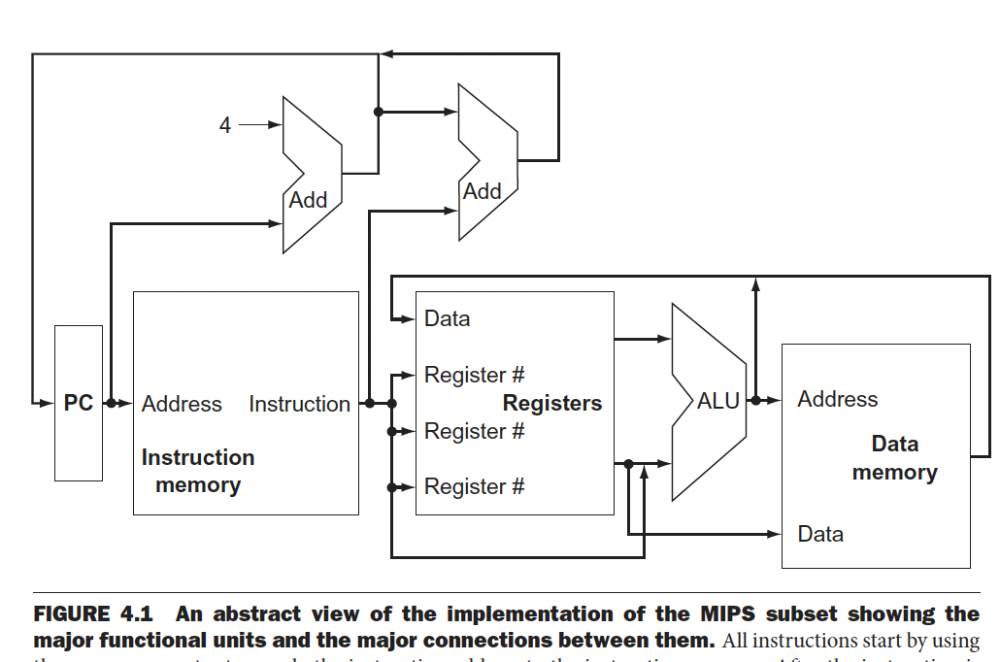
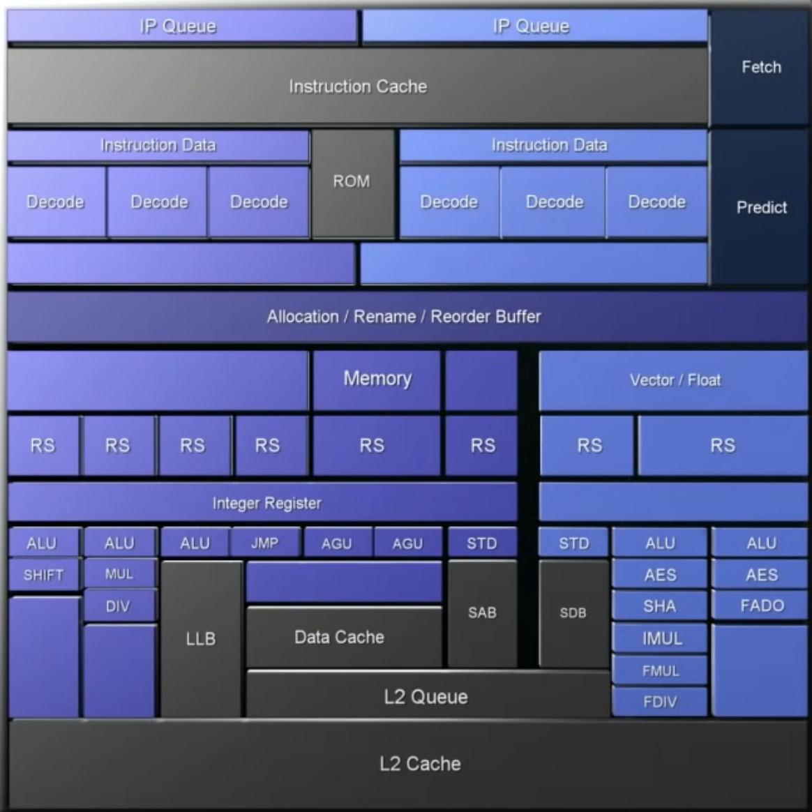
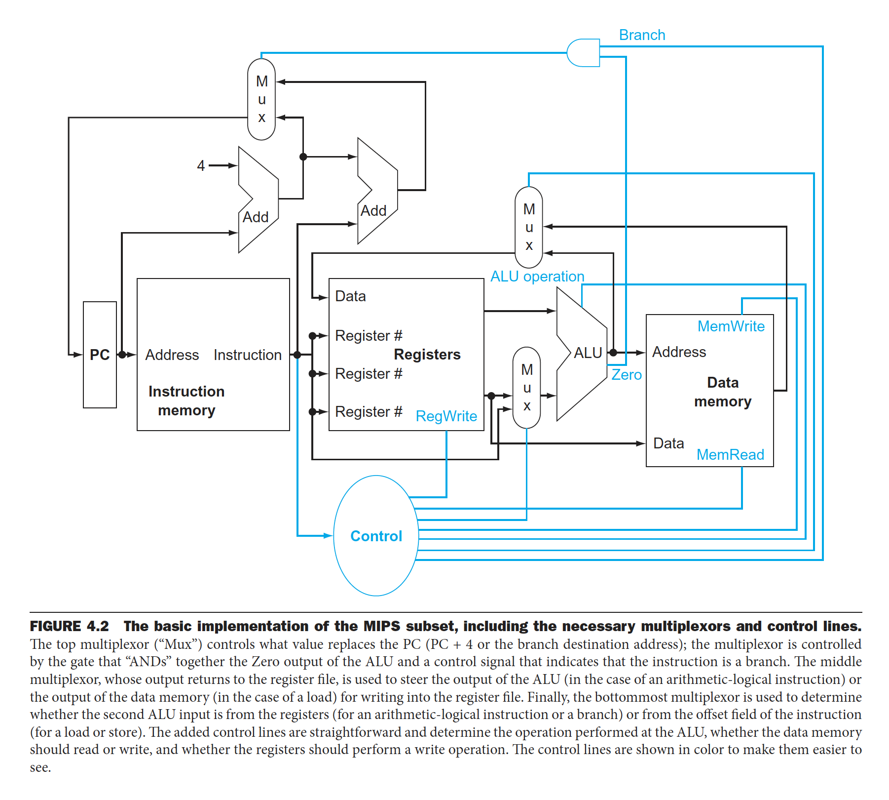
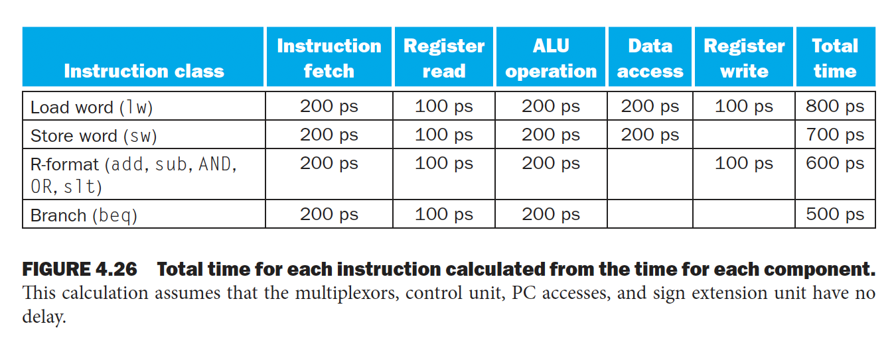
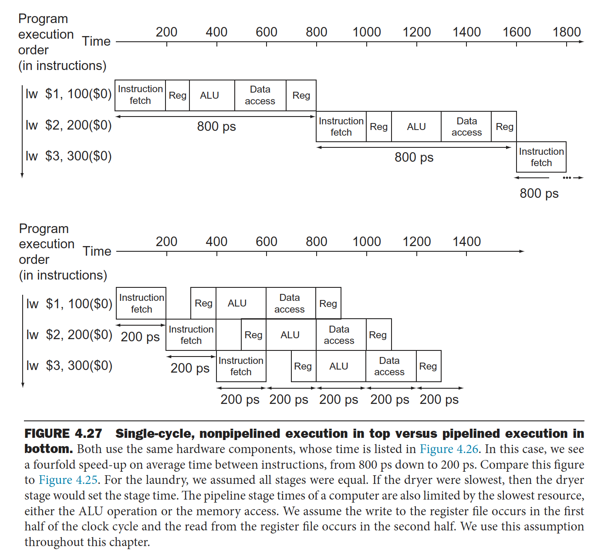
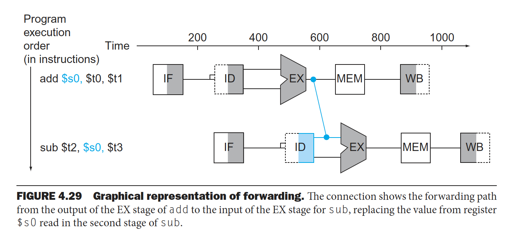
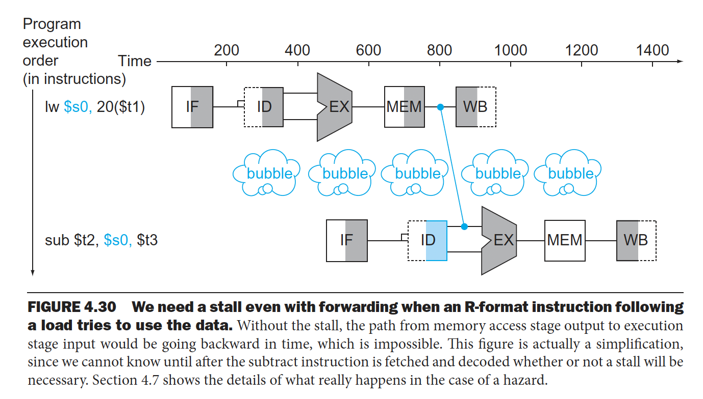
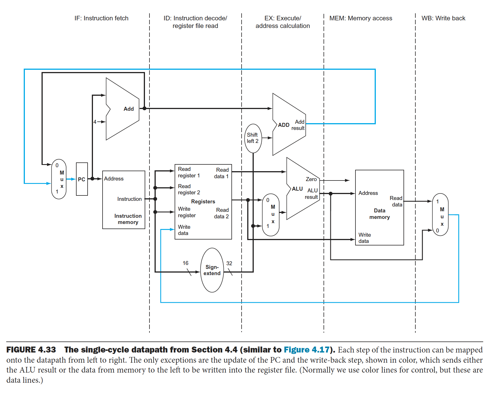
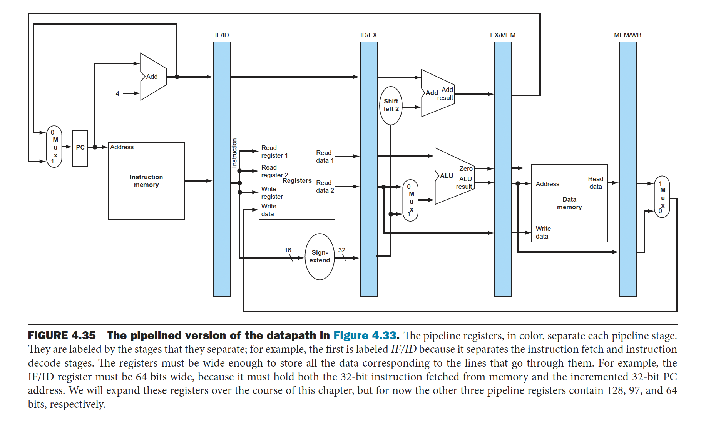
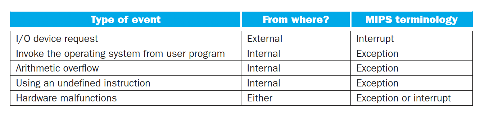

# 서론
1장에서 컴퓨터 성능은 명령어 개수 * 한 명렁어 당 필요한 클럭 사이클 수(CPI) * 한 클럭 사이클 시간 으로 결정된다고 했다. 이 때 명렁어 개수는 컴파일러와 명령어 집합 구조에 의해 결정되고 클럭 사이클 시간과 CPI는 프로세서의 구현 방법에 따라 결정된다. 이 장에서는 MIPS 명령어 집합을 두가지 다른 방법으로 구현하여 데이터패스와 제어 유닛을 만들어보려고 한다.

**MIPS 명렁어 집합의 일부분을 "구현" 해보면서 명렁어 집합 구조가 구현의 여러가지 요소를 어떻게 결정하는지, 또 여러가지 구현 전략이 클럭 속도와 CPI에 영향을 어떻게 미치는지 알아볼 것이다.** 이 장에서 MIPS 명령어의 일부를 구현하는데 사용되는 대부분의 개념은 고성능 서버에서부터 범용 마이크로 프로세서 및 임베디드 프로세서에 이르기까지 다양한 종류의 컴퓨터를 만드는데 사용된다. 여기서 구현이라는 단어를 썼는데 앞에서 정의한 MIPS 명령어 집합 구조를 하드웨어로 어떻게 구현했는지를 알아본다.

모든 명령어의 첫 두 단계는 다음과 같다.
1. 모든 명령어의 실행은 프로그램 카운터(PC)에 있는 명령어 주소를 이용하여 명령어 메모리(Instruction memory)로 보내는 것으로 시작한다. (메모리로부터 명령어를 가져온다고 이해하자)
2. 명령어를 가져와 어떤 레지스터를 읽어야하는지 보고 (명령어 필드를 보고) 하나 또는 두개의 레지스터를 읽는다. 워드 적재 명령어는 레지스터 하나만 읽으면 되지만 대부분의 다른 명령어는 레지스터 두개를 읽는다.

전체적인 MIPS 구현의 개요는 아래와 같다. 이것은 기억하고 있자.

1. 모든 명령어의 실행은 PC에 있는 명령어를 instruction memory로 보내 명령어를 가져오는 것 부터 시작이다. instruction memory는 명령어를 저장하며, 실제로는 CPU 내부의 캐시 메모리, SRAM 또는 DRAM으로 구현될 수 있다. 참고로 data memory는 프로그램 실행 중에 사용되는 데이터를 저장하며, 주로 DRAM으로 구현되지만, 캐시 메모리나 SRAM이 사용될 수도 있다. 여기서 말하는 memory는 우리가 일반적으로 알고 있는 DRAM, SRAM와 같은 캐시메모리로 생각할 수 있다.
2. 명령어를 보고 레지스터를 읽은 후 레지스터의 피연산자를 알아낸다.
3. 메모리 주소를 계산하기 위해서(load(적재)나 store(저장) 명령어의 경우), 산술 연산 결과를 구하기 위해서(정수 산술/논리 명령어의 경우), 비교하기 위해서(분기 명령어의 경우) ALU 연산을 수행한다. 이게 끝이다.
4. 산술/논리 연산은 ALU의 결과를 바로 레지스터에 쓰고 적재/저장 명령어의 경우 ALU의 결과를 레지스터 주소로 사용하여 메모리 읽은 값을 레지스터에 쓰고, 분기 명령어의 경우는 ALU를 비교하는 연산에 사용하는데 자세한 건 후에 알아보자) 나머지 저장(store) 명령어는 ALU를 거치지 않고 레지스터 값을 메모리에 바로 저장한다.

MIPS 명령어 집합은 단순하고 규칙적이기 때문에 여러 종류의 명령어 실행이 비슷해서 구현이 간단한다. 예를들어 점프 명령어를 제외한 모든 명령어가 레지스터를 읽은 이후에는 ALU를 사용한다. 메모리 참조 명령어는 주소 계산을 위해, 산술/논리 명령어는 연산을 수행하기 위해, 분기 명령어는 비교하기 위해 ALU를 사용한다.

pnp 또는 npn 반도체를 이용해 트렌지스터를 만들 수 있다. 이 트랜지스터를 여러개 조합하여 AND, OR, NOT 게이트 등을 만들 수 있고 이 게이트들을 여러개 조합하여 ALU와 같은 산술논리장치를 만들 수 있다. 즉 cpu 안에는 수십억개의 트랜지스터가 들어있는데 길이가 손가락 두마디 정도 되는 cpu에서 수십억개의 트랜지스터가 들어가있다. cpu에는 mosfet이라고 불리는 트랜지스터가 들어있는데 크기가 미세먼지보다도 훨씬 더 작은 0.1nm 정도의 크기가 된다. cpu는 수많은 mosfet들이 모여 많은 논리게이트를 이루고 연산을 수행하고있다. cpu 내부는 아래 그림처럼 코어와 캐시메모리(L1, L2, L3)로 이루어져있다. 그리고 코어 안에 제어장치(control unit)와 연산장치(ALU)와 다양한 레지스터들 이루어져있다. 그리고 L1 또는 L2 캐시가 코어내에 있고 L3캐시는 코어간에 공유되는 것 같은데 자세한건 좀 더 찾아보자. cpu 내부에서 데이터를 인출하고 해석하고 실행하고 저장하는 과정을 거치고 cpu는 이 단계를 세분화해서 사용하고 이렇게 분리된 각각의 프로세스를 스레드라고 하고 코어 하나에 여러개의 스레드가 실행되면 속도가 빨라진다. 우리가 이 장에서 볼 내용은 전부 하나의 코어 내에서 일어나는 cpu 연산처리 과정이다. 아래와 같은 프로세서 구조(아키텍처)는 회사마다 다르다(펜티엄, 샌디브릿지, 하스웰, 타이거레이크 등)

*위 설명 및 이미지 출처: https://www.youtube.com/watch?v=Fg00LN30Ezg&t=1079s*

그리고 대표적인 레지스터 종류는 다음과 같다. (https://technote.kr/310)
1. PC(program counter): 다음 인출될 명령어의 주소를 가지고 있는 레지스터
2. AC(accumulator): 연산 결과 데이터를 일시적으로 저장하는 레지스터
3. IR(instruction register): 가장 최근에 인출된 명령어(현재 실행중인 명렁어)가 저장되어있는 레지스터
4. SR(status register): 현재 cpu의 상태를 가지고 있는 레지스터
5. MAR(memory address register): pc에 저장된 명령어 주소가 사용되기 전에 일시적으로 저장하는 주소 레지스터
6. MBR(memory buffer register): 기억장치에 저장될 데이터 혹은 읽혀진 데이터가 일시적으로 저장되는 버퍼 레지스터

아래는 MIPS의 기본적인 구현이다. 

- instruction memory와 data memory 2개가 존재하는데, data memory는 instruction이 사용하는 데이터가 저장되어있는 메모리이고 이 메모리에 access 하기 위해서는 load/store 관련 명령어들이다. 일반적인 arithmetric 또는 logical branch는 직접적으로 data memory에 접근할 수 없다.
- 논리회로에서 mux(multiplexer)를 사용해서 여러개의 input중에 하나를 선택하는 소자다.
- control은 register나 data memory와 같은 각각의 하드웨어 모듈을 제어한다. (control은 각각의 하드웨어 모듈이 어떻게 동작해야하는지 제어한다) 명령어를 읽어서 해당하는 control을 만든다. 예를들어 데이터 메모리는 load 명령어 일 때는 읽기, store 명령어 일 때는 쓰기를 해야하고 레지스터 파일은 load 또는 산술/논리 명령어 일 때만 쓰기를 해야한다. 물론 ALU는 여러가지 연산 중 하나를 수행해야한다. 멀티플렉서처럼 ALU의 제어선도 명령어 필드 값에 따라 정해지며 제어선이 연산을 통제한다.

# 논리 설계 관례
MIPS를 구현하는 데이터패스 요소는 조합 소자(combinational element)와 상태소자(state element) 두가지 종류의 논리 소자들로 구성된다. 하나의 wire에서 하나의 bit을 나타냄. multi-bit을 나타내고 싶을 땐 multi wire가 필요하다.

조합소자(combinational element)
- combination logic은 데이터 값에 대해 연산을 수행하는 소자로, 출력이 현재의 입력에 의해서만 결정된다.
- ex) AND-gate, Mux, Adder, ALU 등

상태소자(state element)
- 정보를 저장하는데 사용한다.
- 적어도 2개의 입력과 1개의 출력을 갖는다. 꼭 있어야 하는 입력은 기록할 데이터와 클럭이다. 클럭 입력은 데이터 값이 소자에 기록되는 시점을 결정하는데, state element에 언제 쓸 것인지는 클럭이 결정하지만, 값을 읽는 것은 언제든지 가능하다.
- 상태를 포함하는 논리 구성 요소들을 순차 회로(sequential circuit)라고 한다.
- 가장 간단한 state element는 D flip flop이다. flip flop 같은 경우 clock에 동기화 되어있고 clock이 rising(또는 falling) edge일 때 input이 들어오면 output값이 바뀐다. sqeuential은 clock signal에 따라 언제 저장된 값이 업데이트 되어야하는지 결정한다. input과 현재 저장된 값과 input 값에 의해 output이 결정된다. 레지스터나 메모리를 구현할 때 사용되는데 디지털 설계 수업 때 다양한 flip flop이나 latch게 이 sequential element에 해당된다.
- ex) 명령어 메모리, 데이터 메모리, 레지스터 등

한 clock사이에 state element(input)에서 combination logic을 겨쳐 state element(output)까지 도착할 수 있게 해야한다. 이렇게 할 수 있는 longest delay가 clock의 period를 결정한다. 32비트 MIPS가 취급하는 모든 데이터가 32비트 폭을 갖기 때문에, 이 프로세서의 상태 소자와 논리 소자의 입력과 출력 폭은 거의 다 32비트이다. 이떤 입력이나 출력 폭이 32비트가 아니라면 반드시 이를 따로 명시한다.

# 데이터 패스 만들기
데이터를 연산할 경우 순차적으로 어디에 전달이 되고 저장이 되어야하는데 예를들어 register, alus, muxs, memory와 같은 데이터와 관련된 하드웨어 모듈을 연결하는 것이 데이터패스이다. 각 명령어들이 어떤 데이터패스 구성요소(datapath element)들을 필요로 하는지 살펴보면서 MIPS의 데이터패스를 순차적으로 만들어볼 계획이다.

Instrucion fetch(IF) 구현: 명령어를 저장하고 접근하는데 2개의 상태 소자가 필요하며, 다음 명령어의 주소를 계산하기 위해 덧셈기(Adder)가 하나 필요하다.
- PC, Instruction memory, Adder로 구성
- PC값이 instruction memory의 input으로 들어가고 해당되는 instruction이 output으로 나온다.
- 프로그램 카운터는 매 클럭 사이클 끝에 쓰기가 행해지는 32비트 레지스터이다. 따라서 쓰기 제어 신호는 따로 필요하지 않다. 
- Adder는 두 32비트 입력을 더해서 합을 출력으로 내보내는 일만 하도록 되어있는 특수한 ALU라고 생각하자. Adder를 사용하여 program counter 값이 4씩 증가하도록 만든다.

R형식 명령어 구현: R형식 명령어의 ALU연산을 구현하는데 필요한 2개의 구성요소는 레지스터 파일과 ALU이다.
- R형식(R-format) instruction이란?
  - 산술/논리 명령어라고도 불린다.
  - 2개의 register에서 데이터를 읽고 ALU 연산(altirhmetic operation)을 진행하고 결과를 다시 register에 쓰는 명령어를 의미한다.
  - 이러한 명령어를 R-format instruction이라고 부르고 예시로 add, sub, AND, OR, slt 등이 존재한다.
- 레지스터 파일은 모든 레지스터를 포함하고 있으며, 읽기 포트 2개와 쓰기 포트 하나가 있다. 레지스터 파일의 읽기는 항상 read 레지스터 입력이 지정하는 레지스터의 내용을 출력하므로 다른 제어 입력이 필요없지만 레지스터 쓰기는 쓰기 제어 신호를 기반으로 쓴다는 것을 명확히 표시해야한다.

적재와 저장 구현: 적재와 저장 구현에 (레지스터 파일과 ALU와 더불어) 추가로 필요한 두 유닛은 데이터 메모리와 부호확장 유닛이다.
- 데이터 메모리를 access 해야한다.
- 데이터 메모리 유닛은 입력 2개(address와 write data)와 출력 1개(read data)를 갖는 상태 소자이다.
- 읽기와 쓰기 제어 신호가 따로 있지만 한 클럭에는 이들 중 하나만 인가될 수 있다. 데이터 메모리는 에지 구동 쓰기를 한다고 가정한다. 실제 표준 메모리 칩은 쓰기에 사용되는 쓰기 허가 신호(write enable signal)을 가지고 있으며 이는 에지 구동 쓰기가 아니지만, 에지 구동 설계를 실제 메모리 칩에서 동작하도록 조정하는 것은 어렵지 않으므로 이렇게 가정하자.
- 그리고 sign extendion을 이용하여 load/store명령어 같은 경우 16비트를 32비트로 바꿔주게된다. 

분기 구현: 분기 명령어를 위한 데이터패스는 ALU를 사용하여 분기조건을 계산하고 별도의 Adder를 사용하여 분기 목적지 주소를 계산한다.
- register에서 데이터를 2개 읽어온 후 그 2개 값을 비교할 때 ALU를 사용한다. 값을 빼고 값이 0이면 같은거고 0이 아니면 다르다고 계산한다.
- 그리고 타겟 주소를 계산해야하는데 sign-extend를 사용 즉 하위 16비트를 32비트로 변환(하위 16비트를 복사해서 2개로 늘림)해주고, 2bit를 shift left(4를 곱하고)를 한다. 이것이 타겟 주소가 되는데, PC+4와 분기 목적지 주소 중 어느 쪽이 PC에 들어가야는지를 결정한다.

위에서 각 명령어 종류에 필요한 데이터 패스 구성요소에 대해 알아보았고 이제는 이 구성 요소(명령어 인출을 위한 데이터패스, R형식 명령어와 메모리 명령어를 위한 데이터 패스, 분기 명령어를 위한 데이터 패스)를 하나로 묶고 여기에 control을 추가하여 구현을 완성한다. 가장 간단한 데이터패스는 모든 명령어를 한 클럭 사이클에 실행하려고 하는 것이다. 이는 어떤 데이터패스 자원도 명령어당 두번 이상 사용될 수 없음을 의미하기 때문에 한 명령어당 두번 이상 사용해야하는 구성 요소는 필요한 만큼 여러개를 두어야한다. 그래서 데이터 메모리와 별로도 명령어 메모리가 필요한 것이다. 반대로 한 명령어 말고 두개 이상의 서로 다른 명령어들은 다양한 구성 요소를 공유하여 사용할 수 있다. 2개의 다른 명령어가 데이터패스 구성 요소를 공유하기 위해서는 그 구성 요소의 입력에 여러개의 연결을 허용해야하며, mux와 control 신호를 사용하여 그 입력들 중 하나를 선택하게한다.

이제 제어 유닛을 추가해야한다. 제어 유닛은 필요한 입력들을 받아들여 각 상태 소자의 쓰기 신호, 각 멀티플렉서의 선택신호, 그리고 ALU 제어 신호를 만들어내야한다. 이건 일단 나중에 추가하도록하고 여기서는 single cycle로 돌아가는 mips 구현회로를 간단히 만들어보는걸로 마치자.

# 단순한 구현
여기서는 위의 데이터패스에 단순한 제어기능을 추가하여 단순한 구현을 만들어보고자 한다. 이 단순한 구현은 워드 적재(lw), 워드 저장(sw), 같을 시 분기(beq), 산술/논리 연산 명령어들(add, sub, AND, OR, set on less than)을 포함한다.

1. ALU control
  - load/store에서 add할 때 사용되거나, branch에서 subtract할 때 사용되거나, r-type에서 funct 필드 값에 따라 (AND, OR, subtract, add, set on less than) 중 하나를 수행하게 됨
  - opcode로 부터 2bit짜리 ALUOp를 만든다. 논리회로 시간에 배운 kmap 등을 활용하여 ALU Control을 만들어내는 combination logic을 만들 수 있다.
2. Main control unit의 설계
  - ALU control에서 funct 필드와 2비트 신호를 제어 입력으로 사용하는 ALU를 어떻게 설계하는지 봤다면 이제는 제어의 나머지 부분에 대해서 알아본다. 

R형식 명령어, 적재 명령어, 분기 명령어의 데이터패스 동작에 대한 내용은 책을 참고하자. 여기서 참고할 점은 회로에서 회색은 실행이 안되는게 아니고 실행이 되지만 값을 사용하지 않는다는 것을 의미한다. 예를들어 Mux 같은 경우 0 또는 1 input이 들어오기 전에 모두 실행된다. 하드웨어는 모든 모듈이 concurrent하게 실행이 된다. 소프트웨어에서는 if else 구문을 짰다고 했을 때 if 만 실행되고 else는 실행이 되지 않지만, 하드웨어는 전부 다 실행되고 mux에서 분기에 해당하는 부분만 선택이 되는 방식이다.

어쨌든 결국 명령어들이 단계별로 어떻게 동작하는지 봤으니 이제는 간단한 단일 사이클에 구현에 필요한 제어함수에 대한 진리표를 완성하고 제어 유닛의 논리 회로를 설계할 수있다.

MIPS의 핵심 명령어 집합에 대한 단일 사이클 구현(single-cycle implementation)을 완성했다. 하지만 단일 사이클 구현이 올바르게 동작한다고 하더라도 비효율성 때문에 현재는 사용되지 않는다. 왜냐면 단일 사이클 설계에서는 클럭 사이클이 모든 명령어에 대해 같은 길이를 가져야하기 때문이다. 물론 클럭 사이클은 시간이 가장 오래 걸리는 명령어를 기준으로 결정된다. 이는 load instruction인데 왜냐면 instruction memory -> register file -> alu -> data memory -> register file 5개의 기능 유닛을 차례로 사용하기 때문이다. 단일 사이클 구현은 CPI값은 1이지만 클럭 사이클이 너무 길기 때문에 전체 성능이 떨어진다.

각각의 명령에 따라 서로 다른 clock period를 사용하면 안되나? 이건 현실적으로 하드웨어에서는 불가능한 이야기다. 많이 사용하는걸 빨리 만들어야하는데 clock cycle은 느린것에 맞춰지고 이는 디자인 원칙에 위배된다. 그래서 이걸 개선시키기 위해 또 다른 구현 기술인 pipelining이란 개념을 볼 것이다. 단일 사이클 데이터패스와 매우 유사한 데이터패스를 사용하지만 throughput이 훨씬 크기 때문에 매우 효율적이다. 파이프라이닝은 여러 개의 명령어를 동시에 실행하여 효율을 높인다.

# 파이프라이닝
멀티사이클 구현도 있지만 일단 생략하고 파이프라인 구현에 집중해서 보자. 오늘날의 대부분의 칩들은 파이프라이닝을 사용하여 성능 향상을 만들고 있다. 여러개의 명령어가 중첩되어 실행되는 구현 기술이다. 쉽게 말해 병렬성을 통해 성능을 향상 한다는 것이다.

MIPS의 파이프라인은 아래 5단계로 이루어진다.
1. IF: instruction fetch : 메모리에서 명령어를 가져온다.
2. ID: instruction decode : 명령어를 해독하는 동시에 레지스터를 읽는다. MIPS 명령어는 형식이 규칙적이므로 읽기와 해독이 동시에 일어날 수 있다.
3. EX: execute operation or calculate address : 연산을 수행하거나 주소를 계산한다.
4. MEM: access memory operand : 데이터 메모리에 있는 피연산자에 접근한다.
5. WB: write result back to register : 결과값을 레지스터에 쓴다.

## 단일 사이클 vs 파이프라인 성능을 비교해보자. 

단일 사이클 구현에서 명령어 사이의 평균 시간을 파이프라인 구현과 비교해보자. 단일 사이클 구현에서는 모든 명령어가 한 클럭 사이클에 실행된다. 메모리 접근에 200ps, ALU연산에 100ps, 레지스터 파일 읽기나 쓰기에 100ps가 걸린다고 가정해보자.

아래 그림을 참고해보자. 단일 사이클 모델에서는 모든 명령어가 한 사이클 내에 실행되므로 가장 느린 명령어를 수용할 수 있을만큼 클럭 사이클이 충분히 길어야한다. 즉 가장 느린 명령어는 lw이므로 모든 명령어에 필요한 시간은 800ps이다. 파이프라이닝 되지 않은 설계에서는 첫번째 명령어와 네번째 명령어 사이의 시간은 2400ps(3 * 800ps)이다. 

반대로 파이프라인 구현에서도 모든 단계가 한 클럭 사이클에 처리되므로 클럭 사이클은 가장 느린 동작을 수용할 만큼 충분히 길어야한다. 파이프라인닝에은 첫번째와 네번째 명령어 사이의 시간은 600ps(3 * 200ps)으로 4배의 성능향상을 이끌어냈다.


위에서 본 그림에서 명령어의 개수를 1,000,003개의 명령어로 확장시켜보자. 파이프라이닝 예제에서는 명령어 하나당 200ps가 추가되므로 전체 실행시간은 1,000,000 * 200ps + 1400ps이고 파이프라이닝 되지 않은 경우에는 1,000,000 * 800ps + 2400ps가 되므로 파이프라이닝 된 컴퓨터와 되지 않은 컴퓨터에서 실제 실행시간의 비율은 거의 4에 가까워지는데 이는 명령어 사이 시간의 시간 비율과 비슷해짐을 알 수 있다.
***파이프라이닝은 개별 명령어의 실행시간을 줄이지는 못하지만 대신 명령어 처리량(throughput)을 증대시킴으로써 성능을 향상시킨다.*** 실제 프로그램들은 수십억 개의 명령어를 실행하기 때문에 명령어 처리량이 중요한 척도이다.


## 파이프라이닝을 위한 명령어 집합 설계
MIPS 명령어 집합은 원래 파이프라인 실행을 염두에 두고 설계된 것으로 다음 특징들은 효율적인 파이프라인 실행을 위한 것이다.
1. 모든 MIPS 명령어는 같은 길이를 갖는다. 이 제한 조건을 통해 IF, ID 단계를 훨씬 쉽게 해준다. 명령어의 길이가 1바이트에서부터 15바이트까지 변하는 x86과 같은 명령어 집합에서는 파이프라이닝이 생각보다 매우 힘들다.
2. MIPS는 몇가지 안되는 명령어 형식을 가지고 있다. 모든 명령어에서 source register 필드는 같은 위치에 있어야한다. 이는 ID 단계에서 하드웨어가 어떤 종류의 명령어가 인출되었는지를 결정하는동안 레지스터 파일 읽기를 동시에 할 수 있다는 것을 의미한다. 만약에 이와 같은 형식을 가지고 있지 않았다면 총 6개의 파이프라인 단계가 되었을 것이다.
3. MIPS에서는 메모리 피연산자가 적재와 저장 명령어에서만 나타난다. 이와같은 제한은 메모리 주소를 계산하기 위해 실행 단계를 사용하고 다음 단계에서 메모리에 접근할 수 있다는 것을 의미한다. 즉 3번째 단계에서 주소를 계산하고 4번째 단계에서 메모리에 access한다.
4. MIPS 피연산자는 메모리에 정렬되어있어야한다(메모리에 4바이트 간격으로 저장되어있는 것) 따라서 한 데이터 전송 명령어 때문에 메모리 접근을 두번 하는 경우는 없다. 프로세서와 메모리 사이의 데이터 전송은 항상 파이프라인 단계 하나에서 처리된다. 

## 파이프라인 해저드
다음 명령어가 다음 클럭 사이클에 실행될 수 없는 상황이 있다. 이를 해저드(hazard)라 부르며 3가지 종류가 있다.

### 구조적 해저드
같은 클럭 사이클에 실행하기를 원하는 명령어의 조합을 하드웨어가 지원할 수 없기 때문에 발생한다 (어떤 명령어를 실행하기 위해 하드웨어 리소스가 필요한데 하드웨어가 이미 사용되고 있는 경우)

MIPS 명령어 집합은 처음부터 파이프라인닝 하도록 설계되어 구조적 해저드를 피하는 것이 비교적 용이하다. 그림 4.27의 예시에서 파이프라인에 4번째 명령어가 추가된다면 같은 클럭 사이클에 첫번째 명령어는 메모리에서 데이터에 접근하고, 네번째 명령어는 같은 메모리에서 명령어를 인출하게 되므로 이 파이프라인에 메모리가 하나라면 구조적 해저드를 피할 수 없을 것이다.

좀 다르게 설명해보자. structure hazards는 리소스 사용의 충돌에 있어서 발생한다. 예를들어 MIPS의 파이프라인 프로세스에서 메모리가 하나라고 가정을 하면 load/store 같은 경우 데이터를 가져오기 위해 메모리에 엑세스하는데, IF(instruction fetch) 같은 경우도 instruction을 가져오기 위해 또 메모리애 엑세스 해야한다. 이런 경우 load/store 명령어가 데이터를 엑세스하기 위해 메모리에 엑세스하는 동안에는 IF가 일어날 수 없다. 하나의 메모리에 동시에 두개의 명령어가 실행될 수 없으므로 IF의 경우는 앞의 load/store 명령어가 끝날 때까지 기다려야한다. 이렇게 기다리는 것을 stall이라고 부른다. 이때는 메모리를 instruction 메모리와 data 메모리를 분리하는 것으로 해결할 수 있다. 각각 다른 메모리를 access하기 때문에 structure hazard가 해결된다. 대부분의 경우 structure hazards는 리소스를 추가하면 대부분 해결된다.


### 데이터 해저드
어떤 단계가 다른 단계가 끝나기를 기다려야 하기 때문에 파이프라인이 지연되어야 하는 경우 일어난다. 예를들어 어떤 명령어가 실행할 때 데이터가 필요한데 이미 다른 명령어에서 데이터를 사용 중이라 데이터를 사용하지 못하는 경우에 발생한다.


아래 예시처럼 add 명령어 바로 다음에 add의 합($s0)를 사용하는 뺄셈 명령어가 뒤따르는 경우에 발생한다. add 명령어가 다섯번째 결과(WB) 까지는 결과값을 쓰지 않을텐데, 그렇다면 파이프라인이 세 클럭 사이클을 낭비해야한다.
```mips
add $s0 $t0, $t1
sub $t2 $s0, $t3
```
이런 종속성은 너무 자주 일어나고 지연은 너무 길어서 컴파일러가 이런 데이터 해저드를 모두 제거한다고 기대하기는 무리다. 해결방법은 다음과 같다.

첫번째로 forward으로 해결가능하다. forwarding은 레지스터에 저장하지 않고 중간 연산 결과물을 바로 사용 가능하게 하는 것이다. 예를들어 위 mips 코드의 경우 add 명령어의 합을 만들어 내자마자 이것을 뺄샘의 입력으로 사용할 수 있다. 아래 그림처럼 당연하겠지만 target 단계가 source 단계보다 시간상 늦을 경우에만 forwarding이 가능하다. 첫번째 명령어의 MEM 단계의 출력이 다음 명령어의 EX 단계의 입력으로 갈 수가 없다는 말이다. 아래 그림의 파란색 연결은 add의 EX 단계 출력을 sub의 EX 단계 입력으로 forwarding 하는 경로를 표시한 것이다. forwarding은 sub의 두번째 ID 단계에서 읽은 레지스터 $s0 값을 대신한다.


하지만 모든 data hazards를 해결 할 수 있는건 아님. load 명령어는 forwarding 사용해도 data hazard를 해결할 수 없다. 아래 그림처럼 적재 명령어로 메모리에서 데이터를 가져온 다음에 R형식 명령어가 데이터를 사용하려고 시도할 때는 forwarding을 해도 지연이 필요하게된다. 실제로 아래 그림도 단순화한 것인데, 왜냐면 sub 명령어가 인출되고 해독될 때까지 지연이 필요한지 안한지를 알 수 없기 때문이다. 실제로 내부에서 무슨일이 발생하는지는 4.8절을 참고하여 보자. 이런 경우를 load-use data hazard(적재-사용 데이터 해저드)라고 표현한다.

그리고 위 그림은 파이프라인 지연(pipeline stall)이라는 중요한 파이프라이닝 개념을 보여주고 있다. 지연(stall)은 기본적으로 성능을 저하시키지만 정확한 결과를 얻기 위해 꼭 필요하다. 지연은 bubble(거품)이라는 별명으로도 불린다. 이런 stall을 해결하기위해 다른 방법으로 코드의 스케줄링(명령어의 순서를 바꾸는 것)이 있다. 컴파일러는 hazard와 stall을 줄이기 위해서 코드 구조를 바꾸는게 중요하다. 즉 컴파일러를 만드려면 특정 프로세서의 파이프라인 구조를 아주 정확하게 이해하고 있어야한다.

다시 반복하면 data hazard는 RAW인 경우 발생한다. read after write (쓰기 후에 read하는 것)에서 발생한다. 데이터 dependency를 가지는 경우는 RAW, RAR, WAW, WAR 4가지가 존재하는데, data hazard를 발생시키는 data dependency는 RAW이다.

### 제어 헤저드
control hazard는 브랜치(조건부 분기) 명령어에 의해 발생한다. 다음에 실행할 명령어는 브랜치의 결과에 의해 결정된다.
branch prediction 기법을 사용해서 control hazard를 해결한다. branch의 결과를 예측해서 맞으면 지연이 발생하지 않고 틀리면 지연이 발생하게된다. 대부분의 컴퓨터가 분기 명령어를 다루기 위해 예측을 사용한다.


## 요약
파이프라인은 순차적인 명령어 스트림에 있는 명령어간 병렬 성을 추구하는 기술이다. 이는 멀티프로세서 프로그래밍과 달리 기본적으로 프로그래머에게 보이지 않는다는 상당한 이점을 가지고 있다. 결국 instruction의 throughput을 향상시켜서 성능을 높인다. 여러개의 명령어를 동시에 실행해서 성능을 향상하는 것인데, 당연히 하나의 명령어의 실행시간은 같다. hazard는 다음 명령어에 다음 사이클을 실행하지 못하는 것을 의미한다. ISA 디자인은 pipeline 구현의 복잡도에 영향을 주게된다. ISA 구조가 간단할 수록 pipeline 구현이 쉬워진다.


# 파이프라인 데이터패스 제어
파이프라인은 개요만 제대로 이해해도 이후 소프트웨어 엔지니어로서는 충분한 지식을 얻었다고 생각한다. 이 이후로는 간단하게만 정리했으니 자세한 내용은 책을 찾아보자.

앞에서는 single cycle mips 구현을 보았다면 이제는 pipelined의 datapath의 구현을 볼 것이다. 파이프라이닝은 이해하기 힘든데 왜냐면 많은 명령어들이 매 클럭 사이클에 한 데이터패스에서 동시에 실행되기 때문이다.

single cycle pipeline diagram은 특정한 한 cycle의 파이프라인의 내부 상태가 어떤지 보여주는 그림을 나타낼 때 사용한다. 아래는 위에서 했던 단일 사이클 데이터패스를 요약한 그림이다.


아래는 파이프라인 데이터패스를 나타낸 그림이다. stage 사이에 레지스터가 필요하다. 이전 stage의 결과를 다음 stage에 사용하기 위해 이전 stage의 결과를 저장하는 레지스터가 필요하다. IF와 ID의 데이터 패스, EX의 데이터 패스, MEM과 WB의 데이터 패스, EX의 데이터 패스를 각각 나눠서 볼 수 있는데 책을 참고하자.

pipelined control은 어떻게 할까? 일단 control은 ID stage에서 만들어지고 control은 EX, MEM, WB, ID, 스테이지에서 사용될 수 있다. 각각의 stage에서 사용되는 control들을 파이프라인 레지스터를 사용해서 forwarding(결과가 만들어졌을 대 결과를 바로 사용할 수 있게 하는 구현 방법, 대부분의 데이터 hazard는 해결가능하지만 load-use data hazard는 해결못한다) 해줘야한다. pipelined process는 single cycle process 보다 훨씬 복잡하다.


# 예외
제어는 프로세스 설계에서 가장 다루기 어려운 영역이다. 그 제어 중에서도 가장 어려운 부분 중 하나가 예외와 인터럽트를 구현하는 것이다. 예외나 인터럽트는 분기나 점트가 아니면서 명령어 실행의 정상적인 흐름을 바꾸는 사건들이다. 처음에는 산술 오버플로같이 프로세서 내부에서 발생하는 예기치 못한 사건을 처리하기 위해 만들어졌으나 이 매커니즘이 입출력 장치로 확대되어 프로세서와의 통신에도 사용하게 되었다.

용어구분: exception, interrupt, trap
cpu에서 어떤 프로그램을 실행하다가 예상하지 못하는 이벤트가 발생하는데 exception과 interrupt 두가지가 있다. 이 둘은 발생 장소에 따라 다르게 불린다.

- exception은 cpu 내부에서 발생하는 예외를 의미한다. 예를들어 undefined opcode, overflow, syscall 등이 있다.
- interrupt는 외부 장치에서 발생하게 된다.
- trap도 있는데 다른 말로하면 software interrupt 라고한다. trap은 syscall을 활용하는데 사용하는데 어떤 명령어를 실행하면 그 명령어가 interrupt를 발생시키는 것을 의미한다. interrupt는 기본적으로 하드웨어에서 발생하지만 software에서 발생하는 것을 interrupt라고 부르지 않고 software interrupt라고 해서 trap이라고 부른다. trap은 syscall을 구현하는데 사용된다. syscall은 운영체제에서 자세히 설명한다.

