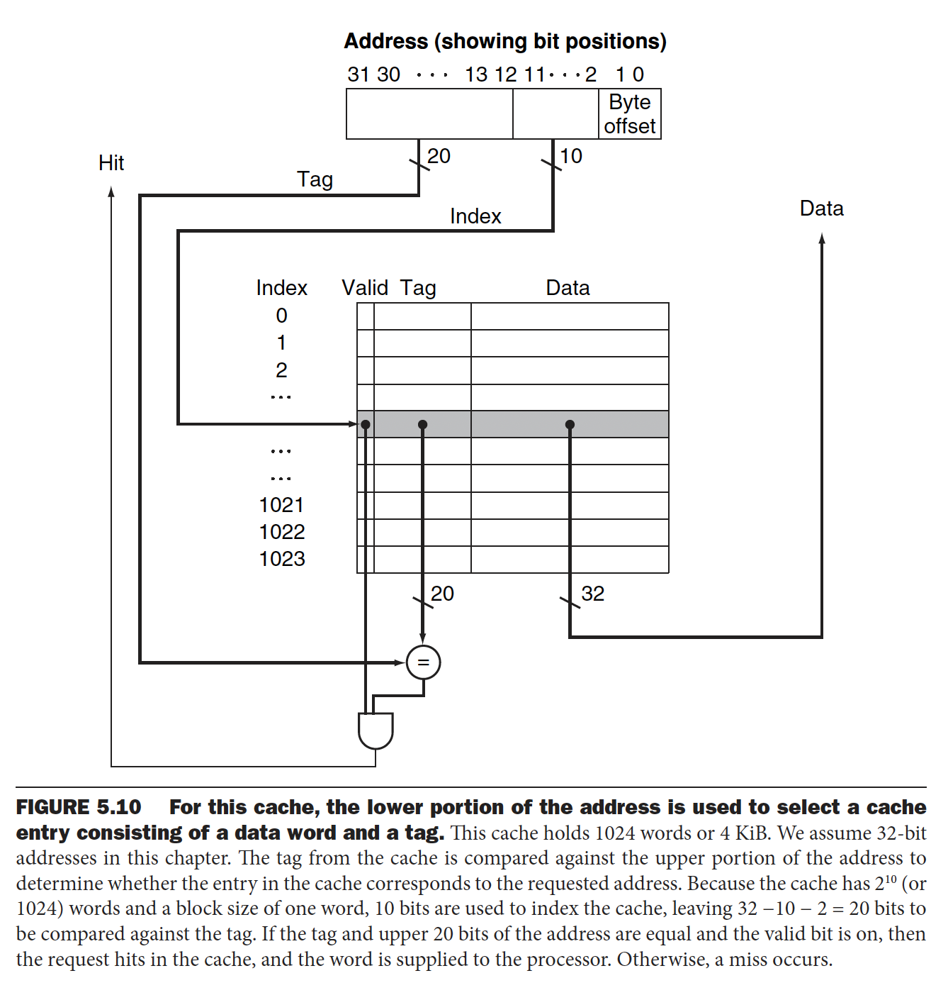

프로그램이 동작하는 방법에는 지역성의 원리(principle of locality)가 적용된다
- 시간적 지역성(temporal locality): 한번 참조된 항목은 곧바로 다시 참조되는 경향이 있다. 예를들어 대부분의 프로그램들이 순환문을 갖고 있고 순환문은 데이터를 반복적으로 접근하므로 상당히 큰 시간적 지역성을 보여준다.
- 공간적 지역성(spatial locality): 어떤 항목이 참조되면 그 근처에 있는 다른 항목들이 곧바로 참조될 가능성이 높다. 예를들어 배열에 요소를 순차적으로 접근할 때 자연스럽게 큰 공간적 지역성이 생긴다.

컴퓨터는 메모리를 계층구조로 구현함으로써 지역성의 원칙을 이용할 수 있다. 한 쌍의 메모리 계층에는 상위 계층과 하위 계층이 있다고 생각할 수 있고 **기본 데이터 단위는 블록 또는 라인이라고 불리고, 계층간에 무엇인가를 복사할 때는 대체로 블록 전체가 이동한다.** 프로세서가 요구한 데이터가 상위 계층의 어떤 블록에 있을 때 이를 hit(적중)이라고 부르고 메모리 계층의 성능의 평가하는 척도로 hit rate(적중률)을 계산하는데 이는 메모리 접근 중 상위 계층에서 찾으 수 있는 것의 비율로써 정의된다. 아래는 메모리 계층구조를 보여준다.

메모리 시스템을 구축하는데 사용된 개념은 운영체제가 메모리와 입출력을 어떻게 관리하는지, 컴파일러가 어떻게 코드를 생성하는지, 심지어 응용 프로그램이 어떻게 컴퓨터를 이용하는지 등 컴퓨터의 다른 분야까지 많은 영향을 미친다. 5.14절은 메모리 계층구조가 어떻게 행렬 곱셈의 성능을 2배로 향상시키는지 보여준다.

# 메모리 기술
메모리 계층구조에는 4가지 주요기술이 사용된다.
1. SRAM(static random access memory)
- 읽기나 쓰기를 제공할 수 있는 접근 포트가 일반적으로 하나 있는 메모리 배열로 구성된 단순한 집적회로이다.
- SRAM은 리프레시가 필요없어서 접근시간은 사이클 시간과 거의 같다. 사이클 시간은 메모리 접근 사이의 시간간격이다.
- **과거의 대부분의 PC와 서버 시스템은 1차, 2차, 심지어 3차 캐시에도 별도의 SRAM칩을 사용했다. 하지만 오늘날에는 Moore의 법칙 덕분에 모든 계층의 캐시가 프로세서 칩에 집적되어서 SRAM칩을 별개로 파는 시장은 거의 없어졌다.**
2. DRAM(dynamic random access memory)
- DRAM에서는 셀에 기억되는 값이 전하 형태로 커패시터에 저장된다. 저장된 값을 읽어나 새로운 값을 쓰기 위해서는 전하를 접근하는데 하나의 트랜지스터가 필요하다.
- DRAM은 저장된 비트 하나당 트랜지스터 하나만 있으면 되므로 SRAM에 비해 훨씬 더 집적도가 높고 값도 싸다(SRAM은 비트당 6~8개의 트랜지스터를 사용함)
- DRAM은 커페시터에 전하를 저장하기 때문에 무한히 유지할 수가 없어서 주기적으로 리프레시해야한다.
  - 성능 저하를 피하기 위해 메인 메모리의 대역폭을 증가시켜 캐시 블록을 더 효율적으로 전송하게 한다. DRAM 외부의 대역폭을 증가시키기 위한 일반적인 방법은 메모리 폭을 넓히는 것과 인터리빙을 사용하는 것이다. DRAM 개발자들은 버스트 전송 모드의 대역폭을 증가시켜 큰 캐시 블록의 비용을 감소시키기 위해 프로세서와 메모리 사이의 인터페이스를 꾸준히 향상시켰다.
  - SDRAM(Synchronous DRAM): DRAM에 클럭을 추가한 것으로 장점은 클럭을 사용하므로 메모리와 프로세서를 동기화하는 시간이 필요없다. SDRAM의 속도가 빠른 것은 주소를 여러번 지정하지 않아도 한꺼번에 여러 비트를 전송할 수 있는 능력이 있기 때문이다.
  - DDR(double data rate) SDRAM: 클럭의 상승 에지에서도 데이터가 전송되고 하강 에지에서도 데이터가 전송되어 대역폭이 2배가 된다는 뜻이다. 클럭 속도와 데이터 전송 폭으로부터 기대할 수 있는 대역폭이 2배가 된다는 뜻이다. 
    - 이 기술의 최신버전을 DDR4라고 한다. 
    - DDR4-3200 DRAM은 초당 32억 번의 전송이 가능한데 이것은 1.6GHz 클럭을 사용함을 의미한다.
3. 플래시 메모리
- 전기적으로 지울 수 있고 프로그래밍이 가능한 ROM(electrically erasable programmable read-only memory, EEPROM)의 한 종류이다.
- 디스크나 DRAM과는 달리 플래시 메모리의 쓰기는 비트를 마모시킨다.
4. 디스크 메모리

# 캐시의 기본
**앞에서 봤던 프로세서 데이터패스의 메모리들은 간단한 캐시로 대체할 수 있다.** 여기서는 프로세서가 한 순간에 필요로 하는 데이터는 한 워드이고 블록 또는 한 워드로 이루어진 아주 단순한 캐시를 먼저 살펴본다. 현대 컴퓨터의 캐시 예측 적중률은 대략 95% 정도라고 한다.
의문 1) 메모리의 데이터와 캐시와 어떻게 매핑시킬 수 있을까?
- 각 워드가 캐시내의 딱 한 장소에만 있을 수 있다면 워드가 캐시 내에 있는지 없는지 바로 알 수 있다. 워드의 메모리 주소를 이용하여 캐시 내의 위치를 할당할 수 있는데, 이러한 캐시 구조를 direct mapping(직접 사상)이라고 한다. 왜냐면 각 메모리 위치가 캐시 내의 딱 한 장소에 바로 사상되기 때문이다.
- 예를들어 메모리에 8블록이 있다고 가정하자. 그럼 하위 3비트(캐시 인덱스)만 가지고 캐시의 위치를 특정지을 수 있다.
의문 2) 프로세서가 원하는 데이터가 캐시에 있다는 걸 알 수는 있겠는데 그럼 특정 주소를 어떻게 찾을 수 있을까?
- 캐시에 태그를 추가한다. 태그는 캐시 내의 메모리 주소를 식별하는데 필요한 정보를 담고 있다. 태그는 캐시 인덱스로 사용하지 않은 나머지 상위 부분 비트로 구성된다.

의문 3) 캐시가 유효한 값인지 어떻게 확인할 수 있을까?
- 처음 컴퓨터를 켜서 프로세서가 작업을 시작할 때는 캐시가 비어있을 것이다. 즉, 태그 필드는 아무 의미가 없을 것이다. 캐시에 유효 비트(valid bit)를 추가해서 엔트리에 유효한 주소가 있는지를 표시한다. 1이면 의미있는 정보가 담긴 블록이고 0이면 의미없는 블록으로 간주한다.

아래처럼 32비트 주소를 사용할 때, 이 캐시는 1024개의 워드를 갖고 있기 때문에 주소 중에서 10비트가 캐시를 인덱스하는데 사용하고 블록의 크기는 1워드이다. 나머지 상위 20비트가 태그에 사용된다. 만약 주소 상위 20비트에 해당되는 태그가 있고, 유효 비트가 1일 때는 캐시가 적중되어 워드를 프로세서에 넘겨준다.

캐시 블록의 인덱스와 그 블록의 태그 값이 캐시 블록에 있는 워드의 메모리 주소를 표시한다. 캐시는 데이터뿐만 아니라 태그도 저장해야하므로 캐시 구현에 필요한 총 비트 수는 캐시 크기와 주소 크기에 따라 결정된다. 위 예시에서는 한 블록의 크기가 한 워드였지만 일반적으로는 여러 워드이다. 하지만 일반적으로 캐시 크기라고 말할 때는 유효 비트와 태그 필드의 크기는 제외하고 데이터 크기만 따진다. 위 이미지의 유효비트와 태그 데이터를 제외하고 4KiB 캐시라고 부른다. 하지만 이 캐시를 구현하기 위해서 필요한 메모리는 당연히 valid bit와 태그 사이즈만큼 더 필요하다.

공간적 지역성을 활용하기 위해서는 캐시가 한 워드보다 더 큰 크기의 블록을 사용해야한다. 큰 블록을 사용하면 실패율이 감소하며, 캐시의 데이터 저장량에 비해 상대적으로 태그 저장량이 줄어들기 때문에 캐시 하드웨어의 효율이 개선된다. 당연하겠지만 캐시 크기에 비해 블록 사이즈가 너무 커져버리면 캐시 실패율이 오히려 증가하게 된다. 캐시내 블록 개수가 적어서 블록에 대한 경쟁이 심해지기 때문이다(같은 캐시 인덱스에 다른 블록이 자리를 쉽게 차지할 수 있음) 결과적으로 블록 내의 워드를 별로 사용하지 못했는데 그 블록이 캐시에서 쪽겨나게 된다. 바꿔말하면 블록 크기가 매우 클 경우 블록 내 워드 간의 공간적 지역성이 감소하게 되어 실패율의 이득이 줄어든다고 말할 수 있다.

우리가 메모리에서 한 워드씩 가져온다. 즉 블록을 가져올 때 걸리는 시간을 굳이 두 부분으로 나누자면 첫번째 워드를 가져오는데 걸리는 시간과 나머지 부분을 가져오는데 걸리는 시간으로 나눌 수 있다. 어떻게 동작하는지 대략적으로 머릿속에 그림을 그릴 수 있어야한다. 그래서 실제로 큰 블록의 전송 시간을 좀 더 최적화하는 방법으로 early restart(조기 재시작) 방식이 있다. 블록 전체를 기다리지 않고 블록 내의 요청된 워드가 도달하면 곧바로 실행을 시작하는 것이다. 많은 시스템들이 명령어 접근에 이 기법을 이용하고 있고 효과가 매우 좋다. 

## 캐시 실패 처리
인터럽트가 발생했을 때는 모든 레지스터의 상태를 저장하는것과 달리 캐시 실패는 파이프라인 지연(stall)을 발생시킨다. 메모리가 데이터를 보내줄 때까지 프로세서를 지연시킨다. 실패 처리단계는 다음과 같다.
1. 원래의 PC값 또는 현재 PC - 4(멀티사이클 구현과 파이프라인 구현에서는 현재 PC - 4가 맞지만, 단일 사이클 구현에서는 현재 PC 값)을 메모리로 보낸다.
2. 메인 메모리에 읽기 동작을 지시하고 메모리가 접근을 끝낼 때까지 기다린다.
3. 캐시 엔트리에 쓴다. 이때 데이터 부분에 메모리에서 인출한 데이터를, 태그 필드에 주소의 상위 비트를, 유효 비트에는 1을 쓴다.
4. 명령어 수행을 첫 단계부터 다시 시작한다. 이때는 필요한 명령어를 캐시에서 찾을 수 있을 것이다.

## 쓰기 처리
데이터를 캐시에만 쓰고 메인 메모리에 쓰지 않으면 메인 메모리는 캐시와 다른 값을 가지게 될 때를 캐시와 메모리 불일치(inconsistent)라고 표현하는데 이를 해결할 수 있는 쉬운 방법은 항상 데이터를 메모리와 캐시에 같이 쓰는 것이다. 이를 즉시 쓰기(write-through)라고 부른다. 방식은 매번 메인 메모리에 데이터를 써야하므로 시간이 오래 걸린다. 최소한 프로세서의 100 클럭 사이클 정도가 필요한 경우가 많기 때문에 프로세서의 성능을 심하게 저하시킨다. 그래서 쓰기 버퍼(write buffer)를 두어 캐시와 쓰기 버퍼에 쓰고 바로 프로세서는 다음 수행을 할 수 있다. 다른 방식으로는 나중 쓰기(write-back) 방식으로 새로운 값은 캐시에만 작성하고 나중에 캐시 블록이 교체될 때만(캐시에서 쫓겨날 때) 이 블록을 하위 메모리계층에 쓰도록한다. 실제로 Intrinsity FastMATH라는 프로세서는 실제로 즉시 쓰기와 나중 쓰기 두가지 방식을 모두 지원하며 어떤 방식을 사용할지는 운영체제가 선택한다.

# 캐시 성능의 측정 및 향상
