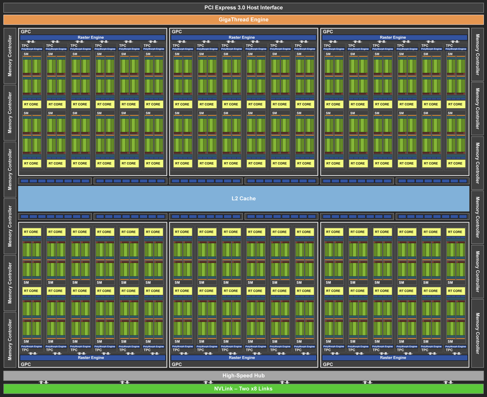
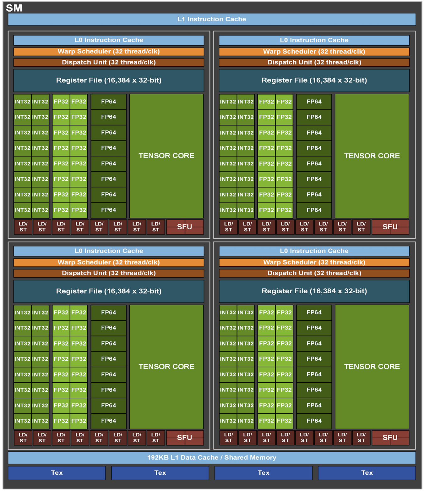
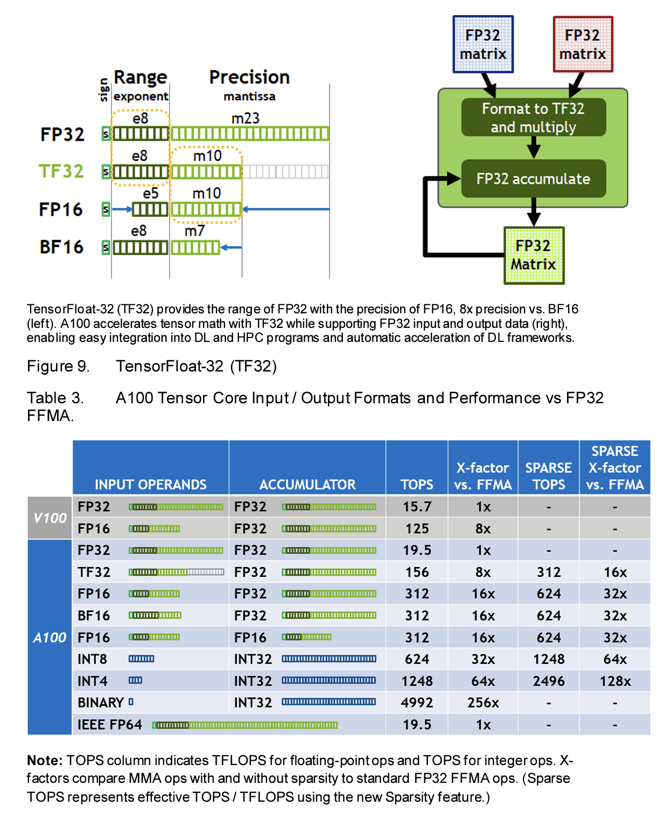

## 서론
하드웨어 병렬성을 이용하여 성능을 올리는 것이 클럭 주파수를 올리거나 CPI를 올리는 것보다 에너지 측면에서 더 유리하기 대문에 멀티프로세서는 다시 큰 주목을 받았고, 멀티프로세서 마이크로프로세서와 이름의 중복을 피하기 위해 멀티코어 마이크로프로세서 라고 부른다. 멀티코어 칩에서는 프로세서를 코어라고 부르며 멀티코어는 실제 주소공간을 공유하는 공유 메모리 프로세서(SMP: shared memory processor)이다.

순차적으로 작성된 프로그램을 어떻게 병렬 하드웨어에서 빠르게 실행할 수 있으냐가 병렬 혁명에서 해결해야할 유일한 문제라고 생각할 수도 있다. 하지만 프로세서 수가 증가함에 따라 병행 소프트웨어의 성능이 계속해서 좋아지게 하는 것도 쉽지 않으며, 이 또한 해결해야할 문제 중 하나이다.

## SISD, MIMD, SIMD, SPMD와 벡터
1960년대에 제안된 컴퓨터 구조의 분류방법이 있는데 이것은 지금도 여전히 사용되고 있다.

||단일 명령어 스트림(Single instruction stream)| 다중 명령어 스트림(Multiple instruction streams) |
|------|---|---|
|**단일 데이터 스트림(Single Data stream)**|SISD|MISD|
|**다중 데이터 스트림(Multiple Data stream)**|SIMD|MIMD|

SISD는 하나의 명령어로 하나의 데이터를 처리하는 프로세서를 의미하며 폰 노이만 구조의 컴퓨터는 기본적으로 이 기법을 따른다. 이러한 시스템에서는 명령어가 순서대로 실행되지만 실행과정은 파이프라이닝 되어있는 것이 일반적이다. 앞에서 본 MIPS 아키텍처를 보자. MIPS가 파이프라인 구조를 사용한다고 해서 여러 명령어를 동시에 실행하는 것이 아니라, 여러 단계에 걸쳐 각 명령어를 순차적으로 실행한다. 따라서 이는 여전히 SISD 구조에 해당되며 파이프라인을 통해 명령어 실행의 효율성을 높이고 클럭 주파수를 증가시킬 수 있지만, 기본적으로는 여전히 하나의 명령어와 하나의 데이터 스트림이 동시에 처리된다. MIPS 프로세서는 SISD 구조를 따르는 전형적인 RISC 아키텍처이다.

MIMD는 여러 명령어로 여러 데이터를 처리하는 프로세서로 여러 데이터를 서로 다른 인스트럭션으로 한꺼번에 처리하게 된다. 현대의 SMT(동시 멀티스레딩, simultaneous multithreading)이 적용된 프로그램들은 모두 MIMD의 프로그래밍 모델이다. MIMD 컴퓨터에서는 보통은 하나의 프로그램을 모든 프로세서가 수행하도록 하되, 조건문을 사용하여 각 프로세서가 코드의 서로 다른 부분을 수행하도록 하는 방법을 사용한다. 이런 프로그램을 SPMD(Single Program Multiple Data)라고 하며 더 나아가 MPMD(Multiple Program Multiple Data) 방식도 존재한다. 이런 방식들 모두 MIMD 컴퓨터를 프로그래밍하는 방법일 뿐이다.

프로그래머의 관점에서 특별히 MIMD와 관련이 깊은 개념으로 하드웨어 멀티스레딩이 있다. MIMD도 여러 프로세서들을 바쁘게 만들기 위해 여러개의 프로세스 또는 스레드를 사용하는 반면에, **하드웨어 멀티스레딩**은 단일 프로세서 내에서 여러 스레드가 실행되도록하여 하드웨어 자원의 효율성을 높여준다. 하드웨어 멀티스레딩은 프로세스 내의 한 스레드가 실행할 수 없게 되면 다른 스레드로 전환하도록 하여 프로세서의 이용률을 높이는 기능이다. 이를 위해 프로세서는 각 스레드의 독립적인 상태를 복사해야하며 모든 스레드는 레지스터 파일과 프로그램 카운터의 복사본을 따로 가지고 있다. 하드웨어 멀티스레딩은 작게는 해당 사이클에 지연상태에 있는 스레드를 건너뛰면서 라운드 로빈 방식으로 인터리빙하는 것이 일반적이다. 크게는 마지막 단계 캐시 실패와 같이 긴 지연이 생길 때만 스레드 전환을 수행할 수도 있다. SMT(Simultaneous Multi-Threading)는 하드웨어 멀티스레딩의 변형으로, 여러 스레드를 한꺼번에 동시에 명령어들을 실행하거나 작업들을 수행할 수 있다는 차이점이 있다. 이러한 멀티스레딩 기능을 실현하기 위해 CPU 설계 단계에서 하드웨어적으로 여러 스레드가 동시에 실행될 수 있는 구조를 갖추어야 하는데 이를 위해 추가적인 레지스터, 명령어 파이프라인 등이 필요하며, 이러한 설계가 하드웨어에 포함되어 있다. 소프트웨어 측면에서는 운영 체제나 애플리케이션이 이러한 멀티스레딩 기능을 인식하고 최적화할 수 있도록 설계되어야 하지만, SMT 자체는 기본적으로 하드웨어에 구현된 기술이다. 2000년대에 들어서 하나의 CPU에 하나의 코어를 넘어서 하나의 CPU에 여러개의 코어가 탑재된 멀티코어 프로세서가 등장하였다. 운영체제에서 자세히보고 여기선 빨리 넘어가자.

SIMD 하나의 명령어로 여러개의 데이터를 처리하는 프로세서를 의미한다. 물론 하드웨어 차원에서 SIMD 명령어 세트를 제공하고 CPU에서 명령을 처리하기 위한 레지스터도 SIMD용 레지스터가 따로 존재하며 EAX, EBX, ECX, EDX와 같은 SISD용 일반 범용 레지스터와 다르게 용량이 더 크다. 현재 대부분의 프로그램은 SISD 방식으로 동작하는데, 즉 하나의 명령으로 하나의 데이터를 처리하고 두개의 데이터를 처리하려면 두번의 연산이 필요하다. 하지만 요즘 컴파일러는 일괄계산 루프문 정도는 SIMD로 잘 바꿔주는 편이다. SIMD 컴퓨터는 벡터 데이터에 대한 연산에 유용하게 사용되는데 예를들어 SIMD 명령어 하나는 64개의 데이터 스트림을 64개의 ALU로 보내서 한 클럭 사이클에 64개의 합을 계산할 수 있도록한다. SISD의 장점은 병렬 실행 유닛들이 모두 동기화되어 있어서 한 프로그램 카운터로 인출한 명령어 하나를 동시에 수행한다는 것이다. 프로그래머의 관점에서 보면 SISD와 비슷하게 동작한다. 모든 유닛들이 동일한 명령어를 수행하는 것 같은데, 실행 유닛마다 별도의 주소 레지스터를 가지고 있어서 다른 데이터 주소를 사용하고 있다는 점이 다르다. 순차적인 프로그램을 직렬 하드웨어인 SISD에서 실행되도록 컴파일할 수도 있고 병렬 하드웨어인 SIM에서 실행되도록 컴파일 할 수도 있다. **GPU 영역에서는 SIMD가 당연시되고 있었다. 애초에 코어가 몇천개씩 달려있는 다중 프로세서환경이라 처음부터 SIMD 형식으로 하드웨어를 만들었다.**

더 오래되었지만 더 우아한 SIMD로 벡터 구조가 있다. 이 구조는 데이터 수준 병렬성을 많이 갖고 있는 문제에 알맞은 구조를 가지고 있다. SIMD 프로세서가 64개의 ALU로 동시에 64개의 덧셈을 수행했던 것과 달리 벡터구조는 ALU 파이프라인으로 구성하여 낮은 비용으로 좋은 성능을 얻는다. 벡터 구조의 기본원리는 메모리에서 데이터를 꺼내서 큰 레지스터 집합에 넣고, 레지스터에 있는 데이터에 대해 파이프라인으로 순차적으로 연산하고, 그 결과를 다시 메모리에 저장한다. 이 때 핵심은 벡터 레지스터 집합을 사용하여 동적 명령어의 대역폭을 획기적으로 줄였다는 것이다. 책의 예시를 보면 MIPS에서 거의 600개에 달하던 명령어를 6개로 크게 줄였다.

## 그래픽 처리 유닛의 기초
SISD구조에 SIMD 명령어를 추가해아한다고 생각하게 된 이유 중 하나는 PC와 워크스테이션에 있는 많은 마이크로프로세서들이 그래픽 디스플레이와 연결되어 있어서 그래픽을 처리하는 시간의 비중이 점점 늘어난다는 것이었다. 그래픽 처리 성능을 끌어올리는 주 동력은 컴퓨터 게임 산업이었다. 빠르게 성장하는 게임 시장은 많은 회사들로부터 더 빠른 그래픽 하드웨어 개발에 더 많은 투자를 하도록 하였다. 이런 구조는 마이크로프로세서의 범용 처리 성능보다 더 빠른 속도로 그래픽 처리 성능이 개선되도록 했다. 그래픽 프로세서가 점점 더 큰 세력을 얻게 되면서 CPU와 구별하기 위해 그래픽 처리 유닛(GPU)라는 이름을 사용하게 되었다.

GPU는 CPU와 다른 스타일의 구조를 가지게 되었다.
1. GPU의 경우 메모리의 큰 지연시간을 극복하기 위해 CPU처럼 다단계 캐시를 사용하지 않고, 하드웨어 멀티스레딩으로 메모리 지연을 감추고 있다. CPU는 높은 성능을 위해 각 코어마다 L1, L2, L3 캐시를 사용하고 있고 메모리 접근이 지연될 때 캐시에서 데이터를 빠르게 가져오기 위해 사용되고 있다. CPU는 상대적으로 적은 수의 스레드를 실행하기 때문에 메모리 지연시간을 줄이기 위해 캐시 계층이 매우 중요하다. 반면에 GPU는 수천개의 스레드를 동시에 실행하도록 설계되었고, 다단계 캐시를 사용하는 반면에 특정 스레드가 메모리 접근으로 지연될 때 다른 스레드가 계산을 계속 하도록 한다. 물론 GPU에도 캐시가 있긴 하지만 다단계 캐시 구조는 아니고 매우 작은 용량으로 특정 작업을 가속화하는 용도로 사용된다. GPU는 다단계 캐시보다는 대량의 스레드와 병렬처리를 통해 메모리 지연을 극복하는 방식으로 사용한다.
2. GPU의 메인 메모리는 지연시간보다는 처리율을 높이는데 초점을 맞춘다. CPU를 위한 DRAM칩 보다 폭이 더 넓고, 처리량이 큰 DRAM 칩을 GPU 전용으로 둔다. GPU 메모리는 통상 CPU의 메인 메모리보다 더 작다. 하지만 최근에 출시되는 데이터 센터용 GPU를 보면 배치가 클수록 학습이 더 효율적이므로 A100 같은 경우 40 GB에서 80GB까지 제공하고 있다.

### Nvidia GPU 구조의 기초
[GPU는 어떻게 작동할까](https://www.youtube.com/watch?v=ZdITviTD3VM) 영상을 참고했다.
모니터에서 보여지는 이미지를 한번 생각해보자. 많이 사용하고 있는 HD 해상도의 크기는 1920 * 1080개의 픽셀로 이루어져있다. 가로와 세로의 픽셀 수를 곱하면 약 200만개의 픽셀이 모니터에 표현되고 있다. 동영상의 경우는 1초에 30장의 이미지를 사용하는데, 이 때 한장의 이미지를 프레임이라고 하고 1초에 사용해야하는 프레임의 픽셀수는 200백만 * 30으로 약 6천만개가 되고 게임의 경우는 1초에 60프레임을 계산해주는 경우도 많으니 계산량이 더 늘어난다. 심지어 요즘 나오는 게임은 3차원 모델로 만들어진다. 3D 그래픽의 각 정점은 위치를 표현하는 x, y, z 축에 대한 좌표를 가지고 있고, 이 외에도 정정의 방향을 알려주는 노말 정보, 그리고 각 정점의 색상정보도 추가된다. 이 정점 데이터를 GPU에 입력하면 입력 받은 정보에 대해 연산을 수행하게된다. 정점 데이터가 입력되면 삼각형 생성, 프레그먼트로 변환, 픽셀로 변환, 이미지로 변환하는 다양한 과정을 거치게 되어 모니터에 뿌려줄 픽셀 값을 출력하게 된다. 그리고 3차원 모델은 크기도 변하고, 회전도 하고, 움직이게 되는데 이 모든 것들이 행렬의 곱셈 형태로 실시간으로 계산되어 모니터에 뿌려주는 픽셀을 만드는데 GPU가 사용된다.

예를들어 HLSL((High-Level Shader Language) 프로그래밍 언어로 작성된 하나의 프레그먼트를 처리해주는 로직이 있다고 했을 때, 먼저 이를 GPU가 이해할 수 있는 기계어로 컴파일해준다. 그리고 하나의 프레그먼트 처리 로직은 하나의 코어 안에 있는 ALU에서 처리된다. 두개의 코어를 사용하면 두개의 프레그먼트가 동시에 처리된다. 그렇게 코어의 개수를 늘리면 더 많은 프래그먼트를 한번에 계산할 수 있다. 또한 하나의 코어 안에 들어있는 ALU의 개수를 예를들어 8개로 늘리면 한번의 명령어로 8개의 프래먼트를 한번에 계산할 수 있다. 이처럼 하나의 명령어로 여러개의 데이터를 얻어내는 방식을 SIMD라고 한다. 픽셀을 만들기 위한 모든 정보들이 SIMD 방식으로 연산된다.

그래픽의 정점은 각 픽셀마다 독립적으로 계산된다. 한 픽셀이 계산되기 기다렸다가 다음 픽셀이 계산될 필요가 없다. GPU는 그래픽 처리를 목적으로 만들어졌기 때문에 데이터의 형식을 그래픽이 처리되는 형태로 바꿔줘야하는 번거로움이 있었다. 많은 데이터를 행렬의 곱셈 형태로 처리하는 것은 일반적인 계산에는 적합하지 않을 때가 많았다. 그래서 CUDA와 OpenCL과 같은 프로그래밍 모델을 사용하면 GPU의 강력한 병렬 처리 능력을 활용하여 픽셀 데이터뿐만 아니라 다양한 다른 목적의 데이터를 처리하고 변환할 수 있었는데, 시뮬레이션, 분자 동역학, 데이터 분석, ML 등에도 사용할 수 있게 되었다.

GPU가 처리해야할 100만개의 작업이 있다고 하자. 그리고 코어가 처리해야할 하나의 작업을 스레드라고하면 서로 독립적인 100만개의 스레드를 처리할 가장 이상적인 방법은 100만개의 코어에 각각 하나씩 할당하는 SIMD 방법이다. 하지만 GPU가 처리해야할 스레드는 너무 많고 이는 현실적으로 불가능하다. GPU에 들어있는 코어의 수는 몇천개에서 몇만개 정도에 불과하다. 그래서 GPU는 SIMT라는 방식으로 작업을 처리한다. 이것은 스레드 중심의 처리방식이다. 예를들어 100만개의 스레드를 1000개의 코어에서 처리한다고 가정하면 100만개의 스레드를 각각 1000개의 코어중 어디론가 보내야한다. 분해하는 과정이 좀 복잡하게 느껴진다. 이때 코어를 100개씩 묶어주면 100만개의 스레드를 10개의 코어그룹(SM, Streaming Processor) 어딘가로 보내면 되니까 분배가 좀 더 쉬워진다. 그리고 이번에는 스레드를 1000개씩 묶어서 1000개의 스레드 그룹으로 만들어주면 1000개의 스레드 그룹을 10개의 코어그룹 중 어디론가 보내면 되니까 분배가 좀 더 쉬워진다. 한 스레드 묶음이 한 코어 묶음에 도달했을 때 1000개의 스레드를 100개의 코어로 한번에 처리할 수가 없다. 그래서 이 스레드를 100개를 한 묶음으로 한번 더 묶어주는데 이때 이 하나의 그룹을 warp(워프)라고한다. 하나의 워프 안에는 100개의 스레드가 들어있기 때문에 하나의 스레드가 각각 하나의 코어에 할당되어 연산을 수행할 수 있다. 그래서 하나의 워프 안에 들어있는 스레드들은 마치 하나의 연산 작업을 처리한다. A, B 행렬을 더해 C라는 행렬을 구한다고 했을 때, 각 row의 덧셈 과정이 한 스레드에서 처리되고, 전체 행렬 덧셈이 하나의 워프 내에서 수행된다. C의 각 요소가 하나의 스레드에서 처리된다. 곱셈, 컨볼루션 연산 모두 마찬가지다. 다시 SIMT의 개념으로 돌아오면 하나의 명령어로 여러 스레드에 동시에 적용하면서도, 스레드가 서로 다른 명령어 경로를 따를 수 있는 유연성을 제공한다. 예를들어 하나의 워프가 두가지 분기 경로를 가지면 GPU는 각 분기 경로를 별도로 실행하고, 결과를 통합할 수 있다. 근데 일반적으로 하나의 워프는 동일한 명령어를 실행한다.

**연산자와 피연산자의 입장에서 한번 요약해보자. 모든 숫자는 예시이다. 연산자인 GPU는 64개의 SM으로 이루어져있고, 한 SM에 들어있는 코어의 수는 128개이다. 그리고 하나의 코어는 멀티스레딩을 지원하여 하나의 코어에서 처리할 수 있는 스레드 개수가 16개이다. 즉 하나의 SM에서 처리할 수 있는 스레드의 개수는 2048개이다. 피연산자의 입장에서 생각해보자. 큰 행렬 연산을 한다고 할 때 32개의 워프로 나뉘고 각 워프는 32개의 스레드로 이루어져있다.** 실제로 RTX 3090 GPU에는 10000개가 넘는 코어가 들어있다. 코어는 128개씩 그룹으로 묶여있다. 128개의 스레드가 들어있는 워프들이 코어 그룹 안에서 연산된다. 워프 안에는 128개의 스레드가 들어있고 코어 그룹 안에는 128개의 코어가 들어있기 때문에 하나의 스레드가 하나의 코어에 할당되어 연산이 수행된다. 코어가 연산하다가 메모리로부터 데이터를 읽어오면서 잠시 대기하는 시간이 생기는데, cpu 경우에는 지연시간을 줄이기 위해 코어 근처에 캐시 메모리를 만드는 방법을 사용하지만, gpu의 경우에는 코어 그룹에서 하나의 워프를 수행하다가 지연시간이 발생하면 바로 다음 워프를 수행하게 된다. 바로 다음 워프를 수행하면서 지연시간이 발생하지 않고 연산이 일어나게 된다. 지연시간을 없게하려면 그만큼 스레드가 많이 있어야 효율이 좋다. 이와 같은 방식으로 gpu는 대량 데이터를 처리하는데 있어 효율이 좋다.

다시 책으로 돌아와 Fermi 구조를 예로 들어보자. 대부분의 벡터 프로세서와 달리 GPU는 한 멀티스레드 SIMD 프로세서 내의 하드웨어 멀티스레딩을 사용하여 메모리 지연을 감춘다. 깊게 파이프라이닝 되어있는 기능 유닛 몇개를 가지고 있는 벡터 프로세서와 달리 GPU는 많은 수의 병렬 기능 유닛을 가지고 있다. GPU는 멀티스레드 SIMD 프로세서들을 가지고 있다. 즉, GPU는 멀티스레드 SIMD들로 구성된 MIMD이다. Fermi 구조의 GPU를 가격대별로 각각 7, 11, 14, 15개의 멀티스레드로 구성된 멀티스레드 SIMD를 갖도록 구현하고 있다. 하드웨어가 생성하고 관리하며 스케줄링하고 실행하는 객체는 SIMD 명령어들의 스레드이다. 이를 SIMD 스레드라고 한다. 이 SIMD 스레드들은 독자적인 프로그램 카운터를 가지고 있으며, 멀티스레드 SIMD 프로세서에서 수행된다. SIMD 스레드 스케줄러는 어떤 SIMD 스레드가 수행할 준비가 되어있는지를 알려주는 제어기를 포함하고 있으며 수행할 SIMD 스레드를 디스패치 유닛에 전달하여 멀티스레드 SIMD 프로세서에서 수행되도록 한다. 책에서는 한 코어 내부 구조를 설명하고 있다.

### Nvidia GPU 제품별 분류
- GeForce(게이밍 제품군)
  - 예시
    - GeForce GTX 1080
    - GeForce GTX 1660 Ti
    - GeForce RTX 3070
    - GeForce RTX 3080
    - GeForce GTX 1050
- GeForce Laptop(게이밍 노트북용 제품군)
- NVIDIA RTX(워크스테이션 제품군)
  - 예시
    - NVIDIA RTX A4000
    - NVIDIA RTX A5000
    - NVIDIA RTX 6000 Ada Generation
    - NVIDIA RTX 8000
- NVIDIA NVS(멀티모니터 출력 제품군)
- 데이터 센터 GPU
  - 예시
    - NVIDIA A100
    - NVIDIA H100
    - NVIDIA Tesla V100
    - NVIDIA Tesla P100
    - NVIDIA A40
- NVIDIA TITAN(게이밍 및 워크스테이션 겸용 제품군)
- GRID(가상화 제품군)
- Mining 제품군

GeForce RTX와 NVIDIA RTX는 서로 다른 시장과 용도를 목표로한다. GeForce RTX는 주로 게이밍 또는 일반 소비자 용이고 NVIDIA RTX는 워크스테이션 또는 전문가 용으로 출시되고 있다. 그리고 GeForce RTX는 원래 게이밍용으로 설계되었지만, AI 작업에도 충분한 성능을 보이고 있다. 다만, NVIDIA RTX와 같은 워크스테이션 GPU는 더 높은 안정성, 더 큰 메모리, 그리고 전문 소프트웨어 최적화를 제공하기 때문에 대규모 AI 작업이나 산업용 애플리케이션에서는 선호된다.

### Nvidia GPU 아키텍처의 히스토리
[NVIDIA GPU 아키텍처 문서](https://www.nvidia.com/ko-kr/technologies/)

그리고 각 GPU 아키텍처를 설명한 백서를 볼 수 있는데 GPU 아키텍처를 이해하는데 많은 도움이 된다. 예를들어 A100의 경우에 NVIDIA A100 Tensor Core GPU Architecture 라고 검색하고 읽어보자.

- Tesla
- Fermi
- Kepler
  - 놀랍게도 Kepler 아키텍처의 NVIDIA K80 GPU는 2024년 4월까지 GCP VM에서 제공되다가 2024년 5월 1일에 지원이 종료되었다.
- Maxwell
- Pascal

- Volta
  - 2017년에 출시
  - 640개 텐서코어로 텐서 계산에서 초당 125 테라플롭스 이상의 성능
  - 210억개 이상의 트랜지스터 장착
  - 예시: V100
    - 16GB, 32GB 구성으로 제공
    - 세계 최초로 100TFLOPS 장벽을 뛰어넘은 GPU
    - NVLINK는 최대 300GB/s로 여러 V100 GPU를 연결함
    - 최대 파워가 300W 라고 함. W는 1초동안 1J의 일을 하는 일률의 단위로, 전력의 기본 단위이다. 즉 300W는 1초 동안 300J의 에너지를 필요로 하며 Wh(와트시)는 1시간 동안 1와트로 일한 일의 양을 뜻하며, 1시간 동안 V100으로 학습시켰을 때 0.3kWh가 되고 비용은 대략 31원 정도된다. 하루동안 학습시키면 744원이다.

- Turing
  - 2018년에 출시 (Turing 설립년도와 Turing 아키텍처 출시년도랑 똑같음 ㅎㅎ)
  - Ray Tracing을 위한 RT 코어가 최초로 탑재됨
  - 예시(GeForce RTX 2080 Ti)
    - 최대 14.2 TFLOps fp32 성능
    - 최대 28.5 TFLOps fp16 성능
    - 113.8 Tensor TFLops
  - 예시(Quadro RTX 6000)
    - 최대 16.3 TFLOps fp32 성능
    - 최대 32.6 TFLOps fp16 성능
    - 130.5 Tensor TFLops
  - 그리고 참고로 같은 아키텍처를 사용하면서 다양한 GPU모델을 포함할 수 있는데 예를들어 TU104와 TU102는 Turing 아키텍처는 공유하되, 서로 다른 성능과 기능을 가진다.
    - 예시(TU102)
      
      - 4608 CUDA코어, 72개의 RT코어, 576개의 Tensor코어, 288 텍스처 유닛, 12개의 32비트 GDDR6 메모리 컨트롤러(총 384비트)
      - 6개의 GPCs(Graphics Processing Clusters)
      - 36개의 TPCs(Texture Processing Clusters)
      - 72개의 SM(Streaming Processor)
      - 각 GPC는 전용 레스터 엔진과 6개의 TPC를 포함하며, 각 TPC는 2개의 SM을 포함한다
      - 각 SM은 64개의 CUDA 코어, 8개의 Tensor 코어, 1개의 RT 코어, 256KB의 레지스터 파일, 4개의 텍스처 유닛, 96KB의 L1/Shared 메모리가 존재

- Ampere
  - 2020년에 출시
  - 새로운 정밀도인 Tensor Float 32(TF32) 및 부동 소수점 정밀도 64(FP64)를 도입
  - Tensor 코어에서 bfloat16, int8, int4의 지원으로 AI 학습 및 추론에 최적화가 가능해짐
  - MIG(Multi-Instance GPU)는 A100, A30 GPU에서 지원되는 기능으로 워크로드가 GPU를 공유할 수 있도록 함.
  - 3세대 NVIDIA NVLink 지원(600GB/s)
  - 2세대 RT 코어 지원
  - 초당 2TB/s의 메모리 대역폭을 제공
  - 40MB L2 캐시를 포함하여 이전 세대에 비해 7배 더많은 온 칩 메모리를 보유
  - GPU 모델이 GA100, GA102, GA103, GA104, GA106, GA107 등 다양하고 이들 모두 Ampere 아키텍처로 구성되어있으며 각각마다 공정단위, 면적, GPC, TPC, SM 등의 개수가 모두 다르다.
  - 예시(GA100 GPU)
    
    - 8GPC, GPC당 8개의 TPC, TPC당 2개의 SM, 전체 GPU당 128개의 SM
    - SM당 62개의 FP32 CUDA 코어, 전체 GPU당 8192 FP32 CUDA 코어
    - SM당 4개의 3세대 텐서코어, 전체 GPU당 512개의 3세대 텐서 코어
    - 6개의 HBM2 스택, 12개의 512-bit 메모리 컨트롤러
    - GA100의 SM 구조는 다음과 같다.
      
  - 다양한 연산 지원
    

- Hopper
  - 2022년 출시

- Ada Lovelace
  - 2022년 출시
  - 데이터 센터 GPU(ex. L40 GPU)
  - Workstation GPU(ex. RTX 6000)
  - 3세대 RT 코어
  - 4세대 Tensor 코어
  - 예시: RTX 6000 Ada
    - 참고로 RTX 6000, A6000, 6000 Ada 모두 다르다. ([출처](https://discuss.pytorch.kr/t/gn-cloud-gpu-ai-gpu/2331#rtx-6000-a6000-6000-ada-4)) 
      - RTX 6000 (Turing 아키텍처, Quadro RTX 6000, 24 GB VRAM, 2018/08/13 출시)
      - RTX A6000 (Ampere 아키텍처, 48 GB VRAM, 2020/10/05 출시)
      - RTX 6000 Ada (Ada Lovelace 아키텍처, 48 GB VRAM, 2022/12/03 출시) 
- Blackwell
  - 2024년 출시
  - 2080억 개의 트랜지스터 탑재
  - TSMC의 4나노 프로세스를 사용하여 제조됨
  - 10TB/s의 칩간 상호 연결
  - fp8, fp16 정밀도로 학습을 가속화하는 Transformer 엔진 기술 지원. 추가로 Blackwell Transformer 엔진은 마이크로 텐서 스케일링이라는 세분화된 스케일링 기술을 활용하여 성능과 정확도를 최적화 함으로써 fp4 AI를 구현함.
  - 생성형 AI 엔진을 도입하여, Nvidia TensorRT-LLM 및 NeMo 프레임워크 혁신과 결합된 맞춤형 Blackwell Tensor 코어 기술을 사용하여 LLM 및 MoE 모델의 추론 및 학습을 가속화
  - 5세대 Nvidia LVLink는 576개의 GPU를 연결함

(참고) 우리나라 전기요금
| 사용량 구간         | 기본 요금 (원/호) | 전력량 요금 (원/kWh) |
|-------------------|------------------|---------------------|
| 300kWh 이하 사용  | 730              | 105                 |
| 301~450kWh 사용   | 1,260            | 174                 |
| 450kWh 초과 사용  | 6,060            | 242.3    