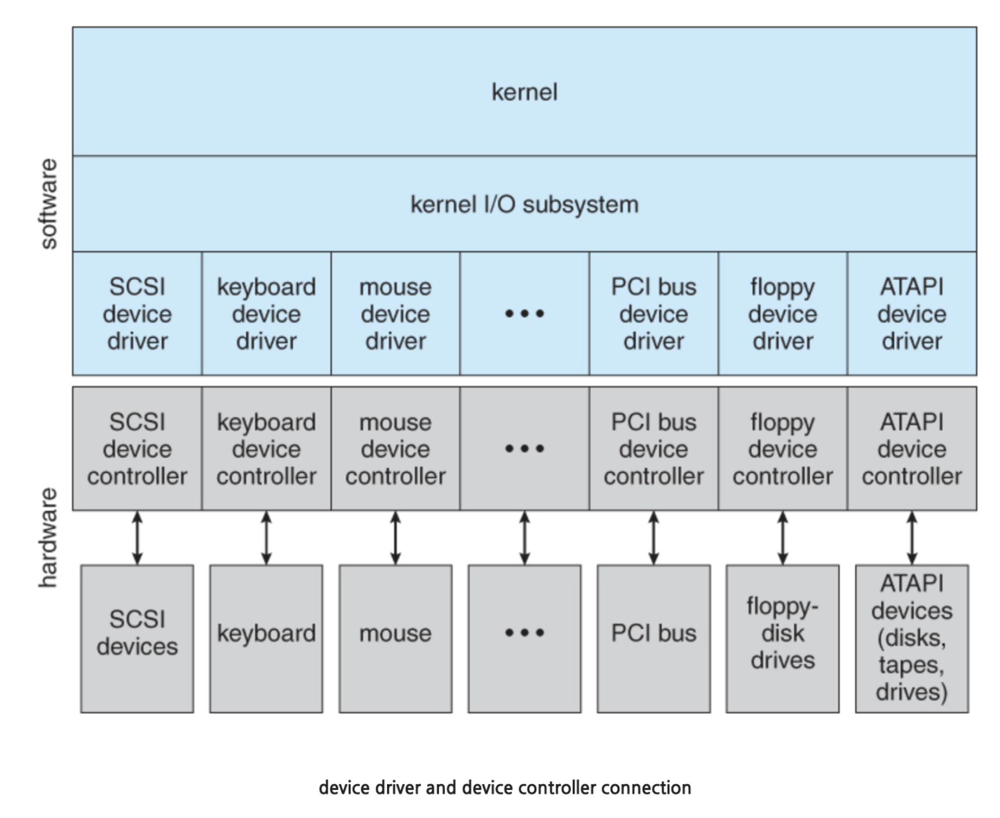
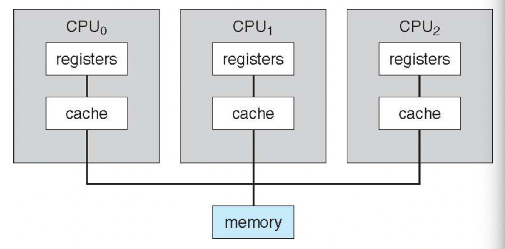
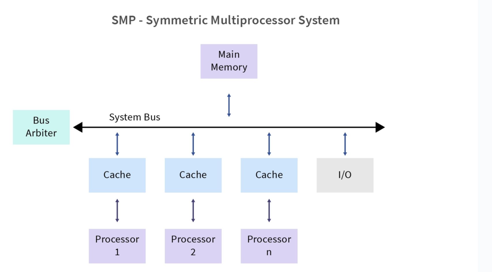
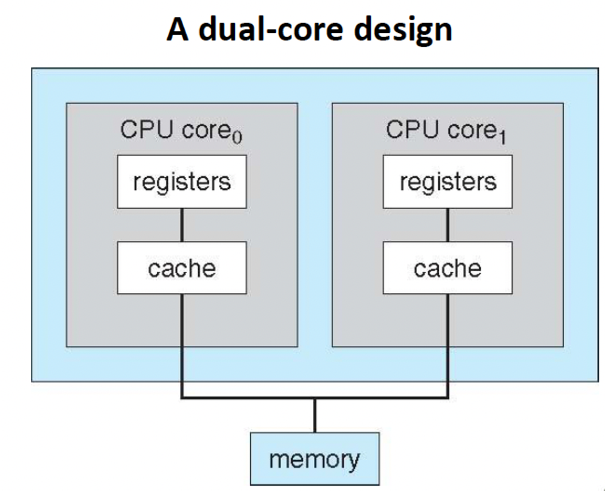
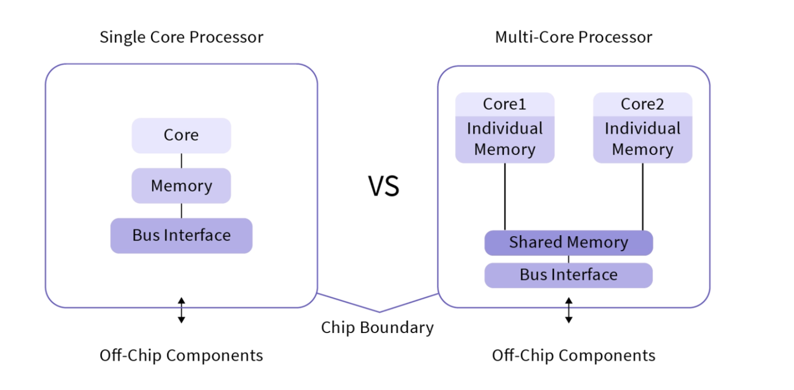
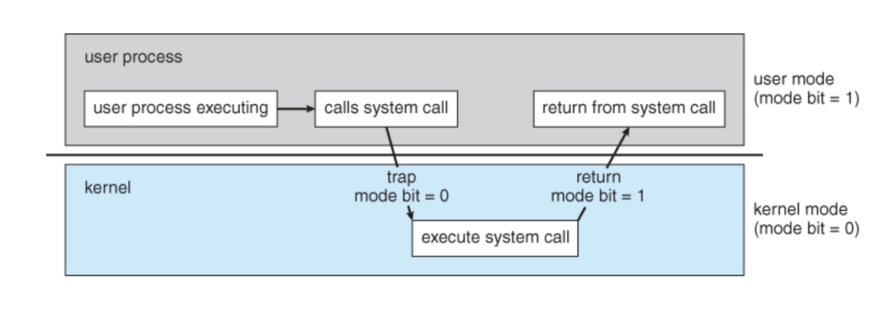
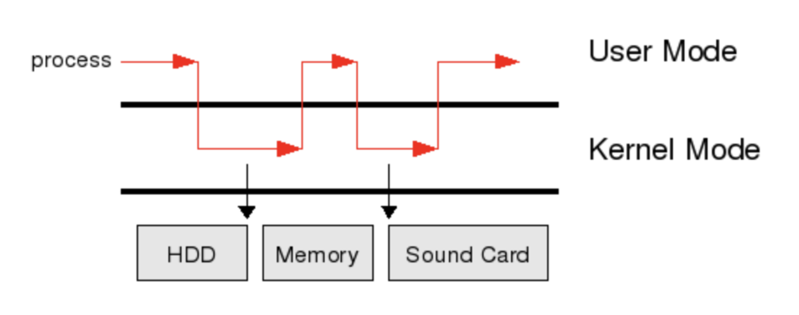

# 목차
1. [운영체제가 할 일](#운영체제가-할-일)
2. [컴퓨터 시스템의 구성](#컴퓨터-시스템의-구성)
3. [컴퓨터 시스템 구조](#컴퓨터-시스템-구조)
3. [운영체제의 작동](#운영체제의-작동)
3. [자원 관리](#자원-관리)

# 운영체제가 할 일
운영체제는 컴퓨터에서 항상 실행되는 프로그램(일반적으로 커널이라고 한다)이다. 운영체제는 항상 실행 중인 ***커널***과 ***미들웨어 프레임워크***(응용 프로그램 개발을 쉽게할 수 있도록 도와주고 기능을 제공함)와 ***시스템 프로그램*** 이 포함된다.

# 컴퓨터 시스템의 구성
컴퓨터 하드웨어(cpu, 메모리, 입출력 장치 등) → 운영체제 → 응용 프로그램(컴파일러, 웹 브라우저 등) → 사용자

현대의 범용 컴퓨터 시스템은 하나 이상의 **cpu**와 구성요소와 공유 **메모리** 사이의 액세스를 제공하는 공통 **버스**를 (ex. PCI 버스) 통해 연결된 여러 **장치 컨트롤러**(device controller)로 구성된다. 각 장치 컨트롤러는 **특정 유형의 장치**(device, 입력 장치, 출력 장치, 저장 장치 등 존재 ex. 프린터, 마우스, 키보드, USB, 디스크 드라이브, 오디오 장치, 그래픽 디스플레이 등)의 제어를 담당하며 하드웨어이다. 디바이스의 작은 cpu 기능을 하는 하드웨어라고 생각할 수 있다. 각 디바이스는 일반적으로 각각을 작은 컴퓨터라고 생각할 수 있는데 컨트롤러, 레지스터, 그리고 데이터를 저장할 수 있는 로컬 버퍼 저장소로 구성되어있다. 각 장치 컨트롤러는 장치와 로컬 버퍼 저장소 간에 데이터를 이동하는 역할을 한다. 그리고 I/O가 끝났을 경우로 cpu에게 인터럽트를 보내기도 하는데 DMA 디바이스 컨트롤러가 따로 있다면 DMA 다비이스 컨트롤러가 cpu에게 인터럽트를 보낸다. 

그리고 각 장치 컨트롤러 마다 **장치 드라이버**(컴퓨터에서 하드웨어 장치를 운영체제에 연결하기 위해 필요한 소프트웨어이며 하드웨어의 기능을 추상화한다)가 존재하며, 이 드라이버는 운영체제에 각 장치에 대한 일관된 인터페이스를 제공한다. 장치 드라이버만이 자신에게 지정된 특정 장치의 특성을 알고있다. 드라이버는 하드웨어에 의존하여 특정 운영체제를 따른다. 드라이버는 각 장치마다 운영체제와 호환되게 하기 위한 소프트웨어이고 (장치와 운영체제가 소통하기 위함) 이 코드를 디바이스 컨트롤러 하드웨어가 인식하는 것이다.

_https://melonicedlatte.com/computerarchitecture/2020/01/01/234600.html_

예를 하나 들어보자. 우리가 마우스를 컴퓨터에 연결할 때 usb를 포트를 이용하여 연결한다. 이 포트는 장치 컨트롤러와 연결이 되어있다. 그리고 어떤 장치를 연결하면 드라이버를 함께 설치해주게 되는데 장치 컨트롤러는 이 드라이버 소프트웨어와 버스를 통해 cpu와 통신을 하고 장치에게 명령을 내린다. 컨트롤러는 하드웨어 영역이고, 드라이버는 소프트웨어 영역이다. 대부분 마우스를 연결하면 드라이버를 따로 설치해주진 않지만 디테일하게 마우스를 제어하고 싶은 경우는 드라이버를 설치하기도한다. 디바이스 드라이버는 장치를 제어하기 위해 커널의 일부분으로 존재하며 드라이버 소스코드는 커널에 함께 포함되어 존재하기도 하며, 별도의 컴파일된 파일이 존재하고 부팅될 때 함께 커널 코드와 함께 부팅되기도한다. 

그럼 마우스로 텍스트 파일을 클릭하여 디스크에서 읽어온다고 상상해보자. 마우스를 클릭하게 되면 마우스 컨트롤러와 드라이버를 통해 cpu에 하드웨어 인터럽트가 발생하며, cpu는 디스크에 파일 읽기를 요청하는 명령어를 디스크 드라이버와 컨트롤러에 전달한다. 디스크 컨트롤러에는 명령을 저장하는 IR(instruction register)와 DR(data register)이 존재하는데, 해당 IR에 파일 읽는 명령어가 적재되고 명령어가 실행되면서 디스크에서 데이터를 읽어온 후 디스크 버퍼에 저장한다. 이 때 디스크 버퍼에 있는 데이터가 메모리로 저장되기 위한 일반적인 상황은 cpu를 통해서만 가능하다. 즉, 메모리에 접근할 수 있는 것은 원래는 store 명령어를 통해 cpu만 가능하다. 하지만 이 때 디스크에서 불러온 데이터를 cpu에게 인터럽트를 발생시켜 cpu를 통해서 메모리에 적재하려고 한다면 cpu의 인터럽트 오버헤드가 크게 증가하기 때문에 cpu는 DMA 모듈을 통해 I/O 장치들이 메모리로 접근할 수 있는 권한을 주게된다. DMA는 direct memory access의 약자로 cpu 를 거치지 않고 장치 컨트롤러와 메모리 사이의 데이터 전송을 가능하게하며 데이터가 전송되는 동안 cpu는 다른 작업을 수행할 수 있다. 그래서 디스크 디바이스 컨트롤러는 DMA를 통해 데이터를 바로 DRAM에 저장하고, 저장이 완료되었을 때 DRAM에 적재된 메모리 주소를 cpu에게 알려주는데 이때 cpu에서는 데이터 이동이 완료되었다는 단 한 번의 인터럽트만 발생하게된다. 실제로 디스크 드라이브 컨트롤러, 그래픽 카드, 네트워크 카드, 사운드 카드를 포함한 많은 하드웨어 시스템이 DMA를 사용한다 ([링크]([https://ko.wikipedia.org/wiki/직접_메모리_접근](https://ko.wikipedia.org/wiki/%EC%A7%81%EC%A0%91_%EB%A9%94%EB%AA%A8%EB%A6%AC_%EC%A0%91%EA%B7%BC)))

### 인터럽트

책의 설명을 그대로 가져와본다. 
1. 입출력 작업을 위해 어떤 작업을 하면(ex. 마우스 클릭)을 하면 장치 컨트롤러와 드라이버에서 cpu 인터럽트를 발생시키고(인터럽트 → cpu), cpu는 디스크에 파일 읽기를 요청하는 명령어를 드라이버에게 보낸다. (cpu → 장치 드라이버)
2. 장치 드라이버는 장치 컨트롤러의 적절한 레지스터에 값을 적재한다.(장치 드라이버 → 장치 컨트롤러) 
3. 그런 다음 장치 컨트롤러는 이러한 레지스터의 내용을 검사하여 수행할 작업(ex. 키보드로 친 문자를 읽어오기, 마우스로 클릭한 파일 읽어오기 등)을 결정한다. 컨트롤러는 장치에서 로컬 버퍼로 데이터 전송을 시작한다. (장치 컨드롤러 → 내부 버퍼 메모리)
4. 데이터 전송이 완료되면 장치 컨트롤러는 장치 드라이버에게 작업이 완료되었음을 알린다. 이 때 **컨트롤러가 드라이버에게 “인터럽트” 를 통해 완료**했다는 사실을 알리게된다. (장치 컨트롤러 → 장치 드라이버)
5. 그런 다음 장치 드라이버는 읽기 요청이면 데이터 또는 데이터에 대한 포인터를 반환하며 운영체제의 다른 부분에 제어를 넘긴다. (또는 다른 경우에는 쓰기 완료, 장치 사용 중 과 같은 상태 정보를 반환한다) (장치 드라이버 → 운영체제)

인터럽트는 크게 두가지로 나뉜다. **하드웨어 인터럽트**는 cpu에게 어떤 사실을 알려줄 때 사용한다(ex. 장치 드라이버가 인터럽트를 발생시킴). **소프트웨어 인터럽트**는 사용자 프로그램이 인터럽트 라인을 생성한다. 예를 들어 예외 상황이나 시스템 콜이 해당된다. 인터럽트를 발생시키기 위한 **인터럽트 요청 라인이** cpu 명령어 아키텍처에 정의되어있고 cpu에서 명령어를 실행하기 전에 인터럽트 요청 라인을 하나하나 확인한다. 인터럽트는 cpu 를 방해하는 행위이다. 인터럽트는 에러 상황 처리 같은 부분에서도 중요하지만 **운영체제와 하드웨어의 상호 작용 방식의 핵심 부분**이다. cpu가 인터럽트되면 cpu는 하던 일을 멈추고, 즉시 고정된 위치로 실행을 옮긴다. 이 고정된 위치는 인터럽트를 위한 서비스 루틴이 위치한 시작 주소를 가지고있다 (아마도 메모리 내의 운영체제가 기계어의 형태로 들어가 있을 것이고 cpu는 그 중에 특정 서비스 루틴이 실행되는 메모리 주소를 읽어오지 않을까싶다) 이 서비스 루틴이 실행되고 끝나면 cpu는 다시 원래 연산을 재개한다. 여기서 서비스 루틴이란 os 안에 코드로 구현된 특정 서비스 로직을 의미한다. 예를 들어 “키보드의 입력 이벤트 발생 시 실행되는 코드”, “마우스 클릭 이벤트 발생 시 실행되는 코드”, “파일을 읽어오는 코드” 등의 로직을 의미한다. 여러 인터럽트 사이에도 interrupt priority level (인터럽트 우선순위 레벨)이 정의되어있다.

### 저장장치 구조
- RAM, DRAM
- EEPROM: 전기적으로 소거 가능한 프로그램 가능 읽기 전용 메모리
- 펌웨어: 쓰기 작업이 자주 발생하지 않고 비휘발성인 저장장치

### 입출력 구조
직접 메모리 엑세스(DMA): 장치에 대한 버퍼 및 포인터, 입출력 카운트를 세팅한 후 장치 컨트롤러는 cpu의 개입 없이 메모리로부터 자신의 버퍼로 또는 버퍼로부터 메모리로 데이터 블록 전체를 전송할 수 있다. (**장치 컨트롤러의 메모리 → 메인 메모리로 바로 전송**) **한 바이트마다 인터럽트가 발생하는 것이 아니라 블록 전송 또는 데이터 전송이 완료될 때마다 인터럽트가 발생**한다. 꼭 cpu를 거치지 않아도 된다!

# 컴퓨터 시스템 구조
### Single processor system
cpu 코어에 산술/논리 연산 장치(ALU), 제어유닛(control unit), 레지스터가 포함되어있다. 즉 코어는 명령을 실행하고 로컬로 데이터를 저장하기 위한 레지스터를 포함하는 구성요소이다.

### Multi processor system
여기서 cpu와 프로세서를 동일한 의미로 사용했다. 하나의 cpu 스펙을 올리는 것은 문제가 있다. 첫번째로 발열의 문제가 있고 두번째로 폴락의 법칙이라고 해서 어느 순간부터 트랜지스터의 제곱근 만큼 성능이 올라간다는 것이었다 (예를들어 반도체의 성능은 면적(복잡도, 트랜지스터 개수)이 2배 증가할 때 1.4배 증가하고 전력소모는 트랜지스터 개수에 비례하여 2배 증가한다) 그래서 멀티프로세서 시스템을 고안하게 되었고 단순히 말해 프로세서가 여러개 있는 시스템을 말하며(물리적으로 2개 이상의 프로세서가 있는 것) 이 프로세서들은 하나의 메모리와 연결되어있다.

_https://www.scaler.com/topics/operating-system/difference-between-multicore-and-multiprocessor-system/_

SMP(symmetric multiprocessing)는 두개 이상의 프로세서가 한 개의 공유된 메모리를 사용하는 컴퓨터 아키텍처를 의미한다. 가장 일반적으로 사용하는 멀티 프로세서 시스템이다. SMP에서는 프로세서가 메모리와 입출력 버스 및 데이터 패스를 공유하며, 하나의 운영체제가 모든 프로세서를 관리하게된다. 집에서 사용하는 pc의 메인보드에는 보통 cpu 소켓이 하나만 있지만 서버용 메인보드는 2개 이상의 cpu 소켓을 가지고있다. 탑재할 수 있는 cpu가 늘어다면 메모리도 더 많이 탑재할 수 있게 되는데 예를들어 1개의 cpu 슬롯당 8개의 메모리 슬롯을 제공한다고 했을 때 2개의 cpu 장착을 지원하는 메인보드에서 16개의 메모리 슬롯까지 제공할 수 있다.

### Multicore system
이후 멀티코어 시스템이 나오게 되었는데 하나의 프로세서에 여러 cpu 코어가 붙는 구조이다. 한 코어는 각 명령어를 수행하기 위한 ALU, 레지스터, control unit을 가지게 된다. 멀티코어는 멀티프로세서 시스템과 다르게 하나의 명령어를 더 잘게 쪼개서 실행할 수 있다.

_https://www.scaler.com/topics/operating-system/difference-between-multicore-and-multiprocessor-system/_

멀티프로세서와 멀티코어의 공통점은 프로세스를 더 빠르게 실행하기 위함으로 고안된 것이며, 차이점은 멀티프로세스는 여러 프로그램을 더 빠르게 실행할 수 있고, 멀티코어는 단일 프로그램을 더 빠르게 실행할 수 있다. 현대에는 멀티 프로세스 + 멀티 코어 시스템을 사용하고있다.

### 멀티테스킹과 멀티프로세싱
여기서 multitasking 과 multiprocessing 을 구분하는데, multitasking은 cpu 스케줄링 알고리즘이 프로세스간에 빠르게 전환하여 사용자에게 빠른 응답 시간을 제공하는 다중 프로그래밍(cpu 작업과 I/O 작업을 병행하는 것)의 확장이며, multiprocessing은 여러 코어에서 실제로 동시에 프로세스를 실행하는 것을 의미한다.

# 운영체제의 작동
컴퓨터의 전원을 켜거나 재부팅 할 때와 같이 컴퓨터를 실행하려면 초기 프로그램을 실행해야한다. 앞에서 언급했듯이 이 초기 프로그램 또는 부트스트랩 프로그램은 단순한 형태를 띠는 경향이있다. 이 부트스트랩 프로그램은 운영체제를 적재하는 방법과 해당 시스템 실행을 시작하는 방법을 알아야한다. (운영체제의 커널이 저장된 위치를 찾아 메모리에 적재하기) 부트스트랩 프로그램은 컴퓨터 하드웨어 내에 펌웨어로 저장된다. cpu 레지스터, 장치 컨트롤러, 메모리 내용에 이르기까지 시스템의 모든 측면을 초기화한다.

### 이중 모드와 다중모드 운용(Dual Mode and Multimode Operation)
실제로는 모드 비트가 2개 초과로 구현할 수 있는데 개념적으로는 이중 모드만 알아두자. 시스템을 올바르게 실행하려면 **운영체제 코드 실행**과 **사용자정의 코드 실행**을 구분할 수 있어야한다. 대부분의 컴퓨터 시스템은 이런 코드 실행을 구분하기 위한 하드웨어 자원을 제공한다.

mode bit 라고 하는 하나의 비트가 컴퓨터 하드웨어에 추가되었는데, 이 비트 값이 0이면 커널모드, 1이면 사용자 모드를 의미한다. 즉 cpu가 현재 사용자 모드냐, 커널 모드인지를 결정한다. 일반적으로 운영체제는 프로세스를 실행할 때 해당 프로세스가 어떤 권한과 자원에 접근할 수 있는지를 결정하고, 이에 따라 cpu의 모드를 변경한다. 이처럼 cpu의 모드 비트가 변경될 때, cpu가 접근할 수 있는 **메모리 영역과 사용 가능한 명령어 집합이 변경**되며, 커널과 사용자의 각 프로세스의 실행이 충돌하는 것을 방지한다. 즉 운영체제는 cpu에서 제공되는 모드 비트를 이용하여, cpu를 제어할 수 있다. 운영체제에 cpu를 제어하는 코드를 작성한다. 모드에 따라 cpu 명령어 권한을 분리할 수 있으며(예를 들어 장치 접근은 커널 모드에서만 가능하다) 커널 모드의 경우에는 모든 cpu 명령어를 실행하고 모든 메모리에 접근 할 수 있다. 

예를들어 사용자 모드에서 실행 중인 프로세스가 운영체제의 기능에 접근해야 할 때 시스템 콜을 호출하거나 하드웨어 이벤트나 예외 상황이 발생했을 때 운영체제에서 mode bit를 변경하면서 cpu는 사용자 모드에서 커널 모드로 전환하게 된다. 시스템 부팅시, 하드웨어는 커널 모드에서 실행한다. 이어 운영체제가 적재되고 사용자 모드에서 사용자 프로세스가 실행된다. 트랩 또는 인터럽트가 발생할 때마다 하드웨어는 사용자 모드에서 커널 모드로 전환한다. 즉 운영체제가 컴퓨터의 제어를 얻을 때마다 항상 커널 모드에 있게 된다.

또한 모드의 개념은 두가지 이상으로 확장 될 수 있는데, 인텔 프로세서에는 4개의 분리된 보호 링이 있는데 0은 커널 모드이고 3은 사용자 모드이다. 링 1, 2는 다양한 운영체제 서비스에 사용될 수 있지만 거의 사용되지 않는다. ARMv8 시스템에는 7가지 모드가 있다. 즉 이런 모드는 cpu 하드웨어에 구현되어있고 이 모드를 어떤 값으로 지정할지는 운영체제가 담당한다.

참고로 **전체 메모리 공간도 유저 영역과 커널 영역으로 나뉜다.** 일반 프로그램을 실행시키기 위한 메모리 공간(유저 영역)과 커널을 실행시키기 위한 주소 공간(커널 영역)을 분리했다. 유저 영역의 메모리 공간은 텍스트, 데이터, 힙, 스택으로 나뉘며 커널 영역은 메모리에서 유저 영역을 제외한 부분이며 커널 영역에는 운영체제와 장치 드라이버 관련 실행 파일들이 올라간다. **모드의 변환으로 유저 어플리케이션 코드가 read flie 함수를 호출했을 때 cpu는 커널 모드로 바뀌고 파일을 읽어오는 인스트럭션을 실행하고 cpu는 다시 유저모드로 바뀌게된다. (여기서 cpu가 커널 모드로 바뀐다고 하니까 마치 하드웨어에 그런 것들이 모두 구현되어있다고 생각하기 쉬운데, cpu는 그냥 바이트가 들어오면 계산해주는 연산장치에 불과하다. 이 모드비트에 따른 모든 분기처리를 os 코드에 구현하게 된다)** **Microsoft Window, Unix 및 linux와 같은 대부분의 최신 운영체제는 이 이중 모드 기능을 활용하고 운영체제를 보다 강력하게 보호한다**

위 이미지에서 보면 커널 코드가 실행되기 전에 mode bit 가 0으로 바뀌고, 사용자 코드가 실행되기 전에 mode bit가 1로 바뀐다.

_https://m.blog.naver.com/ya3344/221238418657_

### 타이머
타이머는 하드웨어다. 운영체제가 cpu에 대한 제어를 할 수 있도록 보장해야하는데 예를 들어 사용자 프로그램이 무한 루프에 빠지거나, 시스템 콜에 실패했을 때, 제어가 운영체제로 복귀하지 않는 경우가 없도록 해야한다. 이런 목적을 달성하기 위해 타이머가 필요하다. 타이머는 지정된 시간 후 cpu를 인터럽트할 수 있도록 설정할 수 있다. 이 시간을 고정할 수도 있고 가변적으로 설정할 수도 있다. cpu 클록의 tick으로 시간을 체크할 수 있다. 이 타이머가 인터럽트를 발생하면 제어는 운영체제에게 넘어가게된다. 즉, 타이머를 통해 모든 프로세스가 cpu의 제어를 얻고 제어를 양도하도록 보장한다.

# 자원 관리
### 프로세스 관리
프로그램과 프로세스는 다르다. 프로그램은 디스크에 저장된 파일의 내용과 같이 수동적인 개체지만 **프로세스는 다음 수행할 명령을 지정하는 프로그램 카운터(program counter)를 가진 능동적인 개체이다. 한 프로세스의 수행은 반드시 순차적이어야한다. cpu는 그 프로세스가 끝날 때까지 그 프로세스의 명령들을 차례대로 수행한다. 어느 한순간에는 그 프로세스를 위해 하나의 명령만 수행**한다. 따라서 두개의 프로세스가 하나의 프로그램과 연결되더라도, 그 두개는 별도의 프로세스로 간주된다.

참고로 프로그램 카운터는 cpu 레지스터 중 하나로 다음 실행될 명령어의 주소를 가지고 있어 실행할 기계어 코드의 위치를 나타낸다. 프로그램 카운터는 각 **명령 주기**에 따라 자동으로 증가하며 메모리 내의 명령어들이 순차적으로 실행될 수 있도록한다.

[명령주기 (WIKI 참고)](https://ko.wikipedia.org/wiki/명령_주기)
- 명령주기(instruction cycle, macheine cycle)는 마이크로프로세서(cpu)가 메모리로부터 프로그램 된 한개의 기계어 명령어를 가져와 어떠한 동작을 요구하는지 결정하고 명령어가 요구하는 동작을 수행하는 과정이다. 컴퓨터의 기본적인 동작 순환이다. 한개의 기계어 명령어가 완료되면 다음 메모리의 기계어가 수행되므로 중앙 처리 장치(cpu)는 시동에서부터 컴퓨터가 꺼질 때까지 이러한 순환을 계속 되풀이한다. 따라서 이를 cpu 사이클이라고도 부른다. cpu의 동작을 하는 한 명령 주기는 계속 반복되어 전력을 소비한다. 전력소모를 줄이거나 기타 cpu를 멈출 필요가 있다면 idle mode 또는 sleep mode 기계어 명령을 실행하면 cpu는 인터럽트가 들어올 때까지 멈추어 명령 주기를 멈추게 할 수 있다.
- 기계어 명령어 하나를 실행하기 위해 최대 4개의 단계가 필요하며, 각 단계는 cpu의 클럭 신호에 동기화되어 동작한다. 각 단계는 각각 몇개의 클럭 펄스가 필요하며 각 cpu마다 다르다. 하나의 명령어를 실행하기 위해 단계적으로 나뉜 과정이 한 사이클이 된다. 각 단계는 마이크로코드의 프로그램과 제어회로인 마이크로시퀀서에 의해 실행된다. RISC는 각 단계가 단순화되어 있지만, 블럭 전송 명령어(메모리 블럭 전송)이 존재하는 cpu가 있으므로 마지막 사이클에서 다량의 데이터 전송이 되는 경우도 있다. 이런 경우 많은 클럭이 필요하다. CISC에는 없는 기능이다.
- 초기의 cpu(4004, 8080, Z80, 6800, ..)는 한개의 기계어 명령어의 명령 주기가 완료될 때까지 다음 명령을 읽지 않았다. 그러나 발전과정에서 속도를 높이기 위해 한개의 명령어가 완료되기 전에 다음 명령어를 읽는 prefetch를 하고 연속적으로 요구동작을 하도록 동작한다. 보통 메모리의 기계어 코드가 끝나면 다음 번지의 메모리 기계어 명령어가 실행되므로 program counter를 사용하여 다음 명령어를 미리 읽는다. 그러나 조건 점프명령(x86의 JEQ 명령어, ARM의 BEQ 명령어)은 다음 주소로 점프하지 않을 수도 있으므로 다시 fetch 해야한다. 인텔의 80486, ARM의 cpu에서 prefetch를 사용한다.

### 메모리 관리
메인 메모리는 cpu와 입출력 장치에 의해 공유되는, 빠른 접근이 가능한 데이터 저장소이다. (cpu → 레지스터 → L1캐시 → L2 캐시 → 메인 메모리) 메인 메모리는 일반적으로 cpu가 직접 주소를 지정할 수 있고, 직접 접근 할 수 있는 유일한 대량 메모리이다(DMA는 예외) 예를들어 cpu가 디스크의 데이터를 처리하려면 cpu가 생성한 입출력 호출에 의해 디스크 데이터가 먼저 메인 메모리로 전송되어야한다. 마찬가지로 cpu가 명령을 수행하기 위해서는 명령이가 메인메모리 내에 있어야한다.

### 파일 시스템 관리

### 대용량 저장장치 관리

### 캐시 관리

### 입출력 시스템 관리

# 보안과 보호
# 가상화
# 분산 시스템
# 커널 자료구조
# 계산 환경