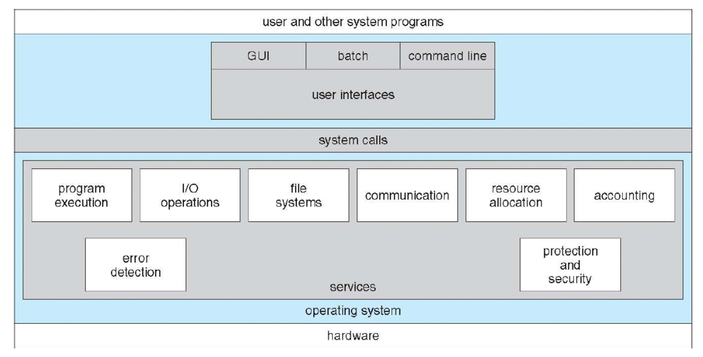
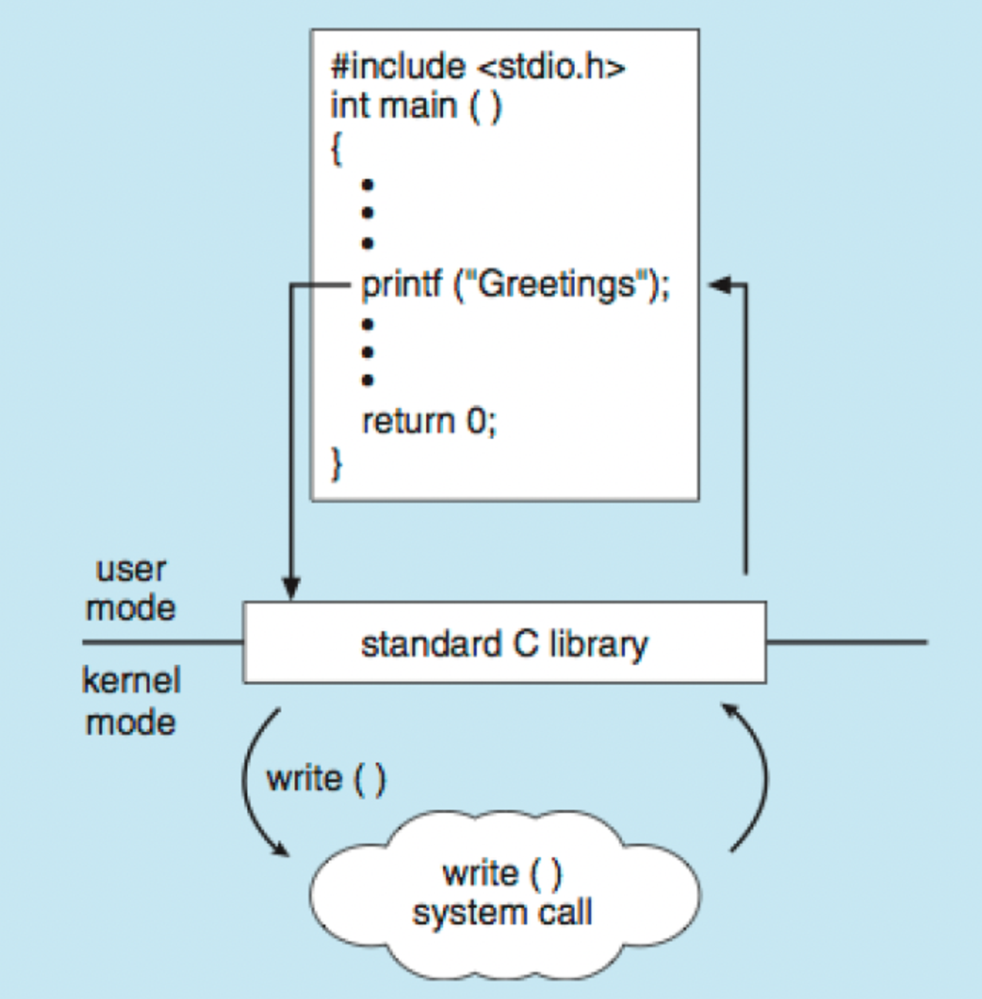
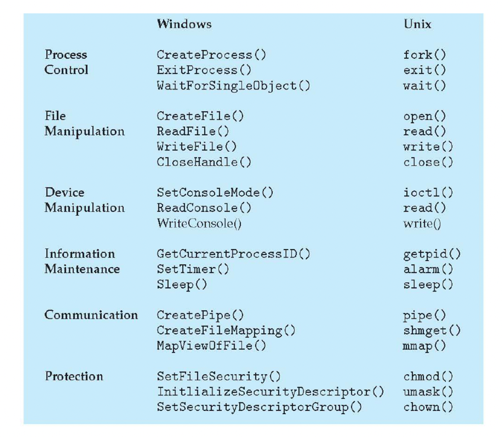
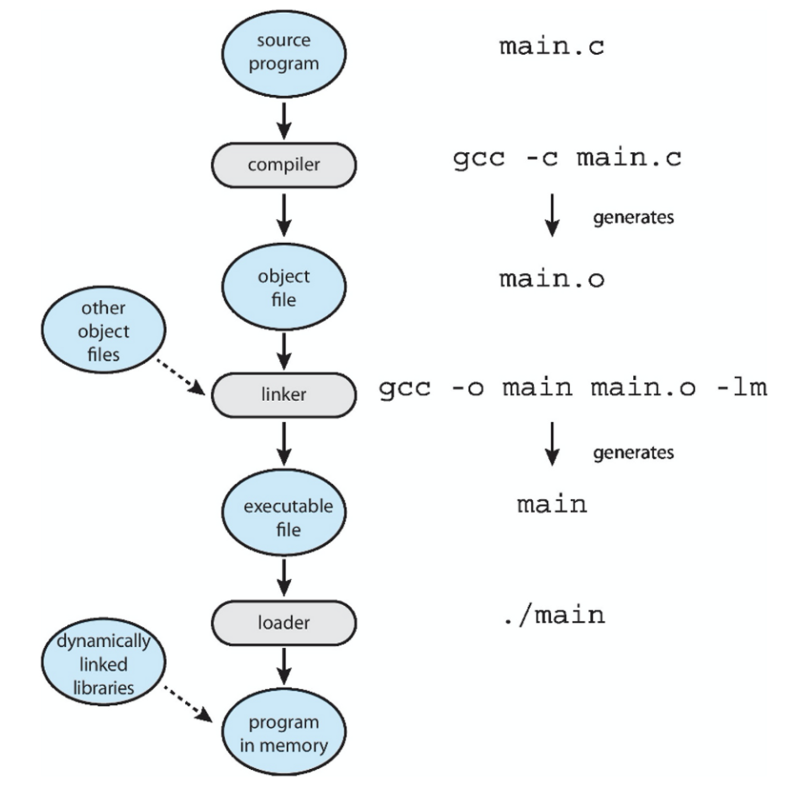
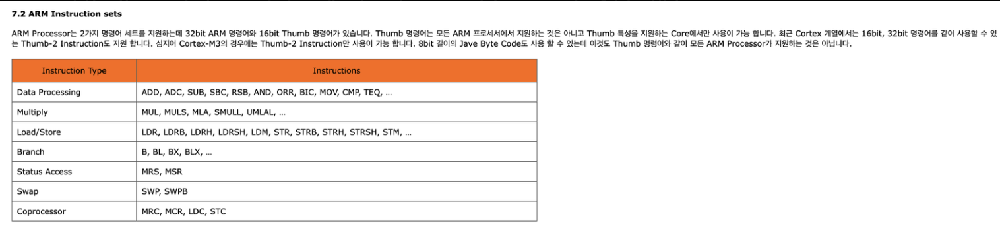

# 목차
1. [운영체제 서비스](#운영체제-서비스)
2. [사용자와 운영체제 인터페이스](#사용자와-운영체제-인터페이스)
3. [시스템 콜](#시스템-콜)
4. [시스템 서비스](#시스템-서비스)
5. [링커와 로더](#링커와-로더)
6. [응용 프로그램이 운영체제마다 다른 이유](#응용-프로그램이-운영체제마다-다른-이유)
7. [운영체제 설계 및 구현](#운영체제-설계-및-구현)
8. [운영체제 구조](#운영체제-구조)
9. [운영체제 빌딩과 부팅](#운영체제-빌딩과-부팅)
10. [운영체제 디버깅](#운영체제-디버깅)

# 운영체제 서비스

- 사용자 인터페이스(GUI, 터치 스크린 인터페이스, CLI)
- 프로그램 수행: 프로그램을 메모리에 적재해 실행할 수 있어야한다.
- 입출력 연산: 수행 중인 프로그램이 입출력을 요구할 수 있으며, 이러한 입출력에는 파일 또는 장치가 포함된다. 이런 입출력 제어를 할 수 있어야한다.
- 파일 시스템 조작
- 통신: 프로세스가 다른 프로세스와 정보를 교환해야할 상황들에 제어가 필요하다. 공유 메모리를 통해 구현될 수도 있고, 메세지 전달(정보의 패킷이 운영체제에 의해 프로세스들 사이로 이동함)을 통해 구현될 수도 있다.
- 오류 탐지
- 자원 할당: 다수의 프로세스가 동시에 실행될 때 각각에 자원(cpu, 메모리, 파일 저장장치 등)을 할당해주어야한다.
- 로깅
- 보호와 보안

# 사용자와 운영체제 인터페이스
여러 명령 인터프리터를 제공하는 시스템에서 이 명령어를 해석하는 프로그램을 쉘(shell) 이라고한다. 명령 인터프리터의 중요한 기능은 사용자가 지정한 명령을 가져와서 그것을 수행하는 것이다. 이 수준에서 파일의 생성, 삭제, 리스트, 복사 등을 수행한다. 이 명령어들은 두가지 방법으로 구현될 수 있다.
- 명령 인터프리터 자체가 명령을 실행할 코드를 가지고 있다. 이 명령어들은 모두 시스템 콜로 이루어진 파일로 존재하게되며, 기본적으로 구현되어있다.
- 시스템 프로그램에 의해 새로운 명령을 구현할 수 있다. 예를들어 unix 명령중에 `rm file.txt` 이라는 명령어는 rm이라는 파일을 찾아서, 그 파일을 메모리에 적재하고, 그것을 매개변수 file.txt 로 수행하는 것이다. rm 명령과 관련된 로직은 rm 파일 내 코드로 구현되어있다.

# 시스템 콜
운영체제(커널)을 제어할 수 있는 API이다. 사용자 모드에서 실행되는 어플리케이션은 커널 모드에 대한 직접적인 접근이 불가능하다. 하지만 커널에 접근할 수 없으면 사용자 모드의 프로세스들이 파일 생성이나 쓰기 또는 읽기, 그래픽 처리, 스레드 생성 및 제어와 같은 거의 모든 작업을 할 수 없다. 따라서 커널에 요청하여 커널 모드에서 처리하고 그 결과를 사용자 모드의 프로그램에게 전달하는 것이 바로 시스템 콜이다. 하드웨어에 직접 접근하는 저수준 작업의 경우 어셈블리 명령을 사용하여 작성해야하지만 운영체제는 일반적으로 c 또는 c++언어로 작성된 API를 제공한다.

예를 들어 `cp in.txt out.txt` 라는 명령어가 실행되는 과정에서도 수 많은 시스템 콜을 호출한다. 입력 파일을 읽고, 출력 파일을 생성하고, 또 동일한 이름의 출력 파일이 있을 때 덮어쓰거나, 종료하는 등의 처리를 해야하며, 또한 디스크 용량 부족 문제가 발생할 수도 있고, 파일을 읽을 때, 쓸 때 에러가 날 수도 있다. 이 모든 경우를 고려하여 시스템 콜의 순서를 나열해야한다.

운영체제에서는 좀 더 추상화된 API를 제공한다. 시스템 콜을 더 추상화한 라이브러리를 시스템 라이브러리라고 부를 수 있을 것 같다. 예를들어 printf 를 호출하면 내부적으로 write 라는 시스템 콜이 호출된다. 이런 간단한 프로그램이더라도 초당 수천 개의 시스템 콜을 수행한다.(참고 : [시스템 콜 테이블 구현체](https://github.com/torvalds/linux/blob/16f73eb02d7e1765ccab3d2018e0bd98eb93d973/arch/x86/entry/syscalls/syscall_64.tbl), [write 시스템 콜 구현체](https://github.com/torvalds/linux/blob/16f73eb02d7e1765ccab3d2018e0bd98eb93d973/fs/read_write.c#L542), [The GNU C Library 문서](https://www.gnu.org/software/libc/manual/html_mono/libc.html#toc-Cryptographic-Functions-1))
- Window에서는 WINDOW API
- Unix/Linux 기반 os에서는 POSIX API(portable operating system interface for unix)
  - POSIX는 IEEE가 제정한 유닉스 기반 API 표준이다. 각 운영체제마다 시스템 콜을 하는 방법이 다 다르니 운영체제가 제공하는 기능을 하나의 프로그래밍 인터페이스로 만들어 제공하면 어떤 운영체제든 어플리케이션을 실행할 수 있게된다. 예를들어 open이 대표적인 posix 함수 중 하나인데, unix 기반 운영체제에서 모두 open 함수를 호출해서 파일을 읽어올 수 있다.
- unix와 linux 시스템에서 표준 C 라이브러리(libc)에서 시스템 콜 래퍼를 제공한다. c언어는 자바 언어 대비 유닉스/리눅스 os 별 표준이 상대적으로 덜 적립된 느낌이라, posix, libc 등이 존재한다. 
  - libc는 표준 C 라이브러리를 의미하고(대명사처럼 사용) glibc는 GNU에서 만든 libc 구현체이다. glibc는 linux 시스템 콜을 래핑하였으며(물론 시스템 콜의 래핑함수만 제공하는건 아니고 다양한 라이브러리를 제공함) 프로그램이 사용할 API를 제공한다. GNU C 라이브러리 프로젝트는 리눅스를 커널로 사용하는 많은 시스템뿐만 아니라 GNU 시스템을 위한 핵심 라이브러리를 제공한다. 이러한 라이브러리는 ISO C11, POSIX.1-2008, BSD, OS별 API 등을 포함한 중요한 API를 제공한다. 이러한 API에는 open, read, write, malloc, printf, getaddrinfo, dlopen, pthread_create, crypt, login, exit 등과 같은 기본 기능이 포함된다. ([참고](https://en.wikipedia.org/wiki/Glibc))
  - 예를들어, malloc, calloc, free 모두 libc 라이브러리에 구현되어있다. 해당 라이브러리의 코드는 할당 및 할당 해제 요청을 추적하고 프로세스 힙을 확대 또는 축소하기 위해 brk() 시스템 호출을 사용한다. ([참고](https://www.oreilly.com/library/view/understanding-the-linux/0596000022/0596000022_ch08-79534.html)) 각 Unix 프로세스는 프로세스의 동적 메모리 요청을 충족하는 데 사용되는 힙이라는 특정 메모리 영역을 가지고 있다. 프로세스에서 동적 메모리를 요청하고 해제하는 데 사용할 수 있는 C 라이브러리 함수는 다음과 같다: malloc(size), calloc(n,size), free(addr), brk(addr) 이 때 brk 함수는 시스템 콜로 구현된 유일한 함수라는 점에서 나열된 다른 함수와 다르다. 다른 함수들은 C라이브러리에서 brk와 mmap을 사용하여 구현된다. 사용자 모드의 프로세스가 brk 시스템 호출을 호출하면 커널은 sys_brk(addr) 함수를 실행한다 ([참고](https://www.oreilly.com/library/view/understanding-the-linux/0596000022/0596000022_ch07-62366.html#ch07-62366)) 실제로 [링크](https://stackoverflow.com/questions/57734525/linux-system-calls-vs-c-lib-functions) 의 내용에 의하면 linux의 system call과 libc 함수는 완전 다른 것으로 이해해야하며 C 라이브러리로 래핑되지 않은 시스템 호출은 syscall 함수를 통해 호출해야 한다고 한다
- Java 버추얼 머신에서 실행할 수 있는 JAVA API를 제공한다. 

아래는 시스템 콜의 종류이다. 모든 운영체제는 고유의 시스템 콜 이름을 가진다.

### 시스템 콜의 유형
시스템 콜은 다섯 가지의 중요한 범주
- 프로세스 제어
- 파일 조작
- 장치 조작
- 정보 유지 보수
- 통신과 보호

프로세스 제어의 예시를 하나 들어보자. FreeBSD 라는 운영체제는 멀티 테스킹을 지원한다. 사용자가 시스템에 로그인 할 때 사용자가 선택한 셸이 수행되어 명령을 기다렸다가 사용자가 요청한 프로그램을 수행한다. 멀티테스킹 시스템이기 때문에 명령 인터프리터와 프로그램과 동시에 수행할 수 있다.
1. 새로운 프로세스를 시작하기 위해 셸은 fork() 시스템 콜을 수행한다. 
2. 선택된 프로그램이 exec() 시스템 콜을 통해 메모리에 적재되어 프로그램이 수행된다. 
3. 그리고 셸은 프로세스가 종료하기를 기다리거나, 다른 명령어가 입력되기를 기다린다. 사용자는 셸에게 다른 프로그램을 수행하도록 요청하거나, 수행 중인 프로세스의 진행상황을 감시하게 하거나, 프로그램의 우선순위를 변경하는 요청을 자유롭게 할 수 있다. 
4. 프로세스가 끝나면 종료하기 위해 exit() 시스템 콜을 수행하며 호출한 프로세스에게 상태코드를 돌려주는데 이 코드를 다른 프로그램이 이용할 수 있게 한다.

유저 모드에서 인자를 받는 시스템 콜이 포함된 함수를 실행했다고 가정해보자. 

1. 그럼 유저 모드에서 함수를 실행한다.
2. 시스템 콜의 인자로 들어온 데이터를 cpu 레지스터에 저장한 뒤 유저 모드에서 커널 모드로 전환된다.
3. 시스템 콜 함수가 종료되고 다시 유저모드로 바뀌고 함수 다음 코드들이 실행된다.

# 시스템 서비스
시스템 서비스는 시스템 유틸리티로도 알려진 프로그램 개발과 실행을 위해 더 편리한 환경을 제공한다. 사용자 대부분이 보는 운영체제의 관점은 시스템 콜에 의해서보다는 시스템 프로그램과 어플리케이션에 의해 정의된다. 자신의 컴퓨터가 MacOS 운영체제를 수행할 때는, 사용자는 마우스와 윈도우 인터페이스를 조작하는 GUI를 보거나, CLI에서 쉘 명령어를 실행할 수도 있다. 이 둘은 모두 시스템 콜을 사용하지만, 이 호출은 다르게 보이고 다른 방법으로 동작한다.

# 링커와 로더
CPU에서 실행하려면 프로그램을 메모리로 가져와 프로세스 형태로 배치되어야한다. 컴파일된 프로그램을 메모리에 배치하여 사용가능한 CPU 코어에서 실행할 수 있게 되게까지의 절차가 있다. CPU는 ISA에 정의된 기계어로 해석하여 연산을 실행한다.

**컴파일러**에 의해 소스코드는 물리 메모리에 위치에 적재되도록 설계된 오브젝트 파일로 컴파일된다. 이러한 형식을 재배치 가능 오브젝트 파일이라고 한다.

**링커**는 (실행파일을 만들 때 불린다) 이러한 재배치 가능 오브젝트 파일을 하나의 이진 실행 파일로 결합한다. 링킹 단계에서 표준 C 또는 수학 라이브러리와 같은 다른 오브젝트 파일 또는 라이브러리가 포함된다.

**로더**는 (파일을 실행할 때 불린다) 이진 실행 파일을 메모리에 적재하는데 사용하며, CPU 코어에서 실행할 수 있는 상태가 된다. 링크 및 로드와 관련된 활동은 재배치로, 프로그램 부분에 최종 주소를 할당하고 프로그램 코드와 데이터를 해당 주소와 일치하도록 조정하여 프로그램이 실행될 때 코드가 라이브러리 함수를 호출하고 변수에 접근하도록한다. 

로더가 호출되는 과정을 예를 들어 설명해보겠다. Unix 시스템의 명령어 라인에 프로그램 이름을 입력하면(ex. ./main), 셸은 먼저 fork() 시스템 콜을 사용하여 새 프로세스를 생성한다. 그런 다음 셸은 exec() 시스템 콜로 로더를 호출하고 exec()에 실행 파일 이름을 전달한다. 그리고 로더는 새로 생성된 프로세스 주소 공간을 사용하여, 지정된 프로그램을 메모리에 적재한다. (GUI에서 더블클릭하면 로더가 호출된다) 그리고 시스템 대부분에서는 프로그램이 적재될 때 라이브러리를 동적으로 링크할 수 있게한다. 이 방법의 장점은 실행 파일에서 사용되지 않을 수 있는 라이브러리를 링크하고 로드하지 않아도 된다는 것이다. 대신 라이브러리는 조건부로 링크되며 프로그램 실행시간에 필요한 경우 적재된다.

### ISA란

보통 **cpu 제조사에서 ISA(instruction set architecture) 라는 명령어 세트를 함께 제공**하는데 이는 소프트웨어와 cpu 사이에서 정의된 인터페이스를 정의한 언어로 쉽게 말해 우리가 아는 어셈블리어다. 어셈블리어는 **기계어를 사람이 좀 더 읽기 편한 형태로 바꾼 것인데** 인간이 이해할 수 있는 범위에서 가장 낮은 수준의 추상화가 아닐까 생각해본다. 이 기계어는 cpu 제조사마다 전부 다르게 정의된다. 예를들어 컴퓨터 입장에서는 00000000010100001000000100010011이 명령의 이진수 표현을 cpu는 1번 레지스터의 값과 상수 5를 더해 2번 레지스터에 저장하는 동작을 한다고 이해를 한다. 이런 식의 명령어를 사람이 읽기 편하게 하기 위해 다음과 같이 기계어에 대응하는 어셈블리어를 사용한다(ex. mov ax, @data) [(출처)](https://namu.wiki/w/%EB%AA%85%EB%A0%B9%EC%96%B4%20%EC%A7%91%ED%95%A9)

아래는 ARM아키텍처의 ISA이다.

_http://www.jkelec.co.kr/img/lecture/arm_arch/arm_arch_4.html#7_

그리고 **컴파일은 어떤 언어의 코드를 다른 언어의 코드로 변환해주는 과정을 의미하며 이를 수행하는 소프트웨어가 컴파일러**다. 실제로 gcc는 c언어 컴파일러로 c++로 작성되어있다. 한마디로 프로그램이다. 물론 고수준에서 저수준 또는 저수준에서 고수준으로 변환할 때 모두 컴파일 하는 과정이라고 말할 수 있지만 이런 경우에는 트랜스 컴파일, 디컴파일 등과 같이 좀 더 디테일한 용어들이 정의되어있으며 보통 컴파일이라고 하는 과정은 고수준의 언어를 기계어로 변환해주는 것을 의미한다. **특히 어셈블리어에서 기계어로 컴파일하는 프로그램을 어셈블러라고 한다**. 컴파일을 하는 대신 **소스를 한꺼번에 컴파일하지 않고 명령 하나하나 마다 컴파일하는 방법도 있는데 이런 프로그램을 인터프리터**라고 한다. make는 Makefile에 명시된 대로 컴파일러에게 명령하여 컴파일하는 명령어이다. ([링크](https://www.notion.so/9cdb926624244b23873c9d59d5c15c26?pvs=21)) 컴파일러는 아래 4종류로 나뉜다.

- raw code → machine code : static compilation
- **raw code** → **byte code** (: byte code compilation) → **machine code** (:AOT compliation (ahead of time compliation)
    - byte code는 고수준의 언어로 작성된 소스 코드를 가상 머신이 이해할 수 있는 형태의 중간 코드로 컴파일 된 언어이다. 이 때 자바 같은 경우는 자바 컴파일러가 raw code 를 byte code로 변환해주고 자바가상머신(JVM)은 바이트 코드를 각각의 하드웨어 아키텍처에 맞는 기계어로 컴파일한다.
    - AOT 컴파일은 런타임 전에 바이트 코드 → 기계어 로 변환하는 과정이다.
- 프로그램 실행시점에 필요한 부분을 즉석으로 컴파일하는 방식 : JIT compliation (just-in-time compliation)
    - 런타임 환경에서 바이트 코드 → 기계어로 변환하는 과정이다. 바이트 코드를 런타임 전과 후에 각각 컴파일하는 것이 AOT 컴파일과 JIT 컴파일을 구분짓는다.
    - JIT 컴파일은 구체적으로 파이썬 인터프리터를 이용해 설명을 해보겠다 -  [링크 (설명 굳)](https://seastar105.tistory.com/136)
        1. 인터프리터는 기본적으로 runtime 도중에 raw code 를 machine code 로 변환하는 프로그램이다. 
        2. 하지만 컴파일러와 비교했을 때 실행 시간이 느려, 가상 머신과 바이트 코드를 중간에 도입했다. 그래서 raw code 에서 byte code(.pyc) 로 컴파일을 한 후 python VM 에서 run time 환경에서 byte code 를 machine code로 바꿔주는 것이다. 하지만 여전히 느리다. 바이트 코드의 최적화는 컴파일러와 비교했을 때 성능이 떨어지며, 사실 런타임 환경에서 raw code → machine code 가 byte code → machine code 로만 바뀐 것이기 때문이다. 
        3. 그래서 여기서 JIT 컴파일러를 추가했다. 전체 코드를 컴파일하면 기존 컴파일러가 하는 일과 다를바가 없으니, 코드가 실행되면서 반복적으로 호출되는 코드의 부분을 컴파일해놓고 가상머신의 메모리에 저장해두는 것이다. 그래서 나중에 컴파일 된 코드 부분이 호출 될 때는 기존 방식 대로 byte code → machine code 로 컴파일 하는게 아니라, 컴파일 된 machine code를 바로 가져다 사용하는 방식이 JIT 컴파일 방식이다. 쉽게 말해서 컴파일과 인터프리터를 적절히 잘 합친 것이다. 파이썬의 경우 python3가 인터프리터 방식 pypy가 JIT 컴파일 방식으로 동작하며 실행시간의 확연한 차이가 있음을 알 수 있다.

# 응용 프로그램이 운영체제마다 다른 이유
**기본적으로 한 운영체제에서 컴파일된 응용 프로그램은 다른 운영체제에서 실행할 수 없다 (즉 운영체제마다 각기 다른 컴파일러가 존재하며 윈도우에서 실행파일 확장자는 exe 이고 이는 맥에서 실행되지 않는다)** 이 이유는 다음과 같다. 

1. **각 운영체제에는 헤더, 명령어 및 변수의 배치를 강제하는 응용 프로그램 이진 형식이 있다**. **이러한 구성요소는 운영체제가 명시한 구조 형태로 실행 파일 내의 특정 위치에 있어야 운영체제가 파일을 열고 응용 프로그램을 메모리에 적재하여 올바르게 실행할 수 있다** (예를 들어 소스코드를 짜면 변수나 함수는 전부 상단으로 보낸다던지 등 소스 코드 구조를 운영체제에 맞게 재배치 하는 느낌이다)
2. 각 운영체제는 고유한 시스템 콜 집합을 제공하고 cpu 마다 다른 명령 집합을 제공한다.

하지만 동일한 응용 프로그램을 다른 운영체제에서 사용하는 경우도 많다. 왜 그럴까? 다음 세가지 방법 중 한가지를 사용하여 응용프로그램이 여러 운영체제에서 실행될 수 있다.

1. 응용 프로그램은 운영체제마다 인터프리터가 제공되는 인터프리터 언어(python, ruby)로 작성될 수 있다. 인터프리터는 소스 프로그램의 각 라인을 읽고, 상응하는 기계어 명령을 실행하고, 해당 운영시스템의 시스템 콜을 호출한다. 
2. 가상 머신을 가진 언어로 응용프로그램을 작성할 수 있다. 가상 머신은 언어의 RTE(runtime environment) 중 일부이다. 이 RTE는 메인 프레임에서 스마트폰에 이르기까지 많은 운영체제에 이식 또는 개발되었으며 이론적으로 모든 자바 앱은 RTE가 제공되는 어디서나 실행될 수 있다.
3. 응용 프로그램 개발자는 컴파일러가 기기 및 운영체제 고유의 이진 파일을 생성하는 표준 언어 또는 API를 사용할 수 있다. 응용 프로그램은 실행 될 때 각 운영체제로 이식되어야하는데, UNIX 운영체제 변종 간의 소스 코드 호환성을 유지하기 위한 POSIX API와 표준 집합이다.

**요약하면 이러한 모든 차이점은 특정 CPU유형(intel x86 또는 ARMv8)의 특정 운영체제에서 인터프리터 또는 RTE 또는 이진 실행 파일을 작성하고 컴파일하지 않으면 응용 프로그램이 실행되지 않는다는 것을 의미한다.** Firefox 브라우저와 같은 프로그램이 window, macos, 다양한 리눅스 기반 os, ios, andriod, 때로는 다양한 cpu 아키텍처에서 실행되는데 필요한 작업량을 상상해봐라. 즉 실행파일은 cpu 아키텍처와 운영체제에 종속적으로 쉽게 말해 2가지의 cpu 아키텍처와 3가지의 운영체제가 있다고 했을 때 단순히 컴파일로만 실행파일을 만든다고 했을 때 총 6번의 컴파일을 진행해야한다.

아래 두개가 프로그램 개발의 복잡도를 올린 것 같다.

- **각기 다른 운영체제** → 각 운영체제마다 명시된 실행파일의 구조 형태(이 구조대로 있어야 프로그램을 메모리에 제대로 적재할 수 있다) 및 각기 다르게 제공되는 시스템 콜 집합
- **각기 다른 cpu 아키텍처** → 각기 다르게 제공되는 ISA

원칙적으로는 프로그래밍 언어를 만들 때는 모든 운영체제에서 실행되도록 만들어지기 때문에 각 운영체제 별로 제공하는 api를 활용하여 모든 운영체제에 대응되게 분기처리를 하여 코드를 작성하는 것이 맞지만 운영체제게 독립적으로 JAVA API , POSIX API, .NET Framework 등은 다양한 운영체제에서 실행 가능하도록 지원하고 있다. 이러한 운영체제의 차이를 추상화한 크로스 플랫폼 라이브러리들이 대표적이다. 나중에 크로스 플랫폼 라이브러리가 내부적으로 어떻게 동작하는지 알아보자.

### 질문

1. arm cpu 아키텍처 위에서 구동되는 윈도우 컴퓨터에서 컴파일 한 결과를 intel cpu 아키텍처 위에서 구동되는 윈도우에서 실행하면 실행될까?
    1. 안된다. 각각의 아키텍처에 맞게 컴파일된 이진 실행파일은 각각의 아키텍처에서만 실행된다.
2. 같은 cpu 아키텍처 위에서, 맥에서 컴파일한 이진 실행파일을 윈도우에서 실행하려고 하면 실행될까?
    1. 안된다. 각 os에 최적화된 컴파일러가 존재하기 때문에 실행 파일을 만들기 위해 컴파일을 한 os에서만 실행파일이 실행된다.
3. 결론은 이러한 cpu 아키텍처와 os 종속성을 신경 안쓰고 개발하기 위해 java, python 과 같은 고수준의 언어들이 개발되었고 해당 언어들이 컴파일 될 때는 내부적으로 os와 cpu 아키텍처를 고려한 이진 실행 파일이 만들어진다. 그래서 우리는 그동안 cpu나 os에 크게 종속적이지 않은 상태에서 개발할 수 있었다.

# 운영체제 설계 및 구현
“정책과 기법의 분리”: 기법은 어떻게 할 것인가를 정의하고, 기법은 무엇을 할 것인가를 정의한다.

예를 들어 타이머 구조는 CPU의 보호를 보장하기 위한 **기법**이지만, 특정 사용자에게 얼만큼의 시간을 설정할지는 **정책**이다.

**c 또는 c++과 같은 언어로 운영체제 커널을 구현하게 되면 코드를 빨리짜고, 간결하고 디버깅이 쉽다.** 또 **컴파일러 기술의 향상**은 **단순히 재컴파일만으로 전체 운영체제를 위해 생성된 코드를 향상**시킬 것이고 각 **cpu 아키텍처와의 호환성 때문에 cpu 아키텍처에 독립적으로 컴파일 과정을 진행**할 수 있다. 즉 arm에서 돌아가는 운영체제는 arm cpu 위에서 돌아가는 컴파일러에서 컴파일을 하면되고, intel위에서 돌아가는 운영체제는 intel cpu 위에서 돌아가는 컴파일러에서 컴파일을 하면 되기때문에 다른 하드웨어로 이식하는 것이 쉽다고 하는 것 같다 (소형 임베디드 장치, intel x86 시스템, ARM 시스템 등)

# 운영체제 구조
### 모놀리식 구조
커널의 모든 기능을 단일 주소 공간에서 실행되는 단일 정적 이진 파일에 넣는 것이다. cpu 스케줄링, 메모리 관리, 파일 시스템의 모든 기능들을 하나의 주소 공간에 할당한다. 이는 성능적 이점이 있다. 최초의 unix 운영체제는 모놀리식 구조이다.

### 계층적 접근
시스템은 다양한 방식으로 모듈화 될 수 있다. 한 가지 방식이 계층적 접근 방식이다. 각 층들은 자신의 하위층들의 서비스와 기능들만을 사용하도록 선택된다. 

### 마이크로커널
1980년도 중반에 마이크로커널 접근 방식을 사용하여 커널을 모듈화했고 이를 Mach 이라 불리는 운영체제를 개발했다. 커널에서 중요하지 않은 구성 요소를 별도의 주소공간에 존재하는 사용자 수준 프로그램으로 구현했고 이들은 메세지를 통해 정보를 주고 받는다. 아직까지 어느 서비스가 커널에 남아있어야 하는지는 의견이 일치하지 않는다. 마이크로커널 운영체제의 가장 잘 알려진 실례는 macOS 및 iOS 운영체제의 커널 구성요소인 Darwin이다. 실제로 Darwin은 두개의 커널로 구성되며 그 중 하나는 Mach마이크로커널이다.

### 모듈
운영체제를 설계하는데 이용되는 가장 최근 기술 중 최선책은 아마도 적재가능 커널 모듈(loadable kernel modules, LKM) 기법의 사용일 것이다. **커널은 핵심 구성요소들은 모두 가지고 있고 부팅 때 또는 실행 중에 부가적인 서비스들을 모듈을 통해 링크**할 수 있다 (즉 부팅 때 모든 코드가 메모리에 올라가지 않는다) 이러한 유형의 설계는 linux, mac os x, solaris, window 등 현대 unix를 구현하는 일반적인 추세이다. **예를 들어 리눅스는 주로 장치 드라이버와 파일 시스템을 지원하기 위해 적재가능 커널 모듈을 사용한다.**

# 운영체제 빌딩과 부팅
### 운영체제 생성

### 시스템 부트
1. 부트스트랩 프로그램 또는 부트 로더 라고 불리는 작은 코드가 커널의 위치를 찾는다.
    1. 컴퓨터 전원을 처음 켜면 **BIOS 라고 하는 비휘발성 펌웨어**에 있는 소형 부트 로더(대표적으로 GRUB) 가 실행된다. 이 부트 로더는 간단한 코드로서 디스크의 주소와 부트스트랩 프로그램 나머지 길이만 알고 있다.
    2. 많은 최신 컴퓨터 시스템이 BIOS 기반 부팅 과정을 UEFI 로 대체하였다. UEFI는 64비트 시스템과 용량이 큰 디스크를 더 잘 지원하는 것을 포함하여 부팅과정이 더 빠르다.
    3. 부트스트랩 프로그램은 커널을 메모리에 적재하는 것 외에도 cpu, 메모리를 점검, cpu 레지스터에서 장치 컨트롤러까지 모든 시스템 측면을 초기화할 수 있다.
2. 커널은 메모리에 적재되고 시작된다.
3. 커널은 하드웨어를 초기화한다.
4. 루트 파일 시스템이 마운트 된다.

# 운영체제 디버깅
### 성능
프로세스별

- ps: 선택된 프로세스에 대한 정보
- top: 현재 프로세스에 대한 실시간 통계

시스템 전체

- vmstat: 메모리 사용량 통계
- netstat: 네트워크 인터페이스에 대한 통계
- iostat: 디스크의 i/o 사용량

### 추적
### BCC