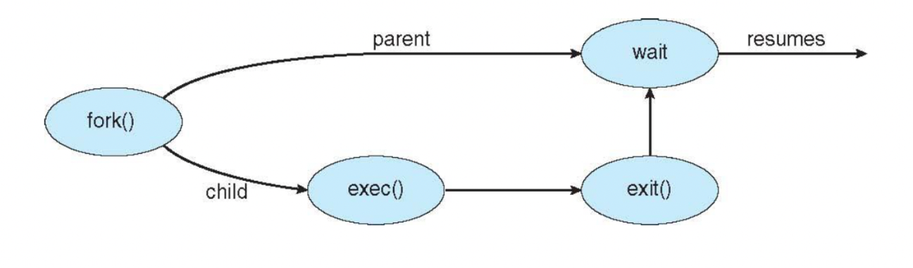

# 목차
1. [프로세스 개념](#프로세스-개념)
2. [프로세스 스케줄링](#프로세스-스케줄링)
3. [프로세스에 대한 연산](#프로세스에-대한-연산)
4. [프로세스 간 통신](#프로세스-간-통신)
5. [공유 메모리 시스템에서의 프로세스 간 통신](#공유-메모리-시스템에서의-프로세스-간-통신)
6. [메세지 전달 시스템에서의 프로세스 간 통신](#메세지-전달-시스템에서의-프로세스-간-통신)
7. [IPC 시스템의 사례](#IPC-시스템의-사례)
8. [클라이언트 서버 환경에서 통신](#클라이언트-서버-환경에서-통신)

# 프로세스 개념
프로세스는 실행 중인 프로그램이며, 프로세스들은 작업을 완수하기 위해 CPU, 메모리, 파일, i/o 장치들이 필요하게 된다. 이러한 자원들은 프로세스가 실행되는 동안 할당된다. 대부분의 시스템에서 프로세스는 작업의 단위가 되며, 운영체제 프로세스는 시스템 코드를 실행시키고, 사용자 프로세스는 사용자 코드를 실행시킨다. 이 모든 프로세스는 병렬로 실행될 수 있다. 이 장에서 소개한 프로세스 모델은 하나의 프로세스가 하나의 제어 스레드로 다른 프로그램을 실행한다고 가정한다.

### 개념
비공식적으로 프로세스란 실행 중인 프로그램을 의미한다. 프로세스의 현재 활동의 상태는 프로그램 카운터 값과 프로세서 레지스터의 내용으로 나타낸다.

- 텍스트: 실행 코드. 크기 고정
- 데이터: 전역 변수, static 변수
- 힙: 런타임에 크기 결정. 프로그램 실행 중에 동적으로 할당되는 메모리. 생성자 또는 인스턴스와 같이 동적으로 할당되는 데이터들이 저장된다.
- 스택: 컴파일 타임에 크기 결정. 함수를 호출할 때 임시 데이터 저장 장소(함수 매개변수, 복귀 주소 및 지역 변수), 함수의 호출이 종료되면 stack 영역 공간이 소멸한다. 이 stack영역을 초과하게 될 때 stackoverflow 에러가 발생한다.

텍스트 및 데이터 섹션의 크기는 고정되기 때문에 프로세스가 실행하는 동안 크기가 변하지 않지만 힙 및 스택은 프로세스가 실행하는 동안 크기가 변하며, 스택 및 힙이 서로의 방향으로 커지더라도 운영체제는 서로 겹치지 않도록 해야한다.

프로세스는 아래처럼 유저모드와 커널모드를 전환하며 실행된다.

_https://sihyung92.oopy.io/os/6#4401f752-9c38-4f82-b427-840bf5c2c920_

### 프로세스 상태

프로세스는 실행되면서 상태가 변한다. 이 상태들의 이름은 운영체제마다 변하거나, 더 세부적으로 구별하여 정의하기도 하지만 <u>**한 cpu 코어에서는 오직 하나의 프로세스가 실행된다는 것을 인식하는게 중요하다**</u>

### 프로세스 제어 블록(process control block, PCB)

각 프로세스는 운영체제에서 PCB에 의해 표현된다. PCB는 약간의 회계 정보와 함께 프로세스를 시작하거나 다시 시작시키는데 필요한 모든 데이터를 가진 저장소 역할을한다. 위 프로세스 상태마다 각각의 queue가 운영체제 내에 존재하는데 이 queue 내에서는 PCB에 대한 포인터로 데이터를 관리한다.

정보

- 프로세스 상태
- 프로그램 카운터: 프로세스가 다음에 실행할 명령어의 주소를 가리킴
    
    [https://ko.wikipedia.org/wiki/프로그램_카운터](https://ko.wikipedia.org/wiki/%ED%94%84%EB%A1%9C%EA%B7%B8%EB%9E%A8_%EC%B9%B4%EC%9A%B4%ED%84%B0) 
    
    **프로그램 카운터**(Program counter, **PC**)는 [마이크로프로세서](https://ko.wikipedia.org/wiki/%EB%A7%88%EC%9D%B4%ED%81%AC%EB%A1%9C%ED%94%84%EB%A1%9C%EC%84%B8%EC%84%9C)([중앙 처리 장치](https://ko.wikipedia.org/wiki/%EC%A4%91%EC%95%99_%EC%B2%98%EB%A6%AC_%EC%9E%A5%EC%B9%98)) 내부에 있는 [레지스터](https://ko.wikipedia.org/wiki/%ED%94%84%EB%A1%9C%EC%84%B8%EC%84%9C_%EB%A0%88%EC%A7%80%EC%8A%A4%ED%84%B0) 중의 하나로서, 다음에 실행될 명령어의 주소를 가지고 있어 실행할 기계어 코드의 위치를 지정한다. 때문에 **명령어 포인터**라고도 한다. [인텔](https://ko.wikipedia.org/wiki/%EC%9D%B8%ED%85%94)의 x86계열의 CPU에서는 IP(Instruction Pointer)라고 한다.[[1]](https://ko.wikipedia.org/wiki/%ED%94%84%EB%A1%9C%EA%B7%B8%EB%9E%A8_%EC%B9%B4%EC%9A%B4%ED%84%B0#cite_note-x86_InstructionSet-1)
    
    프로그램 계수기는 각 [명령 주기](https://ko.wikipedia.org/wiki/%EB%AA%85%EB%A0%B9_%EC%A3%BC%EA%B8%B0)에 따라 자동으로 증가하여, 메모리에 있는 명령어들이 순차적으로 실행될 수 있도록 한다. 단, 분기 또는 서브루틴 호출/복귀 등의 특정 명령어는 프로그램 카운터에 실행해야 위치가 바로 다음 코드가 아니라 새로운 기계어 코드의 위치 값이 들어간다.
    
    대부분의 프로세서에서는 명령어를 반입하고 난 직후에 명령어 포인터를 증가시킨다. 경우에 따라 분기 명령어의 목표가 되는 주소를, 그 분기 명령어의 인수(operand)에서 지정하는 경우도 있다. 명령어의 인수값이 절대 주소값인 경우는 인수값을 프로그램 카운터 값에 설정하면 그 주소를 점프한다.[[1]](https://ko.wikipedia.org/wiki/%ED%94%84%EB%A1%9C%EA%B7%B8%EB%9E%A8_%EC%B9%B4%EC%9A%B4%ED%84%B0#cite_note-x86_InstructionSet-1) 명령어의 종류에 따라 인수가 현재 위치에서의 상대적으로 지정하는 경우도 있는데 이런 경우 현재 프로그램 카운터 값에 인수값을 더하는 방식을 사용한다. 즉, 다음에 실행될 명령어의 주소는 명령어에 따라 명령어의 인수에 지정되는 경우도 있다.
    
    한편, 재설정가능한 컴퓨터 시스템의 기본 모델(비 폰노이만 모델)에서는 프로그램 계수기 대신 [데이터 계수기](https://ko.wikipedia.org/wiki/%EB%8D%B0%EC%9D%B4%ED%84%B0_%EA%B3%84%EC%88%98%EA%B8%B0)를 사용한다.[[출처 필요](https://ko.wikipedia.org/wiki/%EC%9C%84%ED%82%A4%EB%B0%B1%EA%B3%BC:%EC%B6%9C%EC%B2%98_%ED%95%84%EC%9A%94)]
    
- CPU 레지스터: 프로그램 카운터와 함께 다양한 cpu의 레지스터 정보들은 나중에 프로세스가 다시 스케줄링 될 때 다시 올라가게 실행되도록 하기 위해 인터럽트 발생 시 저장되어야한다.
- cpu 스케줄링 정보: 프로세스 우선순위, 스케줄 큐에 대한 포인터와 다른 스케줄 매개변수를 포함한다
- 메모리 관리 정보
- 회계 정보: cpu 사용시간, 경과될 시간, 시간 제한, 계정 번호, 프로세스 번호 등
- 입출력 상태 정보: 이 프로세스에 할당된 입출력 장치들과 열린 파일 목록 등을 포함

### 스레드
현대 대부분의 운영체제는 프로세스의 개념을 확장하여, 한 프로세스가 다수의 실행 스레드를 가질 수 있도록 허용한다. 그래서 운영체제는 프로세스가 한번에 하나 이상의 일을 할 수 있도록 허용한다. **즉 프로세스는 운영체제로부터 자원을 할당받은 작업의 단위이며, 스레드는 프로세스의 자원을 활용하는 실행 흐름의 단위이다.** 그래서 다중 스레드 워드 프로세서는 한 스레드에서 사용자의 입력 관리를 할 때, 다른 스레드에서 맞춤법 검사를 진행할 수 있다.

스레드를 지원하는 시스템에서는 PCB는 각각 스레드에 대한 정보를 포함하도록 확장되며, 스레드를 지원하기 위해서는 시스템 전반에 걸친 수정도 필요하다. (4장 참고)

TCB 
- 참고로 이 PCB 안에 TCB(Thread control block)이라는 정보도 함께 포함되어있다. TCB에는 스레드의 상태, 스레드 ID, 스레드 스케줄링 정보가 포함되어있다.
- 스레드 간의 자원 공유, 동기화(뮤텍스, 세마포어 등)도 TCB를 통해 관리된다.
- TCB는 PCB보다 훨씬 가볍다. 사실 프로세스의 텍스트, 데이터, 힙 정보가 공유되기 때문에 스택 정보와 관련 레지스터 정보만 추가로 가지면 되기 때문에 훨씬 가볍고 이후 나올 컨텍스트 스위칭도 스레드가 프로세스에 비해 훨씬 빠르다.

# 프로세스 스케줄링
<u>**다중 프로그래밍의 목적은 프로세스들이 cpu 이용을 최대화하도록 실행되는데 있다.**</u> 이 목적을 달성하기 위해 프로세스 스케줄러는 코어에서 실행 가능한 여러 프로세스 중, 하나의 프로세스를 선택한다. 각 cpu 코어는 한번에 하나의 프로세스를 실행할 수 있다. (이 장에서는 싱글 코어, 싱글 스레드라고 가정한다)

다중 프로그래밍 및 시간 공유의 목표를 균형 있게 유지하려면 프로세스의 일반적인 동작을 고려해야한다. 대부분 프로세스는 **I/O 바운드 프로세스**(계산 < I/O 에 시간을 더 소비하는 프로세스)와 **CPU 바운드 프로세스**(계산 > I/O 에 시간을 더 소비하는 프로세스) 로 설명할 수 있다.

### 스케줄링 큐 (위 그림 참고)
1. **준비 큐(ready queue)**의 헤더에는 첫번째 PCB의 포인터가 저장되고 각 PCB에는 준비 큐의 다음 PCB를 가리키는 포인터 필드가 포함된다.
2. 프로세스에 CPU코어가 할당되면 프로세스는 잠시동안 실행된다. 즉 **실행 큐(running queue)**에 들어간다.
3. 인터럽트 또는 타임 슬라이스가 만료되어 프로세스가 코어에서 강제로 제거되어 **준비 큐**로 돌아갈 수 있다.
4. **대기 큐(wait queue)**에는 I/O완료와 같은 특정 이벤트가 발생하기를 기다리는 프로세스는 대기 큐에 삽입된다. 또는 프로세스는 새 자식프로세스를 만든 다음 자식의 종료를 기다리는 동안(wait() 시스템콜 호출) 대기 큐에 놓일 수 있다.

### CPU 스케줄링
프로세스는 수명주기 동안 준비 큐와 대기 큐를 왔다갔다한다. 이 때 **cpu 스케줄러의 역할은 준비 큐에 있는 프로세스 중에서 선택된 하나의 프로세스에 cpu 코어를 할당하는 것이다.** cpu 스케줄러는 cpu를 할당하기 위해 새 프로세스를 자주 선택해야 하는데 실제로 cpu 스케줄러는 훨씬 더 자주 실행되지만 적어도 100밀리초마다 한번씩 실행된다. 

일부 운영체제는 ‘스와핑’이라고 알려진 중간 형태의 스케줄링을 가지고 있다. 프로세스를 메모리에서 디스크로 스왑아웃 하고 현재 상태를 저장한 후, 나중에 디스크에서 메모리로 ‘스왑인’하여 상태를 복원할 수 있기 때문에 이 기법을 스와핑이라고 한다. 스와핑은 일반적으로 메모리가 초과 사용되어 가용공간을 확보해야 할 때만 필요하다.

### Context switch
인터럽트는 운영체제가 cpu 코어를 현재 작업에서 뺏어내고 커널 루틴을 실행할 수 있게한다. 인터럽트가 발생하면 시스템은 인터럽트 처리가 끝난 후 context 를 복구할 수 있도록 현재 프로세스의 컨텍스트 (프로세스의 cpu 레지스터 값, 프로세스 상태, 메모리 관리정보 등) 를 PCB에 저장하고 나중에 복구한다.

# 프로세스에 대한 연산
대부분의 시스템에서 프로세서들은 병행해서 실행 될 수 있으며, 반드시 동적으로 생성되고, 제거 되어야한다.

### 프로세스 생성
<u>**실행되는 동안 프로세스는 여러 개의 자식 프로세스를 생성할 수 있다. 그 결과 프로세스 트리를 형성한다.**</u> 그리고 이런 각 프로세스들은 프로세스 식별자(pid)를 사용하여 프로세스를 구분하는데 보통 정수이다. 언제나 pid 가 1인 systemd 프로세스가 모든 사용자 프로세스의 루트 부모 프로세스이다. 시스템이 부팅되면 systemd 프로세스는 다른 사용자 프로세스를 생성한다. 이런 프로세스에는 웹 서버, ssh 서버, 프린트 서버 등이 포함된다. 일반적으로 자식 프로세스를 생성할 때 그 자식 프로세스는 자신의 임무를 달성하기 위해 어떤 자원이 필요한데 이는 운영체제로부터 직접 얻거나 부모 프로세스의 자원의 부분 집합을 사용할 수 있다.

(보편적인 리눅스 시스템의 프로세스 트리(최근 배포판에 init 이 systemd 도 대체되었다)

프로세스가 새로운 프로세스를 생성할 때 두 프로세스를 실행시키는데 두 가지 가능한 방법이 존재한다.
1. 부모는 자식과 병행하게 실행을 계속한다.
2. 부모는 일부 또는 모든 자식이 실행을 종료할 때까지 기다린다.

새로운 프로세스의 주소공간을 볼 때 두가지 가능성이 있다.
1. 자식 프로세스는 부모 프로세스의 복사본이다. 자식과 부모는 똑같은 프로그램 코드와 데이터를 가진다.
2. 자식 프로세스는 자기만의 새로운 프로세스를 가진다. 확실한 건 부모와 자식의 주소공간이 분리되어있다.

`fork()` 는 새로운 프로세스 생성한다. `exec()` 는 `fork()`를 실행한 후 실행되는데 자신의 메모리 공간을 새로운 프로그램으로 대체한다.

### 프로세스 종료

프로세스가 실행을 끝내고 `exit()`시스템 콜을 사용하여 운영체제에게 자신(자식 프로세스) 의 삭제를 요청하면 종료한다. 이 때 `wait()` 시스템 콜의 실행으로 자신을 기다리고 있는 부모 프로세스에게 상태 값을 반환할 수 있다. 그리고 자식 프로세스의 자원이 반납된다. 

부모는 여러가지 이유로 자식 프로세스의 실행을 종료할 수 있다.
- 자식이 자신에게 할당된 자원을 초과할 때 → _근데 주소공간이 분리되어 있는데 부모에게 할당된 자원을 자식이 초과할 일이 있을까? : 부모에게 할당된 자원을 자식이 초과하는게 아니라, 그냥 운영체제가 자식 프로세스에게 할당한 자원을 말하는 것 같다._
- 자식에게 할당된 테스크가 더 이상 필요없을 때
- 부모가 exit() 하는데 부모가 exit() 한 이후에 자식이 실행을 계속하는 것을 운영체제가 허용하지 않을 때

프로세스의 종료 상태가 저장되는 프로세스 항목은 부모 프로세스가 wait() 를 호출할 때까지 남아있다. 종료되었지만 부모 프로세스가 wait() 호출을 하지 않은 프로세스를 **좀비 프로세스**라고 한다. 그리고 부모가 wait() 시스템 콜을 호출하면 프로세스 식별자와 프로세스 자원이 반환되기 때문에 부모가 wait()를 호출하기 전 아주 짧은 시간동안만 좀비 프로세스가 된다. 이 때 부모 프로세스가 wait()를 호출하지 않고 exit() 을 호출했을 때 자식 프로세스를 **고아 프로세스**라고 한다. 고아 프로세스는 새로운 부모 프로세스로 systemd(pid=1) 프로세스를 지정함으로써 이 문제를 해결한다.

### 안드로이드 프로세스 계층
제한된 메모리와 같은 자원 제약 때문에 모바일 운영체제는 제한된 시스템 자원을 회수하기 위해 기존 프로세스를 종료해야할 수 있다. 안드로이드는 임의의 프로세스를 종료하지 않고 프로세스의 중요도 계층을 분류했다. 자원을 확보해야하는 경우 중요도가 낮은 프로세스부터 종료한다. 우선순위가 높은 순서대로 나열하면 다음과 같다
1. forground process
2. visible process
3. service process
4. background process
5. empty process

# 프로세스 간 통신
협력적 프로세스는 데이터를 교환할 수 있는, 즉 서로 데이터를 보내거나 받을 수 있는 <u>프로세스 간 통신(interprocess communication, IPC) </u>기법이 필요하다. 프로세스 간 통신에는 <u>공유 메모리(shared memory)</u>와 <u>메세지 전달(message passing)</u>의 두가지 모델이 있다.

(널널한 개발자) 프로세스는 공간이 독립적으로 주어진다. 메모리 공간에 대해서 다른 프로세스가 접근하지 못하도록 외부 접근을 차단하도록 os가 보장한다. 외부에 대한 변경은 특수한 케이스가 아니면 웬만하면 하지 않는다. 프로세스 간의 통신 방법에는 메모리(RAM)를 이용하는 방식이 있고 파일(pipe)을 이용하는 방식이 있다. 둘의 가장 큰 차이는 파일을 쓰기 시작하면 파일 시스템이 제공하는 한계까지 계속 쓸 수 있지만 메모리는 고정 길이이다. RAM 에 프로세스를 할당할 때는 os가 강하게 체크한다. IPC 가 네트워크 까지 확장되면 RPC 개념이 등장한다. 원격 프로세스를 호출하기 위해서 TCP 통신을 한다. 최근에 HTTP3와 등장하면서 RPC 개념이 확장되었다. pipe(file)는직렬화 시켜서 스트림 시켜서 파일을 주고 받을 때 굉장히 유리하다. shared memory 기법을 쓸 때는 길이가 고정되어있다.

# 공유 메모리 시스템에서의 프로세스 간 통신
보통 공유 메모리 영역은 공유 메모리 세그먼트를 생성하는 프로세스의 주소 공간에 위치한다. 공유 메모리 세그먼트를 이용하여 통신하고자 하는 다른 프로세스는 자신의 주소공간에 이 공유 메모리 세그먼트를 추가해야한다.

### 생산자 소비자 문제
협력하는 프로세스의 일반적인 패러다임이다. 예를 들어 컴파일러는 어셈블리 코드를 생성하고, 어셈블러는 이를 소비한다. 어셈블러는 이어 object module을 생산하고, loader는 이를 소비한다. 클라이언트(소비자)-서버(생산자) 에 대입하여 생각할 수도 있다.

생산자-소비자 문제의 하나의 해결책은 공유 메모리를 사용하는 것이다. 이 때 두가지 유형의 버퍼가 존재한다.
1. 무한 버퍼
2. 유한 버퍼: 버퍼의 크기가 고정되어있다고 가정한다. 

이 경우에 버퍼가 비어있으면 소비자는 반드시 대기해야하고, 모든 버퍼가 채워져 있으면 생산자가 대기해야한다. 이 때 공유 메모리에 접근하고 조작하는 코드가 프로그래머에 의해 명시적으로 작성된다. 만약에 여기서 생산자와 소비자가 동시에 공유 버퍼에 접근하는 상황에 대한 고려는 6, 7장에서 공유 메모리 환경에서 상호 협조하는 프로세스 간에 어떻게 동기화가 구현될 수 있는지에 대해 논의한다.

# 메세지 전달 시스템에서의 프로세스 간 통신
메세지 전달 방식은 동일한 주소 공간을 공유하지 않고도 프로세스들이 통신을 하고 그들의 동작을 동기화할 수 있는 방법을 제공한다. 이 방식은 특히 통신하는 프로세스들이 네트워크에 연결된 다른 컴퓨터들에 존재할 수 있는 분산 환경에서 특히 유용하다. 만약 프로세스 P와 Q가 통신을 한다면, 사이에 communication link(통신 연결)이 설정되어야 한다. 이 책에서는 물리적인 구현에 관심이 있는게 아니라 논리적인 구현에 관심이 있다. 하나의 링크와 send() / receive() 연산을 논리적으로 구현하는 방법은 다음과 같다. 직접 또는 간접 통신, 동기식 또는 비동기식 통신, 자동 또는 명시적 버퍼링이다.

### 명명(Naming)
통신을 원하는 프로세스들은 서로를 가리킬 방법이 있어야한다.

직접 통신

- 통신을 원하는 각 프로세스는 수신자, 송신자의 이름을 명시해야한다.
- 연결은 정확히 두 프로세스 사이에만 연관되며, 프로세스 각 쌍 사이에는 정확하게 하나의 연결이 존재해야한다.

간접 통신

- 메세지들은 메일박스(mailbox) 또는 포트(port)로 송신되고, 수신 프로세스는 그것들로부터 수신된다.
- 이 메일박스는 한 프로세스 또는 운영체제에게 소유될 수 있으며, 프로세스에게 소유될 때는 메일박스는 프로세스 주소 공간의 일부를 가지게 된다. 운영체제가 소유한 메일 박스라면 자체적으로 존재하며, 독립적으로 특정한 프로세스에 예속되지 않는다.
- 통신하고 있는 각 프로세스 사이에는 다수의 서로 다른 연결이 존재할 수 있고, 각 연결은 하나의 메일박스에 대응된다.

### 동기화(Synchronization)
프로세스 간 통신은 send, receive 프리미티브에 대한 호출에 의해 발생한다. 그리고 메세지 전달은 blocking 이거나 non-blocking 방식으로 전달된다. 이 두 방식은 각각 동기식, 비동기식 이라고도 알려져있다.

- blocking send : 프로세스가 send 할 때 수신 프로세스 또는 메일박스에 의해 수신될 때까지 기다린다.
- non-blocking send : 프로세스가 send 하고 바로 다음 작업을 시작한다.
- blocking receive : 메세지가 이용 가능할 때까지 수신 프로세스가 기다린다 (봉쇄(blocking)된다)
- non-blocking receive : 송신하는 프로세스가 유요한 메세지 또는 Null 을 받는다.

### 버퍼링(Buffering)
통신이 직접적이든 간접적이든 간에, 통신하는 프로세스들에 의해 교환되는 메세지는 임시 큐에 들어가있다. 이러한 큐를 구현하는 방식은 3가지가 있다.

1. 무용량(zero capacity): 큐의 최대 길이가 0으로, 안에 대기하는 메세지를 가질 수 없다. 송신자는 수신자가 메세지를 수신할 때까지 기다려야한다.
2. 유한 용량(bounded capacity): 큐는 유한한 길이 n을 가진다.
3. 무한 용량(unbounded capacity): 큐는 잠재적으로 무한한 길이를 가진다. 송신자는 절대 봉쇄되지 않는다.

# IPC 시스템의 사례
사례
1. 공유 메모리를 위한 POSIX API
2. Mach 운영체제의 메세지 전달 시스템
3. Window IPC: 특정 유형의 메세지 전달 기법을 제공하기 위해 공유 메모리를 사용함
4. 파이프: Unix 시스템의 가장 오래된 IPC 기법 중 하나
    1. 파이프는 두 프로세스가 통신할 수 있게 하는 전달자로서 동작한다. 파일의 특수한 유형이다. 
    2. 파이프를 구현하기 위해 다음 4가지 문제를 고려한다.
        1. 파이프가 단방향 통신 또는 양방향 통신을 허용하는가?
        2. 양방향 통신이 허용된다면, 한 순간에 한 방향만 전송 가능한가(half duplex, 반이중 방식), 동시에 양방향 데이터 전송이 가능한가(full duplex, 전이중 방식)?
        3. 통신하는 두 프로세스 간에 부모-자식과 같은 특정 관계가 존재해야만 하는가?
        4. 파이프는 네트워크를 통해 통신이 가능한가? 아니면 동일한 기계안에 존재하는 두 프로세스끼리만 통신이 가능한가?
    3. 예를 들어 일반 파이프의 경우, 생산자와 소비자 형태를 띄면서 오직 단방향 통신만 가능하다. 양방향 통신을 하고 싶으면 두 개의 파이프를 사용해야한다.

# 클라이언트 서버 환경에서 통신
클라이언트 서버에서 사용할 수 있는 두 가지 통신 전략
1. 소켓(socket)
2. 원격 프로시저 호출(RPC) (이는 안드로이드는 동일한 시스템에서 실행되는 프로세스 간 IPC의 형태로 원격 프로시저를 사용한다)

사실 통신도 보면 모바일 또는 웹도 하나의 프로세스이고 서버에 띄워진 웹 또는 API 서버도 결국 전부 프로세스이다. 이 사이의 통신은 결국 프로세스 간의 데이터 전송이라고 생각할 수 있다. rest api 방식이니 graphql 쿼리 방식이니 grpc 방식이니 전부 결국 두 프로세스 간의 데이터 전송에 불과하다.
