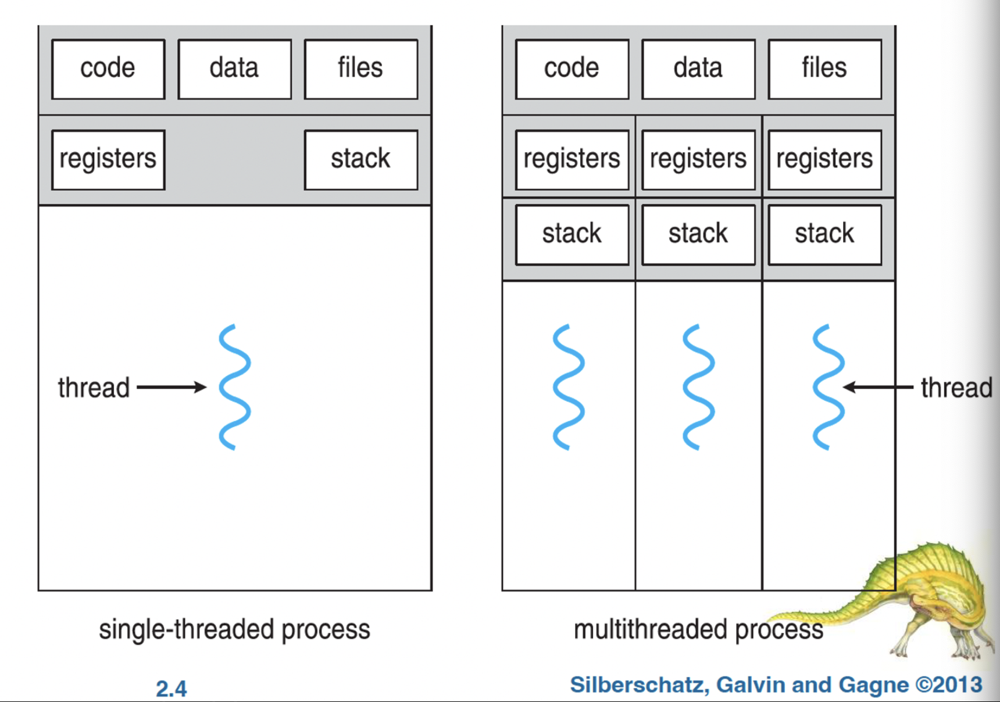
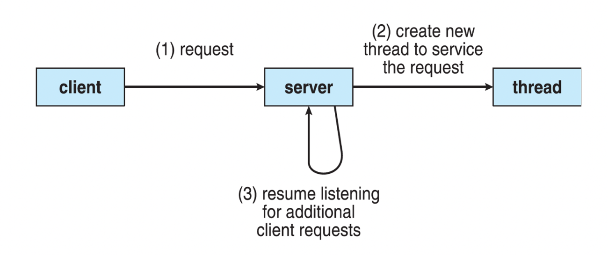
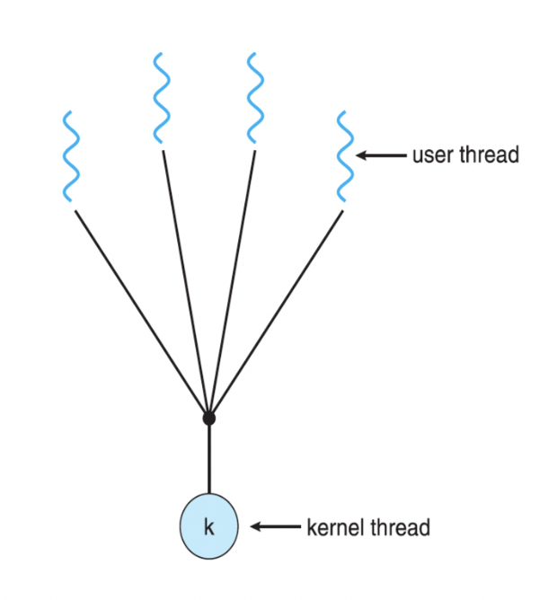
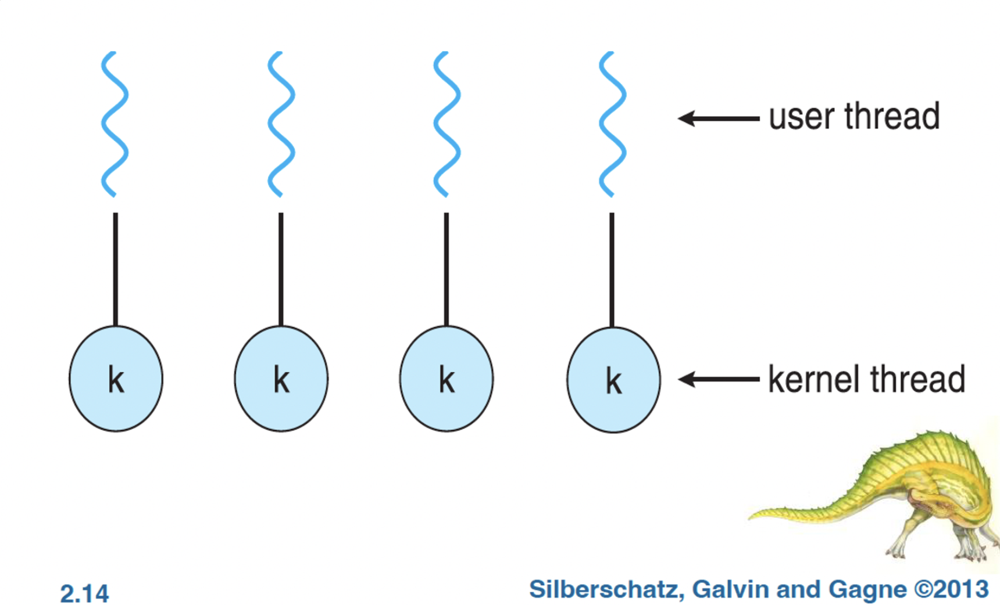
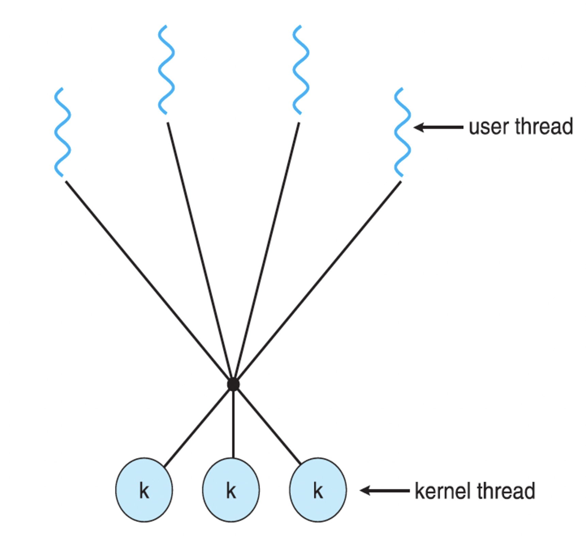
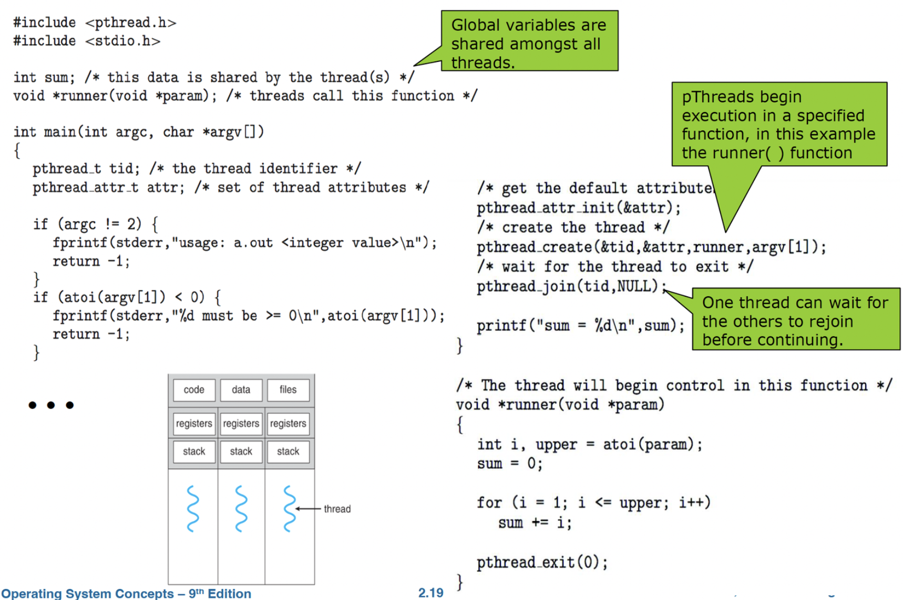
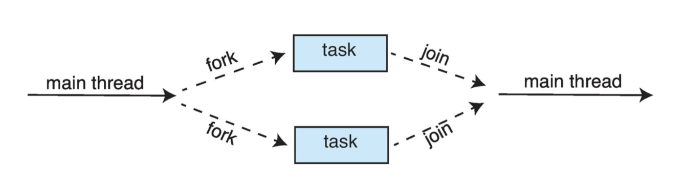
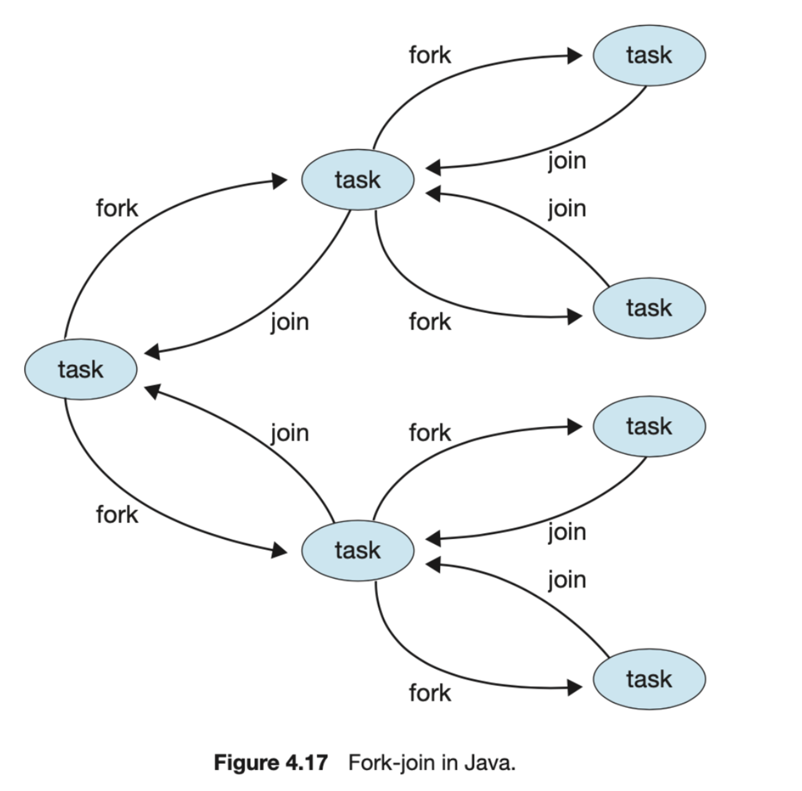

# 목차
1. [개요](#개요)
2. [다중 코어 프로그래밍](#다중-코어-프로그래밍)
3. [다중 스레드 모델](#다중-스레드-모델)
4. [스레드 라이브러리](#스레드-라이브러리)
5. [암묵적 스레딩](#암묵적-스레딩)
6. [스레드와 관련된 문제들](#스레드와-관련된-문제들)
7. [운영체제 사례](#운영체제-사례)

# 개요
<u>스레드는 CPU 이용의 기본 단위이다. 좀 더 다르게 표현하면 프로세스는 운영체제로부터 자원을 할당받은 작업의 단위이며, 스레드는 프로세스의 자원을 활용하는 실행 흐름의 단위이다.</u>

스레드가 사용되는 맥락은 정말 다양하다. (하이퍼스레딩이 적용된) cpu 스레드, 커널 스레드, 유저 스레드로 나눌 수 있다. cpu 스레드는 하드웨어에서 정의된 스레드이고 커널 스레드와 유저 스레드는 소프트웨어에서 정의된 스레드이다. - [링크](https://www.notion.so/4-a8468a8fec2641f98c09b1c5a117c72e?pvs=21)
- **cpu 스레드**는 우리가 보통 cpu의 4코어 8스레드라고 말하는 것에서 4코어의 의미는 물리적인 코어가 4개라는 의미이고 8스레드는 (하이퍼스레딩 기술을 사용해 하나의 코어가 마치 2개의 일을 할 수 있도록 한 것으로) 논리적인 코어 개수를 의미한다. 즉 한 코어에서 동시에 두개의 일을 할 수 있다는 의미이다. 실제로 듀얼코어이더라도 하이퍼스레딩이 적용되면 os 입장에서는 4개의 코어가 있다고 생각한다. 이 스레드는 하드웨어에서 정의된 스레드를 의미하며 이 장에서 이야기 할 스레드는 모두 소프트웨어에서 정의된 스레드를 의미한다. 우리가 프로그램에서 수십개, 수백개의 스레드를 실행하면 실제 8개의 cpu 스레드(논리적인 스레드)가 이를 모두 처리하는 셈이다.
- **커널 스레드**는 위에서 말한 실행흐름의 단위로 cpu 에서 실제로 실행되는 단위, 즉 cpu 스케줄링의 단위이다. 앞에서 말한 프로세스를 통해 하드웨어 자원을 할당받고 실제로 돌아가는건 스레드인데, 좀 더 구체적으로 커널 스레드라는 의미이다. **우리가 이후에 cpu 스케줄링에 대해서 알아볼 때 프로세스가 실행된다고 하는 것들은 전부 내부적으로 스레드로 실행되고 있는 것이다**. **cpu 스케줄링의 대상이 되는 스레드는 전부 커널 스레드이다.** 이 커널 스레드에서 사용자 코드 또는 커널 코드 모두 os 스레드에서 실행된다. 근데 또 맥락에 따라 순수 os 라는 프로그램을 실행하기 위한 스레드라고 설명되기도 한다.
- **유저 스레드**는 스레드의 개념을 프로그래밍 레벨에서 추상화한 것이다. 결국 유저스레드 위에서 돌아가는 코드가 결국 cpu가 처리하기 위해서는 커널 스레드에서 실행해야하는 것이고 유저 스레드와 커널 스레드 사이의 연결이 일어나야한다. 이 연결은 뒤에서 배운다 (1:1, 1:N, N:M) 우리가 자바, 파이썬 등에서 thread를 호출하면 내부적으로 커널 스레드를 생성하는 시스템 콜을 호출하게된다. 근데 또 문서에 따라서 설명으로 위해 os와 독립적으로 실행되는 스레드를 유저 스레드라고 말하는 경우도 있다. 잘 보고 이해하자.

스레드는 스레드 ID, 프로그램 카운터(PC), 레지스터 집합 그리고 스택으로 구성된다. 그리고 스레드는 같은 프로세스에 속한 다른 스레드와 코드, 데이터 섹션, 그리고 열린 파일이나 신호와 같은 운영체제 자원을 공유한다.

_(단일 스레드 프로세스와 다중 스레드 프로세스)_

### 스레드 예시
웹 브라우저에서 하나의 스레드가 이미지 또는 텍스트를 표시하고 다른 스레드는 네트워크에서 데이터를 검색하도록한다. 

워드프로세서에는 그래픽을 표시하는 스레드, 사용자의 키 입력에 응답하는 또 다른 스레드, 백그라운드에서 맞춤법 및 문법 검사를 수행하는 세번째 스레드가 있을 수 있다.

하나의 웹 서버에서 여러 클라이언트의 요청을 처리하는데 옛날에는 한 요청 당 하나의 프로세스를 생성하여 처리했었는데, 새 프로세스가 할 일이 기존 프로세스가 하는 일과 동일하다면 프로세스를 생성하여 더 많은 오버헤드로 처리할 필요가 없다. 한 프로세스안에 여러 스레드를 만들어 처리한다. 웹 서버가 다중 스레드화 되면 서버는 클라이언트 요청을 listen 하는 별도의 스레드를 생성한다.

대부분의 운영체제 커널도 일반적으로 다중 스레드이다. 예를 들어 리눅스 시스템에서 시스템을 부트하는 동안 여러 커널 스레드가 생성된다. 각 스레드는 장치 관리, 메모리 관리, 인터럽트 처리 등과 같은 작업을 수행한다. 

### 스레드 장점
1. 응답성
2. 자원 공유
    1. 프로세스는 공유 메모리와 메세지 전달 기법을 통해서만 자원을 공유할 수 있고 이는 프로그래머에 의해 명시적으로 처리된다. 하지만 스레드는 자동으로 그들이 속한 프로세스의 자원들과 메모리를 공유한다. 코드와 데이터 공유의 이점은 한 응용 프로그램이 같은 주소 공간 내에 여러 다른 작업을 하는 스레드를 가질 수 있다는 것이다. → 메모리의 스택에 위치한 코드만을 분리하여 각 스레드에서 실행된다고 생각하면 될 것 같다.
    2. 스레드는 프로세스의 텍스트, 데이터, 힙 영역을 공유하고, (함수의 매개변수, 함수의 변수, 함수의 리턴 주소 등이 포함되어있는) 스택 영역만 각 스레드마다 할당된다.
3. 경제성
    1. 자신이 속한 프로세스의 자원을 공유하기 때문에, 스레드를 생성하고 context switch 하는 것이 더 빠르다. 일반적으로 스레드 생성은 프로세스 생성보다 시간과 메모리를 덜 소비한다.
4. 규모 적응성(scalability)

# 다중 코어 프로그래밍
스레드가 4개인 응용 프로그램을 생각해보자. 단일 컴퓨팅 코어가 있는 시스템에서는 한 코어가 하나의 스레드만 처리할 수 있기 때문에, 스레드 실행이 번갈아가면서 일어난다. 이 때 cpu 스케줄러는 프로세스 간에 빠르게 전환하여 각 프로세스가 진행되도록했다. (병행성) 하지만 여러 코어가 있는 시스템에서는 각 코어에 별도의 스레드를 할당할 수 있기 때문에, 일부 스레드가 병렬로 실행될 수 있다. (병렬성)

### 암달의 법칙(Amdahl’s Law)
"병렬 실행을 방해하는 실행들이 있으면 코어를 계속 늘린다고 성능향상이 있진 않다”

N개의 처리 코어를 가진 시스템에서 실행되는 어플리케이션 중 반드시 순차적으로 실행되어야만 하는 구성요소를 S라고 하면 다음과 같은 공식을 얻을 수 있다. 예를들어 75%의 병렬 실행 구성요소와 25% 순차 실행 구성요소를 가진 응용이 있다고 가정했을 때 코어가 2개인 시스템에서 약 1.6배의 속도 향상, 4개의 코어인 시스템에서는 2.28배 속도 향상을 얻을 수 있다. 응용 순차 실행 부분은 코어를 추가하여 얻을 수 있는 성능 향상에 불균형적인 영향을 미친다.

$$speedup \le \frac{1}{S + \frac{1 - S}{N}} $$

### 병렬 실행의 유형
<u>**데이터 병렬 실행**</u>: 데이터를 각 코어에 분배한 뒤 계산한다.

<u>**태스크 병렬 실행**</u>: 태스크(스레드)를 다수의 코어에 분배한다. 

하지만 위 둘은 상호 배타적이지 않고 실제로 이 두가지 전략을 혼합하여 사용할 수 있다.

# 다중 스레드 모델
사용자 스레드(user thread)는 사용자 수준에서, 커널 스레드(kernel thread)는 커널 수준에서 제공된다. 사용자 스레드는 커널 위에서 지원되며 커널의 지원 없이 관리되고, 커널 스레드는 운영체제에 의해 직접 관리된다. window, linux, macos를 포함한 모든 현대 운영체제들은 커널 스레드를 지원한다. <u>사용자 응용 프로그램은 사용자 스레드를 생성하며, 이 스레드는 궁극적으로 cpu 에서 실행되도록 하나의 커널 스레드에 매핑한다. </u> 즉 사용자 스레드와 커널 스레드는 어떤 연간 관계가 존재해야한다. 현대 대부분의 운영체제는 일대일 모델을 사용한다.

### 다대일 모델(Many to One model)

많은 유저 스레드를 하나의 커널 스레드에 대응시킨다. 스레드 관리는 사용자 공간의 스레드 라이브러리에 의해 행해진다. 하지만 한 스레드가 blocking 시스템 콜을 할 경우 전체 프로세스가 봉쇄된다. 또 한번에 하나의 스레드만 커널에 접근할 수 있기 때문에, 다중 스레드가 다중 코어 시스템에서 병렬로 실행될 수 없다.

### 일대일 모델(One to One model)

각 사용자 스레드를 하나의 커널 스레드에 대응시킨다. 하나의 스레드가 blocking 시스템 콜을 호출하더라도 다른 유저 스레드는 문제 없이 실행되며 다대일 모델보다 더 많은 병렬성을 제공한다. 이 모델은 다중 프로세서에서 다중 스레드가 병렬로 수행되는 것을 허용한다. 유저 스레드가 커널 스레드와 1:1로 연결되기 때문에 바로 cpu 스케줄링이 적용된다. 단점은 사용자 스레드를 만드려면 해당 커널 스레드를 만들어야하고 많은 수의 커널 스레드가 시스템 성능에 부담을 줄 수 있다는 것이다.

### 다대다 모델(Many to Many model)

여러 개의 사용자 수준 스레드를 그보다 작은 수, 혹인 같은 수의 커널 스레드로 멀티플렉스 한다. 개발자는 필요한 만큼 많은 사용자 수준 스레드를 생성할 수 있다. 그리고 상응하는 커널 스레드가 다중 처리기에서 수행될 수 있고 스레드가 blocking 시스템 콜을 발생시켰을 때 커널이 다른 스레드의 시스템콜 요청을 받을 수 있다. 융통성이 있는 것 처럼 보이지만 구현에 어려움이 있다. 현대 대부분의 운영체제는 일대일 모델을 사용한다.

# 스레드 라이브러리
프로그래머에게 스레드를 생성하고 관리하기 위한 API를 제공한다. 구현 방법은 크게 두 가지가 있다.
1. 커널의 지원 없이 완전히 사용자 공간에서만 라이브러리를 제공하는 것이다. 라이브러리의 자료구조와 코드는 모두 사용자 공간에 존재하며 라이브러리의 함수를 호출하는 것은 시스템 콜이 아니라 사용자 공간의 지역 함수를 호출하게 된다.
2. 운영체제에 의해 지원하는 커널 수준 라이브러리를 구현하는 것이다. 라이브러리를 위한 코드와 자료구조는 커널 공간에 존재하며 라이브러리 API 호출은 곧 커널 시스템 콜을 호출하는 것과 같다.

현재 크게 POSIX Pthreads(사용자 또는 커널 수준의 라이브러리, unix, linux, macos 시스템에서 주로 사용), Windows(커널 수준의 라이브러리), Java(자바 프로그램에서 직접 스레드 생성 및 관리) 의 세 종류 라이브러리가 주로 사용된다.

다수의 스레드를 생성하는 비동기 스레딩과 동기 스레딩의 두가지 일반적인 전략을 소개한다.

- **비동기 스레딩**은 부모가 자식 스레드를 생성한 후 부모는 자신의 실행을 재개하여, 부모와 자식 스레드가 서로 독립적으로 병행하게 실행된다.
- **동기 스레딩**은 부모 스레드가 하나 이상의 자식 스레드를 생성하고, 자식 스레드 모두가 종료할 때까지 기다렸다가 자신의 실행을 제개하는 방식을 말한다. 부모 스레드는 오직 모든 자식 스레드가 조인한 후에야 실행을 재개할 수 있다. 통상 동기 스레딩은 스레드 사이의 상당한 양의 데이터 공유를 수반한다. 예를 들어 부모 스레드는 자식들이 계산한 결과를 통합할 수 있다.

### Pthreads
Pthread는 POSIX 가 스레드 생성과 동기화를 위해 제정한 표준 API이다. 이것은 스레드 동작에 관한 명세일 뿐이지 그것 자체를 구현한 것은 아니다. Linux와 macOS를 포함한 많은 시스템이 Pthreads 명세를 구현하고있다.

### Window threads
### Java threads

# 암묵적 스레딩
스레드 개수가 증가할 수록 개발자가 일일이 신경쓰면서 개발할 수가 없다. 그래서 런타임이나 컴파일러 라이브러리에게 스레드 생성과 관리 책임을 넘겨주는 것이다. 이를 암묵적 스레딩이라고 부른다. 이걸 다루는 방법이 스레드 풀, fork join 프레임워크, Grand Central Dispatch 크게 다섯 가지가 있다. 암묵적 스레딩은 프로그래머가 병행 및 병렬 프로그램을 개발할 때 점점 보편적인 기술이 되고 있다.

### 스레드 풀
스레드 풀과 fork-join 방법은 https://hamait.tistory.com/612 이 링크의 설명을 참고하자.

예를 들어 웹 서버에서 요청을 받을 때마다 스레드를 만들어주면 프로세스보단 적지만 그래도 시간이 걸린다. 그리고 그렇게 만들어도 요청이 끝나면 곧장 폐기된다. 그리고 모든 요청마다 스레드를 만들면 최대 생성할 수 있는 스레드의 수를 정해야한다. 스레드를 무한정 만들면 언젠가 cpu 시간, 메모리 공간 같은 시스템 자원이 고갈된다. 이 모든 문제를 해결해줄 수 있는 방법 중 하나가 <u>**스레드 풀(pool)**</u>이다.

<u>**스레드 풀의 프로세스를 시작할 때 아예 일정한 수의 스레드들을 미리 풀로 만들어두는 것이다.**</u>

풀에 사용가능 한 스레드가 있으면 깨어나고, 요청이 즉시 서비스된다. 스레드가 서비스를 완료하면 다시 풀로 돌아간다. 스레드 풀에 있는 스레드의 개수는 cpu 수, 물리 메모리 용량, 동시 요청 클라이언트 최대 개수 등을 고려하여 정해질 수 있다. 또 풀의 크기를 주위 시스템 부하 상황에 맞춰 조절 할 수도 있다.

### Fork Join
메인 부모 스레드가 하나 이상의 자식 스레드를 생성(fork)한 다음 자식의 종료를 기다린 후 join하고 그 시점부터 자식의 결과를 확인하고 결합할 수 있다. 이 동기식 모델은 종종 명시적 스레드 생성이라고도 하지만, 암시적 스레딩에도 사용될 수 있다. 암시적 스레딩의 경우, fork 단계에서 스레드가 직접 구축되지 않고 병렬 작업이 식별된다. 이 작업에 대한 그림은 아래와 같다. 스레드 라이브러리는 생성되는 스레드의 수를 관리하며 스레드에 작업 배정을 책임진다. 

Java 는 quicksort 및 mergesort 와 같은 재귀 분할 알고리즘과 함께 사용되도록 설계된 버전 1.7 API 에 fork join 라이브러리를 도입했다. 이 라이브러리를 사용하여 분할 정복 알고리즘을 구현할 때 분할 단계 동안 별도의 작업이 fork 되고 원래 문제의 작은 부분집합이 할당된다. 그림은 아래와 같다.

### OpenMP
<u>shared-memory</u> 환경에서 병렬 프로그래밍을 지원합니다. 전처리 내부 구문을 코어의 개수만큼 병렬로 처리할 수 있습니다.

- `#pragma omp parallel` : 코어의 개수만큼 쓰레드 생성
- `#pragma omp parallel for` : 병렬로 루프 수행

### Grand Central Dispatch

애플의 macOs, iOS 에서 사용하는 기술이며 openMP와 거의 똑같다.

### Intel 스레드 빌딩 블록

# 스레드와 관련된 문제들
### Fork() 및 Exec() 시스템 콜

### 신호처리

### 스레드 취소

### 스레드 로컬 저장장치 (Thread-Local Storage, TLS)
한 프로세스에 속하는 스레드들은 그 프로세스의 데이터를 모두 공유한다. 이와 같은 데이터 공유는 다중 스레드 프로그래밍의 장점 중 하나이다. 하지만 상황에 따라서는 각 스레드가 자기만 액세스 할 수 있는 데이터를 가져야 할 필요도 이는데 이러한 데이터를 스레드-로컬 저장장치(thread-local storage, TLS) 라고 부른다.

### 스케줄러 액티베이션
다중 스레드 프로그래밍과 관련하여 마지막으로 고려해야할 문제는 스레드 라이브러리와 커널의 통신 문제이다. 이 통신은 다대다 및 두 수준 모델에서 반드시 해결해야하는 문제이다. 이러한 통신은 응용 프로그램이 최고의 성능을 보이도록 보장하기 위해 커널 스레드의 수를 동적으로 조절하는 것을 가능하게 한다.

다대다 또는 두 수준 모델을 구현하는 많은 시스템은 사용자와 커널 스레드 사이에 중간 자료구조를 둔다. 이 자료구조는 통상 경량 프로세스 또는 LWP(light weight process) 라고 불린다. 이 LWP 는 하나의 커널 스레드에 부속되어있으며, 물리 처리기에서 스케줄 하는 대상은 바로 이 커널 스레드이다. 입출력이 완료되기를 기다리는 동안 같이 커널 스레드가 봉쇄되면 LWP 도 봉쇄되고 함께 연결된 사용자 수준 스레드도 함께 봉쇄된다.

사용자 스레드 라이브러리와 커널 스레드 간의 통신 방법의 하나는 스케줄러 액티베이션이라고 알려진 방법이다. 커널은 응용 프로그램에 LWP의 집합을 제공하고, 프로그램은 사용자 스레드를 가용한 LWP로 스케줄한다.

# 운영체제 사례
다른 많은 운영체제와 달리 linux는 프로세스와 스레드를 구분하지 않는다. 대신 각각을 태스크라고 한다. Linux close() 시스템 콜을 사용하여 프로세스와 더 비슷한거나, 스레드와 더 비슷한 태스크를 만들 수 있다.