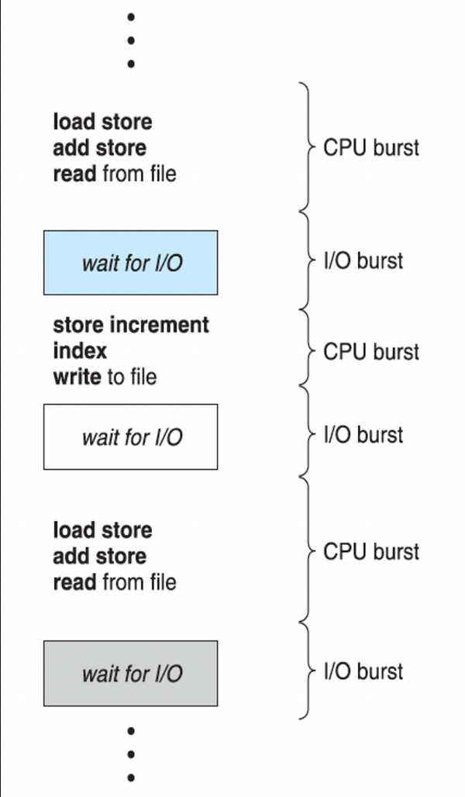
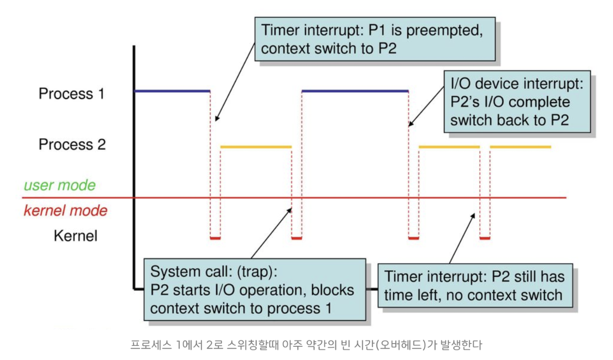
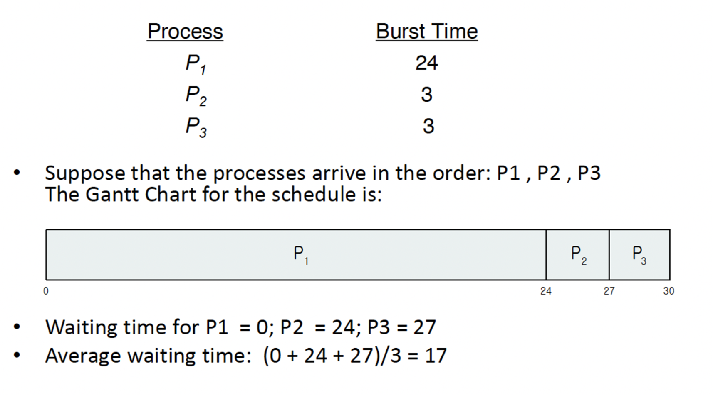
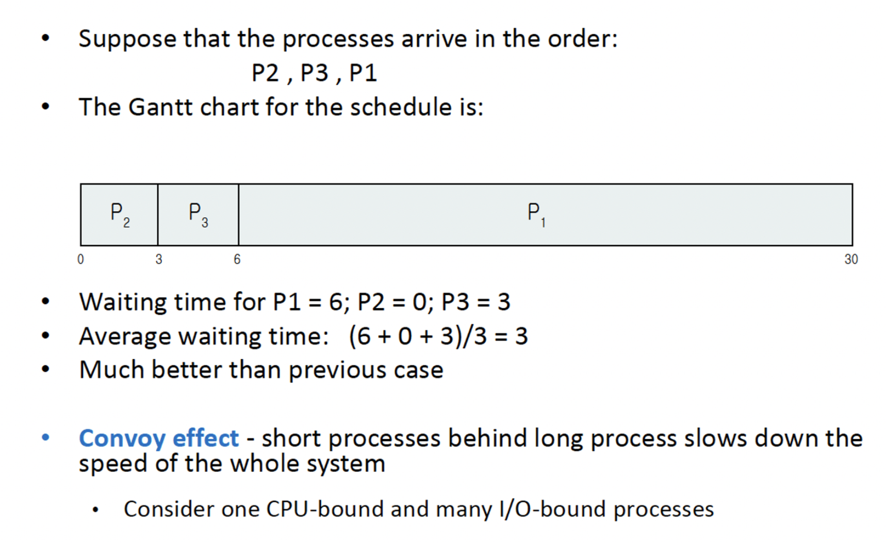
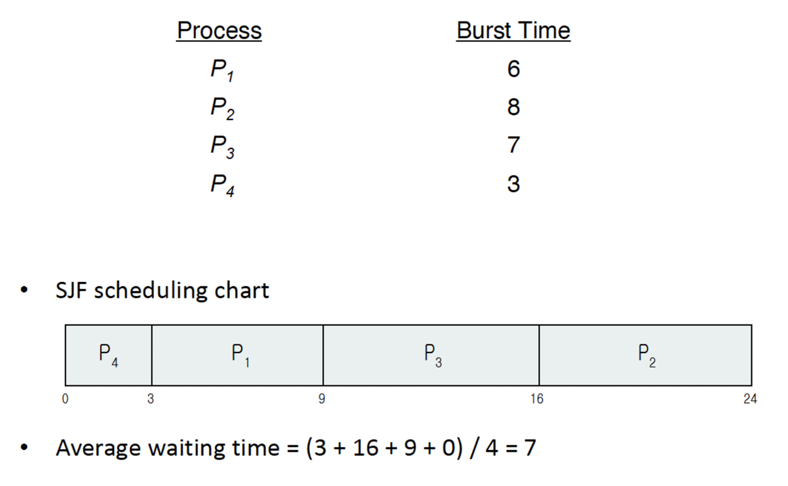
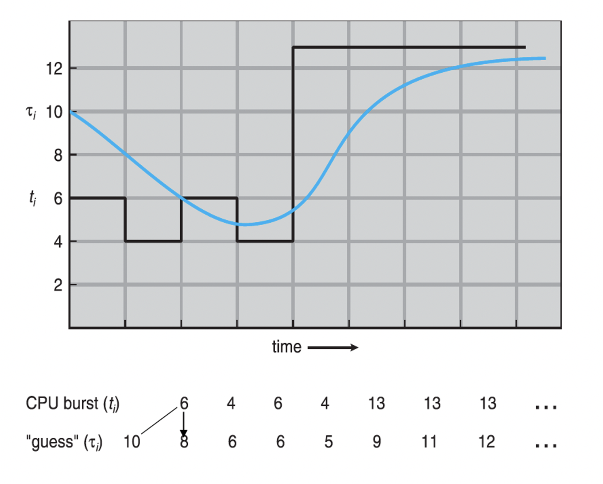
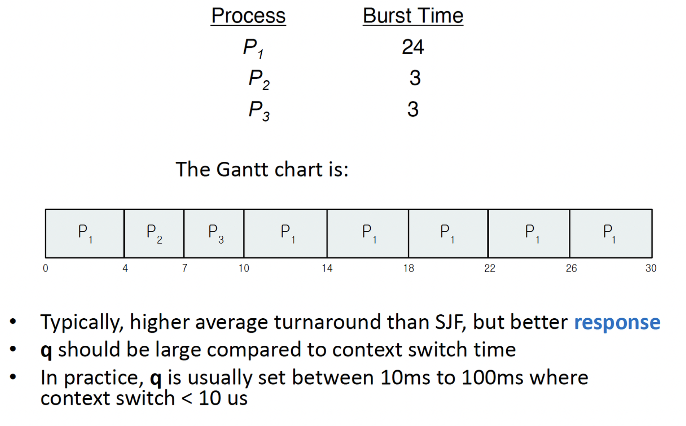
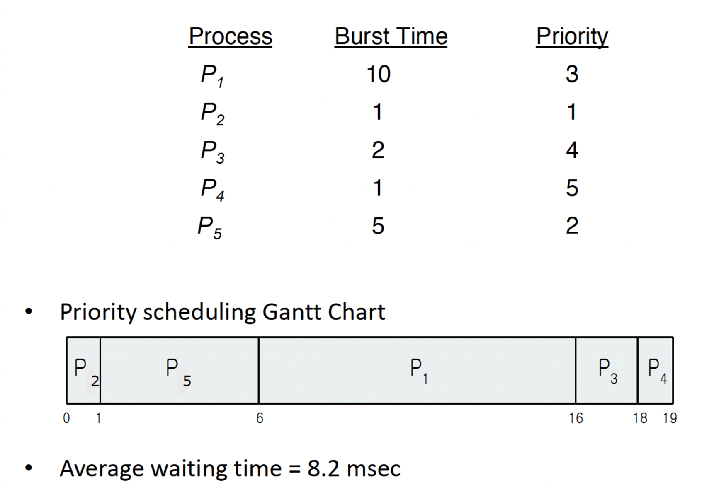
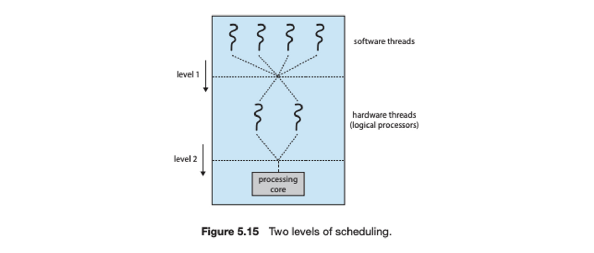

# 목차
1. [기본 개념](#기본-개념)
2. [스케줄링 기준](#스케줄링-기준)
3. [스케줄링 알고리즘](#스케줄링-알고리즘)
4. [스레드 스케줄링](#스레드-스케줄링)
5. [다중 처리기 스케줄링](#다중-처리기-스케줄링)
6. [실시간 CPU 스케줄링](#실시간-CPU-스케줄링)

(널널한 개발자) 운영체제는 국가이고, 프로세스는 가정이며, 스레드는 개인이다. 운영체제가 스레드가 자원을 선점하여 내가 쓸거야 라고 할 때(물론 앞에서 자원의 할당단위는 프로세스, 실행흐름의 단위는 스레드라고 했지만 그냥 비유로 받아드리자) 운영체제는 줄을 서라고 한다. 중요한 건 프로그램이다. 우리는 윈도우 때문에 엑셀을 쓰는게 아니라 엑셀을 쓰려고 윈도우를 쓴다.

선점형(preemitive), 비선점형(non-preemitive)은 스케줄링을 표현하기 위한 용어로 사용된다. 스케줄링은 프로세스 또는 스레드를 대상으로 진행된다. 선점형 스케줄링, 비선점형 스케줄링이라는 단어로 사용한다.

엑셀과 워드가 열려있을 때 엑셀이 cpu를 사용하고 있을 때 워드가 기다리고 있고, 반대로 os 가 이제 excel을 기다리게 하고 워드가 cpu를 사용하게 한다. 이렇게 프로세스가 cpu 자원을 선점해서 쓰려고 하는데 os 가 cpu를 강제로 뺏을 수 있는 것이 선점형 스케줄링 방식이다. 대부분 프로세스는 선점형 스케줄링 방식이고 특수한 경우 제한적으로 비선점형 방식을 사용한다. 엑셀이 만약에 비선점형으로 스케줄링이 된다면 엑셀이 끝날 때까지 워드는 기다리고 있어야한다. os가 못뺏는 것은 아닐텐데, 한 프로세스가 끝날 때까지 기다리게 된다.

그럼 이제 프로세스와 스레드 간의 우선순위를 정해야한다. 예를 들어서 미디어 플레이어는 cpu를 많이 쓰기 때문에 스케줄링 우선순위를 매우 높인다. 그러면 나중에 닫기도 안눌리는 현상이 발생하기도 한다. 20분 정도 걸리는 압축 해제 기능이 있다고 하자. 그럼 사실 20분이냐, 25분 이냐 별로 신경을 안쓴다. 우선순위를 낮춘다. 그리고 GUI 관련 프로그램들은(눈에 보이는 건) 우선순위를 높이고, 백그라운드 작업은 우선순위를 낮춘다. 압축과 비슷하게 느린 입출력을 해야할 경우도 특정 cpu를 선점해서 lock을 하고 기껏 선점한 다음에 wait 하게 될 경우 그것보다 더 큰 낭비가 어디있나? 그래서 non-blocking 이야기가 나왔다. 하지만 반대로 서버는 보통 백그라운드 작업이 우선순위가 높다.

# 기본 개념
cpu 스케줄링은 운영체제가 담당하며, 운영체제의 준비 큐에 있는 프로세스 중 하나를 선택하고(PCB 블록을 선택) cpu를 할당하는 작업을 말한다. 이를 통해 cpu의 자원을 좀 더 효율적으로 사용하도록한다.

<u>프로세스 실행은 cpu 실행과 I/O 대기의 사이클로 구성된다.</u> 프로세스들은 이들 두 상태 사이를 교대로 왔다갔다한다. 프로세스 실행은 cpu burst로 시작된다. 뒤이어 I/O burst 가 발생하고 또 뒤이어 cpu burst가 발생하면서 마지막은 실행을 종료하기 위한 시스템 요청과 함께 끝난다. 프로그램 마다 I/O burst 중심의 프로그램인지 cpu burst 중심의 프로그램인지 다 다르다. 

### 선점 및 비선점 스케줄링
cpu 스케줄링 결정이 일어 날 수 있는 상황
1. 프로세스가 running → waiting 상태 전환
2. 프로세스가 running → ready 상태 전환
3. 프로세스가 waiting → ready 상태 전환
4. 프로세스가 종료할 때

1, 4의 경우 스케줄링에서 선택의 여지가 없다. 실행을 위해 준비 큐에 프로세스가 존재하더라도 반드시 선택되어야한다. (I/O가 일어났는데 기다리지 않거나 프로세스가 종료 되었는데 무시하고 있을 순 없다) 이 때 스케줄링이 발생한 경우를 비선점(nonpreemptive) 또는 협조적(cooperative) 이라고 말한다. 일단 cpu 가 한 프로세스에 할당되면 프로세스가 종료하든지, 대기 상태로 전환해 cpu를 방출할 때까지 점유한다.

그러나 2, 3은 선택의 여지가 있다. 이를 선점(preemptive) 라고한다. 이러한 선점 스케줄링은 데이터가 다수의 프로세스에 의해 공유될 때 경쟁 조건을 초래할 수 있다. 선점은 운영체제 커널 설계에 영향을 준다. 시스템 콜을 처리할 동안, 커널은 한 프로세스를 위한 활동으로 바쁠 수 있다. 그러한 활동은 I/O 큐와 같은 중요한 커널 자료 변경을 포함할 수 있다. 이러한 변경 도중에 <u>**해당 프로세스가 선점**</u>되고(뺏긴다는 의미), 커널(또는 장치 드라이버)이 동일한 구조를 읽거나 변경할 필요가 있으면 어떤 일이 발생할까?

### 디스패처
cpu 스케줄링 기능에 포함된 또 하나의 요소는 디스패처이다. 디스패처는 cpu 코어의 제어를 cpu 스케줄러가 선택한 프로세스에 주는 모듈이며 다음과 같은 작업을 포함한다. <u>**즉 코어의 제어를 cpu 스케줄러에서 프로세스에게 넘기는거다.**</u>
- 한 프로세스에서 다른 프로세스로 문맥을 교환하는 일
- 사용자 모드로 전환하는 일
- 프로그램을 다시 시작하기 위해 사용자 프로그램의 적절한 위치로 이동(jump) 하는 일

컨텍스트 스위칭이 일어날 때 디스패치 지연이 일어난다. (PCB_0에 상태 저장 + PCB_1에서 상태복원 시간)

_(출처: https://inpa.tistory.com/entry/👩‍💻-multi-process-multi-thread)_

여기서 context swiching 이란 한 프로세스에서 다른 프로세스로 전환하는 과정을 의미하며 이 때 이전 프로세스의 실행 마지막에 상태 정보를 PCB에 저장하고, 다음 프로세스의 PCB의 정보를 불러오는데 걸리는 이 시간을 디스패치 지연(dispatch latency)라고 표현한다. <u>그래서 프로세스들이 변경될 때 걸리는 소요시간은 cpu 스케줄링 알고리즘에서 소요되는 시간과 PCB 상태 정보들이 메모리에 저장되고 불러올 때 소요되는 시간들이 모두 더해지게된다.</u> 그리고 스레드 사이에서도 컨텍스트 스위칭이 일어나는데, 멀티 스레딩에서 스위칭 소요시간이 걸려 오히려 싱글 스레드보다 멀티 스레드의 소요시간이 더 걸리는 현상도 발생한다. 프로세스 컨텍스트 스위칭과 다른 점은 하나의 프로세스 내에서 컨텍스트 스위칭이 일어난다는 점이다.

# 스케줄링 기준
CPU 스케줄링 알고리즘을 비교하기 위한 여러 기준이 제시되었다.
1. cpu utilization(이용률)
2. throughput(처리량): 단위시간 당 완료된 프로세스의 개수
3. turnaround time(총 처리시간): 프로세스의 입장에서 본 시간으로 프로세스의 제출 시각과 완료 시간의 시각을 총처리 시간이라고 한다. 즉, 준비 큐에서 대기한 시간 + cpu에서 실행하는 시간 + I/O 시간을 전부 합한 시간이다.
4. waiting time(대기 시간): cpu 스케줄링 알고리즘은 프로세스가 실행하거나 I/O를 하는 시간의 양에 영향을 미치지 않는다. 단지 프로세스가 준비 큐에서 대기하는 시간의 양에만 영향을 준다. 대기 시간은 준비 큐에서 대기한 시간이다.
5. response time(응답 시간): 주고 대화식 시스템(interactive system)에서 욕되며 하나의 요구를 제출한 후 첫번째 응답이 나올 때까지 걸리는 시간이다.

여기서 cpu 이용률과 처리량을 최대화하고 총 처리시간, 대기시간, 응답시간은 최소화하는 것이 바람직하다.

# 스케줄링 알고리즘
다시 복귀해보자. cpu 스케줄링은 준비 큐에 있는 프로세스 중에 어떤 프로세스에 cpu 코어를 할당할지 결정하는 문제를 다룬다. 대부분의 최신 cpu 아키텍처에는 여러개의 코어가 있지만 여기서는 싱글코어라고 가정하고 설명한다. 간트(Gantt)차트는 참여한 각 프로세스의 시작 시각과 종료 시각을 포함하여 특정 스케줄 기법을 도식화하는 막대형 차트로 아래 스케줄링 알고리즘을 간트 차트를 이용하여 표현하고자한다.

### 선입 선처리 스케줄링(First-Come, First-Served Scheduling, FCFS)

프로세스가 어떤 순서로 도착하는지에 따라 평균 대기 시간이 차이가 난다. FCFS 알고리즘은 비선점형이다. 일단 cpu가 한 프로세스에 할당되면, 그 프로세스가 종료하든지, 또는 I/O 처리를 요구하든지 cpu를 방출할 때까지 cpu를 점유한다.

### 최단 작업 우선 스케줄링 (Shortest-Job-First, SJF)

전체 프로세스의 길이가 아니라 cpu burst 의 길이에 의해 스케줄링이된다. 하지만 cpu burst 의 길이를 미리 예측할 방법이 없기 때문에, cpu 스케줄링 수준에서는 구현할 수가 없다. 하지만 예측은 할 수 있다. 

다음 cpu 버스트가 이전 버스트와 길이가 비슷하다고 가정한 후, 다음 cpu 버스트의 길이의 근사값을 계산하여 가장 짧은 예상 cpu버스트를 가진 프로세스를 선택한다. 

다음 cpu 버스트는 일반적으로 이전의 cpu 버스트들의 길이를 지수(exponential) 평균한 것으로 예측한다. 지수 평균을 $\tau_{n}$ 을 n 번째 cpu 버스트의 길이라 하고, $\tau_{n+1}$은 다음 cpu 버스트에 대한 예측값이라고 하자. 그 때 $\tau_{n+1} = \alpha t_n + (1-\alpha)\tau_n$ 으로 표현할 수 있다.

SJF 알고리즘은 선점형이거나 또는 비선점형일 수 있다.

### 라운드 로빈 스케줄링 (Round-Robin Scheduling, RR)

선입 선처리 스케줄링과 유사하지만 시스템이 프로세스들 사이를 옮겨다닐 수 있도록 선점이 추가된다. 시간 할당량(time quantum) 또는 타임슬라이스(time slice) 라고 하는 작은 단위의 시간을 정의한다 (일반적으로 10ms ~ 100ms) 준비 큐는 원형큐(circular queue)로 동작하며 cpu 스케줄러는 준비 큐를 돌면서 한번에 한 프로세스에 한번의 시간할당량 동안 cpu를 할당한다. 준비 큐에 유일하게 실행가능한 프로세스가 있는게 아니라면 연속적으로 두번 이상의 시간 할당량을 할당받는 프로세스는 없다. 만일 프로세스의 cpu 버스트가 한번의 시간 할당량을 초과하면, 프로세스는 선점되고 준비 큐로 되돌아간다. 따라서 RR 스케줄링은 선점형이다.

### 우선순위 스케줄링 (Prirority Scheduling)

SJF 알고리즘은 일반적인 우선순위 스케줄링 알고리즘의 특별한 경우이다. 우선순위가 각 프로세스에 부여되며, cpu는 가장 높은 우선순위를 가진 프로세스에 할당된다. 우선순위는 어떤 측정 가능한 양을 사용하며, 시간 제한, 메모리 요구, 열린 파일 수, 평균 I/O 버스트의 평균 CPU 버스트에 대한 비율 등이 우선순위에 계산된다. 우선순위 스케줄링은 SJF 스케줄링처럼 선점형이거나 비선점형이 될 수 있다. 프로세스가 준비 큐에 도착하면 새로 도착한 프로세스의 우선순위를 현재 실행 중인 프로세스의 우선순위와 비교한다. 선점형 우선순위 스케줄링 알고리즘은  새로 도착한 프로세스의 우선순위보다 높다면 cpu를 선점한다.

이 때 우선순위가 낮은 프로세스는 실행되지 않을 수도 있는데 이는 우선순위가 낮은 프로세스에 대해서 aging이란 방식으로 시간이 지날 때마다 우선순위를 1씩 증가시켜주거나, 같은 우선순위에 대해서 RR 알고리즘을 적용하는 방식이 있다.

### 다단계 큐 스케줄링 (Multilevel Queue Scheduling)

# 스레드 스케줄링
4장에서 프로세스 모델에 스레드를 도입하면서 사용자 수준과 커널 수준 스레드를 구별했다. <u> 대부분의 최신 운영체제에서는 스케줄 되는 대상은 프로세스가 아니라 커널 수준 스레드이다(중요!) </u> 사용자 수준 스레드는 스레드 라이브러리에 의해 관리되고 커널은 그들의 존재를 알지 못한다. <u>cpu상에서 실행되기 위해서 LWP(light weight process)를 통한 간접적인 방식일지라도 사용자 수준 스레드는 궁극적으로 연관된 커널 수준 스레드에 매핑되어야한다.</u> 스레드 스케줄링은 프로세스 스케줄링과 다르게 하나의 프로세스 내에서 여러 스레드가 실행되는 형태이다. 그래서 스레드 간의 동기화 문제가 중요하다.

### 경쟁 범위
사용자 수준과 커널 수준 스레드의 차이 중 하나는 그들이 어떻게 스케줄 되느냐에 있다. 다대일, 다대다 모델을 구현하는 시스템에서는 스레드 라이브러리는 사용자 수준 스레드를 가용한 LWP 상에서 스케줄한다. 이러한 기법은 동일한 프로세스에 속한 스레드들 사이에서 cpu를 경쟁하기 때문에 프로세스-경쟁 범위(process contention scope, PCS)로 알려져있다. 

우리가 스레드 라이브러리가 사용자 수준 스레드를 가용한 LWP 상에서 스케줄 한다고 말하는 경우, 스레드가 실제로 cpu 상에서 실행 중이라는 것을 의미하지 않는다. 실제로 cpu 상에서 실행되기 위해서는 운영체제가 LWP의 커널 스레드를 물리적인 cpu 코어로 스케줄 하는 것을 필요로 한다. cpu 상에서 어떤 커널 스레드를 스케줄 할 것인지 결정하기 위해서 커널은 시스템-경쟁 범위(system-contention scope, SCS)를 사용한다. SCS 스케줄링은 cpu 에 대한 경쟁은 시스템 상 모든 스레드 사이에서 일어난다.

### Pthread 스케줄링

# 다중 처리기 스케줄링
지금까지 우리의 논의는 single processor를 가진 시스템에서 cpu를 스케줄 하는 문제에 주안점을 두었다. 만일 여러개의 cpu를 사용 가능하다면, 여러 스레드가 병렬로 실행될 수 있으므로 부하 공유가 가능해진다. 위에서 single processor를 가졌을 때 cpu 스케줄링에서 보았던 것처럼 여기에도 정답은 없다.

### 다중 처리기 스케줄링에 대한 접근 방법
표준적인 해결방법은 대칭 다중 처리(symmetric multi processing, SMP)이며, 각 processor는 스스로 스케줄링을 할 수 있다. 각 프로세스의 스케줄러가 준비 큐를 검사하고 실행할 스레드를 선택하여 스케줄링이 진행된다. 이는 스케줄 대상이 되는 스레드를 관리하기 위한 두가지 가능한 전략을 제공한다.
1. 모든 스레드가 공통 준비 큐에 있을 수 있다.
    1. 이는 공유 준비 큐에 경쟁 조건이 생길 수 있으므로 두 개의 다른 프로세서가 동일한 스레드를 스케줄링 하지 않도록, 그리고 큐에서 스레드가 없어지지 않도록 보장해야한다.
    2. 큐에 대한 모든 엑세스에는 락 소유권이 필요하므로, 락킹은 매우 경쟁이 심할  것이고 공유 큐 엑세스는 성능의 병목이 될 수 있다.
2. 각 processor는 자신만의 스레드 큐를 가질 수 있다.
    1. 큐마다 부하의 양이 다를 수 있다. 하지만 이는 뒤에 균형 알고리즘으로 모든 프로세서 간의 부하를 균등하게 만들어 줄 수 있다.

window, linux, macos, andriod, ios 의 모바일 시스템을 포함한 거의 모든 최신 운영체제는 SMP를 지원한다.

### 다중 코어 프로세서
SMP 시스템은 다수의 물리 processor를 제공하여 다수의 프로세스가 병렬로 실행되게 한다. 그리고 현대 컴퓨터 하드웨어는 동일한 물리적인 칩 안에 여러 개의 처리 코어를 장착아여 multicore processor 가 된다. 각 코어는 구조적인 상태를 유지하여, 운영체제 입장에서는 개별적인 논리적 cpu처럼 보이게 한다. 

다중 코어 프로세서는 스케줄링 문제를 복잡하게 한다. 연구자들은 프로세서가 메모리에 접근할 때 많은 시간을 허비한다는 것을 발견했다. 메모리 스톨(memory stall) 이라고 하는 상황은 프로세서가 메모리보다 훨씬 빠른 속도로 작동하기 때문에 주로 발생한다. 이런 상황을 해결하기 위해 최근 많은 하드웨어에서는 다중 스레드 처리 코어를 구현했다. 이는 하나의 코어에 2개 이상의 하드웨어 스레드가 할당된다. 이렇게 하면 메모리를 기다리는 동안 하나의 코어에 2개 이상의 하드웨어 스레드가 할당된다. 

운영체제 입장에서 하나의 하드웨어 스레드는 명령어 포인터 및 레지스터 집합과 같은 구조적 상태를 유지하므로 소프트웨어 스레드를 실행할 수 있는 논리적 cpu로 보인다. 그래서 프로세서에는 4개의 코어, 각 코어에 2개의 하드웨어 스레드가 있을 때 운영체제 입장에서는 8개의 논리적 cpu가 있다. 인텔 프로세서는 단일 하드웨어 코어에 여러 하드웨어 스레드를 할당하는 것을 설명하기 위해 <u>**하이퍼-스레딩(동시 다중 스레드(simultaneous multithreading, SMT) 라고도 함)**</u> 이라는 용어를 사용한다.

2단계 스케줄링 구조 : <u>**물리적 코어의 자원(캐시 및 파이프라인 등)은 하드웨어 스레드 간에 공유되어야 하므로 처리 코어는 한번에 하나의 하드웨어 스레드만 실행할 수 있다**.</u> 결과적으로 다중 스레드 다중 코어 프로세스는 현실적으로 두 개의 다른 스케줄링 단계가 필요하다.

- level 1 에서는 운영체제가 각 하드웨어 스레드에서 실행할 소프트웨어 스레드를 선택할 때 결정한다. 이 단계에서 os가 위에서 싱글 코어 스케줄링 알고리즘(FCFS, SJF, RR 등) 중 임의의 알고리즘을 선택할 수 있다.
- level 2에서 각 코어가 실행할 하드웨어 스레드를 결정하는 방법을 명시한다.

### 부하 균등화

### 처리기 선호도

### 이기종 다중 처리

# 실시간 CPU 스케줄링
실시간 운영체제에서 cpu를 스케줄링할 때는 일반적으로 연성(soft) 실시간 시스템과 경성(hard) 실시간 시스템으로 구분한다. 경성 실시간 시스템은 정해진 시간안에 테스크를 반드시 끝내도록 스케줄링 하며, 연성 실시간 시스템은 중요 실시간 프로세스가 그렇지 않은 프로세스보다 우선권만 가진다는 것을 보장한다(실시간 프로세스가 스케줄 되는 시점에 대해서는 아무런 보장을 하지 않는다)

<u>실시간 운영체제에서 중요한 것은 실시간 프로세스가 cpu를 필요로 할 때 바로 응답을 해주는 것이다. 따라서 실시간 운영체제의 스케줄러는 선점을 이용한 우선순위 기반의 알고리즘을 지원해야한다. </u>리눅스, 윈도우, 솔라리스 같은 운영체제는 실시간 프로세스에게 가장 높은 우선순위를 부여한다. 이처럼 선점과 우선순위 기반의 스케줄러를 제공하는 것은 연성 실시간 기능을 제공하는 것에 해당하는데 그러므로 실시간 테스크가 마감시간 내에 확실히 수행하는 것을 보장하지 않는다.

1. 지연시간 최소화
2. 우선순위 기반 스케줄링
3. Rate-Monotonic 스케줄링
4. Earliest-Deadline-First 스케줄링
5. 일정 비율의 몫 스케줄링
6. POSIX 실시간 스케줄링

# 운영체제 사례들

# 알고리즘의 평가
