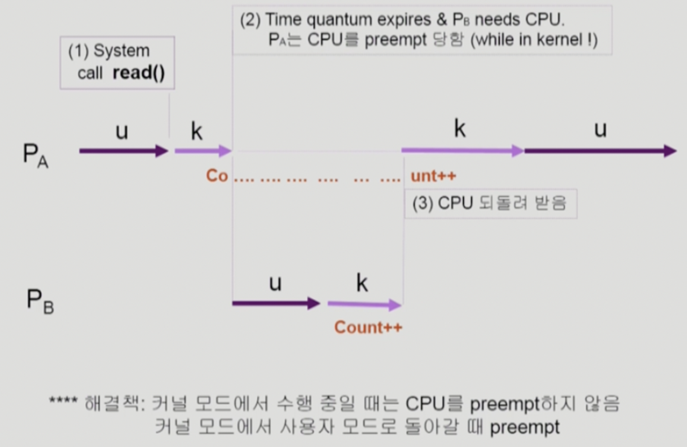
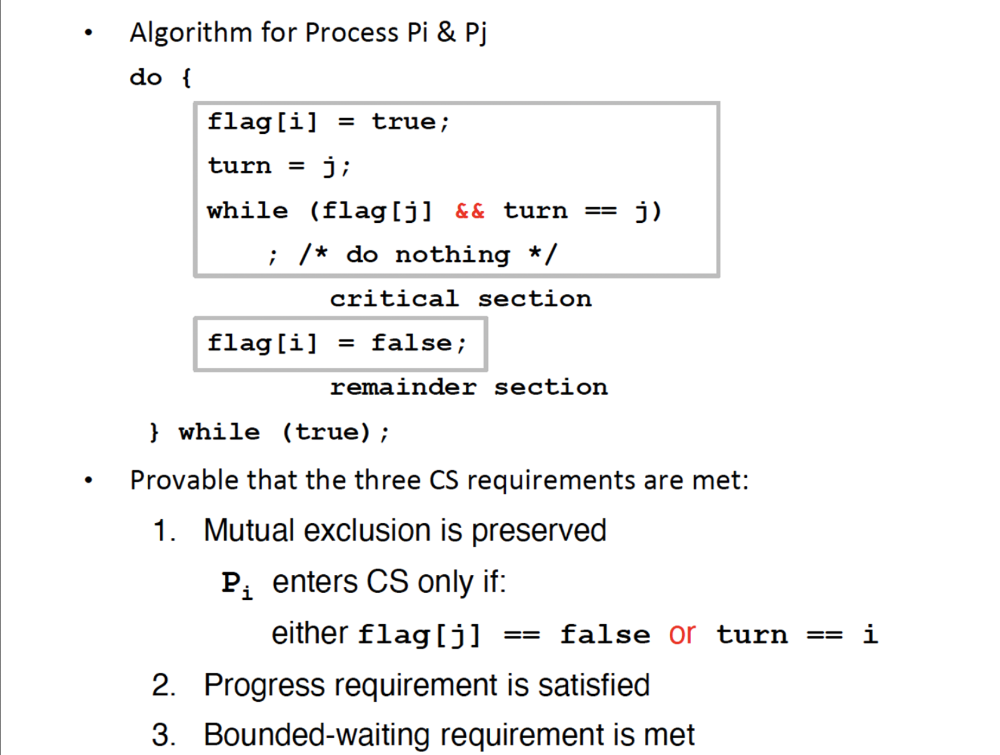
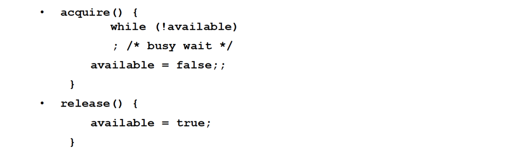
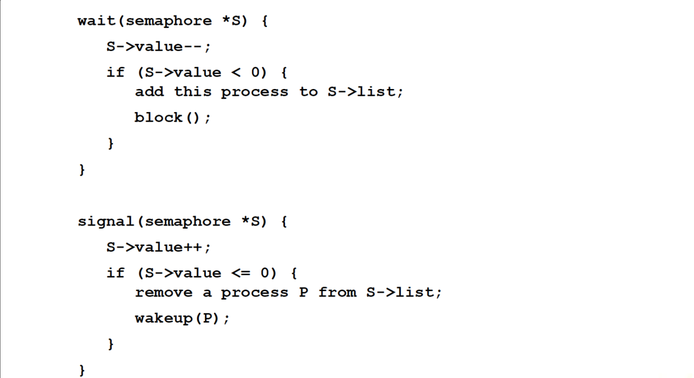

# 목차
1. [배경](#배경)
2. [임계구역 문제](#임계구역-문제)
3. [Peterson의 해결안](#Peterson의-해결안)
4. [동기화를 위한 하드웨어 지원](#동기화를-위한-하드웨어-지원)
5. [Mutex Locks](Mutex-Locks)
6. [세마포](#세마포)
7. [모니터](#모니터)
8. [라이브니스(Liveness)](#라이브니스(Liveness))

이 장이 나중에 코딩할 때 가장 많이 활용하는 파트라서 중요하다. 여기서 동기화 라는 것은 프로세스/스레드를 동시에 실행해도 race condition을 발생시키지 않고 공유 데이터의 일관성을 유지하는 것이다.

이 장의 목표는 다음과 같다.

- 임계구역 문제를 설명하고 경쟁 조건을 설명
- 메모리 장벽, compare-and-swap 연산 및 원자적 변수를 사용하여 임계구역 문제에 대한 하드웨어 해결책 설명
- mutex, lock, semaphore, monitoring 및 condition variable 을 사용하여 임계구역 문제를 해결
- 적은, 중간 및 심한 경쟁 시나리오에서 임계구역 문제를 해결하는 도구를 평가

(널널한 개발자) 중요한 건 여러 개 프로세스가 동시에 한 대상에 접근하면 필연적으로 나타나는 조건이 race condition 이다. 예를 들어 전역 변수 하나를 프로세스 여러개가 동시에 접근했을 때 문제가 발생한다. 코드에서는 한 구문이지만 여러 cpu명령으로 이루어져있다. 예를들어 sum = sum + 1 과 같은 코드가 있다고 했을 때 RAM에서 레지스터로 불러오는 명령어(1), 1을 더하는 명령어(2), 다시 레지스터에서 메모리로 저장하는 명령어(3)가 존재한다. 그래서 코드가 원자성을 띄고 있다는 것은 여러 cpu 명령이 실행될 때 다른 것이 실행 될 수 없다는 것을 의미한다. 

공유자원은 대표적으로 메모리와 파일이 있을 수 있다. 화장실에 들어갈 때 lock을 하고 나올 때 unlock을 하는 것처럼 공유자원을 건드리는 서로 다른 두개의 프로세스가 있을 때 실행되기 시작할 때 lock을 걸어야한다. 위의 예시에서 1을 더하고 메모리에 저장하기 전에 suspend되었다고 해보자. 그 때 다른 스레드가 메모리에서 불러오고 -1을 계산하는 코드가 실행되면, 원하는 결과를 얻지 못할 수 있다. 임계 구간은 무엇을 임계구간으로 정의해야하는가? 임계구간은 무조건 최소화를 해야한다. 이 구간이 길어지면 효율도 안좋도 deadlock을 초래할 수 있다. 없앨 수 있으면 없애는게 좋다.

그럼 임계구역 해결방법은? 구역을 어디를 어떤 근거를 가지고 선택하지? 이것은 경험에서 비롯한다. 해결할 수가 있나? 에 대한 의문이 있다. 상황에 따라 교과서로 해결 안되는 경우가 많다.

전역적 자료구조에 동시 엑세스를 할 때 가장 흔하게 발생한다. DB 서비스를 사용하게 되면 알아서 읽기, 추가, 삭제의 동시성을 알아서 관리해준다. 기능 단위 operation 을 하나로 단위화하고 원자성을 부여해야할 수도 있다. 프로세스 동기화는 세마포어, 뮤텍스 여러가지 있다.

스레딩을 하는 뭔가를 설계할 때 ‘모니터’를 중요하게 보자. 스레드든 프로세스든 동기화의 목표를 달성하기 위해서 항상 달성하기 위해서는 Queue이다. 스레드 내부에서 연산하면 queue(ex. 연결리스트) 에서 가져온다. 세상의 모든 스레드들은 처리하는 로직과 queue가 있다. 어떤 스레드는 i/o만 하고, 어떤 스레드는 검색만 하고 근데 전부 queue에서 데이터를 들고온다. queue에서 병목 현상이 있을 수 있다. 이 구조를 모니터 구조라고한다. 모니터 구조는 굉장히 중요하다. 이렇게 구조를 설계하면 교착상태는 잘 발생하지 않는다.

도스 시스템에서는 동기화는 전혀 필요가 없었다. window3.1 넘어와도 혼자 컴퓨터를 쓰니까 몰랐다. 리눅스는 처음부터 여러 사용자를 대상으로 설계를 했었고, 한 데이터를 여러 사용자가 접근하는 경우가 많았다. 이를 data consistency 의 문제라고한다. 하나의 데이터를 가지고 여러 process가 접근하려고 하는 상황을 race condition 이라고한다.

# 배경
프로그래밍 코드의 입장에서 봤을 때는 단일 명령문처럼 보일지 몰라도 cpu의 입장에서 봤을 때는 여러 라인의 기계어로 변환되어 실행된다. 기계어의 실행 도중에 context switching이 일어날 수 있다.

동시에 여러개의 프로세스가 동일한 자료를 접근하여 조작하고, 그 실행 결과가 접근이 발생한 특정 순서에 의존하는 상황을 **경쟁 상황(race condition)**이라고 한다. race condition 으로 부터 보호하기 위해 하나의 프로세스가 특정 코드에 접근하여 조작하도록 보장해야한다.

# 임계구역 문제
**임계 구역(critical section)**은 공유 자원에 접근하는 코드 영역을 의미한다. 예를 들어 메모리에서 전역 변수 또는 static 변수들이 저장된 힙 영역에 저장된 자원에 접근하는 코드 영역을 의미한다.

임계 구역에는 동 시에 두개 이상의 프로세스가 접근할 수 없다. 이러한 임계 구역 시작부분은 entry section, 마지막 부분을 exit section, 나머지 구역을 remainer section 이라고 한다.


임계 구역 문제를 풀기 위해서는 다음 세가지를 충족해야한다.
1. 상호 배제(mutual exclusion): critical section은 딱 1개의 프로세스만 실행할 수 있다
2. 진행(progress): critical section에서 실행되는 프로세스가 없고, critical section으로 진입하려는 프로세스가 있다면 remainer section에서 실행 중이지 않은 프로세스만 진입에 참여할 수 있다
3. 한정된 대기(bounded waiting): critical section에 진입하려는 요청을 한 후부터 무한정 기다리진 않는다 (앞서 임계구역에 진입하도록 허용하는 횟수에 한계가 있어야 한다)
    1. 스케줄링에서 bounded wating과 다르다. 스케줄링에서 bounded waiting 은 cpu할당을 못받고 여기서는 cpu를 받는다

운영체제라는 소프트웨어 내에서 정말 다양한 경쟁조건이 생길 수 있다. 파일을 read와 write를 동시에 한다던지, process id 요청을 동시에 한다던지 등. 그래서 운영체제 내에서 임계 구역을 다루기 위해서 선점형 커널과 비선점형 커널의 두가지 접근법이 필요하다
- 선점형 커널(preemptive kernal) : 프로세스가 커널 모드에서 수행되는 동안 선점되는 것을 허용. 이 때 커널을 설계할 때 경쟁 조건을 고려해서 신중하게 설계해야한다.
- 비선점형 커널(nonpreemptive kernal) : 프로세스가 커널 모드에서 수행되는 동안 선점되는 것을 허용하지 않음. 이 때는 커널 안에서 실행 중인 프로세스는 하나밖에 없으므로 경쟁 조건을 고려할 필요가 없다.

nonpreemptive kernal 은 race condition이 발생하지 않는다. 하지만 이렇게 구현되어있는 os는 존재하지 않는다. 모든 os는 preemptive kernal 로 구현된다. 이 race condition을 최대한 핸들링 하려고 노력한다. 하드웨어 스펙은 엄청 올랐는데, 속도가 크게 증가하지 않는다고 느낀 이유는 os 알고리즘도 그에 맞게 복잡도가 올라가기 때문이다.

두개의 프로세스가 실행중인데 시스템 콜을 통해 I/O를 하는도중 커널모드로 선점 당하여 다른 프로세스가 실행되고 해당 프로세스도 I/O를 위해 커널모드를 사용하면 커널 내에서 활용하고 있는 데이터에 대해 race condition이 발생할 수 있다

_https://sihyung92.oopy.io/os/6#4401f752-9c38-4f82-b427-840bf5c2c920_

근데 두개 이상의 프로세서를 가지고 있는데 같은 메모리 주소에 접근하면 race condition이 발생할 수 있다. 각 프로세서는 각각 별도의 작업 큐와 인터럽트 요청라인(그냥 cpu에게 인터럽트를 거는 것)을 가지기 때문에 인터럽트를 단순히 disable한다고 해서 해결 할수가 없다. 해결 방안은 커널에 접근할 수 있는 cpu를 1개로 제한하거나, 데이터에 lock을 거는 것인데 전자는 비효율적이다.

# Peterson의 해결안
임계구역 문제에 대한 고전적인 해결책을 제시한다.

임계구역과 나머지 구역을 번갈아 실행하는 두 개의 프로세스가 있다고 가정한다. turn 변수는 임계구역으로 진입할 순번을 나타낸다. turn == i 이면 프로세스 i가 임계구역에서 실행될 수 있다. flag 배열은 프로세스가 임계구역으로 진입할 준비가 되었다는 것을 나타낸다. flag[i] 가 true 일 때 프로세스 i 가 임계구역으로 진입할 준비가 되었다는 것이다.


피터슨의 해결안은 최신 컴퓨터 아키텍처에서는 작동하지 않는다. 주된 이유는 시스템 성능을 향상 하기 위해 프로세서 및 컴파일러가 종속성이 없는 읽기 및 쓰기 작업을 재정렬 할 수 있기 때문이다. 위 코드에서 flag[i] = true와 turn = j 의 순서가 바뀌면 두 스레드가 동시에 임계구역에 접근할 수 있게 된다.

# 동기화를 위한 하드웨어 지원
위에서 이러한 임계구역 문제에 대한 소프트웨어-기반 해결책을 설명했다 (상호 배제를 보장하기 위해 특정 하드웨어 명령어를 포함하지 않는다) 하지만 코드 재정렬로 인해 최신 컴퓨터 아키텍처에서는 잘 작동하지 않을 수도 있다. 그래서 임계구역 문제를 해결하기 위한 세 가지 하드웨어 명령어를 제시한다.
1. 메모리 장벽
2. 하드웨어 명령어
    1. test_and_set() : 이 명령어는 cpu에서 지원하는 atomic 한 명령어로 실행 중간에 간섭받거나, 중단되지 않으며, 동시에 실행될 수 없다. 만일 기계가 test_and_set() 명령어를 지원한다면, false로 초기화되는 lock 이라는 bool 변수를 선언하여 상호 배체를 구현할 수 있다.
    2. compare_and_swap()
3. 원자적 변수

이것도 전부 한계점이 존재한다 (아 아직 이해하기가 어렵다..) 그래서 보다 일반적인 상황에서 경쟁 조건을 해결하는 더 강력한 도구를 살펴보자.

요즘 아래는 잘 안쓴다
- sei : timer 같은 인터럽트 발생하면 지금 프로세스 멈출 수 있다
- cli : 인터럽트 발생해도 안멈추고 무조건 진행해야한다

스레드의 특징인 공유 자원에 대한 동시 엑세스로 인한 문제로, 이를 방지하기 위한 상호배제(Mutual Exclusion), 점유와 대기(Hold and Wait), 비선점(No Preemption), 순환 대기(Circular Wait) 등의 알고리즘을 통해 극복해야 한다.

# Mutex Locks
[링크](https://blog.naver.com/ding-dong/222626631093)도 함께 참고하자.

운영체제 설계자들은 임계구역 문제를 해결하기 위한 상위 수준 소프트웨어 도구들을 개발한다. 가장 간단한 도구가 바로 mutex(mutual exclusion) 락이다. 

### Mutex Lock
- 임계구역을 보호하고, 따라서 경쟁 조건을 방지하기 위해 mutex 락을 사용한다. 즉, 프로세스는 임계 구역에 들어가기 전에 반드시 락을 획득해야하고(acquire 함수 실행) 임계구역을 빠져나올 때 락을 반환해야한다(release 함수 실행).
- mutex는 lock을 건 스레드만이 임계영역을 나갈 때 락을 해제할 수 있다.
- 아래 스핀락은 busy waiting 상태를 유지한다면, 뮤텍스는 wait 상태로 들어갔다가 wakeup 이 되면 ready 상태가 되어 권한 획득을 시도한다. 뮤텍스 락은 스핀 락보다 더 개선된 형태라고 할 수 있다.
- 시스템 전반의 성능에 크게 영향을 주지 않고 길게 처리해야 하는 작업에서 주로 뮤텍스 락을 사용한다.

### Spin Lock

- 위 처럼 구현된 것의 단점은 계속 루프를 돌면서 acquire()을 실행하는 busy waiting 의 상태가 지속된다. 이는 cpu 주기를 낭비하는데 이런 mutex 락 유형을 스핀락(spinlock)이라고 한다. 락을 사용할 수 있을 때까지 회전하기 때문이다. (앞에서 compare_and_swap() 명령을 설명하기 위한 코드 예제와 동일한 문제가 있다) 그래서 멀티 프로세서 시스템(또는 멀티코어)에서만 사용이 가능하다.
- 스핀락은 오직 획득과 반환만 존재하며, 한번에 하나의 컴포넌트만 접근 가능하며 획득과 반환의 주체는 동일하다.
- 스핀락은 프로세스가 락을 기다려야하고, 문맥 교환에 상당한 시간이 소요될 때 문맥 교환이 필요하지 않다는 장점이 있다. 뮤텍스에서는 락을 취득하지 못한 스레드는 wait 큐로 들어가고 나중에 ready로 전환될 때 이 과정에서 컨텍스트 스위칭이 발생한다. 이 때 critical section에서의 작업이 컨텍스트 스위칭에 걸리는 시간보다 더 빨리 끝난다면 스핀락이 뮤텍스보다 시간적으로 더 이점이 있을 수 있다.
- 실제로 다중 코어 시스템의 특정 상황에서는 잠깐 동안 락을 유지해야하는 경우 임계구역을 실행하는 동안 다른 스레드는 다른 코어에서 ‘스핀’하고 있을 수도 있다.

# 세마포
뮤텍스와 스핀락과 달리 정수 변수를 품은 객체라고 보면된다. 이 정수 변수는 lock 개수라고 생각하면된다. 둘 이상의 프로세스 또는 스레드가 공유자원에 접근할 수 있도록 허용한다.

### 세마포어
```c
// 각 세마포는 한 개의 정수와 프로세스 리스트를 가진다

typedef struct {
    int count;
    struct process *list;
} semaphore;
```


- 프로세스가 세마포를 기다려야 한다면 이 프로세스를 세마포의 프로세스 리스트에 추가한다. signal 연산은 프로세스 리스트에서 한 프로세스를 꺼내서 그 프로세스를 깨워준다. 그래서 세마포 정의는 위와 같다.
- wait와 signal 두 가지 연산을 사용한다.
    - 프로세스가 자원을 사용하려는 경우 wait을 호출하여 프로세스가 락을 얻는다. 즉, 세마포어의 값을 감소시킨다. critical section에 접근할 수 있는지 확인하여 접근한다. 값이 음수가 되면 스레드는 block 한다
    - 프로세스가 자원을 반환하려는 경우 signal을 호출하여 락을 반환한다. 즉, 세마포어의 값을 증가시킨다. critical section에서 빠져나온다.
- 이 때 wait와 signal 연산 중 세마포의 정수 값을 변경하는 연산은 반드시 원자적이으로 수행되어야한다.
- signal 메커니즘으로 락을 걸지 않은 스레드도 signal을 통해 락을 해제할 수 있다.
- 또한 세마포어는 순서대로 스레드가 실행되어야할 때도 사용될 수 있다.
- wait 연산을 하고 세마포 값이 0보다 같거나 작을 때(사용가능한 자원이 없다면) 프로세스는 대기를 하는데, busy waiting 방식이 아니라 프로세스는 자신을 일시 중지 시키고 wait 큐에 넣는다(wait 상태로 변환) 그 후 cpu 스케줄러는 다른 프로세스를 실행한다. 다른 프로세스가 signal 연산을 실행하면 프로세스는 wakeup 연산에 의해 재시작 되는데 이때 wait 큐에서 ready 큐로 옮겨진다. 이것이 수행되는지 여부는 cpu 스케줄링 알고리즘에 따라 달라진다. ([출처링크](https://sihyung92.oopy.io/os/6#4401f752-9c38-4f82-b427-840bf5c2c920))

세마포어의 두가지 사용법
1. counting semaphore (개수 세마포어)
    - 0이상의 임의의 정수값인 세마포어 이며, 여러개의 자원을 가질 수 있다.
2. binary semaphore (이진 세마포어)
    - 0 또는 1만 가질 수 있는 세마포어. 자원이 하나라서 뮤텍스로도 사용 가능하다. 하지만 완전히 동일한건 아니다. 뮤텍스는 락을 가진 스레드만 락을 해제할 수 있지만 세마포어는 그렇지 않다. 또 뮤텍스는 priority inheritance 속성을 가지지만 세마포어는 그렇지 않다

뮤텍스와 차이점
- 뮤텍스는 락을 가진 자만 락을 해제할 수 있지만 세마포어는 그렇지 않다. 뮤텍스는 락을 가진 프로세스나 스레드만 해제할 수 있다. 그래서 누가 락을 해제할지 예상할 수 있다. 하지만 세마포어는 wait를 하는 존재와 signal을 하는 존재가 다를 수 있다.
- 뮤텍스는 priority inheritance 속성을 가지지만 세마포어는 그 속성이 없다.
    - 여러 프로세스 또는 스레드가 실행을 하면 cpu에서 컨텍스트 스위칭이 일어나는데 스케줄링이 일어난다. 그 중에 하나가 우선순위 큐에 따라서 실행하는 방식이 있다. 만약 같은 자원에 접근해서 락을 획득하려고 하는 상황이 있을 때 low priority의 프로세스가 락을 지었을 경우 high priority의 프로세스는 실행할 수 없게 된다. low priority 프로세스에 의존성을 가지게 된다. 우선순위가 높음에도 low p가 락을 가지고 있기 때문에 아무것도 할 수 없다.
    - 이 문제는 뮤텍스에서는 락을 가진 프로세스가 락을 해제할 수 있으므로 이 경우 low priority 프로세스의 우선순위를 high priority 프로세스의 우선순위만큼 올려버린다. 그래서 스케줄러가 스케줄링을 할 때 low priority 프로세스의 우선순위를 높여 우선 실행시킨 후 critical section을 빠져나오게한다.

그래서 상호 배제만 필요하다면 뮤텍스를, 작업 간의 실행 순서 동기화가 필요하다면 세마포어를 권장한다. 스핀락, 뮤텍스, 세마포어의 구체적인 동작 방식은 os와 프로그래밍 언어에 따라 조금씩 다를 수 있으니 관련 문서를 잘 알아봐야한다.

# 모니터
세마포가 프로세스 동기화를 위해 사용될 수 있지만, 잘못 사용하면 (때때로) 발견하기 어려운 타이밍 오류를 만들게된다. 프로그래머에 의해 프로그래밍 오류가 발생할 수 있는데 예를들어 signal을 호출해야하는 경우 실수로 wait을 호출할 수 있다. 이러한 오류를 처리하기 위해 간단한 동기화 도구를 통합한 고급 언어 구조물에 대한 필요성이 대두되는데 이것이 모니터 타입이다. ([링크](https://sihyung92.oopy.io/os/6#4401f752-9c38-4f82-b427-840bf5c2c920))

# 라이브니스(Liveness)
프로세스가 실행 수명주기 동안 진행되는 것(무기한 대기를 막는 것)을 보장 하기 위해 시스템이 충족해야 할 일련의 속성을 Liveness 라고 말한다. 방금 말한 무기한 대기(ex. 무한루프) 하는 프로세스는 라이브니스 실패의 한 예시다. 또 busy wating는 라이브니스  실패의 가능성이 있는데, 특히 프로세스가 임의로 오랜 시간동안 루프를 돌고 있는 경우 그러하다. mutex 락 및 세마포와 같은 도구를 사용하여 상호 배제를 제공하려는 노력은 프로그래밍을 하면서 잘못될 수 있는 여지 들이 있다. 라이브니스 실패로 이어질 수 있는 두가지 상황은 다음과 같다.

1. 교착 상태(Deadlock)
2. 우선순위 역전(Priority Inversion)

