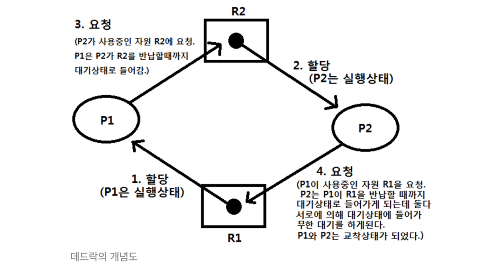
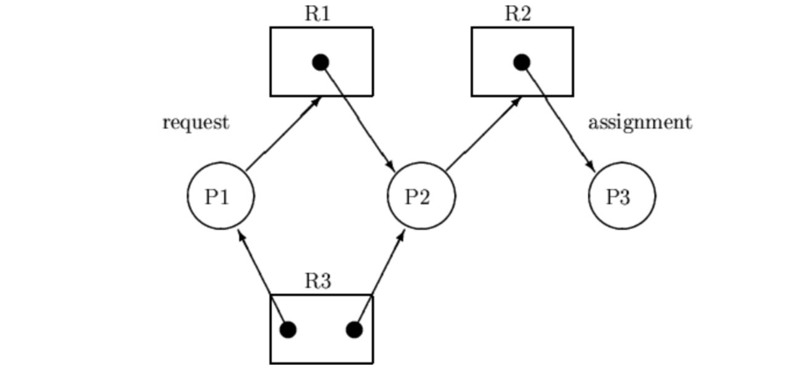
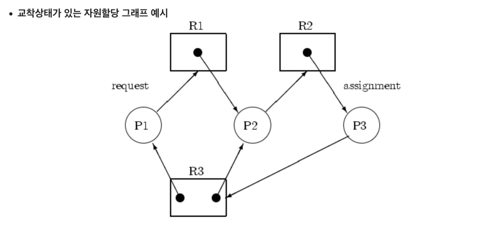
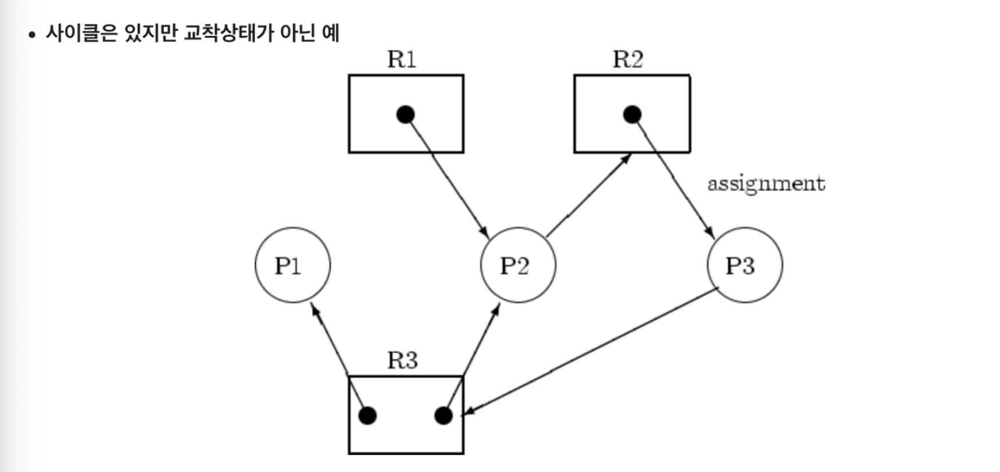
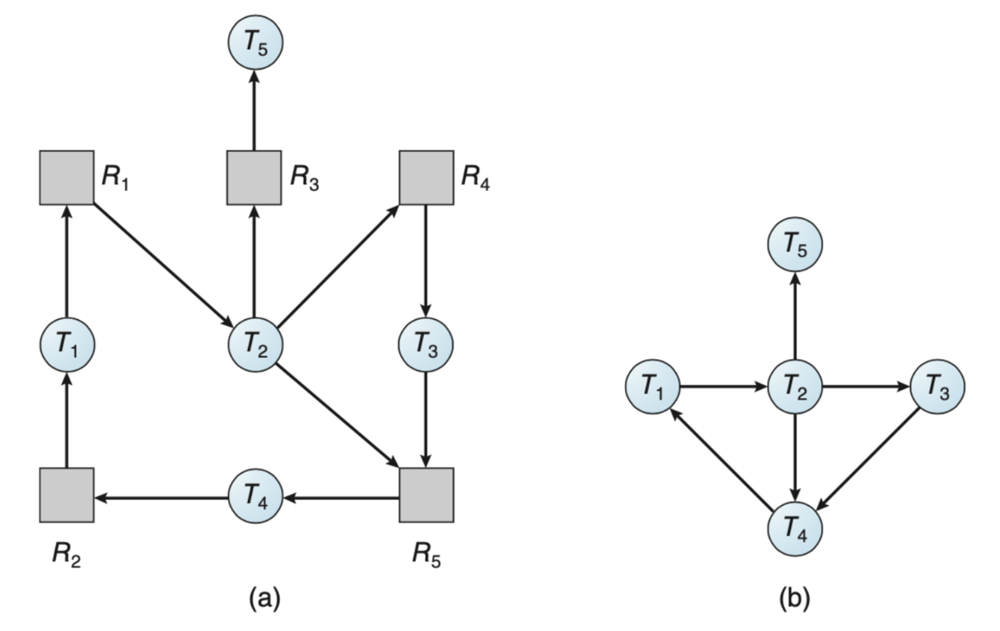

[링크](https://sihyung92.oopy.io/os/7)를 참고하여 정리
여러 프로세스들이 각자 자원(I/O device, cpu 사이클, 메모리, 세마포 등) 을 가지고 있고 또 요청한 상태에서 모두 block된 상태를 교착 상태라고 하자. 그럼 좀 더 어렵게 표현해보자.

다중 프로그래밍 환경에서는 여러 스레드가 한정된 자원을 사용하려고 서로 경쟁할 수 있다. 한 스레드가 자원을 요청했을 때, 그 시각에 그 자원을 사용할 수 없는 상황이 발생하면 스레드는 대기 상태로 들어간다. 이처럼 대기 중인 스레드들이 요청한 자원들에 대해서 자원들이 다른 스레드에 의해 점유되어 있을 때의 상태를 교착 상태라고 부른다. (좀 다르게 표현하면 프로세스 집합 내의 모든 프로세스가 그 집합의 다른 프로세스에 의해서만 일어날 수 있는 이벤트를 기다리는 상황이다)

_https://sihyung92.oopy.io/os/7_

보통 운영체제들은 교착 상태 예방 기능을 제공하지 않는다. 따라서 교착 상태가 없는 프로그램을 설계하는 것은 전적으로 프로그래머의 책임으로 남는다.

# 시스템 모델 

# 다중 스레드 응용에서의 교착상태
## 라이브 락

# 교착 상태 특성
### 필요조건들
교착 상태 발생 조건. 다음 네가지 조건이 동시에 성립될 때 발생한다.
1. 상호 배제(mutual exclusion)
    1. 프로세스가 자원을 사용할 때 다른 프로세스와 동시에 사용할 수 없는 조건
2. 점유하며 대기(hold and wait)
    1. 한 자원을 점유한 상태에서 다른 자원을 요청하기 위해 대기 할 수 있는 상태
3. 비선점(non-preemition)
    1. 한 프로세스가 자원을 할당 받으면 작업이 끝날 때까지 시스템에서 제어권을 뺏을 수 없는 조건을 의미
4. 순환 대기(circular wait)
    1. 여러 개의 프로세스가 서로의 자원을 요청하는 상태

### 자원 할당 그래프

# 교착 상태 예방
이 중 하나만 만족하지 않도록 만들어보자.

상호 배제
- 공유 해서는 안되는 자원의 경우 반드시 성립해야하기 때문에 교착 상태를 예방한다는 이유 만으로 만족하지 않게 할 수 없다.

점유하며 대기
- 프로세스가 자원을 요청할 때 다른 자원을 가지고 있지 않아야한다.
- 방법 1 : 프로세스 시작 시 모든 필요한 자원을 할당받게 함
- 방법 2 : 자원이 필요한 경우 보유 자원을 모두 놓고 다시 요청함

비선점
- 프로세스가 자원을 기다려야 하는 경우 보유한 자원들이 선점된다 (다른 걸 원하면 가지고 있는걸 뺏는다)
- 필요한 자원을 얻을 수 잇을 때 그 프로세스는 다시 시작된다.
- 상태를 쉽게 저장하고 복구할 수 있는 자원에서 주로 사용한다(cpu, memory 등)

순환 대기
- 모든 자원 유형에 할당 순서를 정하여 정해진 순서 대로만 자원을 할당한다.

# 교착 상태 회피
각 프로세스들이 필요로 하는 각 자원별 최대 사용량을 미리 선언한다.

회피 알고리즘
- 자원이 하나인 경우 : 자원 할당 그래프 알고리즘
- 자원이 여러개의 경우 : 은행원 알고리즘 (by 다익스트라)

### 안전 상태

### 자원 할당 그래프 알고리즘
https://wannabe-gosu.tistory.com/26

자원이 하나일 때 사용하는 알고리즘으로, 자원 할당 그래프의 요청선과 할당선이 존재한다. 요청선은 프로세스가 자원을 사용하고 싶다고 요청을 보내는 선이고, 할당선은 자원이 프로세스를 사용하고 있다고 알려주는 선이다.

이 때 교착 상태의 확인 방법은 
1. 자원 할당 그래프에 사이클이 존재하는지 확인한다
    1. 사이클이 존재하지 않으면, 교착 상태 아님
    2. 사이클이 존재하면
        1. 자원에 하나의 프로세스가 존재할 때: 교착 상태
        2. 자원에 여러 프로세스가 존재할 때: 교착 상태의 가능성

### 은행원 알고리즘
[출처](https://jhnyang.tistory.com/102)

교착 상태에 빠질 가능성이 없는 상태를 safe state(안전 상태), 있는 상태를 unsafe state(불안전상태)로 나눴다. 그리고 운영체제는 안전 상태를 유지할 수 있는 요구만 수락하고 불안전 상태를 초래할 사용자의 요구는 나중에 만족될 때까지 계속 거절한다. 즉, 최소한 고객 한명이 원하는 금액을 대출 할 수 있는 만큼의 금액을 은행이 항상 보유하고 있어야한다 는 개념에서 나온다.

모두가 해결할 수 있는 순서를 안전 순서열이라고 한다. 이 안전 순서열이 항상 존재하는 상태로 자원을 할당해 줘야하기 때문에, 최대 자원 요구량을 미리알고 프로세스들이 유한한 시간 안에 자원을 반납해야하기 때문에 실제로 운영체제에서 채택하고 있는 방식은 아니다.

# 교착 상태 탐지
### 각 자원 유형이 한개씩 있는 경우
회피에서 본 자원 할당 그래프를 활용할 수도 있지만 자원의 최대 사용량에 대해서는 알 필요가 없어서 간소화한 그래프를 활용한다. 이 그래프를 대기 그래프(wait for graph) 라고 한다.

아래에서 (a)가 자원할당 그래프이고, (b)가 대기 그래프이다. 예를 들어 아래 대기 그래프에서 T1 → R1 → T2 의 그래프를 T1 → T2 로 간소화했다고 생각하면 된다. 이는 T1이 T2의 자원이 필요해서 요청한 상태이다.

위에서와 마찬가지로 대기 그래프가 사이클이 존재하는 경우에만 시스템에 교착 상태가 존재한다. 교착 상태를 탐지하기 위해 시스템은 대기 그래프를 유지할 필요가 있는데, 주기적으로 사이클을 탐지하는 알고리즘을 호출하는에 이는 $O(n^2)$의 연산량을 요구한다. n은 대기 그래프에서 프로세스의 수다.

### 각 자원 유형을 여러 개 가진 경우
하나의 자원이 여러 프로세스에게 할당되어있을 때는 대기 그래프로 표현할 수 없다. 이 때는 은행원 알고리즘과 마찬가지로 시시각각 그 내용이 달라지는 자료구조를 사용한다.

일반적으로 데드락을 탐지하는데 O(#resource * #process^2) 의 연산량이 소요되며, 일반적인 컴퓨터에서는 데드락 발생 비율이 현저히 낮아 탐지를 굳이 하지 않는다.

### 탐지 알고리즘 사용

# 교착 상태로부터 회복
### 프로세스와 스레드의 종료
1. 모든 프로세스를 kill 한다
2. 데드락이 해소될 때까지, 하나씩 kill 한다.

### 자원 선점
1. 비용을 최소화할 victim 을 선정한다.
2. safe state 로 rollback 해서 프로세스를 다시 시작한다.
3. 기아 문제가 발생할 수 있다