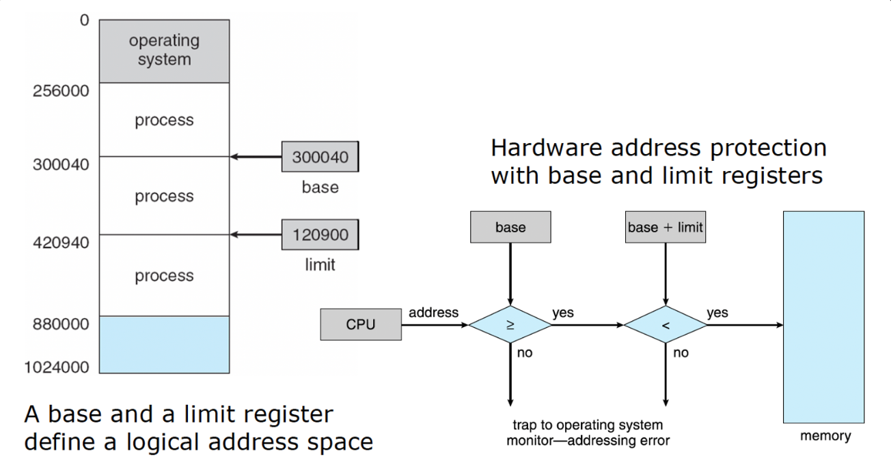
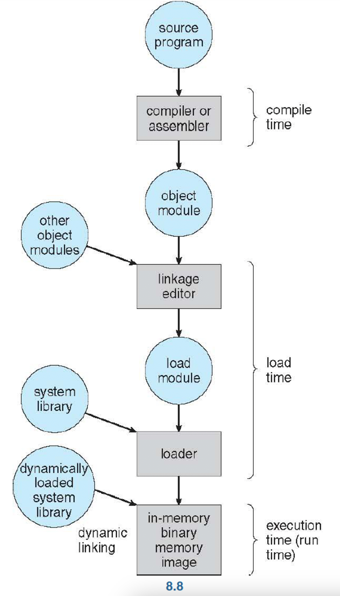
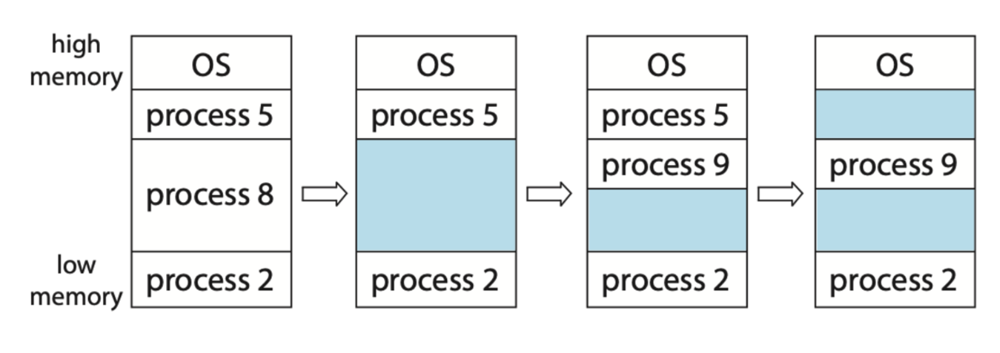
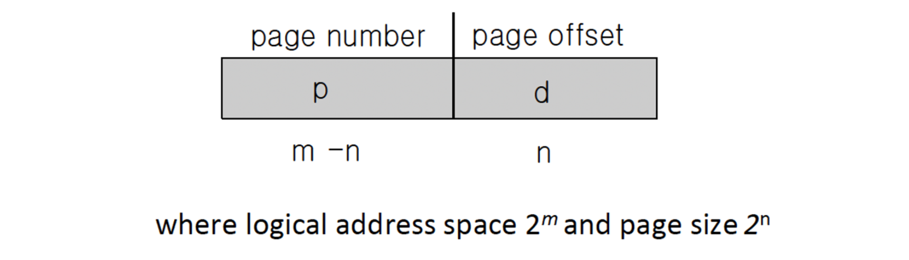
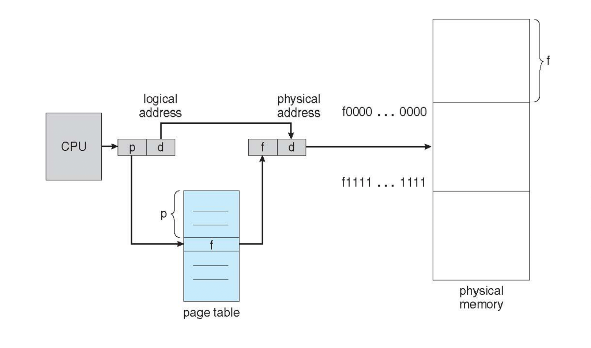
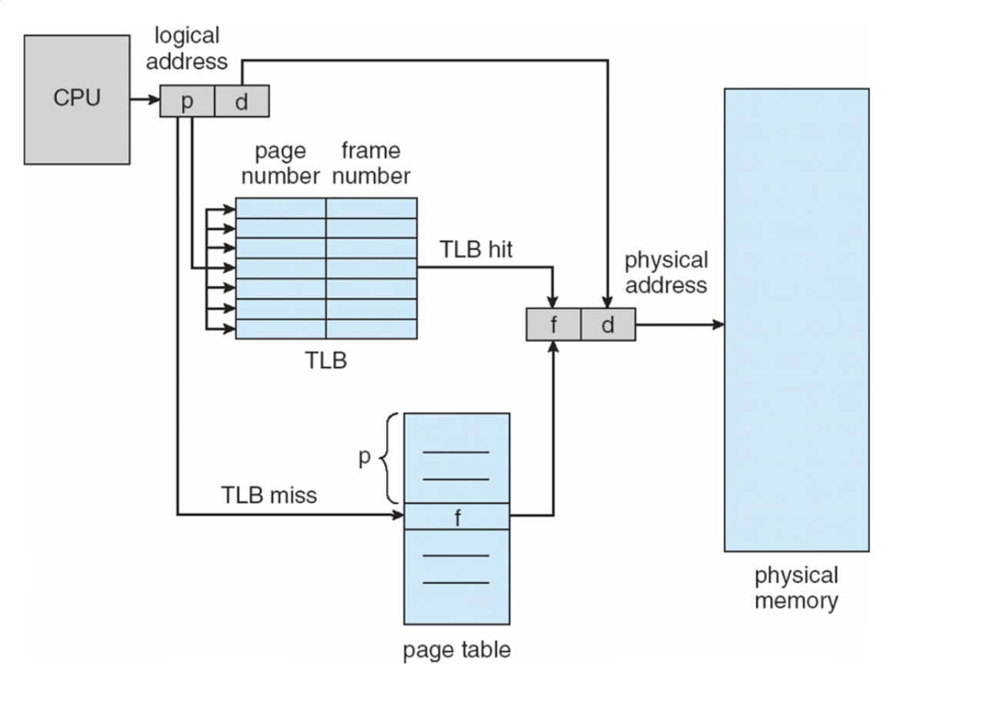
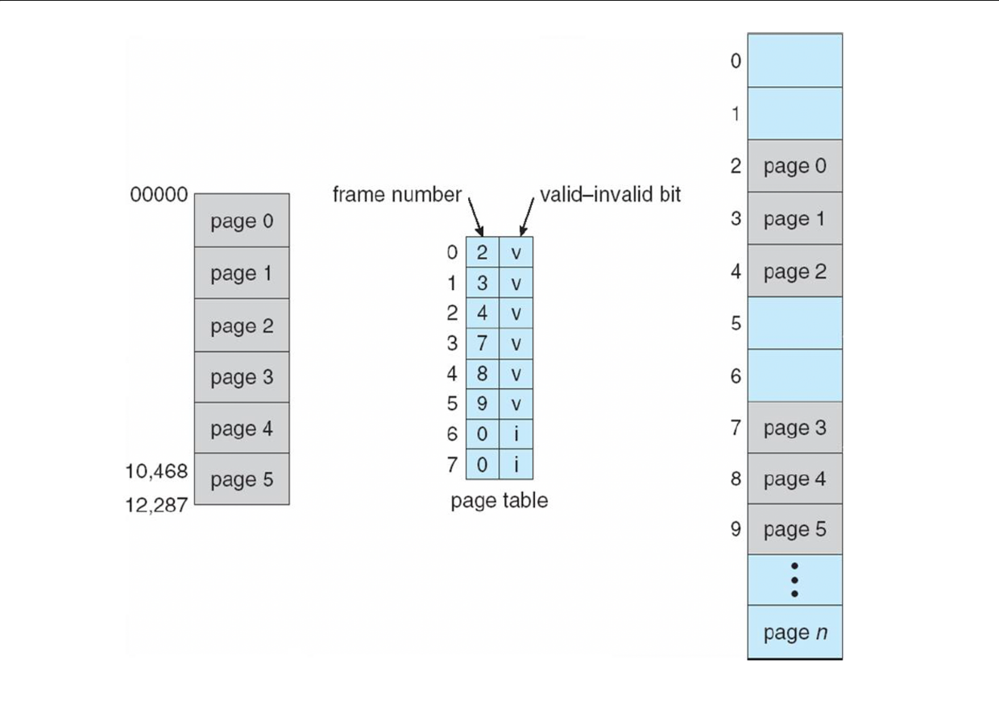
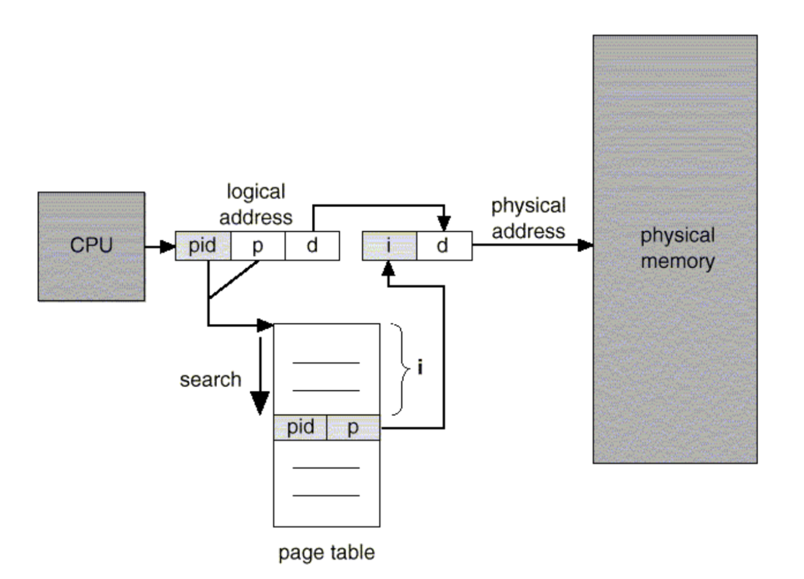

(널널한 개발자) 가져온 프로세스를 메모리의 어떤 위치에 올릴지 결정하는 정책을 배치 정책이라고 한다. 메모리를 같은 크기로 자르는 것을 페이징(윈도우의 경우는 4KB) 이라고 한다. 메모리가 꽉차면 잘 안쓰는 메모리 공간을 디스크로 옮긴다던지 등 재배치를 진행한다. MS-DOS 라는 os를 쓸 때는 프로세스 여러개 돌리지 않고 1개만 돌릴 수 있었는데 이 때 프로세스 하나가 모든 시스템 자원을 선점했었다. 메모리의 한 단위는 1byte가 되는 것이고 1byte 마다 메모리에 주소가 붙는데, 64bit 시스템의 경우 $2^{64}$만큼의 메모리 주소를 관리할 수 있고 사이즈는 $2^{64}$ byte 가 된다. 근데 실제로 저만큼의 메모리 주소를 가질 수 있는건 아니고 한계가 있다. 몇 백 기가 또는 정말 크면 TB 정도까지로 제한되어있다. 물리적 메모리에 부여된 하드웨어 수준의 메모리 주소 체계가 있고 어플리케이션 프로세스 수준에서 주소가 있다. 그 두개는 다른 번호를 사용하게 된다. 이 둘은 가상 메모리 체계를 사용하기 때문에 두 주소는 일치하지 않는다. 

메모리 오버레이와 스왑 → Virtual memory 시스템을 이야기하기 위한 초석이다.

프로그램의 크기가 실제 물리 메모리 보다 클 때 전체 프로그램을 메모리에 가져오는 대신 적당히 잘라서 가져오는 기법을 메모리 오버레이라고 한다. 하나의 메모리에 여러 프로그램을 겹겹이 쌓아 실행하는 것을 말한다. 나중에는 RAM이 작아서 프로그램을 실행하지 못하는 경우도 있었다. 그래서 RAM과 HDD를 연동해서 서로 데이터를 주고 받는 개념이 등장했고 그것을 스왑이라고 한다. 보조 기억장치에 스왑 영역을 둔다. RAM과 스왑 메모리를 합쳐서 컴퓨터가 사용할 수 있는 메모리 공간이라고 한다.

swap in/out 말고 page in/out 이라고도 표현한다. 최대 절전모드는 완전히 꺼진게 아니고 RAM에 있는 정보를 HDD에 저장하는 것이다. 그리고 다시 전원을 키면, HDD 에서 RAM으로 가져온다. RAM이 32GB 라고해서 32GB를 전부 옮기지 않고 실제 사용된 메모리들만 스왑인 한다. 실제로 SSD로 바뀌고 나서 swap in/out 속도가 HDD 대비 훨씬 빠르기 때문에 cpu가 좋아진 것보다 체감상 성능이 훨씬 좋아졌다고 한다.

메모리 분할 방식의 구현 → 가변 분할 방식, 고정 분할 방식

s/w 크기가 얼마인지 예상할 수가 없다. 가변 분할 방식은 여러 s/w들을 일단 연속된 공간에 할당해준다 . 고정 분할 방식은 페이지 단위로 자르고 중간 중간에 fragment 라고 하는 빈 공간이 생긴다. 그 때 조각 모음을 통해 메모리에 존재하는 기계어 코드들을 재배열을 진행해서 빈 공간을 하나로 만들어준다. 옛날에 HDD의 경우 조각모음을 했었는데, SSD로 와서는 조각 모음을 굳이 할 필요가없다.

# 배경
cpu 스케줄링의 결과로 cpu 이용률과 사용자에 제공하는 컴퓨터 응답속도를 향상 시켰다. 이러한 성능을 유지하기 위해서는 많은 프로세스들을 메모리에 유지해야한다. 즉, 메모리를 공유해야한다.

### 기본 하드웨어
메모리는 각각 주소가 할당된 일련의 바이트들로 구성된다. cpu는 program counter 가 지시하는대로 메모리부터 다음 수행할 명령어를 가져오는데 필요한 경우 추가적인 데이터를 더 가져올 수 있으며 반대로 데이터를 메모리에 내보낼 수 있다.

<u>**메인 메모리와 (코어의) 레지스터들은 cpu가 직접 접근할 수 있는 유일한 범용 저장장치이다.** </u>기계 명령어 들은 메모리 주소만을 인수로 취하고, 디스크의 주소를 인수로 취하진 않는다. 각 cpu 코어에 내장된 레지스터들은 일반적으로 cpu 클록의 1 사이클 내에 접근이 가능하다. 하지만 메모리 버스를 통한 메모리의 접근은 많은 cpu 클록 틱 사이클이 소요되며, 이 경우 cpu가 필요한 데이터가 없어서 명령어를 수행하지 못하고 지연되는(stall) 현상이 발생한다. 그래서 cpu와 메모리 사이에 캐시를 추가했다.

각각의 프로세스가 독립된 메모리 공간을 가지도록 보장해야한다. 기준(base)와 상한(limit)이라고 불리는 두 개의 레지스터를 사용하여 이것을 보장한다. base register는 가장 작은 합법적인 물리 메모리 값을 저장하고, limit register는 주어진 영역의 크기를 저장한다. 

기준과 상한 레지스터는 여러가지 특권 명령을 사용하는 운영체제에 의해서만 적재된다. 특권 명령은 오직 커널 모드에서만 수행하고, 운영체제만 커널 모드에서 수행되기 대문이다. 이 기법은 운영체제만 레지스터 값을 변경할 수 있도록 허가해줌으로써 사용자 프로그램이 레지스터의 내용을 변경하는 것을 막는다.

### 주소의 할당
프로그램은 원래 디스크에 저장되어있다. 실행하려면 메모리로 가져와서 프로세스 문맥(2.5절 참고) 내에 배치해야한다.

대부분의 프로그램은 다음과 같이 여러 단계를 거쳐 실행되기 때문에 이들 단계를 거치는 동안 주소들은 여러 가지 다른 표현 방식을 가진다.

메모리 주소 공간에서 명령어와 데이터 바인딩은 그 바인딩이 이루어지는 시점에 따라 다음과 같이 구분된다.
- 컴파일 시간: 컴파일할 때 특정한 메모리 주소와 함께 컴파일한다.
- 적재 시간 : 프로세스가 메모리 내 어디로 올라오게 될지를 모를 때 이진 코드를 재배치 가능 코드로 만들어야한다. 코드와 주소와의 바인딩은 프로그램이 메인 메모리로 실제로 적재되는 시간에 아루어진다. 시작 주소가 바뀌면 아무때나 코드를 다시 메모리에 적재하면 된다. 컴파일에는 논리 주소만 결정되고 실행시에 물리적인 메모리 주소가 결정된다.
- 실행 시간 : 만약 프로세스가 실행하는 중간에 메모리 내의 한 세그먼트로부터 다른 세그먼트로 옮겨질 수 있다면 바인딩이 실행 시간까지 허용되었다.

### 논리 대 물리 주소 공간
cpu가 생성하는 주소를 논리 주소라고 하고 메모리가 이해하는 주소(메모리 주소 레지스터(MAR)에 주어지는 주소) 를 물리 주소라고 한다. 프로그램 실행 중에는 가상 주소를 물리 주소로 바꿔줘야하는데 이 변환 작업은 하드웨어 장치인 메모리 관리 장치(memory management unit, MMU)에 의해 실행된다. 여기서 부터 기준 레지스터 기법을 일반화시킨 MMU 기법에 따른 변환을 설명할 것인데 기준 레지스터를 재배치(relocation) 레지스터 라고 부른다.

<u>**사용자 프로그램은 절대 실제적인 물리 주소에 접근하지 않는다. 우리가 보는 주소들은 전부 논리 주소이다.**</u>

이 논리 주소 공간의 개념은 올바른 메모리 관리에 핵심적인 개념이다.

### 동적 적재 (Dynamic loading)
지금까지 프로세스가 실행되기 위해 프로세스 전체가 메모리에 올라와 있어야했다 (또 그렇게 가정하고 설명했다) 하지만 메모리 공간을 더 효율적으로 사용하기 위해서는 동적 적재를 해야한다. 동적 적재는 실제 호출되기 전까지는 메모리에 올라오지 않고 재배치 가능한 상태로 디스크에서 대기하고 있다.

### 동적 연결 및 공유 라이브러리
동적 연결 라이브러리(DDL)은 사용자 프로그램이 실행될 때 사용자 프로그램에 연결되는 시스템 라이브러리이다. 이 라이브러리를 여러 프로세스 간에 공유할 수 있어 (메인 메모리에 DDL 인스턴스가 하나만 존재) 공유 라이브러리 라고도한다.

- 정적 연결(static linking) : 라이브러리가 이 프로그램의 이진 프로그램 이미지에 끼어 들어간다.
- 동적 연결(dynamic linking) : 앞에서 동적 적재는 메모리에 로딩 되는 시점이 실행시까지 미루어진 것을 의미했지만(동적 적재와 다르다! 호출하면 메모리에 적재한다는게 동적 적재이다) 동적 연결에서는 연결(linking)이 실행 시까지 미루어짐을 의미한다.

# 연속 메모리 할당
메모리는 일반적으로 두 부분으로 나누어지는데 하나는 운영체제를 위한 것, 다른 하나는 사용자를 위한 것이다. 많은 운영체제는 높은 메모리에 위치한다. 연속적인 메모리 할당에서는 각 프로세스는 다음 프로세스가 적재된 영역과 인접한 하나의 메모리 영역에 적재된다.

### 메모리 보호
프로세스가 자신이 소유하지 않은 메모리를 접근할 수 없게 강제할 수 있다. 시스템이 상한 레지스터와 재배치 레지스터를 가지고 있다면 가능하다.

cpu 스케줄러가 다음으로 수행할 프로세스를 선택할 때, 디스패처(dispatcher)는 context switching의 일환으로 재배치 레지스터와 상한 레지스터에 정확한 값을 적재한다. cpu에 의해 생성되는 모든 주소는 이 레지스터의 값을 참조해서 확인 작업을 거치기 때문에 운영체제와 다른 사용자 프로그램을 현재 수행 중인 사용자 프로그램의 접근으로 부터 보호할 수 있다.

### 메모리 할당
운영체제는 각 프로세스가 메모리를 얼마나 요구하며, 또 사용가능한 메모리 공간이 어디있는지를 고려하여 공간을 할당한다. 프로세스가 공간을 할당 받으면 그 이후로는 cpu를 할당받기 위해 경쟁한다. 프로세스가 끝나면 메모리를 반납하고, 운영체제는 다른 프로세스에 이 공간을 할당할 수 있다.

(가변 파티션)

이 때 프로세스를 가변 파티션에 할당 할 수 있다. 하지만 이는 메모리에 다양한 크기의 빈 공간을 야기시킬 수도 있다. 이는 동적 메모리 할당 문제의 특별한 예시 중 하나로, 일련의 가용 공간 리스트로부터 크기 n 바이트 블록을 요구하는 것을 어떻게 만족 시켜줄 것인가를 결정하는 문제이다.
1. 최초 적합 : 첫번째 사용 가능한 공간을 할당 
2. 최적 적합 : 사용 가능한 공간 중 가장 작은 것
3. 최악 적합 : 가장 큰 가용 공간 할당

최초 적합과 최적 적합 모두 시간과 메모리 이용 효율 측면에서 최악 적합보다 좋다는 것이 입증되었다.

### 단편화
메모리는 너무 많은 수의 매우 작은 조각들로 단편화되어있다. 이를 외부 단편화라고 한다. 최초, 최적 적합 모두 <u>**외부 단편화(external fragmentation)**</u>로 인해 어려움을 겪는다.

메모리의 전체 크기와 프로세스 크기들은 모두 외부 단편화에 따라 큰 영향을 미칠수 있다. 예를 들어 최초 적합의 경우 통계적인 분석을 해보면 N개의 블록이 할당 되었을 때 0.5N개의 블록이 단편화 때문에 손실될 수 있다는 것을 알 수 있다. 즉 메모리의 1/3을 사용할 수 없다. 이 현상을 50% 규칙이라고 한다.

외부 단편화를 해결하는 방법
- 압축 : 하지만 이는 재배치가 컴파일 또는 적재 시에 정적으로 행해진다면 압축은 시행될 수 없다. 압축은 프로세스들의 재배치가 실행 시간에 동적으로 이루어지는 경우에만 가능하다.
- 페이징(paging) : 논리 주소 공간을 여러 개의 비연속적인 공간으로 나누어 프로세스에 할당하는 방법. 이 때 메모리를 아주 작은 공간들로 분할하고 프로세스가 요청했을 때는 <u>**내부 단편화(internal fragmentation)**</u>가 일어날 수 있다.

segmentation : 코드 영역, 데이터 영역, 스택 영역과 같이 의미 단위로 영역을 분할하여 다른 영역에 올리는 방식. 외부 단편화(external fragmentation)가 일어날 수 있다.

# 페이징
어떻게 보면 연속 메모리 할당과 반대되는 말이다.

### 기본 방법
프로세스의 물리 주소 공간이 연속되지 않아도 되는 메모리 관리 기법이다. 물리 메모리는 프레임(frame), 논리 메모리는 페이지(page)라 불리는 같은 크기의 블록으로 나누어진다. 이 간단한 아이디어가 엄청난 기능을 수행하고 폭넓은 영향을 끼쳤다. 예를 들어 논리 주소 공간은 물리 주소 공간과 완전히 분리되었기 때문에 물리 메모리의 크기가 $2^{64}$바이트 보다 적게 장착된 시스템에서도 프로세스는 64비트로 이루어진 논리 주소 공간을 사용할 수 있다. (64bit cpu에서 4gb 메모리를 사용할 수 있다) 논리 주소 공간이 물리 주소 공간 보다 작으면 안될까?

위 이미지처럼 cpu 에서 나오는 모든 주소는 페이지 번호와 페이지 오프셋으로 이루어져있다. 페이지 번호는 페이지 테이블에서 엑세스할 때 사용된다.

페이지 테이블

- 페이지 테이블은 프로세스별 자료구조이다. 페이지 테이블에 대한 포인터는 각 프로세스의 PCB(프로세스 제어 블록)에 저장된다.
- 현재 대부분의 컴퓨터는 페이지 테이블을 메인 메모리에 저장하고 **페이지 테이블 기준 레지스터(page table base register) PTBR)** 에서 페이지 테이블의 주소(base 값) 을 가지고 있다. 다른 페이지 테이블을 사용하고 싶으면 단지 이 레지스터만 변화시키면 되고 문맥 교환 시간을 줄일 수 있다.
- PTLR(page table length register)에 테이블 크기(limit 값)을 보관한다.
- 페이지 테이블은 물리 메모리의 각 프레임의 시작 주소를 저장하고, 오프셋은 참조되는 프레임안에서의 위치이다.
- CPU에서 생성된 논리 주소를 물리 주소로 변환하기 위해 MMU 하드웨어에서 취하는 방식
    1. 페이지 번호 p를 추출하여 페이지 테이블의 index로 사용한다.
    2. 페이지 테이블에서 해당 프레임 번호 f를 추출한다.
    3. 논리 주소의 페이지 번호 p를 프레임 번호 f로 바꾼다.

프로세스의 크기가 페이지 크기와 무관하다면 평균적으로 프로세스당 반 페이지 정도의 내부 단편화가 예상된다. 이런 측면에서 작은 페이지의 크기가 바람직 할 것 같지만 그러면 페이지 테이블의 크기가 커지게된다. 현재는 보통 페이지 크기가 4KB 또는 8KB이다.

프로세스가 메모리에 할당되는 과정
1. 한 프로세스가 실행되기 위해 메모리에 도착하면, 그 프로세스가 n개의 페이지로 분해하고 페이지 주소를 할당한다.
2. 프로세스들이 페이지 순서대로 프레임에 할당되고 프레임 번호가 페이지 테이블에 기록된다. 그 다음 페이지의 프로세스가 또 다음 프레임에 적재되고 프레임 번호가 페이지 테이블에 기록되고 
3. 2가 반복된다

<u>프레임 테이블(Frame table)</u> : 운영체제는 어느 프레임이 할당되어있고, 어느 프레임이 사용 가능한지 등 물리 메모리의 자세한 할당에 대해 파악하고 있어야한다. 이는 시스템에 하나 밖에 없는 프레임 테이블(frame table)에 기록된다. 프레임 테이블은 각 프레임당 하나의 항목을 가지고 있으며, 프레임이 비어있는지, 할당되었는지, 할당 되었다면 어느 프로세스의 어느 페이지에 할당되었는지에 대한 정보가 있다.

### 하드웨어 지원
페이지 테이블에 접근하여 메모리에 접근하는 연산을 할 때 두 번의 메모리 접근이 필요하다.
1. 페이지 번호를 기준으로 PTBR 오프셋 값을 사용하여 페이지 테이블 항목을 찾는다. 
2. 프레임에서 실제 주소를 생성하고 메모리의 원하는 위치에 엑세스 할 수 있다. 

이렇게 페이지 테이블로 메모리에 엑세스를 하려면 두 번의 메모리 엑세스가 필요하다.  이 문제에 대한 해결로 <u>**Translation Look-Aside Buffer(TLB)**</u> 라고 불리는 특수한 소형 하드웨어 캐시가 사용된다. 페이지 번호가 TLB에 없으면 TLB 미스가 일어난다.

### 보호
1. 페이지에 접근 권한을 다루는 protection bit가 있다. (read / write / read-only 등)
2. 페이지 테이블의 각 엔트리에는 유효/무효(valid/invalid)라는 하나의 비트가 더 있다. 이 비트가 유효로 설정되면 해당 주소의 frame에 유효한 내용이 있다는 것을 의미한다. invalid하면 해당 페이지의 frame에 유효한 내용이 없음을 의미한다. 물리 메모리에 정보가 없으니까 접근이 불가능하다. 
    1. 프로세스가 그 주소부분을 사용하지 않는 경우
    2. 해당 페이지가 메모리에 올라와있지 않고 swap area에 있는 경우
    

### 공유 페이지
페이지의 장점은 공통의 코드를 공유할 수 있다는 것이다.

# 페이지 테이블의 구조
### 계층적 페이징

### 해시 페이지 테이블
페이지 번호를 해시 키로 사용한다. 만약에 충돌이 없다면 해시 페이지 테이블은 물리메모리에게 constant access time을 제공한다.

### 페이지 역테이블
보통 프로세스는 각자 하나씩 페이지 테이블을 가지고 또 페이지 테이블은 프로세스가 사용하는 페이지마다 하나의 항목을 가진다. 운영체제는 프로세스가 가상 페이지 주소를 제시할 때마다 이 테이블에 와서 그것을 실제 페이지 주소로 변환 시켜줘야한다. 테이블 내의 어느 곳에 원하는 물리 페이지가 있는지를 계산할 수 있고, 이 값을 통해 메모리를 엑세스 할 수 있다. 이 기법의 단점 중 하나는 각 페이지 테이블 항목의 개수가 수백만개가 될 수 있다. 이런 테이블은 물리 메모리 사용을 추적하기 위해 많은 양의 물리 메모리를 소비한다.

그래서 프로세스당 페이지 테이블이 아니라 시스템 전체에서 하나의 페이지 테이블을 가지고 있도록 구현한 것이 inverted page table 이다. 페이지 테이블에서 각 엔트리는 각 프레임에 올라와 있는 페이지 주소, 프로세스 id를 표시하며 물리적 메모리의 page frame이 담고 있는 내용을 표시한다.

검색할 때마다 테이블 전체를 탐색해야하므로 검색 시간이 오래 걸리는 단점이 잇고, associative register 를 사용하여 병렬 검색 방식으로 조치할 수 있다.

# 스와핑
프로세스가 실행되기 위해서는 프로세스의 명령어와 명령어가 접근하는 데이터가 메모리에 있어야한다. 하지만 프로세스 또는 그 일부분이 실행 중에 임시로 백업 저장장치(backing store)로 보내졌다가 실행을 계속하기 위해 다시 메모리로 돌아올 수 있다. 이것을 스와핑이라고 한다.

모든 프로세스의 물리 주소 공간 크기의 총합이 시스템의 실제 물리 메모리 크기보다 큰 경우에도 스와핑을 이용하면 동시에 실행하는 것이 가능하다.

### 기본 스와핑
표준 스와핑은 전체 프로세스를 메모리에서 백업 저장장치로 이동한다.

### 페이지에서 스와핑
전체 프로세스를 저장장치로 이동하는데 오래 걸린다. 그래서 요즘은 사용하지 않는다. 스와핑이란 단어는 일반적으로 표준 스와핑을 말하며, 페이징은 페이징에서 스와핑을 말한다. 

페이지 아웃 : 메모리 → 백업 저장장치

페이지 인 : 백업 저장장치 → 메모리

### 모바일 시스템에서 스와핑

# 사례: Intel 32비트와 64비트 구조

# 사례: ARM 구조