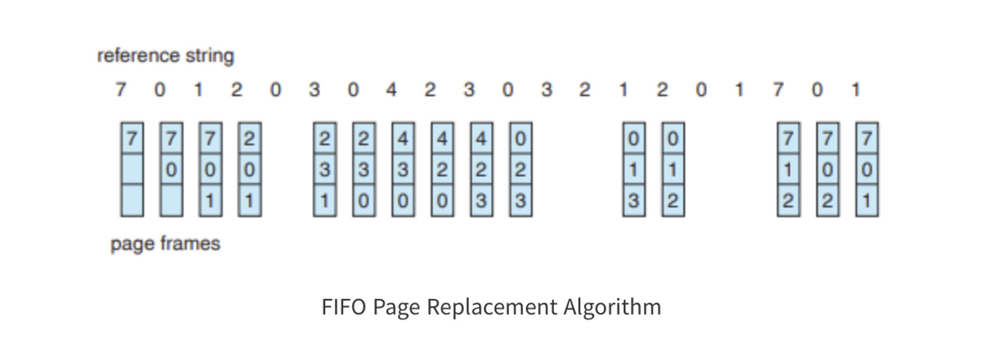

“접근 통제”

유저 모드 어플리케이션이 있을 때 이 어플리케이션이 메모리의 아무 위치나 접근하도록 허용되지 않는다. 이게 전부 가상 메모리 시스템에서 이루어진다.

컴퓨터마다 메모리(1차 메모리 + 2차 메모리) 크기가 다르다. 이 때마다 s/w가 의존성이 존재해서 코드를 메모리 마다 고쳐야하면 아무도 코딩 못한다. 범용 os가 등장하면서 그럴 필요가 없게 되었다.

가상메모리는 장치에 대한 의존성을 없애는 역할도 하고, 관리 측면에서 높은 추상성을 제공한다. 그래서 접근제어를 통해 보안 수준을 높게 구현할 수 있다.

가상 메모리가 나오면 os 비트 수부터 따져야한다. 32bit 운영체제에서 메모리는 4GB까지 쓸 수 있는데 2GB, 2GB로 나누고 앞은 유저모드, 뒤는 커널모드로 나뉘며, 유저 모드의 앞부분은 os 가 할당되는 메모리 영역이다. 대략 유저 모드에서 사용할 수 있는 메모리는 1.7xxxGB 정도 밖에 안될 것이다.

커널에 존재하는 메모리 메니저는 물리메모리와 스왑메모리 영역을 합쳐서 프로세스가 사용하는 가상 주소 공간을 실제 물리 주소 공간에 이러한 과정을 동적 주소 변환 이라고 한다. 동적은 runtime이라는 뜻이고, 프로그램이 실행 중에 주소를 변환한다는 의미이다. 물리적인 수준의 주소는 segmentation 단위로 자르고, 어플리케이션 수준의 주소는 page 단위로 자른다. 보통 page와 segment를 섞어서 사용한다. 

가상 메모리 체계에서는 프로세스 별로 각자 고유한 메모리 주소를 가지기 때문에, 프로세스에서 메모리 주소가 다 같다 하더라도 물리 메모리 주소는 전부 다른 위치가 된다. 특정 프로세스가 sleep 상태에 빠져 잘 사용이 안되는 경우는 스왑이 되어서 HDD 쪽을 가리키게 될 수도 있다.

운영체제의 메모리 메니저는 매핑 테이블을 가지고 있다.

매핑 테이블은 물리 메모리가 세그먼트로 분할 되어있는 경우 뿐만 아니라 페이징으로 분할된 경우에도 똑같은 방식으로 적용된다. 위치정보가 0번 페이지냐, 0번 세그먼트냐인지는 상관없다. 매핑테이블은 lookup 테이블 처럼 쉽게 접근할 수 있도록 하기 위해 리스트 보다는 배열로 구현했을 가능성이 크다. 매핑 테이블이 os가 관리하고 있는데, 프로세스 A가 죽었을 때 매핑 테이블에서 그냥 빼버리면 되기 때문에, 관리하기가 매우 쉬워진다. 좋은 운영체제 일 수록 가상화의 성능을 높인다. 이런 매핑 테이블이 없으면 프로세스가 갑자기 죽었을 때 사용하지 않는 메모리 공간을 바로바로 체크하기가 힘들다. 안쓰는 메모리 공간이 많아지면 결국 재부팅 할 수 밖에 없다. 특히 모바일 os가 가상화가 잘되어있는데, 아이폰 재부팅을 얼마마다 하는가? 거의 안한다.

왜 포인터가 어려웠을까? 컴퓨터 구조에 대한 이해가 부족했을 수 있지만 기본적을 virtual memory에 대한 이해가 없기 때문이다. 32bit 시스템 일 때 VMS(virtual memory system) 는 한마디로 4GB 짜리 선형 배열(char [42억]) 이다. 이 안에 스택, 힙 등등 모두 들어있다.  가상 주소(페이지 단위)가 있고, 물리 주소(프레임 또는 세그먼트 단위)가 있다. 가상 주소는 프로세스 마다 가지고 물리 주소는 RAM이 가진다. 페이지는 윈도우 기준으로 보통 4KB 단위로 끊는다. 그리고 페이지와 세그먼트의 각각의 크기는 보통 동일하게 가져간다.

메모리 접근 권한

메모리 영역 = 데이터 영역(스택, 힙, 정적(rw- 영역, r—영역), x(실행) 영역은 없다) + 코드 영역(r-w 영역)

# 배경
<u>**가상 메모리는 프로세스 전체가 메모리 내에 올라오지 않더라도 실행이 가능하도록 하는 기법이다.**</u> 이를 통해 사용자 프로그램이 물리 메모리의 크기보다 커져도 된다.

앞에서 dynamic loading 방법을 사용하여 전체 프로세스를 메모리에 올려도 된다는 제약을 완화해주지만 프로그래머에게 추가적인 작업을 요구한다.

가상 메모리는 실제의 물리 메모리 개념과 개발자의 논리 메모리 개념을 분리한 것이다. 이렇게 함으로써 적은 메모리를 가지고도 큰 가상 주소 공간을 프로그래머에게 제공할 수 있다. 이 이외에 가상메모리는 페이지 공유를 통해 파일이나 메모리가 둘 또는 그 이상의 프로세스들에 의해 공유되는 것을 가능하게 한다.

# Demand paging(요구 페이징)
보조저장장치에서 메모리에 필요한 페이지만 적재하는 기법을 요구 페이징(demand paging) 이라고 한다. 요구 페이징 가상 메모리를 사용하면 프로그램 실행 중 필요할 때만 페이지가 적재된다. 따라서 접근 되지 않은 페이지는 물리 메모리로 적재되지 않는다.

### 기본 개념
<u>**요구 페이징(demand paging)**</u> 을 통해 프로세스의 일부 페이지는 메모리에, 다른 일부는 저장장치에 있다. 이 둘을 구분하기 위해 하드웨어 지원이 필요하다. 이 때 valid-invalid 비트 기법이 사용될 수 있다. 메모리에 올라온 것을 valid, 그렇지 않은 것을 invalid 로 표현한다. 

만약에 이 때 메모리에 올라와있지 않은 페이지에 접근하려고 하면 <u>**페이지 폴트 트랩(page fault trap)**</u>을 발생시킨다. 페이징 하드웨어는 페이지 테이블을 이용한 주소 변환 과정에서 무효 비트를 발견하고 운영체제에 트랩을 건다.

(페이지 폴트 핸들링 과정)
1. 프로세스에 대한 내부 테이블(PCB와 함께 유지됨) 을 검사해서 메모리 참조가 유효/무효 한지 확인
2. 무효한 페이지를 참조했을 때 그 프로세스는 중단된다.
3. 페이지가 메모리에 올라오지 않았다면(지금은 invalid 하지만 사실은 valid 했다면) 보조저장장치에서 가져온다.
4. 빈 공간, 즉 가용 프레임(ex. 페이지 프레임 리스트)을 찾는다.
5. 보조저장장치에서 프레임으로 페이지을 읽는다.
6. 페이지가 메모리에 있다는 것을 알리기 위해 페이지 테이블을 갱신하며, 프로세스가 유지하는 내부 테이블을 수정한다.
7. 트랩에 의해 중지되었던 명령어를 다시 수행한다. 프로세스는 마치 그 페이지가 항상 메모리에 있었던 것처럼 해당 페이지에 접근한다.

극단적인 경우에는 메모리에 페이지가 하나도 안 올라와 있는 상태에서도 프로세스를 실행시킬 수 있다. 운영체제에서 첫 명령으로 명령 포인터를 설정하는 순간, 이 명령이 메모리에 없으므로 페이지 폴트를 발생시킨다. 이 후 프로세스가 사용하는 모든 페이지마다 메모리에 올라올 때까지 필요할 때마다 페이지 폴트가 발생한다. 어떤 페이지가 필요해지기 전에 결코 그 페이지를 메모리로 적재하지 않는 방법을 <u>**순수 요구 페이징(pure demand paging)**</u> 이라고 한다.

모든 프로그램은 <u>참조 지역성(locality of reference)</u>가 있어서 프로그램의 어느 한 특정 작은 부분만 한동안 집중적으로 참조하는데, 이 성질 때문에 요구 페이징은 만족할 만한 성능을 보인다.

요구 페이징을 지원하기 위한 하드웨어
1. 페이지 테이블 : 보호 비트 값 또는 유효/무효 비트를 통해 특정 항목을 무효로 설정할 수 있어야한다.
2. 보조저장장치 : 메인 메모리에 없는 모든 페이지를 가지고 있다. 이를 스왑 장치라하며, 그 저장 영역을 스왑 공간이라고 한다.

### 가용 프레임 리스트(Free Frame list)
페이지 폴트를 해결하기 위해 대부분의 운영체제는 가용 프레임의 풀인 **가용 프레임 리스트**를 유지한다. 프로세스의 스탭 또는 힙 세그먼트가 확장될 때도 가용 프레임이 할당되어야한다.

시스템이 시작되면 모든 가용 메모리가 가용 프레임 리스트에 넣어진다. 가용 프레임이 요청되면(ex. 요구 페이징을 통해) 가용 프레임 리스트의 크기가 줄어든다.

### 요구 페이지 성능
페이지 폴트의 확률이 p라고 하자. p는 0에 매우 가까울 것이다. 이 때 실질 접근 시간은 다음과 같다.

$$실질 접근시간 = (1-p) * ma + p*페이지폴트시간$$

실질 접근 시간을 계산하기 위해 페이지 폴트를 처리하는데 얼마나 많은 시간이 걸리는지 알아야한다. 페이지 폴트 처리 시간에 영향을 주는 요소는 아래와 같다.
1. 인터럽트 처리
2. 페이지 읽기
3. 프로세스 재시작

사실 1, 3은 거의 안걸린다. 그래서 실제 접근 시간은 페이지 폴트율에 비례한다. 그래서 페이지 폴트율을 낮게 유지하는 것이 상당히 중요하다. 그렇지 않으면 실질 접근 시간은 커지고 프로세스 수행은 심각하게 늦어진다.

# 쓰기 시 복사 (Copy on write)
fork() 시스템 콜을 통해 프로세스를 생성할 때 페이지 공유와 비슷한 기법으로 첫 요구 페이징조차 생략하는 것이 가능하다. fork()는 부모 프로세스와 똑같은 자식 프로세스를 만들어준다. 과거에는 fork()를 하면 부모 프로세스의 페이지들을 자식 프로세스에 복사해주었지만 대부분의 자식은 이렇게 만들어지자마자 exec() 시스템 콜을 한다. 그럼 부모로부터 복사해온 페이지들은 쓸모가 없어진다. 

그래서 부모 페이지들을 다 복사해오는대신 <u>**쓰기 시 복사(copy-on-write)**</u> 방식을 사용할 수 있다. 이 방식에서는 자식 프로세스가 시작할 때 부모의 페이지를 당분간 함께 사용하도록 한다. 이 때 공유되는 페이지를 <u>**쓰기 시 복사 페이지**</u>라고 한다.

수정되지 않은 페이지들은 자식과 부모 간에 계속 공유될 수 있다. 수정 될 수 있는 페이지만 쓰기 시 복사가 일어난다. 쓰기 시 복사는 window, linux, macOS 등을 포함한 여러 운영체제에서 나타난다. 

# 페이지 교체
시스템이 40프레임이 있고 전체 10페이지 중 5페이지만 사용하는 프로세스가 있다고 하자. 그럼 원래는 4개의 프로세스만 수행될 수 있었지만 요구 페이징을 통해 8개의 프로세스가 수행될 수 있다. 여기서 다중 프로그래밍의 정도를 더 올리면, <u>**메모리 과할당(over-allocating)**</u>이 발생한다. 프로세스가 실행되는 동안 페이지 폴트가 발생한다. 운영체제는 필요로 하는 페이지를 보조저장장치에서 발견했지만 가용한 프레임이 없는 상황이다(모든 메모리가 사용 중이다)

이 때 운영체제는 몇가지 선택을 할 수 있다. 프로세스를 종료한다. 하지만 사용자가 그들의 프로세스가 페이징 시스템에서 실행되고 있음을 알게하면 안된다. 그래서 이때 페이지 스와핑과 **페이지 교체**를 결합한다.

### 기본적인 페이지 교체

1. 보조저장장치에서 필요한 페이지의 위치를 찾는다.
2. 빈 페이지 프레임을 찾는다.
    1. 가용 프레임이 있다면 그것을 사용한다.
    2. 가용 프레임이 없다면 희생될(victim) 프레임을 선정하기 위한 페이지 교체 알고리즘을 실행한다.
    3. victim page를 보조저장장치에 기록하고, 관련 테이블을 수정한다.
    4. (참고) 이 때 빈 프레임이 없을 때 디스크를 두 번 접근해야한다. 이는 페이지 폴트 처리 시간이 2배 소요되며 실질 접근 시간도 늘어난다. 이런 오버헤드는 변경 비트(modify bit)를 사용해서 감소시킬 수 있다. 즉 내용이 변경되었을 때만 보조저장장치에 업데이트 하면된다.
3. 빼앗은 프레임에 새 페이지를 읽어오고 테이블을 수정한다.
4. 페이지 폴트가 발생한 지점에서 프로세스를 계속한다.

이 때 두가지 문제를 해결해야한다.
1. 프레임 할당 알고리즘 : 각 프로세스에 얼마난 많은 프레임을 할당해야할지 결정
2. 페이지 교체 알고리즘 : 페이지 교체가 필요할 때 어떤 페이지를 교체해야할지 결정. 일반적으로 페이지 폴트율이 가장 낮은 것을 선정한다.

### FIFO 페이지 교체
메모리에 올라온지 가장 오래된 페이지를 내쫒는다.

프레임 개수가 늘어나면 페이지 폴트 횟수가 항상 줄어들어야할 것 같지만 그렇지 않은 상황이 발생하는데 이를 <u>**Belady의 모순(Belady’s anomaly)**</u>이라고한다.

### 최적 페이지 교체(Optimal page replacement)
앞으로 가장 오랫동안 사용되지 않을 페이지를 찾아 교체한다.

이건 프로세스가 앞으로 메모리를 어떻게 참조할지를 알아야해서 실제 구현은 어렵다. 주로 비교 연구목적을 위해 사용된다.

### LRU 페이지 교체(LRU page replacement)
가장 오랫동안 사용되지 않은 페이지를 교체한다. 이것이 Least-recently-used(LRU) 알고리즘이다. LRU 알고리즘은 페이지마다 마지막 사용시간을 유지한다. 이 페이지 교체 알고리즘은 자주 사용된다.

구현 방법
1. 계수기(counters)
2. 스택(stack)

최적 페이지 교체와 마찬가지로 LRU 교체는 Belady의 모순 현상을 야기하지 않는다. <u>**이렇게 Belady 모순 현상을 발생시키지 않는 알고리즘을 스택 알고리즘 이라고 부른다.**</u>

### LRU 근사 페이지 교체 (LRU approximation page replacement)
1. 부가적 참조 비트 알고리즘
2. 2차 기회 알고리즘
3. 개선된 2차 기회 알고리즘

### 계수 기반 페이지 교체(Counting based page replacement)

### 페이지 버터링 알고리즘(Page buffering algorithm)

### 응용(application)과 페이지 교체

# 프레임의 할당
128 프레임을 가지는 시스템이 있다고 생각해보자. 이 때 운영체제가 35프레임을 차지하고 나면 나머지 93 프레임이 사용자 프로세스를 위해 남게 되는데, 순수 요구 페이징 기법에서는 처음에 93 프레임 모두가 가용 프레임 리스트(free frame list)에 들어가게 된다. 사용자 프로세스들이 실행을 시작하면 가용 페이지 리스트에서 가용 페이지를 사용하게 된다.

### 최소로 할당해야 할 프레임의 수
최소의 프레임만 할당해야하는 이유는 성능과 관련된다.
1. 당연하겠지만 프로세스에 할당될 수 있는 프레임 수가 줄어들게 되면 페이지 폴트율은 증가하고 프로세스 실행은 늦어진다. 
2. 명령어 수행이 완료되기 전 페이지 폴트가 발생하면 그 명령어는 나중에 재실행되어야한다. 이 때 하나의 명령어가 참조하는 모든 페이지는 동시에 메모리에 올라와 있어야지 그 명령어의 수행이 끝날 수 있다.

프로세스당 최소 프레임 수는 아키텍처에 의해 정의되는 반면, 최대 수는 물리 메모리 양에 의해 정의된다.

### 할당 알고리즘
n개의 프로세스, m개의 프레임이 있을 때 가장 쉬운 방법은 각 프로세스에 m/n 프레임씩 주는 것이다. 이것을 **균등 할당**이라 한다.

프로세스의 크기 비율에 맞추어 프레임을 할당해주는 것을 **비례 할당**이라고 한다. 

두 가지 모드 equal 과 proportional 할당 모두 다중 프로그래밍 정도에 따라 할당 되는 양이 달라진다. 다중 프로그래밍 정도가 높아지면 각 프로세스는 프레임을 덜 받게 되고 적어지면 각 프로세스는 프레임을 많이 받게 된다.

하지만 여기서 중요한 점은 두 할당 모두 우선순위 프로세스에 상관없이 할당된다는 것이다. 이 때 사용할 수 있는 방법은 비례 할당에서 프로세스의 크기가 아니라, 우선순위를 사용하는 방법이 있다.

### 전역 대 지역 할당
여러 프로세스가 프레임 할당을 위해 경쟁하는 과정에서 페이지 교체 알고리즘은 아래 두가지로 나눌 수 있다.
1. 전역 교체 : 교체할 프레임을 모든 프레임을 대상으로 교체
2. 지역 교체 : 교체할 프레임을 자기에게 할당된 프레임에서 교체
    1. 프로세스에 할당된 프레임의 수는 변하지 않는다.

일반적으로 전역 교체가 지역 교체 알고리즘보다 더 좋은 시스템 성능을 나타내며 더 많이 사용한다.

### 비균등 메모리 접근 (Non-uniform memory access)
지금까지 모든 메인 메모리는 동일하게 접근된다고 가정했다. 하지만 여러 개의 cpu를 가진 경우 특정 cpu는 메인 메모리의 일정 영역을 다른 영역보다 빠르게 접근할 수 있다. 시스템의 cpu와 메모리의 연결 방식이 이러한 성능의 차이를 야기한다

# 스레싱(Thrashing)
프로세스에 ‘충분한’ 프레임이 없는 경우, 즉 작업 집합의 페이지를 지원하는데 필요한 최소 프레임이 없는 경우 그 프로세스는 곧바로 페이지 폴트를 일으킬 것이다. 과도한 페이징 작업을 스레싱 이라고 부른다. <u>**어떤 프로세스가 실제 실행보다 더 많은 시간을 페이징에 사용하고 있으면 스레싱이 발생**</u>했다고 한다.

스레싱과 그에 따른 스와핑은 성능에 큰 영향을 미친다. 스레싱과 스와핑을 피하고자 하는 가장 좋은 방법은 가능한 충분한 물리 메모리를 장착하는 것이다.

### 스레싱의 원인
운영체제는 cpu 이용률을 감시한다. cpu 이용률이 너무 낮으면 새로운 프로세스를 시스템에 더 추가한다. 이 때 전역 페이지 교체 알고리즘을 통해 어떤 프로세스의 페이지인지에 대한 고려 없이 교체를 수행한다. 즉 만약에 교체될 프레임이 다른 프로세스에서 당장 사용해야할 프레임이었다면 다른 프로세스도 페이지 폴트를 발생시킬 것이다. 페이징 장치에 대한 큐잉이 진행되면서 준비 큐는 비게된다. 프로세스들이 페이징 장치를 기다리는 동안 cpu 이용률은 떨어진다. 그럼 cpu 스케줄러는 다른 프로세스를 더 추가한다. 이렇게 결국 스레싱이 일어나게 된다.

cpu 이용률을 높이고 스레싱을 중지하기 위해 다중 프로그래밍 정도를 낮춰야만 한다. 

지역 교체 알고리즘(또는 우선순위 교체 알고리즘)을 사용하여 스레싱을 영향을 제한할 수 있다. 하지만 완전한 해결책은 아니다. 프로세스가 스레싱 하는 경우 대부분 페이징 장치의 큐에서 기다리게 된다. 페이징 장치의 평균 대기열이 길어지기 때문에 페이지 폴트의 평균 시간을 늘어나고 스레싱 되지 않은 프로세스에서도 실질 접근 시간이 증가할 수 있다.

스레싱 현상을 방지하기 위해 각 프로세스가 사용하는 최소한의 프레임 개수를 보장해야하는데 이는 지역성 모델(locality model)을 기반으로 추즉한다. 지역성 모델이란 프로세스가 실행될 때는 항상 어떤 특정한 영역에서만 메모리를 집중적으로 참조함을 의미한다. 지역이란 집중적으로 함께 참조되는 페이지의 집합을 의미한다.

명시적으로 언급하지는 않았지만 지역성 모델은 지금까지 이 책에서 논의해왔던 캐싱 기법의 기본 원리이기도 하다. 특정 데이터에 참조가 어떤 패턴도 없이 무작위적이라면 캐싱은 무의미해진다.

### 작업 집합 모델
작업 집합모델은 지역성을 토대로 하고 있다.

### 페이지 폴트 빈도

# 메모리 압축
페이징의 대안은 메모리 압축이다. 여기서는 수정된 프레임을 스왑 공간으로 페이징 아웃하지 않고 여러 프레임을 하나의 프레임으로 압축한다. 이러면 페이지 스와핑에 의존하지 않고도 메모리 사용량을 줄일 수 있다.

# 커널 메모리의 할당
사용자 모드에서 수행중인 프로세스가 추가적인 메모리를 요구하면 커널이 관리하는 가용 페이지 프레임에서 페이지들이 할당된다. (이 가용 리스트는 위에서 본 바와 같이 페이지 교체 정책들에 의해 물리 공간상에 흩어져 있는 페이지들로 채워진다) 사용자 프로세스가 단 한 바이트만 필요한 경우라면 프로세스가 한 페이지 프레임을 할당 받았으므로 내부 단편화가 일어난다. 

하지만 커널 메모리는 보통 사용자 모드 프로세스에 할당해 주기 위한 페이지 리스트와 별도의 메모리 풀에서 할당 받는다. 그 이유는 아래와 같다.
1. **커널은 다양한 크기의 자료구조를 위해 메모리를 할당받는다. 커널은 메모리를 단편화에 의한 낭비를 최소화하고자 한다.** 많은 운영체제가 커널 코드나 데이터는 페이징하지 않기 때문에 특히 더 중요하다.
2. 사용자 모드 프로세스에 할당 되는 페이지들은 물리 메모리 상에 굳이 연속적일 필요가 없다. 하지만 물리 메모리에 직접 접근하는 하드웨어 장치는 물리적으로 연속적인 메모리가 있어야 하는 경우가 있다.

### 버디 시스템
커널 프로세스에 할당하는 메모리를 관리하는 한가지 방법이다. 버디 시스템은 물리적으로 연속된 페이지들로 이루어진 고정된 크기의 세그먼트로부터 메모리를 할당한다. 메모리는 이 세그먼트로부터 2의 거듭제곱 할당기에 의해 2의 거듭제곱 단위로 할당된다.

buddy system을 통해 인접한 여러 segment는 하나의 큰 segment 로 합쳐질 수 있다.

### 슬랩 할당(Slab allocation)
커널 프로세스에 할당하는 메모리를 관리하는 나머지 다른 방법이다. 슬랩(slab)은 하나 또는 그 이상의 연속된 페이지들로 구성된다. 캐시는 하나 혹은 그 이상의 슬랩으로 구성된다. 각 커널 자료구조마다 하나의 캐시가 존재한다. 예를들어 프로세스 디스크립터를 위한 캐시, 파일 객체를 위한 캐시, 세마포어를 위한 캐시 등이 존재한다.

슬랩의 3가지 상태
1. Full : 슬랩 내 모든 객체가 used 로 표시됨
2. Empty : 슬랩 내 모든 객체가 free로 표시됨
3. Partial : Used, free 객체가 섞여 있음

슬랩 할당기는 먼저 partial 슬랩의 free 객체를 이용해 요청을 처리하려고 노력한다. partial slap이 없으면 empty 슬랩으로부터 free 객체를 할당한다. empty 슬랩도 없으면 새로운 슬랩이 연속된 물리 메모리에 할당되어 캐시에 주어진다.

슬랩 할당기 장점
1. 단편화에 의해 낭비되는 메모리가 없다
2. 메모리 요청이 빠르게 처리된다.

# 기타 고려 사항
