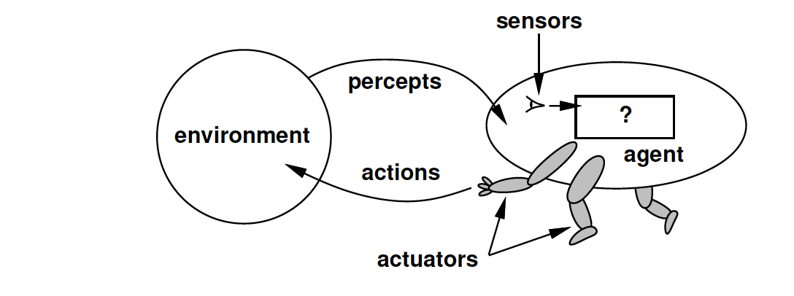
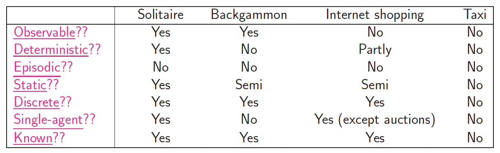
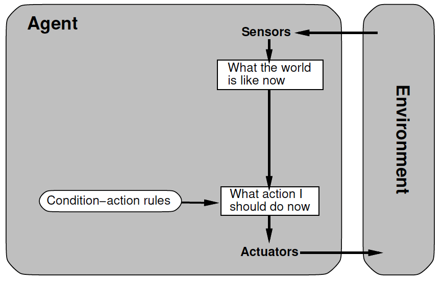
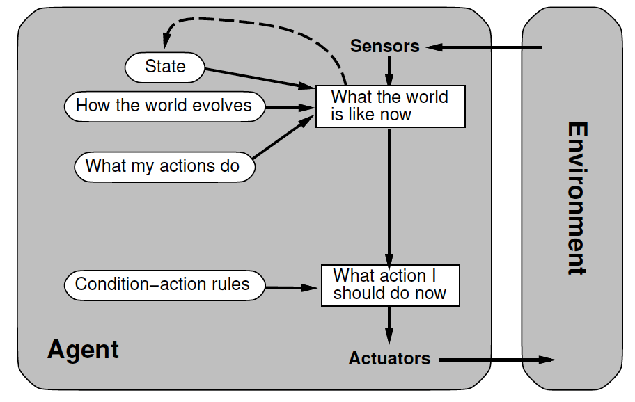
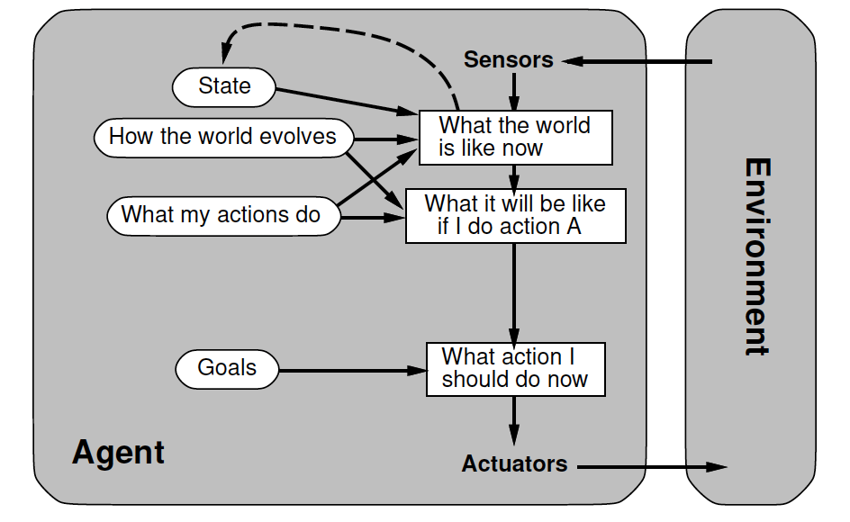
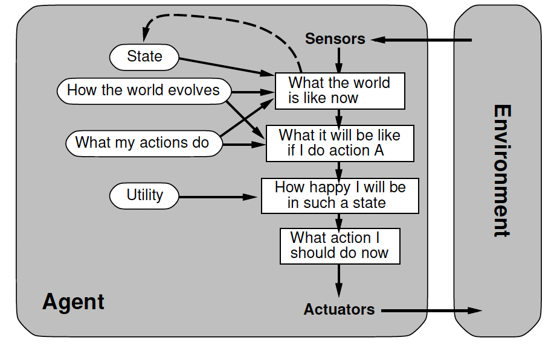
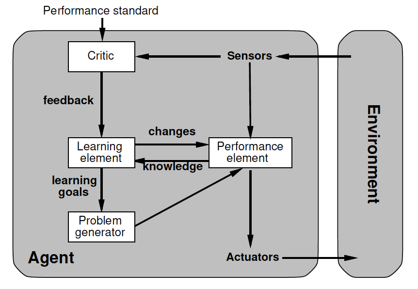
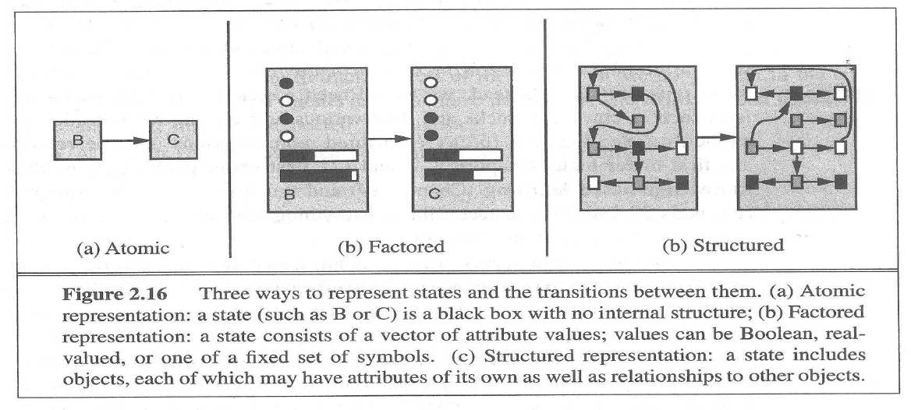

# Agents and environments

## What is Agent

1. (1) 에이전트는 자신이 놓인 환경에 대해 ‘센서’를 통해서 환경에 대한 상태를 ‘추정’한다. (2) 그리고 에이전트는 해당 환경속에서 acturator를 통해 act 한다. 그리고 1, 2 과정을 반복한다.
4. 에이전트는 반드시 주어진 환경에서 스스로 결정하고 행동해야한다. 에이전트의 예시로 humans, robots, softbots(software robots), thermostats(온도조절기) 등이 있다.

### Agent function
과거에서 현재까지 인식한 정보들(percept sequence)를 바탕으로 가능한 여러가지 행동들 중에서 하나의 행동을 결정하는 함수이다.
$$f: P^* \rightarrow A$$

### Agent program
- Agent program은 $f$를 produce하기 위해 physical architecture를 실행한다. 즉 Agent program은 sensor로부터 percept(인식)을 받아, actuator를 통해 action으로 반환하며, physical sensor와 actuator(architecture)가 있는 compute device에서 실행된다. 
- artificial agent의 agent function은 내부적으로 agent program에 의해 구현된다.

### Rational agent(Intelligent agent)
- percept sequence 를 바탕으로 특정 performance measure를 최대화할 수 있는 act를 선택한다.

## PEAS
- rational agent를 디자인할 때 반드시 task environment(작업 환경, 어떤 환경에서 작업을 하는지)을 명세해줘야한다.
  - Performance Measure(성능척도)
  - Environment(작업환경)
  - Actuators(행동 수행의 주체)
  - Sensors(센서)
- (예시) automated taxi agent를 디자인 한다고 해보자.
    - performance measure: safety, destination, profits, legality, comfort, ...
    - environment: US streets/freeways, traffic, pedestrians, weather, ... 
    - actuators: steering, accelerator, brake, horn, speaker/display, ...
    - sensors: video, accelerometers, gauges, engine sensors, keyboard, GPS, ...
- (예시) internet shopping agent를 디자인 한다고 해보자.
    -  performance measure: price, quality, appropriateness, efficiency
    - environment: current and future WWW sites, vendors, shippers
    - actuators: display to user, follow URL, fill in form
    - Sensors: HTML pages(text, graphics, scripts)

## Environment Type(환경특성)

(solitaire: 혼자 하는 카드놀이, Backgammon: 백개먼 보드게임)
1. 완전 관측(fully observable) vs 부분 관측(partially observable)
    - 완전 관측: 매순간 환경 전체를 인식할 수 있다(ex. 바둑 agent)
    - 부분 관측: 매순간 일부분의 환경만 인식할 수 있다. (ex. 자율 주행 agent)
2. 결정(deterministic) vs 비결정(stochastic)
    - 결정: 동일한 ‘환경’에 대해 동일한 ‘행동’을 수행하면 ‘환경의 변화’는 항상 동일하다 (ex. 행동에 대한 환경 변화를 예측할 수 있다)
    - 비결정(확률적): 동일한 ‘환경’에 대해 동일한 ‘행동’을 수행해도 환경의 변화가 다를 수 있다 (ex. 로봇이 컵을 드는 행동을 했을 때 컵을 잘 들거나, 컵을 들다가 놓치는 등 여러 결과가 나올 수 있다)
3. 정적(static) vs 동적(dynamic)
    - 정적: action을 하지 않으면 환경은 변하지 않는다.(ex. 바둑판: 돌을 놓지 않으면 환경은 변하지 않음)
    - 동적: action을 하지 않아도 환경에 변화가 있다. (ex. 자율주행 agent: 주행을 하지 않음에도 주변 환경은 계속 변화함)
    - 하지만 둘다 어떤 action을 하면 환경은 반드시 변한다
4. 이산적(discrete) vs 연속적(continuous)
    - 이산적: 환경의 경우의 수가 유한한 경우 (ex. 격자판 내에서 이동(공간 이산화): 변화를 명확하게 표현할 수 있음)
    - 연속적: 환경의 경우의 수가 무한인 경우 (ex. 드론 공중 비행, 로봇 팔 제어)
5. 단편적(episodic) vs 순차적(sequential)
    - 단편적: 현재 결정한 행동이 나중의 결정에 영향을 미치지 않음 (ex. 양궁)
    - 순차적: 현재 결정한 행동이 나중의 결정에 영향을 미침 (ex. 퍼즐, 큐브)
6. 싱글 에이전트 vs 멀티 에이전트
    - 싱글 에이전트: 해당 환경에서 하나의 에이전트만 존재
    - 멀티 에이전트: 해당 환경에서 여러개의 에이전트가 존재(ex. 경쟁(바둑, 체스, 제로섬게임 등), 협동, 경쟁 + 협동 가능)

# Agent Type(에이전트 유형)
아래 그림에서 rectangle은 agent의 decision process에서 "현재의 internal state"를 의미하여 oval은 process 과정에서 사용된 background information을 의미한다.

## Simple Reflex Agents(단순 반사 에이전트)

  1. sensor 를 통해 "현재 상태" 추정
  2. condition-action rules 를 통해 가장 적합한 행동을 결정하고 actuators를 통해 act

## Model-based Reflex Agent(모델 기반 반응형 에이전트)
model based reflex agent에서 제시한 모델은 부족한 sensor 측정치에 대해 state(현재 시간이 T일 때 T-1에서 추측한 현재 상태), world model(환경이 어떻게 바뀌는지 인식), action model(자신이 수행할 수 있는 행동이 무엇이 있는지 인식)을 통해서 현재 상태를 더 정확하게 추정할 수 있다.

1. sensor를 통해 "현재 상태"를 추정: sensor를 통한 정보 + 추가적인 정보(by model)를 조합하여 최종적으로 현재 상태를 추정
2. condition action rules를 통해 가장 적합한 행동을 결정하고 actuators를 통해 act

## Goal-based Agents(목표 기반 에이전트)

센서를 통한 즉각적인 행동이 아니라, 센서로 인식한 환경 상태에서 내가 수행할 수 있는 행동들에 대한 결과를 예측하고, 그 결과 중에서 goal에 더 가까운 행동을 결정한다. simple relfex agent와 model based reflex agent는 condition action rule에 의해 조건 반사적으로 행동한데 반하여 goal based agent는 미리 예측가능한 결과를 계산하고 goal과 비교하여 최적의 결정을 이끌어낸다.
1. sensor 를 통해 현재 상태를 추정
    - sensor를 통한 정보(환경에 대한 정보) + 추가적인 정보(자신의 행동에 대해 스스로 인식)를 조합하여 최종적으로 현재 상태를 추정.
    - goal based agent에서 사용하고 있는 model(state, world model, action model)은 현재 내 상태를 알기 위해서 뿐만 아니라 최적의 행동을 찾기 위해서도 사용된다.
2. 예측한 수행 가능한 act 에 대한 결과를 예측하고 어떤 act가 goal에 더 근접한지 판단하고 결정

## Utility-Based Agents(유틸리티 기반 에이전트)
목표만 쫓는게 아니고 센서로 인식한 환경상태에 대해 내가 수행하는 행동들이 얼마나 이득이 있는지 계산하고, 이득을 최대한 으로 얻을 수 있는 행동을 결정한다.

goal vs utility
  - goal: 묵표 달성 또는 목표 미달성
  - utility: 상대적으로 무엇이 더 좋은지의 개념. utility function을 통하여 utility value를 평가함.

## Learning Agents(학습하는 에이전트)

## 에이전트 프로그램 구성요소들의 작동방식

1. Atomic: algortihms underlying search, game-playing, HMM(Hidden Markov Model), MDP(Markov Decision Process)
2. Factored represenation: CSA, propositional logic(명제논리), planning, Bayesian networks, some machine learning algorithms
3. Structured representation: relational DB, first-order logic(1차논리), 1st order probability model, knowledge-based learning, natural language understanding

예시로 finding driving route의 들어보자.
- Atomic representation: the state of world는 우리가 속해있는 도시의 이름일 뿐이다.
- Factored representation: 당시 탱크에 있는 가스의 양, 현재 GPS 좌표 등은 불확실성을 나타낸다.
- Structured representation: 가장 표현력이 뛰어나다.
---

[참고링크](https://cs-ssupport.tistory.com/397)