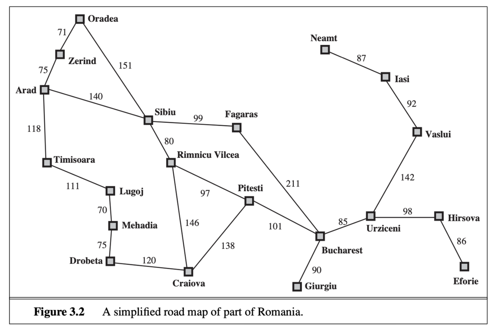

문제 해결 에이전트(problem-solving agent)는 어떤 목표 상태로 가기 위해 sequence of actions를 산출하는 에이전트를 의미하며 sequence of actions를 찾는 과정을 search(검색)이라고 한다. 3, 4, 5장에서 여러 검색 알고리즘을 설명한다.

3장
- 가장 간단한 환경, 일화적, 단일 에이전트, 완전/부분 관측 가능, 결정/비결정론적, 정적, 이산 , 기지 환경에서의 알고리즘
- 정보 없는(uninformed, 얼마나 남았는지 추정 할 수 없는 형태) 검색 알고리즘
- - 정보 있는(Informed, 목표까지 얼마나 남았는지 알 수 있는 형태) 검색 알고리즘

4장은 제약이 덜한 환경에서의 검색 알고리즘은 5장 다중 에이전트 검색 알고리즘을 알아본다.

# Problem-solving agents(문제해결 에이전트)
문제를 형식화 한다는 것은 문제들의 세부 사항들을 제거하는 절차를 진행하는 것이다. 이 세부사항을 제거하는 절차를 다른 말로 추상화라고도 한다. 그리고 문제의 형식화가 올바르게 되었다는 것은 추상 수준(level of abstraction)이 적절하다는 것이다. 유용한 추상을 구축하는 능력이 없다면 지능적 에이전트는 현실 세계에 완전히 매몰될 것이다.

(예시 문제)


# Definition of Problem, Problem types


## Example problems
### Standardized problem(표준화된 문제)
간결하고 정확하게 서술할 수 있기 때문에 서로 다른 연구자들의 알고리즘의 성능을 비교할 수 있다. 예시는 아래와 같다.
- 격자 세계(grid world)
- 진공 청소기가 청소하는 경로에 대한 문제를 형식화할 때 grid world 를 적용하여 형식화 할 수 있다
- 소코반 퍼즐(sokoban puzzle)
- 슬라이딩 타일 퍼즐
- 8-퍼즐, 15-퍼즐

### Real world problem(실세계 문제)
예시는 아래와 같다.
- Route-finding problem(노선 찾기 문제)
    - 지정된 위치들과 그 위치들 사이의 링크들을 따라가는 전이들로 정의할 수 있다
- Touring problem(순회 문제)
    - 하나의 목적지가 아니라 반드시 방문해야하는 장소들을 정하고 경로를 구한다.
    - ex) 외판원 문제 또는 순회 판매원 문제: 모든 도시를 정확히 한번씩 방문해야하는 순회문제
    - 검색 및 최적화 알고리즘에 사용 가능
- VLSI 배치 문제
- 로봇 네비게이션 문제
    - 목적지에 도로를 따라가는 것이 아니라 비교적 자유롭게 돌아다님
    - 로봇의 팔과 다리가 추가 되고 그것들을 제어할 경우 검색 공간은 다차원이 된다. 관절 각도 하나하나를 고려해줘야한다.
    - 로봇들이 종류마다 각기 다른 sensor가 있어서 다른 지각 데이터를 산출한다면?
- 자동 조립 시퀀싱
    - 복잡한 물체를 로봇이 자동으로 조립하는 문제(1970년대부터 업계 표준 관행)
    - 알고리즘들은 조립 절차를 찾고 그 절차를 최적화한다.
- 단백질 설계
    - 특정 질병의 치료에 효과가 있는 속성을 가진 단백질을 나타낼 수 있는 아미노산의 배열을 찾는 문제

# 검색 알고리즘들
## Tree search example
검색 트리(search tree)의 구조를 보면 각 node는 state에 해당되고, edge는 action에 해당되며, 루트 노드는 문제의 초기 상태에 해당된다. 이 때 검색 트리가 있고 초기 상태와 목표 상태가 있을 때 초기 상태에서 다음 확장할 노드를 어떻게 선택할 수 있을까?

## Graph search

## Best first search(최선 우선 검색)
- 어떤 평가함수 $f(n)$이 최솟값이 되는 노드 n을 선택한다.
- 파이썬 구현
```python
```
## Data structure for Nodes
검색 알고리즘에는 검색 트리를 추적하기 위한 자료구조가 필요하다. 특히 검색 알고리즘에 사용되는 구체적인 종류의 대기열 알고리즘
- priority queue
- FIFO 대기열 (queue)
- LIFO 대기열 (stack)

## Redundant Paths
중복 경로(Redundant Paths)들을 점검하는 알고리즘들을 그래프 검색(graph search) 알고리즘 이라 부르고, 중복경로를 점검하지 않는 부류의 검색 알고리즘들을 트리류 검색(tree-like search) 알고리즘이라 부른다.

## 검색 알고리즘의 성능 측정
- 완결성(completeness): 문제에 해답이 존재할 때 알고리즘이 해답을 반드시 찾아내는가? 그리고 해답이 없을 땐 해답이 없음을 잘 알려주는가
- 비용 최적성(cost optimality): 모든 해답 중 경로 비용이 가장 적은 해답인가
- 시간 복잡도(time complexity): 알고리즘을 수행하는데 시간이 얼마나 걸리는가
- 공간 복잡도(space complexity): 알고리즘을 수행하는데 메모리가 얼마나 필요한가

# Uninformed Search Strategies(정보 없는 검색 전략)

주어진 상태가 목표와 얼마나 가까운지 알 수 없다. 예를 들어 A → B → C 로 이동한다고 했을 때 각각의 이동경로에 대한 길이 또는 소요 시간이 전혀 주어지지 않은 상황이다. 이와 정반대로 정보 있는 검색 전략은 각 이동 경로에 대한 정보가 주어진 상황을 의미한다.

## Breadth-first search(너비 우선 검색)
- 노드에 도달하는 동작의 수를 평가함수로 두고 best-first search 를 구현할 수 있다.
- 항상 동작의 수가 최소인 해답을 찾는다. 만약 깊이 d에서 노드를 확장할 때는 d-1 노드들이 모두 확장된 상태일 것이므로 동작의 수가 더 적은 해답이 있다면 이미 찾았을 것이다.
- 효율성을 높이는 두가지 요령
    1. Queue를 사용한다면 좀 더 검색 효율을 높일 수 있다
    2. 모든 동작의 비용이 같은 문제들에 대해서는 비용 최적 알고리즘이지만 그렇지 않은 문제에서는 최적이 아니다.
- 모든 상태에 b개의 자식 노드가 있으며 깊이 d 인 트리가 있다고 했을 때 노드의 전체 개수는 $1 + b + b^2 + ... + b^d = O(b^d)$ 가 된다. 즉 시간 복잡도는 $O(b^d)$이다.
- 지수 복잡도를 가진 문제이다. 이러한 복잡도를 가진 알고리즘은 극히 간단한 문제가 아닌 한 적용하기 힘들다.

## Uniform-cost search(균일 비용 검색 또는 다익스트라 알고리즘)
- 동작들의 비용이 같지 않을 때, 명백한 선택 하나는 루트에서 현재 노드로의 경로 비용을 평가 함수로 두고 **best-first search(최선 우선 검색**)을 적용하는 것이다.
- BFS를 기반으로 진행되기 때문에 completeness, optimality 모두 만족한다.
- computer science 에서는 다익스트라 알고리즘 (Dijkstra’s algorithm) 이라 부르고 ai 에서는 uniform-cost search 라고 부른다.
- 완결적이다.
- 시간 복잡도와 공간 복잡도는 $O(b^{1 + [ C^* / \epsilon]})$ 이다. 모든 동작 비용이 동일할 때, $O(b^{1 + [ C^* / \epsilon]})$ 는 그냥 $O(b^{d+1})$ 이다.

## Depth-first search(깊이 우선 검색)
- 검색 트리에서 가장 깊은 노드를 제일 먼저 검색한다.
- 깊이를 평가함수로 두고 best-first search 를 구현한다.
- tree-like search이 적합한 문제에서 DFS가 위의 검색 알고리즘보다 메모리를 훨씬 적게 요구한다.
- 메모리 복잡도는 b가 분기계수이고 m이 트리의 최대 깊이 일 때 $O(bm)$ 이다.
- 이보다도 메모리를 덜 쓰는 DFS의 변형으로 역추적 검색(backtracking search) 가 있다.
    - 좀 더 자세히 파보자.
    - 제약조건 만족 문제에서 해를 찾기 위한 전략이다.

## Depth-limit search(깊이 제한 검색)과 Iterative-deepening search(반복 심화 검색)
- 깊이 우선 검색이 무한한 경로를 따라 헤메는 일을 방지하기 위한 방법
- 깊이 제한 검색(depth-limit search)
- 반복 심화 검색(iterative deepening search)
    - 일반적으로 반복 심화 검색은 검색 상태 공간이 메모리에 담을 수 있는 크기보다 크고 해답의 깊이가 알려지지 않을 때의 정보 없는 검색 방법으로 바람직하다.

## Bidirectional search(양방향 검색)


# Informed (Heuristic) Search Strategies (정보 있는 검색 전략 (발견적 검색))

목표들의 위치에 관한 domain-specific 힌트들을 사용하는 검색 전략이 uninformed search 전략보다 좀 더 효율적으로 해를 찾아내는 이유와 그 방법들을 알려준다. 힌트는 heuristic function(발견적 함수), $h(n)$의 형태로 주어진다. $h(n)$은 노드 n의 상태에서 목표 상태로 가는 최저 비용 경로의 비용 추정치를 의미한다.

## Greedy best-first search(탐욕적 최선 우선 검색)
- $h(n)$ 값이 가장 작은 노드, 즉 목표와 가장 가깝다고 추정되는 노드를 제일 먼저 확장한다.
- 탐욕적이라고 하는 이유는 각 단계마다 가능한 한 목표에 가까워지려고 하는데 이러한 탐욕 때문에 이 알고리즘이 신중한 접근방식보다 더 나쁜 결과를 초래할 수도 있다.

## $A^*$ search(에이스타 검색)

- $f(n) =$ $g(n)$ (초기 상태에서 노드 n으로의 **경로 비용)** + $h(n)$ (n에서 목표로의 최단 경로의 **추정 비용)**
- 즉 n 을 거쳐 목표로 나아가는 최선의 경로 비용
- 완결적
- cost optimality의 조건
    - admissibility(허용성)
        - $A^*$ 가 비용 최적성을 갖추는지는 heuristic의 특정 성질들에 의존한다. 핵심적인 성질은 admissibility(허용성)이다. 목표에 도달하는 비용을 절대로 과대평가 하지 않는 발견적 함수를 가리켜 admissible heuristic 라고 부른다. 쉽게 말하면 휴리스틱 예측값과 실제 휴리스틱 값을 비교했을 때 항상 휴리스틱 예측값을 실제 휴리스틱 값보다 작게 설정한다.
        - admissible heuristic : heuristic function 을 허용할 수 있는가? h(n)이 admissible 하다면 에이스타를 활용한 tree search 는 항상 optimality를 만족한다.
        - admissibility 를 가지면 cost optimality 이다
    - consistency(일관성)
        - $h(n) \leq c(n, a, n') + h(n')h(n) \leq c(n, a, n') + h(n)$
        - conststency 가 있는 heuristic function 은 모두 admissible 하므로 constatency 가 있는 heuristic function 의 $A^*$ 는 cost optimality 를 가진다
    - consistency → admissibility → cost optimality
- 에이스타가 효율적인 이유는 최적해를 발견하는데 필요하지 않은 검색 트리 노드들을 대거 잘라내기 때문이다. 이를 pruning(가지치기)라고 부른다. 가망없는 가능성들을 조사 없이 제거하는 것은 인공지능의 여러 분야에서 중요한 기법이다.


## Satisficing Search(만족 검색, Weighted $A^*$):
- $A^*$ 검색에는 장점이 많지만, 수많은 노드를 확장해야 한다는 단점이 크다. 만일 최적은 아니지만, 충분히 좋은 해로 만족할 수 있다면, 방문할 노드들을 줄일 수 있다. 그런 해를 satisficing solution 이라고한다.
- 가중 $A^*$검색을 somewhat-greedy search(다소 탐욕적인 검색)이라고 불러도 될 것이다. 가중 $A^*$는 탐욕적 최선 우선 검색처럼 목표로 나아가는데 집중하지만, 그러면서도 경로 비용을 아예 무시하지 않는다. 하지만 비용은 크면서 목표로 별로 나아가지 못하는 경로는 제쳐준다.
- sub-optimal(준최적) 알고리즘은 다양하다.

## Memory-Bounded Heuristic Search(메모리 제한 검색)
- $A^*$가 사용하는 메모리는 거의 대부분 frontier와 reached(도달된 상태들을 담는 자료구조)가 차지한다.
- reference count: 예를 들어 상하좌우 이동만 가능한 격자에서 한 격자에 4번이상 도달했다면 그 상태는 reached 에서 제거해도된다
- beam search
    - 검색의 크기를 제한한다.
    - 가장 쉬운 크기 제한 방법은 f 점수 기준으로 상위 k개의 노드두고 검색한다.
    - 그러면 noncompleteness 하고 sub-optimal 이 되지만 k를 잘 선택하면 메모리도 절약하고 빠르게 검색할 수 있다. 이렇게 되면 near-optimal 한 해도 찾아낼 수 있다.
- Iterative-Deeping $A^*$ (IDA*, 반복 심화 $A^*$ 알고리즘)
    - 각 경로의 f 비용이 정수인 8-퍼즐 같은 문제에서는 이 알고리즘이 잘 동작한다FS
- 재귀적 최선 우선 검색(recursive best-first search, RBFS)

## Bidirectional Heuristic Search (양방향 발견적 검색) 
