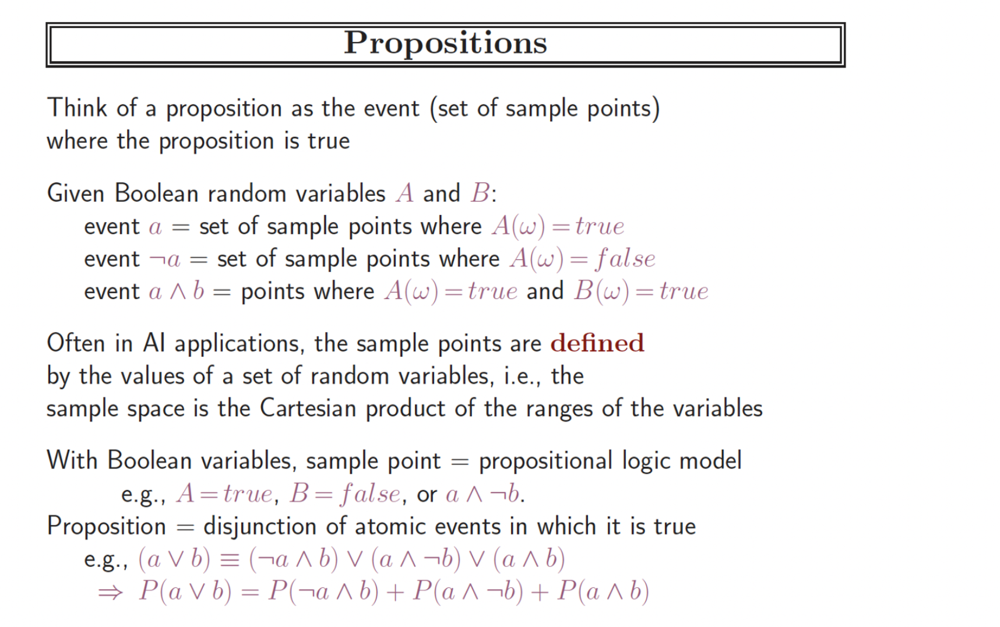
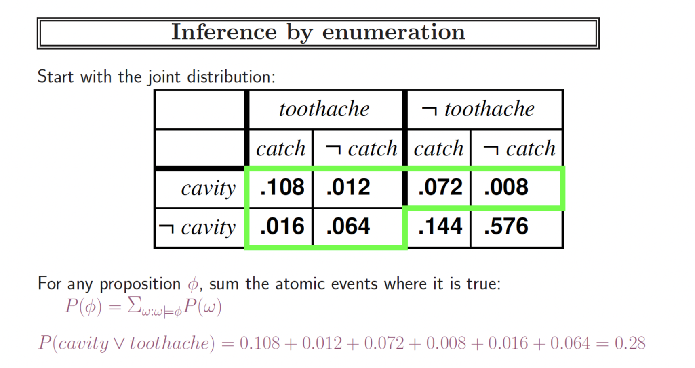
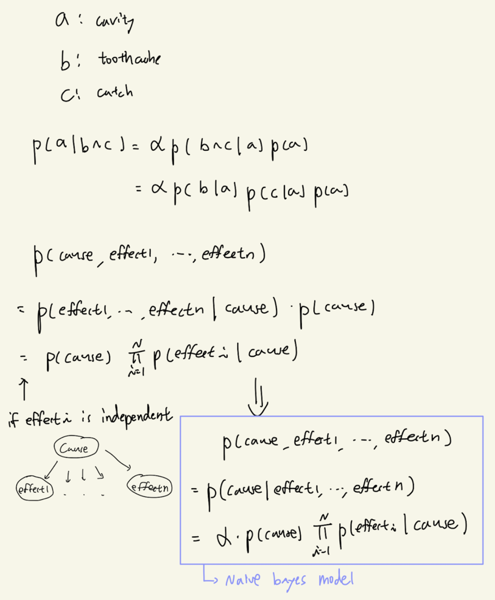
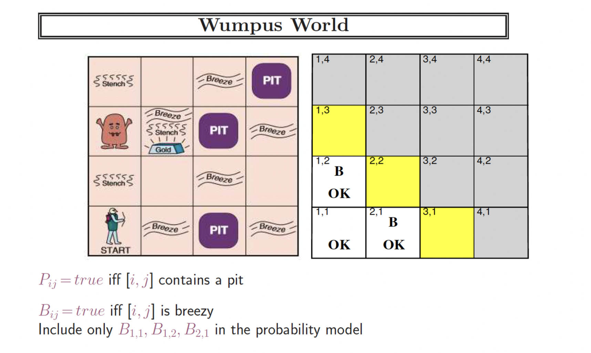

# Uncertainty

## Uncertainty with logic
기본적인 언어는 propositional logic(명제 논리) 이며, 이보다 표현 범위가 더 뛰어난 혹은 넓은 언어가 predicate logic(서술 논리)이다.

Logic and Probablity theory (무슨말일까?, 명제 논리 파트를 좀 더 읽어보자, [참고링크](https://velog.io/@tonyhan18/기초-인공지능-11-ciitsgw4))
- Ontological commitments are the same
- Epistemological commitments are different

Making decisions under uncertainty
- decision theory = utility theory + probability theory
- agent 가 rational과 필요충분관계에 있는 것은 agent의 action에 대해서 가능한 결과들에 대해서 가장 높은 효용을 주는 action을 선택한다는 것이다. 이것이 Maximum Expected Utility(MEU) principle이다.
- Decision-Theoretic Agent? 이 부분도 좀 더 읽어보자.

# Probability
아래처럼 propositions과 probability 를 함께 사용하는 것 같다.

# Inference using Full Joint Distribution

- 여기서 사용된 inference 라는 의미와 proposition을 정의하고 확률을 계산했는데 갑자기 또 random variable 을 사용하여 계산한다. 이것도 propositional 하게 나타낸 것 같다. 뭐지?
- normalization
- marginal probability

# Independence and Bayes rule
1. independence
2. conditional independence
    - conditional independence is our most basic and robust form of knowledge about uncertain environments
3. bayes rule
4. bayes rule and conditional independence
5. Navie Bayes models

# Wumpus World
Uncertainty 와 관련된 wumpus world 문제는 되게 간단하다. 아래에서 1.3, 2.2, 3.1 중에 구덩이가 있는데 이 구덩이를 피해야한다. 즉 1.1은 괜찮고, 1.2와 2.1의 인접한 곳에 구덩이가 있다는 가정이 있을 때 1.3, 2.2, 3.1 중 구덩이가 나올 확률이 가장 낮은 곳으로 이동하는 것이 목표이다.

([문제 설명](https://velog.io/@tonyhan18/기초-인공지능-11-ciitsgw4), [해결](https://buildabetterworld.tistory.com/54))