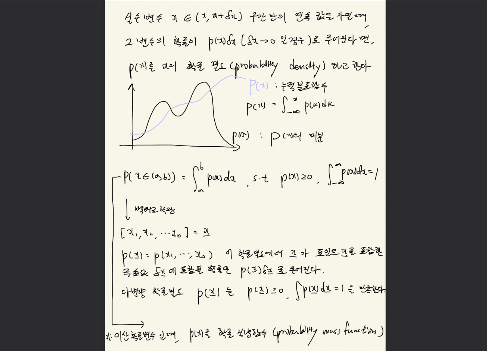
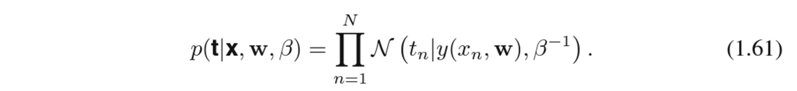

# 다항식 곡선 피팅

아주 단순하게 생각해보자. 위 그림처럼 $sin(x)$ 에 노이즈를 주어 데이터를 몇개 생성하고 그 데이터의 추세를 가장 잘 따르는 곡선을 찾고자한다. 피팅한 곡선을 다항식으로 가정한다. 그럼 우리가 찾아야 하는 변수는 $w$와 M이 된다. 참고로 다항 함수 $y(x, \bold{w})$는 x에 대해서는 비선형이지만, 계수 w에 대해서는 선형이다. <u>**다항 함수와 같이 알려지지 않은 변수에 대해 선형인 함수들은 중요한 성질을 지녔으며, 선형 모델**</u>이라 불린다. 이에 대해서는 3, 4 장에서 알아볼 것이다. 

(M이 정해졌을 때) 최적의 $w$를 구하기 위해 오차함수를 정의하고 이를 최소화하는 $\bold{w}$를 구하여 모델을 결정한다. 이건 convex optimization problem 의 일종이다. 함수가 convex 할 경우 미분을 하여 0 되는 지점을 찾으면 된다.

최적의 M을 결정하는 문제는 모델 비교(model comparison) 또는 모델 결정(model selection) 이라는 문제에 대항된다. M의 크기에 따라서 위 그림처럼 underfitting 이 되거나 overfitting 이 되기도 한다.

## 오버피팅
오버피팅이 되는 경우를 한번 생각해보자. 위에서 말했듯이 M(차수)가 늘어나면 곡선은 심하게 진동하며 이를 과적합이라고 한다.

M=9 인 다항식 집합은 M=3인 다항식 집합을 만들어낼 수 있으며 (더 낮은 차수의 다항식 집합은 더 높은 차수의 다항식 집합의 부분 집합) sinx를 멱급수 전개한 결과식은 모든 차수의 항들을 다 가지고 있으며 그렇기 때문에 피팅의 성능은 M이 증가함에 따라 단조 증가해야하는게 아닐까 한다고 생각할 수 있다. sinx 를 다항식으로 피팅한다고 하면 그럴 수 있겠다. 차수가 증가하면 sinx 함수에 가까워 지게끔 만들 수 있다. 하지만 여기서는 곡선을 데이터 셋에 피팅 시켜야한다. 

위 테이블을 보면 <u>**데이터 셋 개수가 고정되었을 때 차수 M에 따른 계수들의 값을 보면 M이 커짐에 따라 계수값 역시 증가**</u>함을 알 수 있다. 큰 양수와 음수가 번갈아 나타난다. 더 큰 M을 가진 유연한 <u>**다항식이 타겟값이 포함된 랜덤한 노이즈에 정확하게 피팅**</u>되어서 이런 결과가 나왔다. 이렇게 되면 테스트 데이터 셋에 대해 오차 함수의 값은 계수 값이 커짐에 따라서 점점 더 커짐을 알 수 있다.

한번 **데이터 셋의 크기와 모델의 복잡도 차원**에서 극단적으로 생각해보자. 데이터 셋 크기 $\ll$ 모델의 복잡도가 되면 오버피팅의 위험이 있고, 데이터 셋 크기 $\gg$ 모델의 복잡도가 되면 언더피팅의 위험이 있다. 그럼 오버피팅을 완화하기 위해서는 둘의 차이가 심하지 않게 조정해주는 것이 중요한데, 데이터 셋을 늘리거나, 모델의 복잡도를 줄이면 된다. 반대로 언더피팅을 완화하기 위해서는 데이터 셋을 줄이거나 모델의 복잡도를 늘리면된다.

## MLE(Maximum likelihood estimation) vs Baysian
주어진 데이터 셋을 가장 잘 피팅하는 모델을 찾는 과정을 다르게 말하면 maximum likelihood estimation($p(D | w)$ 를 최적화, 주어진 $w$에 대해 D를 얼마나 잘 나타내는가) 이다. 자 근데 좀 이상하다. 문제의 복잡도에 따라서 모델의 복잡도를 선택해야할 것 같은데 데이터 셋의 수에 따라서 모델의 매개변수 크기가 달라진다. 어떤 느낌이냐면 예를들어 face recognition 문제의 복잡도를 봤을 때는 (데이터 셋이 많을 때) resnet101이 resnet50 보다 성능이 잘나온다. 왜냐면 그만큼 복잡한 문제이기 때문이다. 하지만 내가 가진 데이터 셋의 크기가 적어서 resnet 101을 쓰면 오버피팅이 일어나, resnet 50 을 사용한다.
- (3장에서 살펴볼 내용과 같이) 모델의 복잡도를 측정하는데는 매개변수의 숫자만을 사용하는 것이 아닌 더 적합한 방법이 있을 수 있다. <u>**훈련 집합의 데이터 수에 따라서 모델에서 사용하는 매개변수 숫자에 제약을 두는게 좀 이상하다.**</u>
- 앞에서 본 최소 제곱법은 maximum likelihood 방법의 특별한 예시이다. 그리고 <u>**과적합 문제는 maximum likelihood 방법의 성질 중 하나이다.**</u>
- 그것은 특정 데이터 셋에 대해서만 가능도가 최대가 되는 매개변수를 구하기 때문인데 사실 베이지안(bayesian) 방법론을 채택하면 과적합 문제를 피할 수 있다. <u>**베이지안 관점에서는 데이터 포인트의 숫자보다 매개변수의 숫자가 훨씬 더 많은 모델을 사용해도 문제가 없다는 사실을 알 수 있다.**</u> 베이지안 모델에서는 데이터 집합의 크기에 따라서 적합한 매개변수의 수가 자동으로 정해진다.

그럼 MLE를 통해 최적화를 한다고 했을 때 과적합은 피할 수 없는 문제이다. 그럼 어떻게 완화할 수 있을까?

## 정규화

과적합 문제를 해결하기 위한 방법 중 하나로 오차함수에 계수의 크기(w 파라미터의 크기)가 커지는 것을 막기 위한 페널티항을 추가한다. 즉, 복잡한 모델을 제한적인 데이터 집합을 활용하여 피팅하기 위한 방법이다. 람다가 너무 크면 피팅이 안되고, 너무 작으면 정규화의 효과가 없다. 적절한 람다 값을 선택하는게 중요하다. Quadratic (이차 형식) 정규화는 리지 회귀(ridge regression) 이라고 하면 뉴럴넷 맥락에서는 가중치 감쇠(weight decay)라고 한다. 

## 모델의 복잡도 선택하기
오차함수를 줄이는 방식으로 문제를 해결할 경우에는 적합한 정도의 모델 복잡도를 선택해야한다고 알고 있으면 될 것 같다. training set과 validation set을 나누고 훈련집합은 w를 결정하는데 활용하고 검증 집합은 모델 복잡도(M이나 $\lambda$)를 결정하는데 활용하면 될 것 같은데 이는 훈련 데이터를 낭비하는 것이므로 더 좋은 방법을 고려해볼 수도 있다.

# 확률론
확률론을 이용하면, 패턴 인식 문제를 더 원칙적으로 이해할 수 있다. (의사)결정이론과 확률론을 함께 활용하면 주어진 정보가 불확실하거나, 완전하지 않은 제약조건 하에서의 최적의 예측을 할 수 있다.

## 확률 변수
동전을 던진다. 가능한 경우는 H, T 두가지 이다. 이 때 H와 T가 나올 확률은 각각 얼마인가? 라는 질문을 H 또는 T를 가질 수 있는 (확률)변수 X를 정의하고 p(X=H) 또는 p(X=T) 식으로 표현할 수 있다.

## 베이지안 정리에 대한 해석

상자에는 오렌지(주황색)와 사과(초록색)가 들어있다. 랜덤하게 상자하나를 골라 임의로 과일 하나를 꺼내고, 어떤 과일인지 확인한 후 꺼냈던 상자에다가 도로 집어 넣는다고 해보자. 이를 여러 번 반복할 것이다. 빨간색 상자를 고를 확률이 0.4, 파란색 상자를 고를 확률이 0.6이고 상자 안에서 과일을 선택할 확률이 동일하다고 하자. 상자는 확률 변수이며 상자를 확률 변수 B라고 정의할 것이다. 과일도 확률 변수이며 확률 변수 F라고 정의할 것이다. 자 이렇게 확률 변수가 정의되면 여러 가지 질문을 던져볼 수 있다. 선택 할 때 사과가 선택될 확률은? (P(F=사과)) 오렌지를 선택했을 때 파란색 상자를 선택했을 확률은? (p(B=파란색 상자 | F=오렌지)) 등이 가능하다.

그럼 예시로 질문을 하나 해보자. 선택된 과일이 오렌지라는 것을 알 때, 어떤 상자를 뽑았을까? 만약에 아무 정보도 주어지지 않고 어떤 사람이 빨간색과 파란색의 상자 중에 어떤 상자를 선택할지 고르라고 하면 당연히 파란색 상자를 고를 것이다. 어떤 과일이 선택되었는지를 알기 전에 어떤 박스를 선택되었냐고 묻는다면 그 확률은 P(B)일 것 이다. 이를 사전 확률(prior probability)라고 한다. 우리는 사전 확률이 큰 박스를 고를 것이다.

근데 선택된 과일이 오렌지라는 것을 알게 된다면 (P(F = 오렌지 | B = 파란색 상자, 빨간색 상자)) 베이지안 정리를 활용하여 P(B|F) 를 구할 수 있다. 이를 사후 확률 (posterior probability)라고 부르는데 그 이유는 F=오렌지 사건을 관측한 ‘후’의 확률이라 그렇다. 선택된 과일이 오렌지라는 것을 확인하면 빨간색 상자를 고를 사후 확률이 2/3 가 된다. 그래서 선택된 과일이 오랜지라는 정보를 알게되었을 때 어떤 사람이 빨간색과 파란색의 상자 중 어떤 상자를 선택했는지 고르라고 하면 빨간색 상자를 선택하게된다. 빨간색 상자안의 오렌지 비율이 파란색 상자의 오렌지 비율보다 높으며, 이 때문에 고른 과일이 오렌지 였다는 관측결과가 고른 상자가 빨간색일 가능성을 높여주는 것도 우리 직관과 일치한다. (단순하게 생각해서 조건부 확률 내용이다)

## 확률의 기본 법칙 (용어)
Joint probability(결합 확률)
- 확률 변수 $X$가 $x_i$, $Y$가 $y_i$일 확률을 $p(X = x_i, Y= y_i)$로 적고 이를 $X=x_i, Y=y_i$일 결합 확률이라고 한다.

Marginal probability (주변 확률)
- $p(X=x_i)$ 또는 $P(Y = y_i)$는 주변 확률 이라고한다.

Conditional probability (조건부 확률)

sum rule (합의 법칙)
- $p(X) = \Sigma_{Y}p(X,Y)$

Product rule(곱의 법칙)
- $p(X, Y) = p(Y|X)p(X)$

Bayes’theorem (베이즈 정리)
- $p(Y | X) = \frac{p(X | Y)p(Y)}{P(X)}$

Independent (독립)
- $P(X, Y) = P(X)P(Y)$
- 곱의 법칙에 따라 $P(X | Y) = P(X)$ 로도 나타낼 수 있다
- 서로 다른 두 확률 변수가 서로의 확률에 전혀 영향을 주지 않을 경우를 의미한다.
- 각각의 marginal probability를 곱한 것이 joint probability와 같을 경우이다.

## 확률 밀도

확률변수 x가 이산 변수일 경우 p(x)를 확률 질량 함수(probability mass function) 라고 부른다

반대로 확률 변수 x가 연속된 값을 가질 때는 p(x)를 확률 밀도 함수 (probability density function)라고 한다. 연속 변수의 확률 밀도와 이산 변수/연속 변수가 조합된 경우의 확률 밀도에도 합의 법칙, 곱의 법칙, 베이지안 정리를 적용할 수 있다. 연속 변수의 합과 곱의 법칙에 대해서 정식으로 정의를 내리기 위해서는 수학의 한 분야인 measure theory(측도 이론)에 대해 알아봐야한다. 이 책의 범위를 넘기므로 jump!

## 기대값
확률과 관련된 가장 중요한 계산 중 하나는 함숫값들의 가중 평균을 구하는 것이다. 확률 밀도 $p(x)$ 하에서 어떤 함수 $f(x)$의 평균값은 $f(x)$의 기대값이라 하며 $E[f]$라고 적는다. 

이산 분포에서 기대값은 아래와 같다.
$$E[f] = \sum_{x}p(x)f(x)$$

연속 분포에서 기대값은 아래와 같다.
$$E[f] = \int p(x)f(x)dx$$

## 공분산
공분산은 x값과 y값이 얼마나 함께 같이 변동하는가에 대한 지표다. 만약 x, y가 서로 독립적일 때 공분산 값은 0이다.

_출처 : https://www.youtube.com/watch?v=jNwf-JUGWgg_

## 베이지안 확률
### 확률의 두가지 측면
1. **빈도적 관점**
2. **베이지안 관점** 
    - 주장에 대한 신뢰도를 어떻게 업데이트 할 것 인가?
    - 좀 더 포괄적인 개념으로 확률을 이용해서 불확실성을 정량화 할 수 있다.
    - 불확실한 사전 예를 들어 “달이 한때는 태양의 궤도에 있었다” 등은 사전 확률은 굉장히 낮게 시작하지만 다양한 증거들로 우리의 판단이 바뀌고 사후 확률이 점점 높아지는 방향으로 이동하게된다. **새 증거가 주어질 때마다 불확실성을 수정하고 그 결과에 따라 최적의 선택을 내리게 해주는 일반적인 방법론이 확률의 베이지안 해석이다.**
    - 베이지안 정리로 관측 결과가 사전확률을 바꿀 수 있다는걸 보였다.

### 베이지안 확률 관점에서 곡선 피팅
곡선의 피팅 문제로 돌아가서 베이지안 관점을 사용하면 확률론의 다양한 방법들을 사용해서 $w$와 같은 모델 매개변수의 불확실성을 설명할 수 있다. 더 나아가서 베이지안 관점은 모델 그 자체를 선택하는데 있어서도 유용하다.
$$p(w | D) = \frac{p(D | w)p(w)}{p(D)}$$ 
우리가 알고 싶은것은 $w$를 잘 정하는 것이다. 위 식으로로 표현할 수 있다. 결국 우리가 알고 싶은 것은 $w$이고 사전 확률 $p(w)$에서 학습 데이터 분포 D를 보고 $p(w | D)$가 어떻게 변하는지를 보는 것이다.

<u>**가능도 함수(Likelihood function)**</u>
- 각각의 다른 매개변수 벡터 $w$에 대해 관측된 데이터 집합(D)이 얼마나 그렇게 나타날 가능성이 있는지를 표현한다. <u>**가능도 함수는 static 하게 $w$를 고정된 매개변수라 생각하고 데이터 분포의 가능성을 구하는 것이다.**</u> 그래서 사전 확률 $p(w)$를 해당 $w$들에 대해 데이터셋의 가능도를 수치화하여 곱하면($w$가 데이터 셋을 얼마나 잘 나타내는지를 곱하면) w에 대한 사후확률을 계산할 수 있게된다.
- 가능도 함수는 w에 대한 확률 분포가 아니며, 따라서 w에 대해서 가능도 함수를 적분해도 1이 될 필요가 없다.
- 우리가 평균을 계산하는 방법 조차도 MLE 연구를 통해서 얻어진 결과이다. 이 때 어떤 가정이 있었던 것 같은데 무엇인지 뒤에서 살펴보자.

Likelihood function은 베이지안 확률 관점과 빈도적 확률 관점 양측에서 굉장히 중요한 역할을 한다. 하지만 사용되는 방식은 양 접근법에서 근본적으로 다르다.
- 빈도적 확률 관점에서는
    - 빈도적 확률 관점에서 널리 사용되는 추정 값 중 하나는 바로 최대 가능도(maximum likelihood)다. 최대 가능도를 사용할 경우 w는 가능도 함수를 최대화하는 값으로 선택된다.
    - 머신러닝에서 오차함수는 음의 로그 가능도 함수값을 오차함수(error function) 이라고 말한다. 오차함수를 최소화하는 것은 가능도 함수를 최대화하는 것과 동일하다.
- 베이지안 확률 관점에서는
    - 오직 하나의 (실제로 관측된) 데이터 집합 D만이 존재하고 매개변수의 불확실성은 w의 확률 분포를 통해서만 표현된다.
    - 베이지안 방법론의 토대는 18세기에 만들어졌다. 하지만 실제적으로 베이지안 방법론을 활용하는데 있어서 오랫동안 많은 제약이있었다. 그 제약중 하나는 베이지안 절차를 완전히 활용하기 위해서는 전체 매개변수 공간에 대한 주변화(marginalization, 합산 또는 적분)를 하는 과정이 필요하다는 것이다. 예측치를 계산하거나 서로 다른 모델을 비교하는데 있어서 이 과정이 필요하다. 마르코프 연쇄 또는 몬테 카를로(11장) 등의 표본 추출 방법(sampling)이 개발되고 컴퓨터의 연산 속도와 메모리 용량이 늘어남에 따라 다양한 분야에서 베이지안 테크닉을 활용할 수 있게 되었다. 이는 연산량이 많아 주로 작은 문제에서 사용되어왔다. 더 최근에는 변분적 베이지안, 기대 전파법(10장) 등의 효율적인 결정론적 근사 방법들이 개발되어 더 큰 문제들에서 베이지안 테크닉을 사용할 수 있게 되었다. 

예를 들어 동전 3개를 모두 던졌는데 세번 다 앞면이 나오면 빈도적 관점에서는 최대 가능도 추정을 통해 추론한다면 앞으로 앞면이 나올 확률은 1이라고 하지만 베이지안 관점에서는 적절한 사전 확률을 사용하면 이렇게 까지 과도한 결론을 내는 것을 막을 수 있다. 빈도적 접근법의 단점 중 하나는 데이터 수가 적을 때 심각한 과적합이 일어나기 쉽다고 이야기할 수 있다는 것이다. 베이지안 접근법에 대한 비판중 하나는 사전 분포가 실제 사전의 믿음을 반영하기보다 수학적인 편리성을 위해 선택된다는 것이다. 베이지안 관점에서는 사전 확률의 선택에 따라 결론이 나기 때문에 추론 과정에 주관이 포함될 수 밖에 없다는 단점이 있다.

## 가우시안 분포
관측된 데이터 $x$는 N개의 스칼라 변수를 지칭하며 평균값 $\mu$와 $\sigma^2$를 가지는 가우시안 분포에서 관측값들을 독립적으로 추출한다. 이렇게 같은 분포에서 독립적으로 추출된 데이터들을 독립적이고 동일하게 분포(independent and identically distributed, i.i.d) 라고 한다. 앞에서 두 독립 사건의 결합 확률은 각 사건의 주변 확률의 곱과 동일한데 데이터 집합 x는 i.i.d 이기 때문에 아래 이미지처럼 조건부 확률을 나타낼 수 있다. $\mu$와 $\sigma^2$의 함수로 보면 이 식은 가우시안 분포의 가능도 함수에 해당한다

$$p(x | \mu, \sigma^2) = \prod_{n=1}^N \mathcal{N}(x_n|\mu, \sigma^2) $$

관측된 데이터 집합을 바탕으로 확률 분포의 매개변수를 결정하는 표준적인 방법 중 하나는 가능도 함수를 최대화하는 매개변수를 찾는 것이다. 이 방법은 지금까지 확률론에 대한 논의에 따른다면, 주어진 데이터를 바탕으로 매개 변수의 확률을 최대화하는 것이(베이지안), 주어진 매개변수를 바탕으로 데이터의 확률을 최대화하는 것(가능도 함수의 최대화) 보다 더 자연스럽게 느껴지므로 조금 이상하게 보일 수 있지만 이 두 방법은 깊이 연관되어있다.

어쨌든 가능도 함수이 최대일 때 매개변수를 구하면 $\mu$는 데이터들의 평균 $\sigma^2$은 표본 분산이 된다. 하지만 최대 가능도 방법이 구조적으로 분포의 분산을 과소평가함을 알 수 있는데 직관적인 설명은 아래를 보자.

위 이미지는 최대 가능도 방법을 이용하여 가우시안 분포의 분산으로 구하고자 할 때 어떻게 편향이 생기는지를 보여준다. 녹색 곡선은 데이터가 만들어진 실제 가우신안 분포를 나타내며, 3개의 빨간색 곡선은 세개의 데이터 집합에 대해 최대 가능도 방법을 이용하여 피팅한 가우시안 분포를 나타낸다. <u>세개의 데이터 집합에 대해 평균을 내면 평균값은 올바르게 계산되지만 분산 값은 실제 평균값이 아닌 표본 평균값을 기준으로 분산을 계산하기 때문에 구조적으로 과소평가 될 수 밖에 없다. (데이터 포인트의 개수 N을 늘려주면 최대 가능도 해에서의 편향은 점점 줄어든다) 이 최대 가능도의 편향문제는 앞에서 본 다항식 곡선 피팅에서의 과적합 문제의 근본적인 원인에 해당한다.
</u>

## 곡선피팅
앞에서는 다항식 곡선 피팅 문제를 오차 최소화(맨 처음에)의 측면에서 살펴보았는데 여기서는 <u>같은 곡선 피팅 문제를 확률적 측면에서 살펴봄</u>으로써 오차 함수와 정규화에 대한 통찰을 얻을 수 있다. 이는 완전한 베이지안 해결법을 도출하는데 도움이 될 것 이다.

### MLE(Maximum likelihood estimation)
곡선 피팅 문제의 목표는 N개의 입력값 $\mathbf{x}=(x_1, ..., x_N)^T$ 과 해당 타겟값 $\mathbf{t}=(t_1, ..., t_N)^T$ 가 주어진 상황에서 새로운 입력변수 $x$가 주어졌을 때 그에 대한 타겟변수 $t$ 를 예측해 내는 것이다. 확률 분포를 사용하여 타겟 변수의 값에 대한 불확실성을 표현할 수 있다. 이를 위해서 주어진 x에 대한 t 값이 곡선 $y(x, \mathbf{w})$ (앞에서 sin함수 피팅 할 때 주어졌던 다항식 곡선)값을 평균으로 가지는 가우시안 분포를 가진다고 가정한다. 즉 $p(t | x, \mathbf{w}, \beta)$가 가우시안 분포 형태를 가지며 데이터 포인트들이 분포로부터 독립적으로 추출되었다는 가정 하에 아래 형태를 가지는 가능도 함수를 얻을 수 있다. 최대 가능도 방법(매개변수 $\mathbf{w}$가 주어졌을 때 데이터 $\mathbf{x}, \mathbf{t}$가 최대화 하도록 함)을 이용해서 알려지지 않은 매개변수 $\mathbf{w}$와 $\beta$ 를 구해보도록하자. 이 때 $\beta$는 정밀도를 의미하고 분산의 역수($\frac{1}{\sigma^2}$)에 해당한다.

앞서 가우시안 분포에 대해 적용했던 것과 마찬가지로 가능도 함수의 로그를 취해 그 최대값을 구하는 것이 편리하다. $\mathbf{w}$ 에 대해 아래 식을 최대로 만드는 값을 구하면 제곱합 오차함수를 최소화하는 것과 같다는 것을 알 수 있다.
<u>노이즈가 가우시안 분포를 가진다는 가정하에 가능도 함수를 최대화하려는 시도의 결과로 제곱합 오차함수를 유도할 수 있다.</u>

마찬가지로 위 식을 $\beta$ 를 결정하는데도 MLE 방법을 사용할 수 있다. 이렇게 $\mathbf{w}$, $\beta$를 구하고나면 새로운 변수 $x$에 대해 예측 값을 구할 수 있다. 물론 여기서 가우시안 확률 모델을 가정으로 두었으므로 예측값은 점 추정값이 아니라 t에 대한 예측 분포(predictive distribution)으로 표현될 것이다.

### MAP(Maximum A Posteriori estimation)
위의 가능도 함수의 매개변수 값을 알았으니 베이지안 방식으로 더 나아가보자. 그래서 다항 계수 w에 대한 사전 분포를 도입할 것이다. 문제의 단순화를 위해 다음 형태의 가우시안 분포를 사용할 것이다. $\alpha$는 w 분포의 정밀도이며, $\alpha$와 같이 모델 매개변수의 분포를 제어하는 변수들을 초매개변수(hyperparameter)라고한다.

베이지안 정리에 따라서 아래처럼 사후 분포는 사전 분포와 가능도 함수의 곱에 비례한다.
$$p(w | \mathbf{x}, \mathbf{t}, \alpha, \beta) \propto p(\mathbf{t} | \mathbf{x}, \mathbf{w}, \beta) p(\mathbf{w}|\alpha)$$
주어진 데이터에 대해 가장 가능성 높은 w를 찾는 방식으로 w를 결정할 수 있다. 바꿔 말하면 <u>사후 분포를 최대화하는 방식으로 w를 결정할 수 있다는 것이다. 이 테크닉을 최대 사후 분포(maximum posterior) 라고 한다. 사후 분포를 최대화 하는 것이 “정규화된 제곱합 오차 함수”를 최소화하는 것과 동일함을 확인할 수 있다.</u> 이는 책을 참고하자.

## 베이지안 곡선 피팅
위에서 사전 분포 $p(w | \alpha)$를 포함시키긴 했지만 여전히 w에 대해서 점 추정을 하고 있기 때문에 아직 완벽한 베이지안 방법론을 구사한다고 말할 수 없다. 완전한 베이지안 접근을 위해서는 확률의 합과 곱의 법칙을 일관적으로 적용해야한다. 이를 위해서는 모든 w 값에 대해서 적분을 시행해야한다. 이러한 "marginalization(주변화)"가 패턴 인식에서의 베이지안 방법론의 핵심이다.

합과 곱의 법칙만으로 예측 분포를 다음과 같은 형태로 적을 수 있다.

(3.3절에서는 곡선 피팅 예시와 같은 문제의 경우, 사후 분포가 가우시안이며 해석적으로 계산할 수 있다는 것을 살펴볼 것이다)

# 모델 선택
최대 가능도 접근법에서 이미 확인한 것과 같이 과적합 문제 때문에 훈련 집합에서 좋은 성능이 바로 좋은 예측 성능을 보장하진 않는다. 이를 해결할 한가지 방법으로 validation set을 둘 수 있다.

교차 검증법(cross validation) 의 주요 단점은 데이터 셋을 S개의 집합으로 나누고 S-1개의 집합을 이용하여 모델을 학습시키고 남은 집합을 이용하여 모델을 평가한다. 이는 S의 수가 늘어남에 따라 모델 훈련의 시행횟수가 늘어난다는 단점이 있다.

역사적으로 다양한 ‘정보 기준’들이 최대 가능도 방법의 편향 문제에 대한 대안으로 제시되어왔다. 더 복잡한 모델에서 과적합이 일어나지 않도록 하는 페널티 항을 추가하는 방식이다. (4.4.1)

# 차원의 저주 (The curse of dimensionality)
앞서 살펴본 다항식 곡선 피팅에서는 입력 변수가 오직 x 하나였다. 하지만 패턴 인식의 실제 사례에서는 이와 다르게 많은 종류의 입력 변수로 구성된 고차원 공간을 다뤄야만 한다. 고차원 공간의 입력 변수를 다뤄야 한다는 사실은 패턴 인식 문제를 푸는데 있어서 심각히 고려되어야 할 중요한 원소다. Large dimensional representation 은 더 큰 많은 것들을 표현할 수 있는 능력을 가지지만 차원의 저주에 빠질 수 있다.

고차원 공간에서의 문제점에 대해 통찰을 얻기 위해 다항식 곡선 피팅 문제를 다변수 입력 공간에 적용해보자. D개의 입력 변수가 있을 때 3차 계수까지의 다항식의 일반 형태는 다음과 같다.

$D$가 증가함에 따라서 독립적인 계수의 숫자는 $D^3$에 비례하여 증가한다. 실제 적용에서는 데이터의 복잡한 종속 관계를 다 표현하기 위해서 더 높은 차수의 다항식이 필요할 수도 있다. M차 다항식의 경우 계수의 숫자는 $D^M$에 비례하여 증가한다.

# 결정 이론
분류 문제에서 결정이론, 회귀 문제에서 결정이론을 구분하여 생각할 수 있다. 우리는 불확실성을 정량화하고 조작하는 수학적인 토대로서의 확률론에 대해 살펴보았다. 패턴 인식 문제를 풀 때는 불확실성이 존재하는 상황에서 의사 결정을 내려야하는 경우가 많다. 이런 상황에서 decision theory와 확률론을 함께 사용하면 최적의 의사결정을 할 수 있다. **추론과 결정은 다르다.**

입력 벡터 x와 타켓 벡터 t가 존재하는 상황에서 새로운 입력벡터 x가 주어졌을 때 새로운 t 를 예측하는 문제에서 결합 확률분포 p(x, t)는 이 변수들의 전체 불확실성을 요약해서 나타내줄 것이다. <u>**주어진 훈련 집합 데이터에서 p(x, t)를 찾아내는 것을 추론(inference) 문제의 대표적인 예시**</u>이다. 이는 매우 어려운 문제로 이 문제에 대한 해결책이 이 책의 많은 부분을 차지하고 있으며 실제 응용 사례에서는 대부분의 경우 t에 대해서 예측을 하는 것이 더 중요한 문제이다. t가 어떤 값을 가질 것 같은지를 바탕으로 특정 행동을 취해야할 수 있다. 이를 위한 이론적인 토대가 결정 이론이다.

예를 들어 환자의 엑스레이 이미지로 그 환자가 암에 걸렸는지 안 걸렸는지를 판단하는 진단문제를 고려해보자. 입력 벡터 x와 환자가 암에 걸렸는지 안걸렸는지를 나타내는 t의 결합 확률 분포는 매우 유용한 값이긴 하지만 최종적으로 우리가 하고 싶은 것은 예를 들어 환자를 치료할지 말아야할지를 결정하는 것이다. 그리고 이 해당 결정이 최적이기를 바라는데 이것이 결정(decision) 단계이다. 결정 이론이 하려는 것은 적절한 확률들이 주어진 상태에서 어떻게 하면 최적의 결정을 내릴 수 있는가를 설명하는 것이다. 사실 결정 단계는 추론 문제를 풀기만 하면 상당히 간단하다.

## 오분류 비율의 최소화
자세한 내용은 책을 찾아보자.

decision region, decision boundary(decision surface)

결론은 실수할 확률을 최소화하기 위해서는 각각의 $x$를 사후 확률 $p(C_k | x)$가 최대가 되는 클래스에 포함시키면 된다.

## 기대 손실의 최소화
<u>어떤 결정이나 행동이 일어났을 때의 손실을 전체적으로 측정하는 함수다. 이를 활용하면 우리의 목표를 발생하는 전체 손실을 최소화하는 것으로 변경할 수가 있다.</u> 어떤 저자들은 효용함수(utility function)를 사용하기도 하는데 이 경우에는 그 값을 최대화하는 것이 목표이다. 손실의 음의 값을 취한 것이 효용이라고 생각하면 그 둘은 동일한 개념이다.

## 추론과 결정
(지금까지) 분류 문제를 두단계로 나누어 보았다.
- **첫번째는 추론(inference) 단계로 훈련(training) 집단을 활용하여 $p(C_k|x)$에 대한 모델을 학습**시키는 단계다.
    - 이 조건부 확률을 결정하는데 두가지 방법이 있는데 하나는 직접 모델링을 하는 것으로 예를 들어 조건부 확률을 매개변수적 모델로 표현하여 **최적의 매개변수를 훈련 집합을 통해 찾는 방법**이 있다.
    - 또 다른 방법은 생성적인 방법으로 클래스 조건 밀도(가능도 함수, $p(x|C_k)$)와 클래스 사전 확률 $p(C_k)$를 모델한 후 필요한 **사후 확률을 베이지안 정리를 이용하여 계산하는 방식**이 있다 (베이지안 방법론)
- **두번째는 결정 단계로 학습된 사후 확률들을 이용해서 최적의 클래스 할당을 시행**하는 것이다.
- 아니면 두가지를 한번에 풀어내는 방식도 생각해볼 수 있다. <u>**x가 주어졌을 때 결정값을 돌려주는 함수를 직접 학습시키는 것이다. 이러한 함수를 판별 함수(discriminant function)**</u> 이라고 한다. 그냥 입력 벡터를 특정 클래스에 바로 매핑하는 함수이다.

즉, 추론과 결정을 분리함으로써 아래에서 이야기 할 다양한 이득을 누릴 수 있게된다

여기서 환자의 엑스레이 이미지는 $x$ 이고 암이 있거나 없는 두 클래스를 $C_k$ 로 표현한다. 우리의 목표는 새 환자의 엑스레이 이미지 $x$를 구한 후에 두 클래스 중에 어떤 것으로 이미지를 분류할지 알아내는 것이다. 이는 $p(C_k | x)$로 나타낸다. 기대 손실을 최소화하는 결정 법칙는 각각의 클래스에 대한 사후 확률 $p(C_k|x)$을 최대화하는 클래스에 할당하는 것이다. 결국 우리가 알고 싶은 것은 $C_k$이고 관측 데이터 $x$ 가 주어졌을 때  $p(C_k|x)$가 어떻게 변하는지를 보는게 중요하다.

### 결정 문제를 풀기 위한 3가지 접근법
1. 생성모델(generative model)
    1. 각각의 클래스 $C_k$에 대해서 조건부 확률 밀도 $p(x | C_k)$를 알아내는 추론 문제를 풀어낸다. 클래스별 사전 확률 $p(C_k)$도 따로 구한다. 그리고 베이지안 정리를 적용해서 각 클래스별 사후 확률 $p(C_k | x)$를 구한다. 
    2. 이와 동일하게 $p(x, C_k)$ 결합 분포를 직접적으로 모델링한 후 정규화해서 사후 확률을 구할 수도 있다. 사후 확률을 구한 후에는 결정 이론을 적용하여 각각의 새 입력 변수 x에 대한 클래스를 구한다. 직간접적으로 <u>**입력값과 출력값의 분포를 모델링하는 방식을 generative model**</u> 이라고 한다.
2. 판별모델(discriminative model)
    1. 우선 사후 확률 $p(C_k | x)$를 계산하는 추론 문제를 풀어낸 후에 결정이론을 적용하여 각각의 입력 변수 x에 대한 클래스를 구한다. <u>**사후 확률을 직접 모델링하는 방식을 discriminative model 이라고 한다.**</u>
3. 각각의 입력값 x를 클래스에 사상하는 discriminative function (판별함수) 를 찾는다. 이 방식에 확률론이 사용되진 않는다. 추론 단계와 결정 단계를 하나의 학습 문제로 합친 것이다. 하지만 이 방식을 이용할 경우 사후 확률  $p(C_k | x)$를 알 수 없다.

### 사후 확률을 구하는 것이 유의미한 이유
1. 위험의 최소화
    1. 판별 함수만 알고 있을 때는 손실 행렬 값이 변할 때마다 훈련 집합을 활용하여 분류 문제를 새로 풀어야한다.
2. 거부 옵션
    1. 사후 확률을 알고 있으면 주어진 거부 데이터 포인트 비율에 대해 오분류 비율을 최소화하는(기대 손실값) 거부 기준을 쉽게 구할 수 있다.
3. 클래스 사전 확률에 대한 보상
4. 모델들의 결합
    - 복잡한 응용사례의 경우에는 하나의 큰 문제를 여러개의 작은 문제로 나누어서 각각을 분리된 모듈로써 해결하는 것이 바람직한 경우가있다. 예를들어 우리의 가상 의학 진단 문제에서 엑스레이 이미지 뿐만 아니라, 혈액 검사 결과 정보도 사용가능하다고 해보자. 여러 다른 종류의 정보를 하나의 공간으로 합치는 것보다 엑스레이와 혈액검사 결과 시스템을 따로 만드는 것이 더 효율적일 수 있다.
    - 이를 위한 방법으로 각 클래스에 대해서 엑스레이 이미지 $x_I$과 혈액 데이터 $x_B$가 독립적이라고 가정하는 것이다. $p(x_1, x_2 | C_k) = p(x_I | C_k) p(x_B| C_k)$ 를 만족하는 경우를 **조건부 독립**이라고하고 해당 조건이 주어졌을 때 엑스레이 이미지와 혈액 데이터 사후 확률 $p(C_k | x_I, x_B)$를 나이브 베이즈 모델을 통하여 구할 수 있다.

## 회귀 문제에서 손실 함수
회귀 문제의 결정 단계에서는 각각의 $x$에 대해서 t의 추정값 $y(x)$를 선택해야한다. 이 과정에서 손실 L이 발생한다고 가정했을 때 평균 기대 손실은 다음과 같다.

회귀 문제에서 일반적으로 손실함수는 제곱 손실이며, 이 L을 제곱 손실 함수를 사용한다고 했을 때 평균 기대 손실을 최소화하는 $y(x)$ 구하면 아래 식을 구할 수 있다.

위 식은 <u>$x$가 주어졌을 때 t의 조건부 평균이며 회귀 함수(regression function)라고 한다.</u> 회귀 문제의 결정 단계에서는 각각의 $x$에 대해서 t의 추정 값 $y(x)$를 선택해야한다.

위 이미지 처럼 기대 제곱 손실을 최소화하는 회귀 함수 $y(x)$ 는 조건부 분포 $p(t | x)$ 의 평균으로 주어진다

회귀 문제의 손실함수로 제곱 손실 이외의 다른 것을 사용하는 것도 가능하다. 실제로 제곱 손실이 좋지 않은 결과를 가져와서 더 복잡한 접근 법을 사용해야하는 경우가 있는데 예를들어 조건부 분포 $p(t | x)$ 가 다봉 분포인 상황이다. 

제곱 손실을 일반화한 예시인 민코프스키 손실이 있다.

$E[L_q]$의 최소값은 q가 2일 때는 조건부 평균으로, q가 1일 때는 조건부 중앙값으로, q가 0에 가까워질 때는 조건부 최빈값으로 주어지게된다. → 어떤 손실함수를 사용했는지에 따라 실제 y 피팅이 조건부 평균 또는 중앙값 또는 최빈값 등으로 달라진다는 말이다.

### 회귀 문제를 풀기 위한 세가지 방식
분류 문제와 마찬가지로 회귀 문제에서도 적절한 확률값들을 먼저 구한 후 최적의 결정을 내릴 수도 있고, 결정을 직접 내리는 모델을 만들 수도 있다.
1. 결합 밀도 $p(x, t)$를 구하는 추론 문제를 풀어낸다. 다음에 이를 정규화하여 조건부 밀도 $p(t|x)$를 구하고 최종적으로 식 (1.89 ) 로 주어지는 조건부 평균을 구한다.
2. 조건부 밀도 $p(t|x)$를 구하는 추론 문제를 풀고, 식 (1.89) 로 주어지는 조건부 평균을 구한다.
3. 훈련 데이터로부터 회귀 함수 $y(x)$ 를 직접 구한다.

# 정보 이론
정보량(h(x))과 확률 분포(p(x))와의 관계 : $h(x) = -log_2{p(x)}$

일어날 가능성이 매우 높은 사건은 정보량이 적고, 일어날 가능석이 적은 사건은 정보량이 많다.