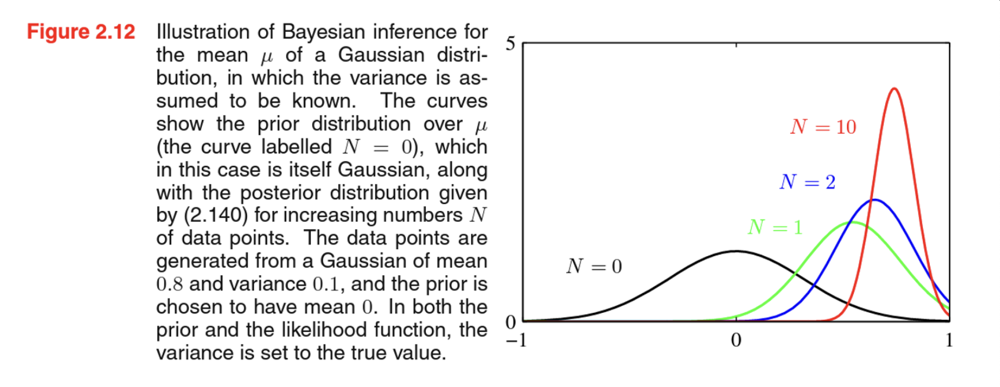

# 개요
## 밀도추정문제
이 장에서 논의할 분포의 역할들중 하나는 한정된 수의 관찰 집합 $x_1, x_2, x_3, …, x_n$ 이 주어졌을 때 확률 변수 $x$의 확률 분포 $p(x)$를 모델링 하는 것이다. 이를 density estimation(밀도 추정) 문제라고 한다. 이 장의 목표를 위해서 데이터 포인트 들은 독립적이며, 동일하게 분포되어있다고 가정할 것이다. 사실 밀도 추정 문제는 근본적으로 타당하지 않은데, 제한된 수의 관찰된 데이터 집합으로부터 가능한 모 확률 분포의 가짓수는 무한대이기 때문이다. 각각의 데이터포인트 $x_1, …, x_N$ 에 대해서 0이 아닌 값을 가지는 어떤 분포 p(x)도 모 분포의 후보가 될 수 있다. 이들 중에서 적절한 분포를 선택하는 것은 1장의 다항식 곡선 근사 문제에서 맞닥뜨렸던 모델 선택의 문제와 연관되어있다. 이는 패턴인식문제의 중요한 쟁점 사항 중 하나다.

## 매개변수적 분포와 비매개변수적 분포
이산확률변수의 **이항분포**와 **다항분포**, 연속확률변수의 **가우시안 분포** 들은 모두 **매개변수적 분포(parametric distribution)** 의 예다 . 해당 분포들은 평균과 분산처럼 작은 수의 조절가능한 매개변수에 의해 조절가능하기 때문에 매개변수적 분포라고 불린다. 이런 모델을 밀도 추정 문제에 적용하기 위해서 적절한 매개변수 값을 찾는 과정이 필요하다. 
- **빈도적 관점**에서는 어떤 특정 기준을 최적화 하는 방식으로 매개변수를 찾게 된다. 최적화 기준의 예시로 가능도 함수가 있다.
- **베이지안 관점**에서는 매개변수에 대한 사전 분포를 바탕으로 관측된 데이터 집합이 주어졌을 때 사후 분포를 계산한다. 이 과정에서 베이지안 정리를 사용한다.

또한 켤레(conjugate) 사전 확률이 중요한 이유는 사후 확률이 사전 확률과 같은 함수적 형태를 띠도록 만들어주기 때문이다. 예를 들어 다항 분포 매개변수의 켤레 사전 확률은 디리클레 분포이다.

**매개변수적인 접근법의 한계점 중 한가지는 분포가 특정한 함수의 형태를 띠고 있다고 가정하는 것이다.** 몇몇 적용사례는 이 가정이 적절하지 않은데, 이 경우에는 **비매개변수적(nonparametric) 밀도 추정 방식**이 대안으로 활용될 수 있다. 비매개변수적 밀도 추정 방식에서는 분포의 형태가 데이터의 집합의 크기에 종속적이다. 이러한 모델들은 여전히 매개변수를 가지고 있지만, 이 매개변수들은 분포의 형태를 결정짓는게 아니라, 모델의 복잡도에 영향을 미친다. 히스토그램, 최근접 이웃, 커널을 바탕으로 한 비매개변수적 방법들이 존재한다.

# 이산 확률 변수
## 베르누이 분포(Bernoulli distribution)
최대 가능도 체계하에서 동전의 앞면이 나올 확률은 데이터 집합에서 앞면이 나온 비율로 주어지게 된다. 

가능도 함수가 $\mu^x(1-\mu)^{1-x}$의 형태를 띄고 있기 때문에 $\mu$와 $1- \mu$의 거듭제곱에 비례하는 형태를 사전 분포로 선택한다면 사전 확률과 가능도 함수의 곱에 비례하는 사후 분포 역시 사전 분포와 같은 함수적 형태를 가지게 될 것 인데 이러한 성질을 켤레성(conjugacy)라고 한다.

## 이항분포 (binomial distribution)
크기 N의 데이터가 주어졌을 때 x=1인 관측값의 수 m에 대해서도 분포를 생각해볼 수 있다.

## 베타분포
우리가 추가적으로 관측 데이터를 더 얻게 되면 지금의 사후 분포가 새로운 사전 분포가 될 수 있다. 이를 확인하기 위해 관측값을 한번에 하나씩 받아들이고 현재의 사후 분포를 매번 업데이트하는 방식으로 생각해보자. 매번 업데이트 단계에서 새로운 관측값에 해당하는 가능도 함수를 곱하고 그 다음에 정규화를 시행해서 새로운 수정된 사후 분포를 얻는 것이다.

즉 <u>**베이지안 관점을 받아드리게 되면 학습에 있어서 이러한 sequential (순차적) 접근이 자연스럽게 여겨지게된다**</u>. 이는 사전 분포나 가능도 함수의 선택과는 상관없이 오직 데이터가 독립적이고 동일하게 분포되어있다는 것에만 의존적이다.

<u>**근데 더 많은 데이터를 관측할수록 사후분포의 불확실성 정도가 꾸준히 감소하는 것은 베이지안 학습의 일반적인 성질일까? 이를 확인하기 위해서 베이지안 학습을 빈도적 관점에서 살펴보도록하자. 그러면 평균적으로 위의 성질이 실제로 사실임을 알 수 있다.**</u>

# 다항 변수
이산 확률 변수는 두가지 가능한 값들 중 하나를 취하는 수량을 설명하는데 사용될 수 있다. 하지만 많은 경우에 서로 다른 K개의 값들 중 하나를 취할 수 있는 이산 변수를 활용해야한다. 이런 변수를 표현하는 데는 여러가지 방법이 있지만, 곧 살펴보게 될 것처럼 원 핫 인코딩을 사용하는 것이 각종 적용에 있어 가장 편리하다.

## 다항분포
## 디리클레 분포
다항 분포의 켤레 사전 분포이다.

# 가우시안 분포
## 조건부 가우시안 분포
만약 두 변수 집합이 결합적으로 가우시안 분포를 보인다면 하나의 변수 집합에 대한 다른 변수 집합의 조건부 분포 역시 가우시안 분포를 보인다는 성질이있다. 또한 각 변수 집합의 주변 분포 역시 가우시안 분포를 보인다. 책의 증명과정을 통해 위에서 결합 분포 $p(x_a, x_b)$가 가우시안 분포이면 조건부 분포 $p(x_a | x_b)$도 가우시안 분포이다.

## 주변 가우시안 분포
아래 식으로 주어지는 주변 분포도 역시 가우시안 분포이다.
$$p(\mathbf{x}_a) = \int p(\mathbf{x}_a, \mathbf{x}_b) d\mathbf{x}_b$$

## 가우시안 변수에 대한 베이지안 정리
2.3.1 절과 2.3.2 절에서는 가우시안 분포 $p(x)$에 대해 벡터 x를 두 부분의 벡터 집합 $x = (x_a, x_b)$ 로 나눈 후 조건부 분포 $p(x_a | x_b)$와 주변 분포 $p(x_a)$에 대한 표현식을 찾아내었다. 이 때 조건부 분포 $p(x_a | x_b)$의 평균이 $x_b$ 에 대해서 선형임을 확인하였다. 가우시안 주변 분포 $p(x)$와 가우시안 조건부 분포 $p(y | x)$가 있을 때 $p(y | x)$의 평균이 x에 대한 선형 함수이며, 공분산은 x에 대해 독립적이라고 하자. 이것이 바로 **선형 가우시안 모델(linear guassian model)**의 예시이다. (8.1.4에서 더 자세히 보자)

## 가우시안 분포의 최대 가능도
최대 가능도 방법론을 토대로 하여 매개변수 $\mu, \Sigma$에 대한 점 추정값을 구할 수 있다.

## 순차추정
순차적인 방법론은 데이터 포인트를 하나씩 처리하고 바로 버릴 수 있도록 해준다. 따라서 순차적인 방법론은 온라인 적용 사례에서 매우 중요하다. 또한 관여되어 있는 데이터 집합의 크기가 매우 커서 전체 데이터 포인트들에 대한 일괄 처리가 불가능할 경우에도 사용할 수 있다.

## 가우시안 분포에서의 베이지안 추론
### 가우시안 분포의 분산을 알고 있는 상황에서 평균을 추정하는 문제
가우시안 분포 평균값의 최대 가능도 표현식을 순차적으로 업데이트 하는 방식은 이미 앞에서 살펴보았다. N개의 데이터 포인트를 관측했을 때 평균값을 N-1개의 데이터 포인트를 관측했을 때의 평균값과 데이터 포인트 $x_N$의 기여도로 표현하는 것이다. 사실 베이지안 페러다임에서는 추론 문제를 자연스럽게 순차적으로 바라보게 된다.

### 평균을 아는 상황에서 분산을 추정하는 문제
사전 분포를 켤레 형태로 선택하면 계산이 훨씬 간단해진다. 가우시안 분포의 켤레 사전 분포는 감마 분포에 해당한다.

## 스튜던트 t 분포
## 주기적 변수
## 가우시안 분포의 혼합

# 지수족
지금까지 이 장에서 살펴본 확률 분포들은(가우시안 혼합분포를 제외하고) 지수족(exponential family)라 불리는 더 넓은 분포 부류의 특정 예들에 해당한다. 지수족에 포함되는 분포들은 공통적으로 여러 중요한 성질들을 가지고 있다.
## 최대 가능도와 충분 통계량

## 켤레 사전 분포

## 무정보적 사전 분포

# 비매개변수적 방법
## 커널 밀도 추정

## 최근접 이웃 방법론