2장에서 밀도 추정 또는 데이터 집단화 등의 비지도 학습에 초점이 맞춰져 있었다면 여기서는 지도학습에 초점을 맞추도록 한다. 선형 회귀 모델은 조절 가능한 매개변수를 바탕으로 한 선형 함수를 사용하는 모델이다. 

가장 단순한 형태의 선형 회귀 모델은 입력 변수들에 대한 선형 함수이다. 하지만 입력 변수들에 대한 비선형 함수들의 집합을 선형적으로 결합하면 더 유용한 함수를 얻을 수 있다. 이러한 함수들을 **기저함수(basic function)** 이라고 한다. 이러한 모델들은 입력 변수들에 대해서는 비선형적이지만 매개변수에 대해서는 선형 함수이기 때문에 쉽게 분석할 수 있다.

N개의 관측값 $\{{\mathbf{x}_n}\}$ 과 이에 해당하는 타켓값 $\{{\mathbf{t}_n}\}$이 훈련집합으로 주어졌을 때 회귀 모델의 목표는 새 변수 x에 대한 타켓 t를 예측하는 것이다. 이를 위한 가장 단순한 접근법은 <u>**새 입력값 x의 타겟값 t를 출력하도록 하는 적절한 함수 y(x)를 직접 만드는 것이다.**</u> 확률적인 측면에서 말하면 **예측 분포 p(t | x)를 모델링 하는 것**이 우리의 목표가 된다. 이 예측분포를 통해 x에 대한 표적값 t의 불확실성을 표현할 수 있다. <u>**1.5.5의 결정이론에서 논의된 바외 같이 평균 기대 손실을 최소화하는 방향으로 y(x)를 구하게 되면 손실 함수를 무엇을 썼냐에 따라서 p(t | x)의 평균값 또는 최빈값 또는 중앙값등으로 y(x)가 구해지게 된다. 예를 들어 제곱 손실 함수를 사용했을 때 t에 대한 조건부 기대값이 최적의 해가 된다는 것이다.**</u> 즉 또 다르게 표현하면 조건부 분포 y(t | x)가 주어졌을 때 해당 최적 예측값에 도달하도록 하는 다양한 오류 함수에 대해서 본 것이고 (여기서 부터 맞는 설명일까?) 이렇게 y(t | x)를 결정하기 위해서 최대 가능도 또는 베이지안을 통해서 해당 조건부 확률을 추정하게 된다.

# 선형 기저 함수 모델
아래 모델을 선형 회귀 모델이라고 한다. 선형 회귀 모델의 가장 중요한 성질은 매개변수 w에 대해서 선형함수이다. 그리고 입력 변수에 대한 고정 비선형 함수들을 사용하고 있는데 이 때 $\phi_j(x)$를 기저 함수(basic function) 이라고 한다. <u>쉽게 말해 고정된 기저함수의 선형 결합으로 이루어진 모델이 선형 회귀 모델이다.</u>
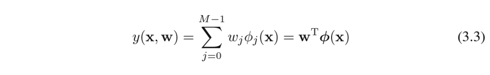

## 최대 가능도와 최소 제곱
<u>**앞에서 곡선 피팅에서 최대 가능도 식을 유도했을 때처럼 타깃 변수 t는 결정 함수 y(x, w)와 가우시안 노이즈의 합으로 주어진다고 가정할 것이다. 데이터 포인트를 가우시안 분포로부터 독립적으로 추출되었다는 가정하에 아래 형태를 가지는 가능도 함수를 얻을 수 있다.**</u>

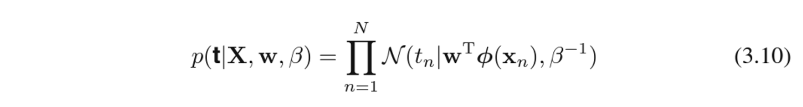
1.2.5에서 살펴본 것처럼 가우시안 노이즈 분포하에서 선형 모델에 대한 가능도 함수를 최대화하는 것은 제곱합 오류 함수를 최소화하는 것과 동일하다. 참고로 아래 편향 $w_0$가 훈련 집합의 타깃 변수들의 평균과 기저 함수값 평균들의 가중 합 사이의 차이를 보상한다는 것을 알 수 있다.
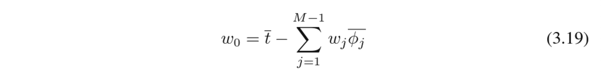
아래 식 3.15는 최소 제곱 문제의 정규 방정식(normal equation)이라고 부른다.
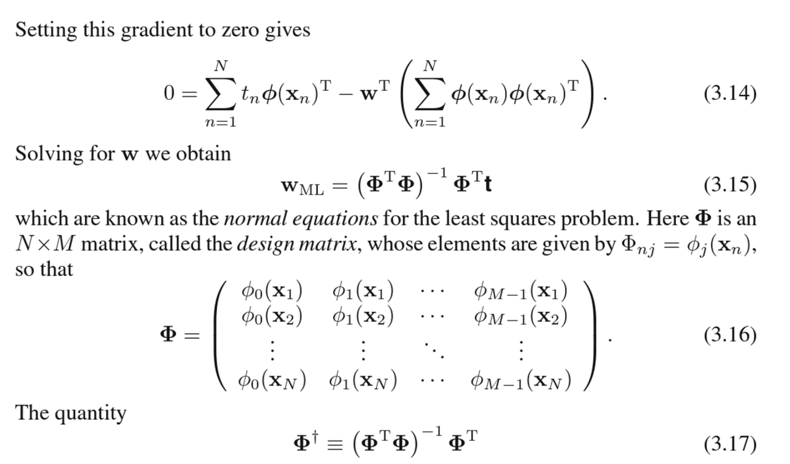

## 최소 제곱의 기하학적 의미
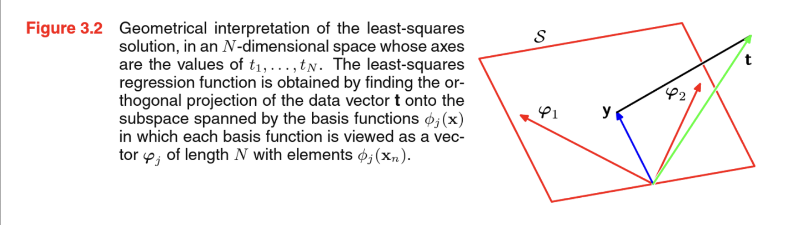
M개의 벡터 $\phi_j$ 은 M차원의 선형 부분 공간 S상에 펼쳐지게 될 것이고 즉, y는 $\phi_j$들의 선형결합으로 이루어져있다. 최소 제곱합 오류는 부분 공간 S상의 y와 가장 가까운 t에 의해 결정이 되므로 이 해는 t를 부분공간 S로 직교적으로 투영한 것이라 생각할 수 있다. 

## 순차적 학습
위 식 3.15의 최대 가능도 해와 같은 일괄 처리 테크닉을 활용하기 위해서는 전체 훈련 집합을 한번에 처리해야한다. 큰 데이터 집합에 대해서는 계산이 복잡할 수 있으며 이럴 땐 순차적(sequential)알고리즘을 활용하는 것이 유용할 수 있다(온라인 알고리즘이라고도 한다) 순차적 알고리즘에서는 한번에 하나의 데이터 포인트를 고려하며 모델의 매개변수들을 업데이트 한다. 확률적 경사하강법 / 순차적 경사 하강법을 적용하여 순차적 학습 알고리즘을 구현할 수 있다.

## 정규화된 최소 제곱법
과적합 문제를 막기 위해서 오류 함수에 정규화항을 추가하면 오류 함수는 다음과 같은 형태를 띈다.
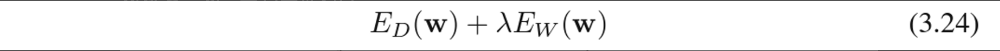
가장 단순한 형태의 정규화항은 가중치 벡터 원소들의 제곱합으로 제곱합 오류 함수를 고려하여 전체 오류 함수는 다음과 같다.
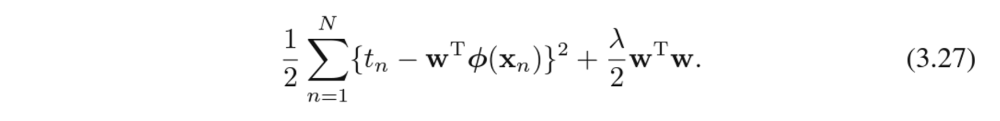
정규화항은 가중치 감쇠(in 머신러닝) 또는 매개변수 축소(in 통계학)으로 불린다. 좀 더 일반화된 정규화 오류 함수는 다음과 같다.
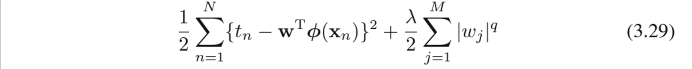
정규화는 유효한 모델의 복잡도를 제한하면서 복잡한 모델들이 제한된 수의 데이터 집합을 이용해서도 심각한 과적합 없이 피팅될 수 있도록한다. 하지만 이 경우에 최적의 모델 복잡도를 찾는 문제가 적절한 기저 함수의 수를 정하는 문제에서 적절한 정규화 계수 $\lambda$를 찾는 문제로 변경된다.
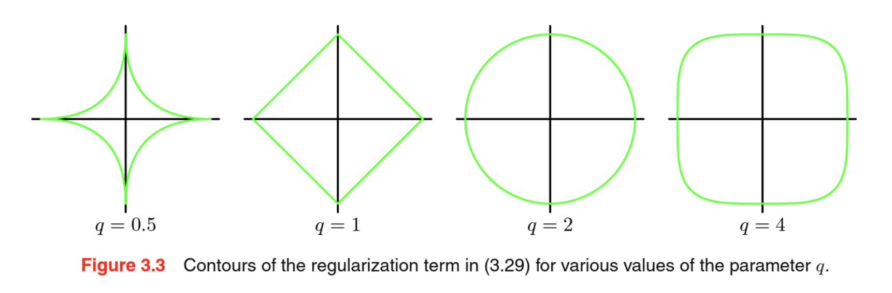
위의 일반화된 정규화 오류 함수의 최소화하는 것은 $\Sigma_{j}|w_j|^q ≤ \eta$의 제약조건하에서 최소화하는 것과 같다는 것을 의미하고 그림으로는 아래처럼 나타낼 수 있다.
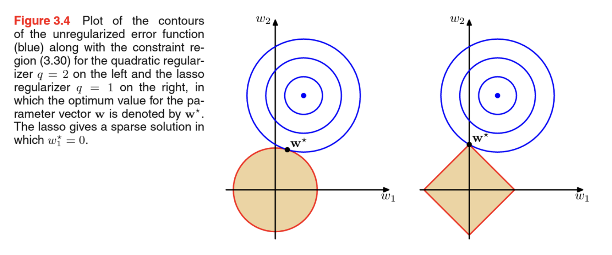

## 다중 출력값
지금까지 단일 타깃 변수 t에 대해서만 고려했다. 여기서는 표적 벡터 t 에 대해서 예측하도록 한다. 임의의 공분산 행렬을 가진 일반적인 가우시안 노이즈 분포에 대해 확장하는것은 그리 어렵지 않고 이 역시 각각의 문제들이 각각의 문제들이 K개의 서로 독립적인 회귀 문제로 분리된다. 왜냐하면 매개변수 W는 가우시안 노이즈 분포의 평균값을 정의할 뿐이며, 2.3.4절에서 살펴본 것과 같이 다변량 가우시안 분포의 평균값의 최대 가능도의 해는 공분산과 독립적이기 때문이다. 이 장의 나머지 부분에서 논의의 편리함을 위해 단일 타깃 변수 t에 대해서만 고려하도록한다.

# 편향 분산 분해
과적합 문제는 최대 가능도 방법을 사용할 경우에 발생하는 안타까운 성질이며, 베이지안 방법론을 바탕을 각각의 매개변수를 주변화할 경우에는 발생하지 않는다. 베이지안 관점에서 모델 복잡도에 대해서 깊이 살펴보기 전에 빈도주의 관점으로 모델 복잡도에 대해 살펴보고자 하며 이를 편향 분산 트레이드 오프(bias variance trade off)라고 한다.

<u>**1.5.5절의 회귀 문제의 결정 이론에 대해 논의할 때 조건부 분포 p(t | x) 가 주어졌을 경우 해당 최적 예측값에 도달하도록 하는 다양한 오류 함수들에 대해 살펴보았다. 가장 많이 사용되는 오류 함수는 제곱 오류 함수이며 이 경우 최적의 예측치는 조건부 기대값으로 주어지게 된다.**</u>

<u>**이 때 중요한 것은 결정 이론에서 사용했던 제곱 오류 함수와 모델 매개 변수의 최대 가능도 추정치에 해당하는 제곱합 오류 함수는 다르다는 것을 명심해라! (결정에서의 손실함수와 추정에서의 가능도의 최대를 추정하기 위한 제곱합 오류 함수는 다르다. 결정과 추정을 다르게 보자)**</u>

아래에서 100개의 데이터 집합을 만들고 한 데이터 집합에는 25개의 데이터 포인트를 가지고있다. 24개의 가우시안 기저함수를 바탕으로 한 모델을 이용하여 일반화된 정규화 정규화 오류 함수를 최소화하는 방식으로 각각의 데이터 집합을 피팅했고 그 결과로 구해진 예측 함수 y의 그림을 아래에서 확인할 수 있다.
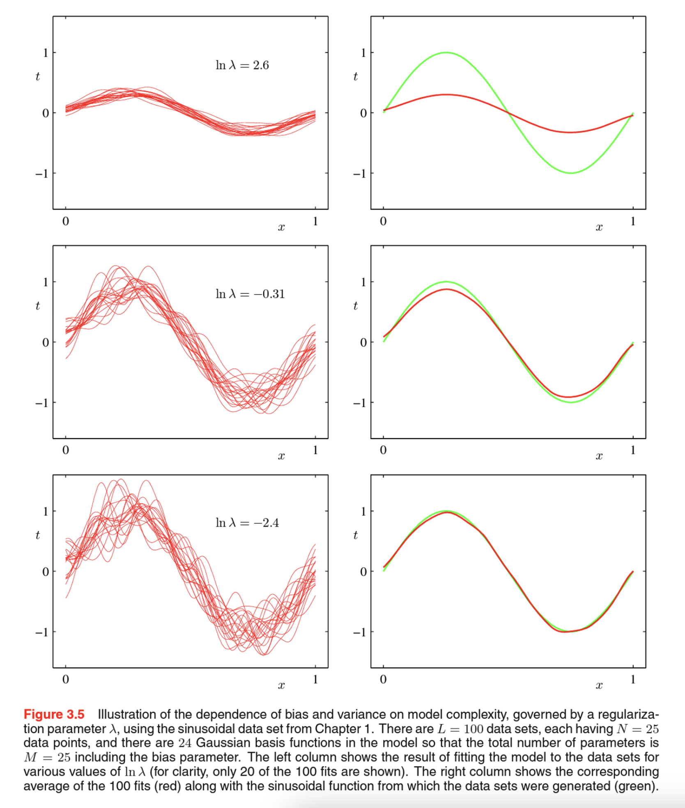

여기서 맨 위 행은 큰 정규화 계수를 활용하여 낮은 분산(빨간색 커브가 비슷한 파형을 보인다)과 높은 편향(오른쪽 그래프의 두 커브가 많이 차이난다)를 가지는 경우를 보여주며, 아래쪽 행은 작은 정규화 계수를 사용했고 큰 분산과 낮은 편향을 보인다. <u>**M=25(편향 매개변수까지 포함하면) 인 복잡한 모델의 여러 결과값들을 평균 내는 것이 이득을 주는 과정임을 예상할 수 있다. (오른쪽에 100개의 해당 근사치들의 평균을 빨간색으로 나타내었다)**</u> 실제로 여러 해들의 가중 평균을 내는 것은 베이지안 방법의 핵심에 해당한다 (베이지안 방법에서 가중 평균은 여러 데이터 집합들에 대한 평균이 아니라 각 매개변수들의 사후 집합에 대한 것이다)

편향 분산 분해를 통해 모델 복잡도의 문제에 대해서 빈도주의 관점의 흥미로운 통찰을 얻을 수 있다. 하지만 이러한 관점의 실제적인 가치는 제한적이다. 왜냐하면 편향 분산 분해는 여러 데이터 집합들의 모임에 대한 평균을 바탕으로 한 것이기 때문이다. 실제 사례에서는 단 하나의 데이터 관측 집합만이 주어지는 일이 보통이다. 

아래에서 $(편향)^2 + (분산)$ 값이 최소가 되는 지점 근처에서 시험 데이터에 대해 최소 오차를 냄을 알 수 있다.

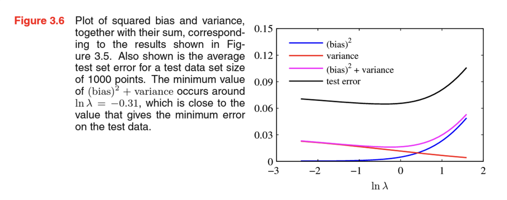

# 베이지안 선형 회귀
선형 회귀 모델의 매개변수를 정하기 위한 최대 가능도 방법에서 기저 함수의 숫자로 결정되는 모델의 복잡도는 데이터 집합의 크기에 따라 조절되어야 한다는 것을 확인했다. 또 로그 가능도 함수에 따라 정규화항을 추가하는 것은 정규화항의 계수값에 따라 모델의 복잡도를 조절할 수 있다는 의미이다. 이렇게 되면 특정 문제에 대해 모델 복잡도를 결정하는 것은 또 새로운 문제로 떠오른다. 단지 가능도 함수를 최대화 하는 방식으로 문제를 풀면 언제나 과적합에 해당하는 아주 복잡한 모델을 선택한다. 물론 훈련, 검증 데이터 셋을 나누어 모델의 복잡도를 결정할 수도 있지만 계산 시간과 소중한 데이터를 낭비하게 된다. 

$\rightarrow$ 베이지안 방법론을 통해 선형 회귀를 시행하면 과적합 문제를 피하고 훈련 데이터만 가지고 모델의 복잡도를 자동으로 결정할 수 있다.

## 매개변수 분포

## 예측 분포

## 등가 커널

# 베이지안 모델 비교
베이지안 측면에서 모델 선택 문제에 대해 논의한다. 그리고 다음 3.5절에서 이 아이디어를 바탕으로 선형 회귀에서 정규화 매개변수를 결정하는 것에 대해 설명할 것이다.

모델의 매개변수 값에 대한 점 추정을 시행하는 대신에 해당 매개변수를 바탕으로 주변화(합산 혹은 적분)를 시행함으로써 최대 가능도 방법과 연관된 과적합 문제를 피할 수 있다. 이 경우 훈련 집합을 바탕으로 모델들을 직접 비교할 수 있기 때문에, 검증 집합이 필요하지 않다. 또한 여러 복잡도 매개변수들을 한번의 훈련 과정에서 동시에 결정할 수 있는데 예를 들어 7장의 상관 벡터 머신은 각각의 훈련 포인트 하나마다 하나씩의 복잡도 매개변수를 가지는 베이지안 모델이다.

# 증거 근사
## 증거 함수 계산

## 증거 함수 극대화

## 유효 매개변수의 숫자

# 고정 기저 함수의 한계점
매개변수에 대한 선형관계는 해당 종류의 모델을 분석하기 쉽게 해준다. 매개변수들의 선형성을 가정할 때 최소 제곱 문제의 해가 닫힌 형태로 존재하며 베이지안 과정을 통해 풀이가 가능하다. <u>**또한 기저 함수를 적절히 선택할 경우 입력 변수와 타깃 변수 사이의 임의의 비선형성도 모델링할 수 있다.**</u>

선형 모델의 심각한 한계점을 이후에 서포트 벡터 머신 또는 뉴럴 네트워크 등의 모델들을 살펴볼 것이다.

선형 모델의 한계점은 기저 함수가 훈련 데이터 집합이 관측되기 전에 고정되어있으며, 1.4에서 논의했던 차원의 저주 문제의 징후를 보인다는 것이다. 선형 모델의 경우 기저 함수의 숫자는 입력 공간의 차원 D가 증가함에 따라 아주 빠르게 증가한다.

이 문제를 해결하기 위해 사용 가능한 실제 데이터 집합들의 두가지 성질이 있다.
1. 데이터 벡터들 $\{x_n\}$은 보통 내재적 차원수가 입력 공간의 차원수보다 작은 비선형 매니폴드에 근접하게 존재한다. 이러한 예시로 12장에서 손글씨 숫자 이미지 데이터에서 지역화된 기저 함수를 사용한다면 입력 공간상에서 데이터를 포함하는 지역에만 이 기저 함수들이 퍼져 있도록 배열 할 수 있다. 이러한 방법으로 방사 기저 함수 네트워크, 서포트 벡터 머신, 상관 벡터 머신 등이 있다.
2. 타깃 변수들이 데이터 매니폴드의 몇몇 일부 방향성에 대해서만 중요한 종속성을 가졌을 수 있다.