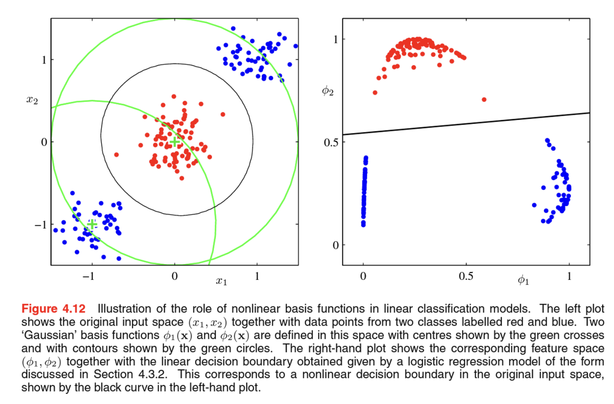

분류 문제의 목표는 입력 벡터 x가 주어졌을 때 K개의 이산 클래스 $C_k (k = 1, …, K)$들 중 하나에 할당하는 것이다. 대부분의 문제에서 클래스들은 서로 겹치지 않는다. 즉 각각의 입력값들은 하나의 클래스에 할당된다. 따라서 입력 공간은 결정 경계(decision boundary) 또는 결정 표면(decision surface)라고 불리는 여러 결정 구역(decision region)들로 나누어지게 된다. 타깃변수는 0또는 1의 값이거나, 클래스의 개수가 2개 이상일 때 원-핫 인코딩으로 표현한다.

이 장에서 말하는 선형 모델의 의미는 입력 벡터 x에 대한 선형 함수라는 의미로 결정 표면들은 D차원의 입력 공간상의 (D-1)차원 초평면으로 정의된다. 클래스들이 선형 결정 표면들을 바탕으로 정확하게 나뉘어질 수 있는 데이터 집합을 선형 분리 가능(linearly separable)한 집합이라고 일컫는다.

f는 활성화함수라고 부르며 활성화 함수가 비선형이더라도 결정 경계면은 x에 대해 선형 함수이다. 그래서 식 4.3으로 표현가능한 모델들을 일반화된 선형 모델(generalized linear model)이라고 부른다. 이런 종류의 모델은 회귀 모델과 달리 f 때문에 매개변수에 대해 선형적이지는 않다. 

# 판별 함수
판별함수는 입력 벡터 x를 K개의 클래스들 $C_k$중 하나에 배정하는 함수이다. 이 장에서는 결정 표면이 초평면(그것이 그려진 공간보다 한 차원 낮은 공간에서 정의)인 선형 판별(linear discriminant)에 대해서만 살펴볼 것이다.
## 두개의 클래스

선형 판별 함수를 가장 간단하게 표현했으며 $y ≥ 0$ 이면 클래스 $C_1$에 $y ≤ 0$ 이면 클래스 $C_2$에 배정되고 결정 경계는 $y = 0$ 이 된다. D차원의 입력 공간상의 (D-1)차원 초평면에 해당된다. 그리고 편향 매개변수 $w_0$가 결정 표면의 위치를 결정한다.

## 다중 클래스

다중 클래스 선형 판별의 경우의 결정 경계를 그린 도식으로 결정 경계가 빨간색 선으로 그려져있다. 두 점 $x_A$, $x_B$가 같은 영역 $R_k$ 상에 존재할 경우에 두 점을 잇는 선상에 존재하는 모든 점 $\hat{x}$ 역시 $R_k$ 상에 존재해야한다. 따라서 결정 영역은 단일 하게 연결되어있으며 볼록해야한다.
<u>**선형 판별함수의 매개변수를 학습하는 세가지 방법은 바로 최소 제곱법, 피셔의 선형 판별법, 퍼셉트론 알고리즘이다.**</u>

## 분류를 위한 최소 제곱법
K개의 클래스의 타킷 벡터가 원핫 인코딩으로 표현된다고 가정했을 때, 최소 제곱법을 사용하는 것이 타당한 이유는 최소 제곱법이 입력 벡터가 주어졌을 때 표적 벡터의 조건부 기댓값 $E[t|x]$ 의 근사값을 구하는 방법이라는 점이다. 이진 부호화의 경우 이 조건부 기대값은 사후 클래스 확률의 벡터로 주어지게 되는데 불행하게도 이런 확률들은 (0, 1) 범위 밖의 값을 가질 수도 있어서 성능이 좋지 못하게 근사된다.

최소제곱법은 원래 가우시안 조건부 분포 가정하에서의 최대 가능도 방법과 연관되어 있는 방식이다. 그렇기 때문에 명확히 가우시안이 아닌 분포를 가진 이진 표적 벡터들에 대해서 최소 제곱법이 제대로 작동하지 않는 것은 당연하다. <u>**더 적합한 확률적 모델을 사용하면 최소 제곱법보다 훨씬 더 나은 성질을 가진 분류 테크닉을 만들어 낼 수 있지만 일단 지금은 선형 분류 모델의 매개변수를 찾아내는 비확률적 방식에 대해 좀 더 살펴보자.**</u>

## 피셔의 선형 판별

## 최소 제곱법과의 관계

## 다중 클래스에 대한 피셔 판별식

## 퍼셉트론 알고리즘

# 확률적 생성모델
이제 분류 문제를 확률론적으로 살펴보도록 하자. 데이터의 분포에 대한 단순한 가정으로부터 선형 결정 경계를 가지는 모델을 유도해 내는 과정에 대해 살펴볼 것이다. 1.5.4절에서 분류를 위한 판별적 접근법과 생성적 접근법의 차이에 대해 논의했고 여기서는 클래스별 조건부 밀도 $p(x|C_k)$와 클래스 사전분포 $p(C_k)$를 모델하고, 베이지안 정리를 적용하여 사후 확률 $p(C_k | x)$를 계산해내는 방식의 생성적 접근법을 사용할 것이다.

### 로지스틱 시그모이드 함수
클래스가 2개인 경우 클래스 $C_1$에 대한 사후 확률을 다음과 같이 정의했다.

### 소프트맥스 함수
클래스가 2개 이상인 경우 클래스 $C_k$에 대한 사후 확률을 다음과 같이 정의했다.

이제 클래스별 조건부 밀도에 대해서 특정 형태를 선택하였을 경우의 결과에 대해서 살펴보도록 하자. 연속적인 입력 변수 x와 이산적인 입력 변수 x에 대해 각각 살펴볼 것이다.

## 연속 입력
클래스별 조건부 밀도, $p(x | C_k)$가 가우시안이라고 가정하고 그 결과로 사후 확률이 어떻게 되는지 살펴보자. 그리고 모든 클래스들이 같은 공분산 행렬을 공유한다고 가정할 것이다. 그 때 클래스가 두개인 경우에 대해서 4.65 처럼 식을 구할 수 있다.

로지스틱 시그모이드 함수의 입력 변수가 x에 대한 선형 함수가 되었다. 아래 그림에서 왼쪽의 그래프는 두 클래스들의 클래스 조건부 밀도를 그린 것이고, 각각의 클래스에 대해서 빨, 파란색으로 그려져있다. 오른쪽 그림은 이에 해당하는 사후 확률 $p(C_k | x)$를 그린 것이다. 사후 확률은 x에 대한 선형 함수의 로지스틱 시그모이드로 주어진다. $C_1$에 대한 사후확률은 빨간색, $C_2$에 대한 사후확률은 파란색으로 색칠되어있다.

## 최대 가능도 해
클래스별 조건부 밀도, $p(x | C_k)$를 매개변수적 함수 형태로 명시하고 나면 최대 가능도 방법을 이용하여 매개변수들과 사전 클래스 확률 $p(C_k)$를 구할 수 있다. 이를 위해서는 관측값 x에 대한 클래스 라벨이 필요하다.

## 이산 특징
우선 이진 입력 변수를 고려해보고 그 이후에 더 일반적인 이진 입력 변수값들에 대해 살펴보고자 한다. 만약 D개의 입력 값이 있다면, 일반적인 분포는 각각의 클래스에 대해서 $2^D$개의 숫자를 가진 테이블에 해당할 것이다. 이 분포는 $2^D -1$개의 독립변수를 가진다. 이는 특징의 수가 늘어남에 따라 기하급수적으로 늘어나므로 더 제한된 표현 방법이 필요하다. 여기서 나이브 베이즈 가정을 사용할 것이다. 나이브 베이즈 가정하에서는 각각의 값들이 클래스 $C_k$에 대해 조건부일 때 서로 독립적으로 취급되며 클래스 조건부 분포는 다음의 형태를 가진다. 

## 지수족
가우시안 분포를 가지는 입력값과 이산 입력 값의 경우에 사후 클래스 확률은 로지스틱 시그모이드 함수 또는 소프트맥스 함수를 활성화함수로 가지는 일반화된 선형 모델로 주어진다. 이들은 클래스 조건부 밀도 $p(x | C_k)$가 지수족 분포라고 가정했을 때 더 일반화 시킬 수도 있다.

# 확률적 판별모델
클래스가 2개인 분류 문제의 경우 다양한 종류의 클래스 조건부 분포 $p(x | C_k)$에 대해 클래스 $C_1$의 사후 확률을 x의 선형함수에 대한 로지스틱 시그모이드 함수로 표현할 수 있음을 알아보았다. 그리고 클래스가 여러개인 경우에는 클래스 $C_k$의 사후 확률을 x에 대한 선형 함수를 소프트맥스 함수로 변환한 것으로 표현할 수 있다는 것도 보았다. 그리고 클래스 조건부 분포가 특정 분포를 가질 경우 최대 가능도 방법을 아용하여 밀도의 매개변수와 클래스 사전 분포를 구하고 베이지안 정리를 활용하여 사후 클래스 확률도 계산했다. 이는 생성적(generative)모델링을 한 예시였다 (p(x)에서 x 값을 추출하는 방식으로 인공의 데이터를 생성하는 것이 가능하기 때문이다)

여기서는 조건부 분포 $p(C_k | x)$를 통해 정의된 가능도 함수를 직접 극대화하는 방식으로 진행할거고 이는 판별적(discriminative)훈련의 한 예시이다. 특히 클래스 조건부 밀도에 대한 가정이 실제 분포를 잘 근사하지 못했을 경우 판별적인 방식이 더 나은 예측 성능을 보인다.

## 고정된 기저함수
지금까지 입력 벡터 x에 대해 직접적으로 적용되는 분류 모델을 사용했었는데, 이 모든 알고리즘들은 기저 함수들의 $\phi(x)$를 이용하여 입력값들에 대해 고정된 비선형 변환을 적용해도 동일하게 사용할 수 있다. 이 결과로 얻게되는 결정 경계는 아래 그림과 같이 특징 공간 $\phi$상에서 선형 일 것이고 x 공간에서는 비선형일 것이다. 

## 로지스틱 회귀
4.2에서 생성적 방식에 대한 논의에서 클래스에 대한 사후 확률을 특징 벡터의 선형 함수에 로지스틱 시그모이드 함수로 적을 수 있었다.

## 반복 재가중 최소 제곱법

## 다중 클래스 로지스틱 회귀
앞에서 다중 클래스 생성적 모델에 대한 논의에서 다양한 클래스 분포에 대한 입력 변수들의 선형 함수에 소프트맥스 변환을 적용한 형태로 사후 확률을 표현할 수 있다는 것을 확인했다.

## 프로빗 회귀
## 정준 연결 함수

# 라플라스 근사
## 모델 비교와 베이즈 정보 기준

# 베이지안 로지스틱 회귀
## 라플라스 근사
## 예측 분포
