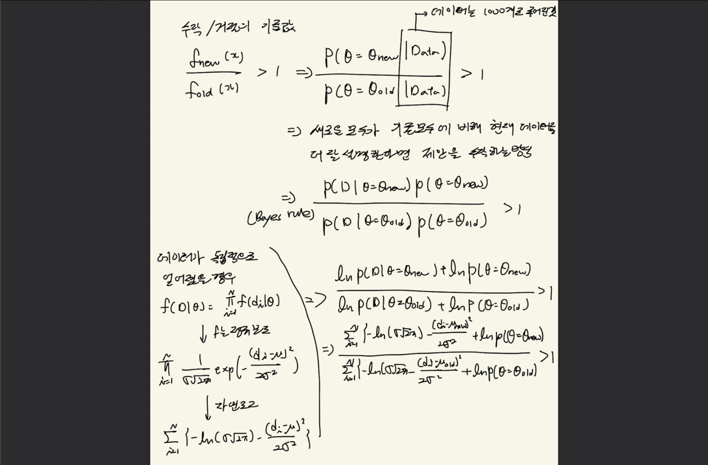

아래 내용 출처: https://www.youtube.com/watch?v=x0qhLFnTfV8

# Bayesian estimation
목표 : MCMC(Markov Chain Monte Carlo)를 이용하여 모집단 분포의 파라미터를 추정한다.
- 정리하면 여기서는 모집단 분포의 파라미터를 구하기 위해서 MLE가 아니라 MCMC를 이용한 bayesian estimation을 사용해보고자 하는 것이다.
- 여기서 MLE와 다른 점은 MLE는 모든 주어진 x에 대해 likelihood 값이 점검 되었다면, MCMC에서는 제안분포를 통해 관찰하고자 하는 mean 값을 제안 받아 점검이 진행된다.

가정
- 모집단을 평균 10, 표준편차 3인 정규분포라고 했을 때 표본 집단은 모집단에서 1000개를 샘플링 한 것이다. 다시 말해, 1000개의 샘플만을 가지고 30,000개의 전체 모집단의 평균을 더 잘 추정해보고자 하는 것이다. (그럼 그냥 1000개 샘플을 평균 내면 안되냐는 것인데, 모수 중 하나로써 평균을 구하고자 하는 것이고 다 더해서 개수로 나눠주는 방법도 사실 MLE 연구를 통해서 얻어진 결과이지, 평균이라는 모수를 쉽게 얻을 수 있었던 건 아니다)

추정 과정
- 1) Random initialization
    - 타겟분포는 정규분포로 모수는 평균과 표준편차가 존재하는데, 여기서는 편의를 위해 평균만 추정해보자.
    - 제안분포의 첫 평균 값은 1이고, 표준 편차는 편의상 표본 표준편차를 그대로 사용할 것이다.
- 2) 제안분포로부터 새로운 모수 제안받기
    - MCMC 샘플링에서처럼 제안 분포로부터 새로운 mean 값 추천 받기
    - 이를 위해 첫 평균값인 1을 중심으로 제안 분포를 그림
    - 제안 분포로 정규분포 사용 (표준편차는 0.5)
- 3) 추천 받은 mean 값을 기준으로 accept 혹은 reject.
    - MCMC 샘플링에서와 마찬가지로 타켓 함수의 높이 비교를 통해 이루어진다.
    - 수락의 기준 값
      
    - 하지만 MCMC 샘플링과 차이점은 아래와 같다.
        - 하나의 타켓함수에 대한 서로 다른 입력값에 대한 함수의 높이 차이가 안남
        - 타켓함수의 모수가 변경되고(즉, 평균이 이동), 주어진 데이터(x값)은 움직이지 않음
    - prior 파트에 대한 설명
        - Prior는 대략적으로 나마 알 수 있는 것
        - 가령, $\mu$값은 최소한 양수다 정도의 배경 지식으로 설정 가능
            - 예시) $p(\mu) = 1$ if $\mu$ >0 else 0
        - 더 좋은 prior를 생각해낼 수록 estimation의 결과가 더 빨리 수렴될 수 있다.
- 4) 패자부활전
    - 과정 3에서 거절 당한 경우에는 MCMC 샘플링과 마찬가지로 패자부활전을 거칠 수 있다. 전혀 생각지도 못한 곳에서 정답이 있을 수 있기 때문에 패자부활전을 한다.
    - 패자부활전 부활 기준
      

추정결과

