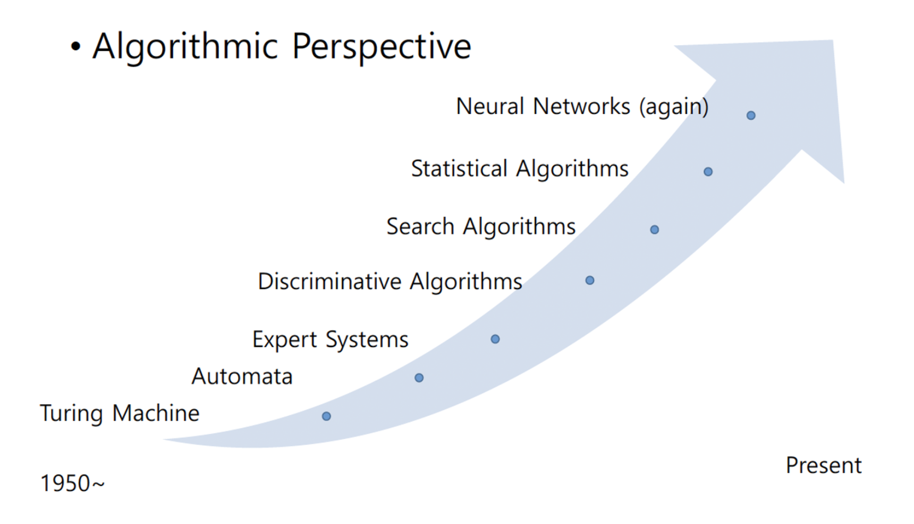

# 목차
1. NLP Overview
2. Linguistics Concepts
3. Linguistics Concepts - Terms
4. NLP Problems
5. N-Gram
6. Language Model
7. Machine Translation
8. Question Answering
9. Conversational System

# 1. NLP Overview
### AI Methods applied to NLP
| Tribe | Origins | Master | Date |
|--|--|--|--|
| Symbolists | Logic, philosophy | Inverse deduction | ~2000 |
| Connectionists | Neuroscience | Backpropagation | ~present |
| Evolutionaries | Evolutionary biology | Genetic programming | |
| Bayesian | Statistics | Probabilistic inference | ~2014 |
| Analogizers | Psychology | Kernal machines | |

 실제로 인공지능을 구현하고자 하는 학파를 나눠보자면 5개의 학파로 나뉘어 질 수 있다고 한다 (책 마스터알고리즘 참고)

### 왜 nlp가 어려울까?
- ambiguity
- sparse data
    - 자주 등장하는 단어와 가끔씩 등장하는 단어의 개수 차이가 심하다.
    - 지프의 법칙(빈도 * 랭킹은 거의 일정하다)
      
- variation
- expressivity (표현능력)
- strong context dependency

### Academic Community
The biggest society
- The Association of computational linguistics (ACL)
- Linguistic Data Consortium(LDC)

Related Conferences (focused on hot problem solving method)
- NLP General
  - ACL
  - Empirical Methods in Natural Language Processing(EMNLP)
  - North American Chapter of the Association for Computational Linguistics (NAACL)
- ML Specific
  - NIPS, ICML
- Symbolic and traditional ML and AI
  - AAAI
- Linguistic(언어학) base
  - COLING
  - CoNLL
  - LREC
- Knowledge Mining (Database research base)
  - KDD
  - SIGIR
  - CIKM

# 2. Linguistics Concepts

_출처: https://www.quora.com/What-is-the-relationship-between-linguistics-and-other-fields_
- phonetics(음성의)
- phonology(음운)
- morphology
- lexicon
- syntax
- sementics

# 3. Linguistics Concepts - Terms

# 4. NLP Problems
### Large Categories of NLP Research Area
Method
- Logic, statistics, linguistics, machine learning

NLP Applications
- NLP Core Tasks
  
- Language Understanding
  - morphological analysis
  - part-of-speech tagging
  - syntactic parsing
  - sementic parsing
  - sementic analysis
  - discourse analysis
  - pragmatic analysis
- Language Modeling
- Practical Applications
  

Resource
- Data (generation, define, standard, ...)
- Tools (evaluation, data generation, ...)

Evaluation
- Measuring performance of tasks

### NLP Tasks in a Big Picture

# 5. N-Gram
n-gram: consecutive N symbols

role of n-gram
- probabilistic modeling of sequences
- evaluation

n-gram based models
- training/sampling
- assumptions: length of dependency, positional independence

# 6. Language Model

# 7. Machine Translation
Objective function
- (usually) word-level probability(F1)
- sentence-level probability

Evaluation
- word-level accuracy (F1)
- sentence-level accuracy(BLEU, NIST, TER, METEOR, Rouge-L)

History of MT
- Translation Memory
- Rule-based MT
- Statistical MT
- Neural MT
  - RNN(2014)
  - LSTM/GRU(2014)
  - Google’s Neural Machine Translation System(2016.)

# 8. Question Answering

### Extractive QA

_Zhu, Fengbin, et al. "Retrieving and reading: A comprehensive survey on open-domain question
answering." (2021). (https://arxiv.org/abs/2101.00774)_

### Open domain QA (in Extractive QA)

1. Question Analysis 
    - Query Formulation
      - pos tagging, parsing, stop-word removal
      - query expansion/paraphrase generation
    - Query classification
2. Document Retrieval
    - model based approach
      - boolean model(exact keyword matching)
      - vector space model(similarity)
      - probabilistic model(ex. TF-IDF)
      - language model
    - post processing approach
      - document filtering
      - document re-ranking
      - document selection
3. Answer Extraction

### Abstractive QA
abstractive vs extractive
- abstractive: generation of new units
- extractive: selection form observed units

_Cui, Wanyun, et al. "KBQA: learning question answering over QA corpora
and knowledge bases."(2019). https://arxiv.org/abs/1903.02419_
- Online procedure: Generator
- Offline Procedure: External Resource

# 9. Conversational System

# 10. Overview AI
### Gap Between General and Academic View
1. physical action → robotics
2. mental action → aritificial intelligence (neuro science?)
    - memorizing
        - done!
        - use memory and program
        - materials, electronics
    - body control
        - maybe done!
        - collect all bit signals and send them to peripherals
        - robotics, mechanics, electronics
    - recognizing somthing in real world
        - maybe done?!
        - camera, microphone and many sensors
        - materials, mechanics, electronics, chemistry, biology
    - understanding meaning
        - difficult!
        - cognitive science
        - math, statistics, cs
    - guessing
        - difficult!
        - math, statistics, computer science
3. emontional action → psychology. AI my be applied

### AI history

### Limit
- knowledge
- data
- computing power
- ethical problems

# 11. problem solving 1
ex) 컴퓨터에게 이차방정식을 풀게 하고 싶다.
1. specifiy the input conditions
2. check the conditions
3. receive inputs
4. return the final outputs

문제를 디자인하기
- input type
    - numerical, symbolics
    - continuous, discrete
- output type
    - numerical, symbolic
    - continuous, discrete
- problem type: classification, regression
- how to design a problem
    - image classification
    - voice recognition
    - recommendation
    - document search
    - translation
    - forecasting
    - finding the shortest path
    - traffic optimization
    - self driving car

# 12. problem solving 2
### What is understanding
Understanding is … : 이차방정식을 풀 때 성공적인 100개의 연속된 시퀀스가 있다고 하자. 이 때 여기서 중요한 규칙을 발견할 수 있을까? 다른 말로 표현하면 sequence를 생성하기 위해 knowledge 또는 strategy를 발견할 수 있을까?

### Why do we care about understanding? 
모든 science 와 engineering 필드에서 problem solving은 다음과 같은 실험적인 프로세스를 거친다.

또는 이론 분야라면?

### Hypothesis set
- correct output을 생성하기 위해 hypothesis set을 찾을 수 있을까? 만약 하나의 hypothesis 만 존재한다면 답을 이미 알고 있기 때문에 search를 할 필요가 없다. 우리가 체크해야할 많은 hypothesis 가 있을 때 우리는 problem solver를 이용해야한다. given conditions과 함께 주어진 문제를 풀기 위해 hypothesis set을 정의해야한다. 예를 들어 알고리즘은 hypothesis 의 sequence 이다.
- 복잡한 문제일 수록 many hypothesis가 존재한다. AI는 best hypothesis set을 찾는 것이다.

### Fundamentals of AI
- model representation (model space 정의)
- optimization (training)
- generalization (gap between training and test space)

### AGI
Narrow AI

Narrow AI $\rightarrow$ Strong/General/Super AI

# 13. model representation
optimization
- coverage
- goal
- loss landscape
- local optimum
- global optimum

generalization
- true optimum
- model complexity
- method
- landscape modification

AI 알고리즘 카테고리

Major representation of hypotheses
- logic(ex. 삼단논법)
- random variable(bayesian network)
- hyperplane(ex. partitioning, segmentation, separation - nn, svm, decision tree)
- population

# 14. Training - Part 1
Optimization
- in deep learning - adam, gradient descent
- in probabilistic graphical model
    - exact point estimation
        - lagrange multiplier
        - grandient descent
        - newton’s method
        - …
    - approximation
        - stochastic gradient descent
- in mathematics

- example issues to consider in practical use

- in algorithmic approach

# 15. Training - Part 2
How to find local optimum
- convex optimization
- analytic solution
- approximation
    - gradient descent

# 16. Training - Part 3
Exploitation(이용) vs Exploration(탐사)
- Exploitation : searching more narrow regions to find better solutions
- Exploration : searching wider regions to find more various solutions

Convergence vs Divergence

Local optima vs global optima

Generalization - True optimum

# 17. Training - Part 4
Generalization - Model complexity
- overfitting

Generalization - method
- penalization(weight decaying)
- model distortion
- data distortion
- multitask learning

# 18. Evaluation
regression, classification metrics

# 19. probabilistic model intro
Framework of Building a Probabilistic Model
- Generative vs Discriminative models

Training a probabilistic Model
- Prior, Likelihood, Posterior probability
- MLE, MAP
- Assumption

Inference
- Steps
  - Marginalization
  - Bayes rule
  - Chain rule
- Reduce inference time
  - memorizing partial results as a seperate table

Issue
- Independence assumption
- Assumptions on Parameterized distribution
- Obsevables to Variable Relation

generative vs discriminative
- Directly Learn $p(y | \theta, x)$ : discriminative approach
- Learning $p(x, y | \theta)$: generative approach

generative model
- bayesian network
- markov network
- any random variable based networks

discriminative models
- neural networks
- SVM

Inference vs Learning

# 20. Representations of Probabilistic Models - Bayesian Networks

# 21. Markov Network1,2

# 22. predicate calculus

# 23. Representations of Probabilistic Models - Inductive Logic Programming

# 24. Representations of Probabilistic Models - Neural Network

# 25. Bayesian Logic Programming

# 26. Markov Logic Network

# 27. Formal Grammar

# 28. Probabilistic Context Free Grammar