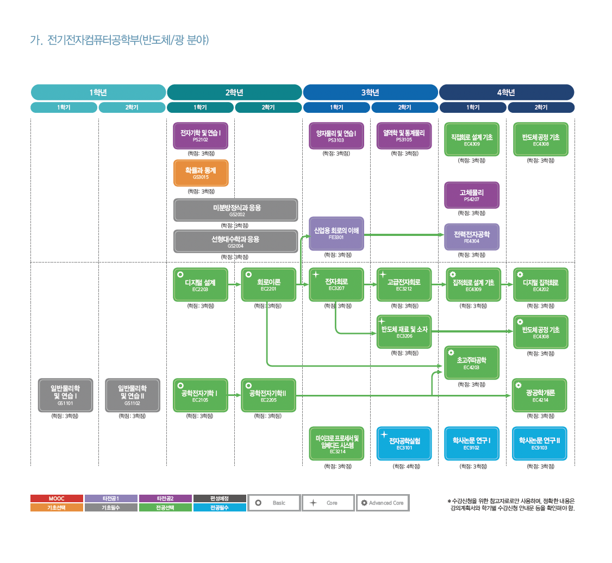
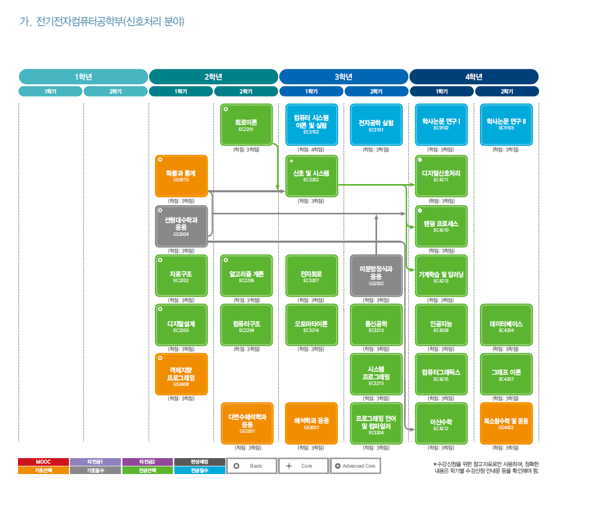
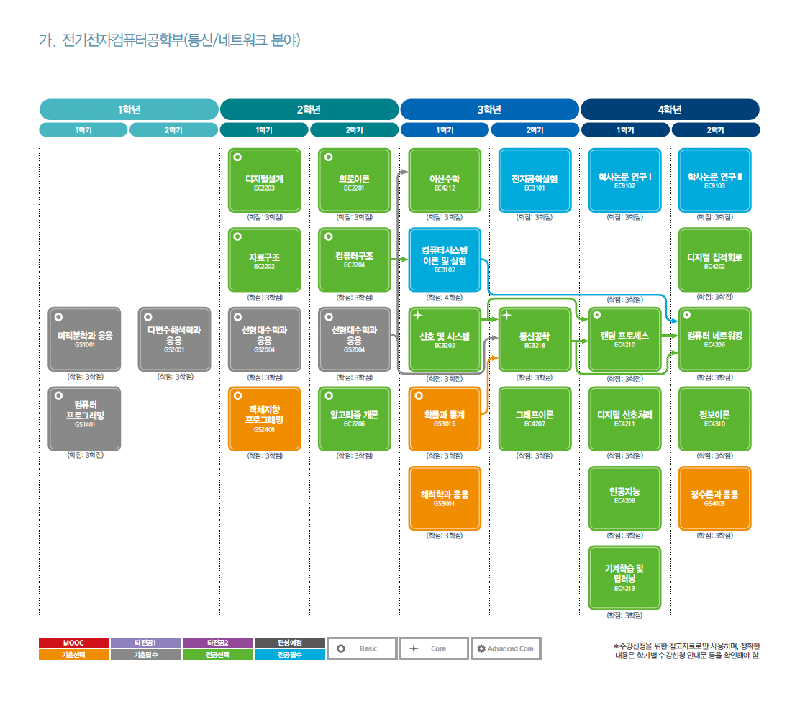
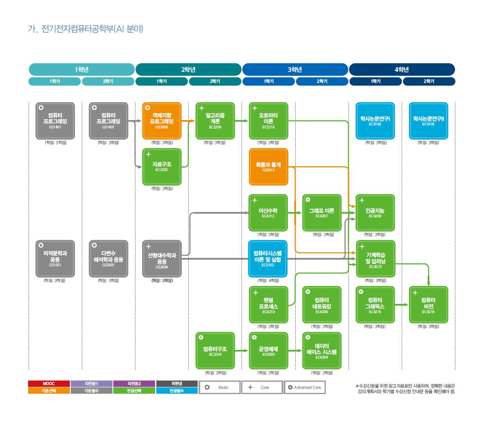
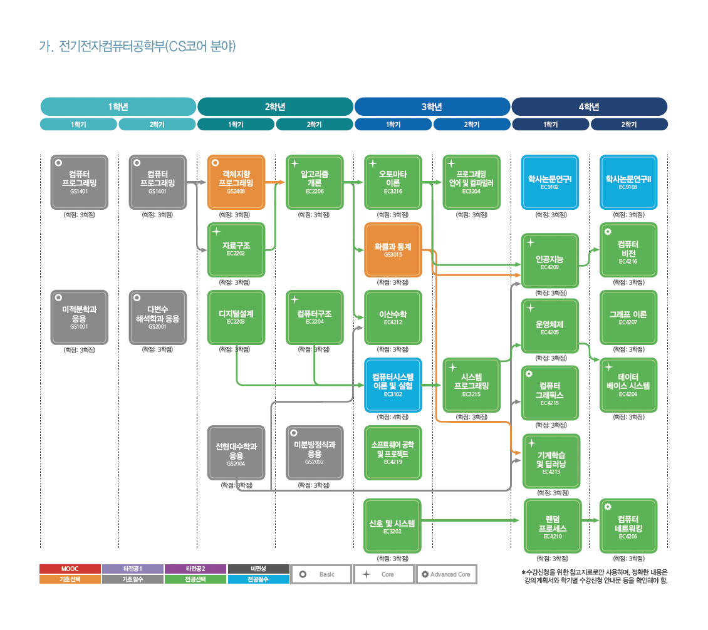

전자기학, 양자역학부터 시작하여 반도체를 연구하고 다이오드나 트랜지스터와 같은 전자소자를 만들고 회로를 설계하여 cpu와 메모리와 같은 칩을 만들고 폰노이만 구조를 기반으로 하는 컴퓨터 구조를 디자인하고 그 위에 운영체제가 올라가고 또 그 위에 다양한 프로그래밍 언어와 컴파일러를 통해 다양한 어플리케이션들이 올라가고, 또 여러 대의 컴퓨터가 네트워크를 통해 하나로 연결되는 이 컴퓨터와 관련된 모든 생태계를 최대한 이해하고 싶어서 정리를 시작했고 학부에서의 지적인 호기심은 여기까지만 채우고 나머지는 나중에 궁금하면 따로 찾아보자.

# Computer Science가 생기기까지
처음에는 [전기공학(Electrical Engineering)](https://encykorea.aks.ac.kr/Article/E0049609)이 있었다. 전기공학은 전기를 생산하고 수송하여 사용하는 전 영역을 커버한다. 전기 공학은 전기를 에너지로 간주하여 다루고 전력공학, 통신공학, 전자공학, 제어공학, 컴퓨터공학들은 모두 크게는 전기공학에 포함되는 학문이다. 전력전자, 전력시스템, 자동제어 등을 공부하고 전력 시스템이나 전봇대에 있는 변압기 등을 다루며 나중에 한전(한국전력공사), 한전 계열사(KPS, KDN), 전력거래소, 한수원 등에서 일하게된다. 너무 등등을 붙이면서 말했는데 나도 자세히 몰라서 일단 이 정도로만 적어보았다.

그리고 전기공학의 한 분야인 [전자공학(Electronics)](https://encykorea.aks.ac.kr/Article/E0049609)은 전기를 신호 또는 정보로 다루며 반도체의 원리를 이용하는 소자와 소자를 이용한 회로들을 주로 공부한다. ~~실험을 하다가 잘못되었을때 따끔하면 전자공학, 병원에 실려가면 전기공학~~ 진공관은 진공 속에서 금속이 가열될 때 방출되는 전자를 전기장으로 제어하여 한쪽 방향으로 전자가 움직이도록 하거나(정류) 전자를 빨리 움직여서 전류 흐름을 증가시키는(증폭) 특성을 갖도록 하는 유리관이다. 실제로 에니악을 만들 때 2만개 가까이 되는 진공관을 가지고 회로를 만들었다고 하는데 이 진공관을 가지고 처음으로 전기를 동력이 아닌 정보 전달에 이용하였고 전자공학이라는 새로운 영역이 탄생했다. 이 진공관은 크기도 크고, 전력 소비도 크고, 감전의 위험도 있고 유리로 되어있어서 깨지기 쉬운 여러 단점들이 있어 진공관을 대체할 수 있는 소자를 개발하기 시작했고 이후 트랜지스터가 나오면서 진공관이 하나씩 대체되기 시작했다. 이때부터가 전자공학이란 분야에 불을 붙인 시기가 아닐까싶다. 전자공학은 반도체를 이용한 전기소자를 다루거나 전기소자들을 이용하여 회로를 디자인하고 또 다양한 형태의 신호를 가지고 전선, 무선, 광통신 등을 통해 데이터를 전송하거나 처리하는 통신이나 네트워크를 연구하기도 한다.

전기공학과 전자공학은 보통 함께 사용되는 것이 관례이며 전기전자공학에서 가장 큰 기술 조직이자 주요 표준 및 연구 정책을 발전시키는 조직인 IEEE(Institute of Electrical and Electronics Engineers)만 봐도 Electrical and Electronics를 함께 사용하는걸 볼 수 있다. 전자공학은 전기공학의 한 분야로 시작했지만 전자공학의 내용이 워낙 방대해졌음을 시사한다. 전자공학의 한 분야인 컴퓨터 과학이 새로운 학과로 생길만큼 내용이 방대해졌고 요즘은 학부에서 인공지능 학과가 새로 생기는 추세인 것 같은데 실제로 뜯어보면 아직은 컴퓨터 과학에서 배우고 있는 커리큘럼을 그대로 들고가는 경우가 많아보인다.

# 전기공학, 전자공학, 컴퓨터공학 학과구분
학과 구분을 보통 다음과 같이한다.
- EE(electrical engineering, 전자전기공학(전자공학 + 전기공학))
- CS(computer science)
- EECS(electrical engineering and computer science, 전자전기컴퓨터공학)

EE라고 하면 영어로는 electrical engineering이고 전기공학이라고 해석되지만 대부분 전자공학과 전기공학을 합친 의미로 사용한다. 물론 전기공학과가 따로 있는 곳도 있는데, 아래 적은 학교를 비롯하여 대부분 전기전자공학과로 묶어서 사용하는 것 같다. 그리고 전자전기공학과에서는 이름에 "전기"라는 단어가 들어가있지만 전기나 전력에 대해서 배우진않고 대부분 전자공학에 관련된 내용을 배운다. 학과수업을 보면 반도체, 회로, 통신, 컴퓨터로 구분하여 배운다. 그리고 CS는 computer science에 집중해서 배우는데, 대부분 EE 안에 computer science 분야가 따로 있어서 EE를 선택했다고 하더라도 computer science에 집중하여 수업을 들을 수 있다. 물론 순수 CS학과보다는 하드웨어 쪽을 좀 더 다루긴한다. 우리학교처럼 아예 명시적으로 EECS라고하여 전자전기컴퓨터공학 이라고 부르는 곳도 있다.

# (전기)전자공학 분류
### 디바이스 분야(Device, Circuit)
- device
  - 집적회로 설계
  - 디지털 집적회로
  - ...
- semiconductor(device의 특수분야)
  - 전자기학
  - 물리전자개론
  - 반도체 재료 및 소자
  - 집적회로 소자
  - 메모리 소자
  - 반도체 공정
  - ...
- circult
  - 디지털설계
  - **회로이론**
  - **전자회로**
  - 아날로그 전자회로
  - 디지털 전자회로
  - ...

### 시스템 분야(Communications & Signal)
- **신호 및 시스템**
- **랜덤 프로세스**
- 전자공학실험
- 전자회로
- 디지털 신호처리(DSP)
- 통신공학
- ...

### 컴퓨터 분야(Computer)
- **컴퓨터구조**
- 컴퓨터시스템 이론 및 실험
- 프로그래밍 언어 및 컴파일러
- **운영체제**
- **자료구조**
- **알고리즘**
- 데이터베이스 시스템
- 기계학습 및 딥러닝
- **컴퓨터 네트워킹**
- ...

# 대표 학교
### 서울대
1. 전기정보공학부(EE)
    - 시스템 분야
      - 기초회로이론, 기초전자기학, 전기시스템선형대수, 신호 및 시스템, 확률변수 및 확률과정의 기초, 제어공학, 전기공학설계프로젝트, 전력전자공학, 통신시스템, 전자기기 및 제어, 로봇공학, 디지털신호처리, 네트워크 등
    - 디바이스 분야
      - 기초회로이론, 전기시스템선형대수, 기초전자회로, 전자기학, 양자역학의 응용, 아날로그전자회로, 반도체소자, 전기공학설계 등
    - 컴퓨터분야
      - 기초회로이론, 논리설계, 자료구조, 알고리즘, 컴퓨터구조, 디지털 시스템 설계 및 실험, 운영체제, 임베디드시스템 설계, 컴파일러 등
2. 컴퓨터공학부(CS)
    - 이산수학, 컴퓨터프로그래밍, 논리설계, 전기전자회로, 컴퓨터구조, 자료구조, 오토마타이론, 알고리즘, 디지털신호처리, 시스템 프로그래밍, 운영체제, 인공지능, 데이터마이닝, 데이터베이스, 데이터통신, 컴파일러, 컴퓨터그래픽스, 컴퓨터네트워크, 컴퓨터비전, 컴퓨터보안, 기계학습, 딥러닝, 양자컴퓨팅, 자연언어처리, 암호학, 블록체인 등

### 카이스트
1. 전기및전자공학부(EE)
    - [학부과정 로드맵](https://ee.kaist.ac.kr/under-curr-map/)
2. 전산학부(CS)
    - [학부과정](https://cs.kaist.ac.kr/education/undergraduate)
4. 반도체시스템공학과

### 포스텍
1. 전자전기공학과(EE)
    - 회로이론, 신호 및 시스템, 전자기학, 디지털 시스템 설계, 반도체, 전자회로 1, 전자수학, 확률 및 랜덤프로세스, 마이크로프로세서, 물리전자, 자동제어, 정보통신공학개론, 전자회로 2, 컴퓨터 설계, 통신 및 네트워크 개론, 디지털 신호처리, 디지털 통신 개론
2. 컴퓨터공학과(CS)
3. IT융합공학과
4. 반도체공학과

### 지스트
- 반도체공학과(Semiconductor Engineering)
- 전기전자컴퓨터공학부(EECS)
  - 
  - 
  - 
  - 
  - 
    *(2023 지스트 학사편람 참고)*

### 유니스트
- 전기전자공학과(EE)
- 컴퓨터공학과(CS)

### 디지스트
- 전기전자컴퓨터공학과(EECS)
- 반도체공학과

### Stanford
- Electrical Engineering(EE)
- Computer Science(CS)

### UC Berkeley
- Electrical Engineering and Computer Sciences(EECS)

# 학교공부
Computer를 구성하고 있는 하드웨어나 시스템 지식과 관련된 과목들을 low level부터 high level까지를 적어보면 다음과 같다. 내가 들은 과목 또는 듣진 않았지만 중요하다고 생각되는 과목들을 폴더로 만들어 따로 정리했다.

반도체
- 전자기학
- 물리전자개론
- (반도체 재료 및 소자, 반도체 공정, ...)

---

회로
- 디지털 설계
- (회로이론, 아날로그 전자회로, 디지털 전자회로, 집적회로 설계, 디지털 집적회로, ...)

---

통신 & 신호
- 복소함수학
- 랜덤 프로세스
- 신호 및 시스템
- (통신공학, 디지털신호처리, 정보이론, ...)

----

컴퓨터
- 컴퓨터 구조
- 컴퓨터 시스템 이론 및 실험
- 프로그래밍 언어 및 컴파일러
- 운영체제
- 자료구조와 알고리즘
- 컴퓨터 네트워킹
- 데이터베이스 시스템
- 기계학습 및 딥러닝
- 자연어처리
- 인공지능
- 이산수학
- (그래프이론, 컴퓨터 비전, 컴퓨터 그래픽스, ...)
